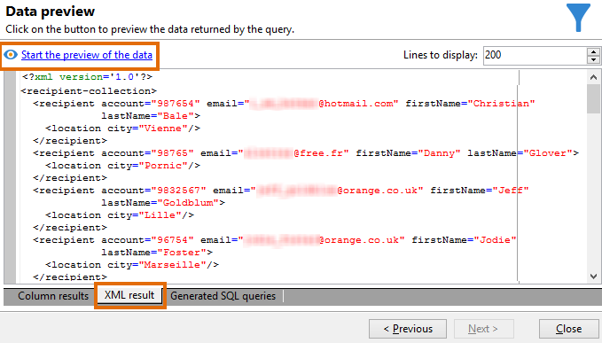

# Consulta de la tabla de destinatarios {#querying-recipient-table}

En este ejemplo, se desea recuperar los nombres y correos electrónicos de los destinatarios cuyo dominio de correo electrónico es “orange.co.uk” y que no viven en Londres.

* ¿Qué tabla se debe seleccionar?

  La tabla del destinatario (nms:recipient)

* Campos que se desea seleccionar como columnas de salida

  Correo electrónico, nombre, ciudad y número de cuenta

* ¿Cuáles son las condiciones de filtrado de los destinatarios?

  ciudad y dominio de correo electrónico

* ¿Se ha configurado una clasificación?

  Sí, en función de **[!UICONTROL Account number]** y **[!UICONTROL Last name]**.

Para crear este ejemplo, aplique los pasos siguientes:

1. Haga clic en **[!UICONTROL Tools > Generic query editor...]** y elija la tabla **Destinatarios** (**nms:recipient**). A continuación, haga clic en **[!UICONTROL Next]**.
1. Elija **[!UICONTROL Last name]**, **[!UICONTROL First name]**, **[!UICONTROL Email]**, **[!UICONTROL City]** y **[!UICONTROL Account number]**. Estos campos se añaden a **[!UICONTROL Output columns]**. A continuación, haga clic en **[!UICONTROL Next]**.

   

1. Ordene las columnas para mostrarlas en el orden correcto. Aquí se busca ordenar los números de cuenta en orden descendente y los nombres en orden alfabético. A continuación, haga clic en **[!UICONTROL Next]**.

   

1. En la ventana **[!UICONTROL Data filtering]**, refina la búsqueda: elija **[!UICONTROL Filtering conditions]** y haga clic en **[!UICONTROL Next]**.
1. La ventana **[!UICONTROL Target element]** permite introducir la configuración del filtro.

   Defina la siguiente condición de filtro: destinatarios con un dominio de correo electrónico igual a “orange.co.uk”. Para ello, elija **Email domain (@email)** en la columna **[!UICONTROL Expression]**, elija **equal to** en la columna **[!UICONTROL Operator]** y escriba “orange.co.uk” en la columna **[!UICONTROL Value]**.

   

1. Si es necesario, haga clic en el botón **[!UICONTROL Distribution of values]** para ver una distribución en función del dominio de correo electrónico de los posibles clientes. Hay un porcentaje disponible para cada dominio de correo electrónico de la base de datos. Los dominios que no sean “orange.co.uk” se muestran hasta que se aplique el filtro.

   En la parte inferior de la ventana se muestra un resumen de la consulta: **Email domain equal to “orange.co.uk”**.

1. Haga clic en **[!UICONTROL Preview]** para obtener una idea del resultado de la consulta: solo se muestran los dominios de correo electrónico “orange.co.uk”.

   

1. Ahora, se cambia la consulta para encontrar contactos que no residen en Londres.

   Seleccione **[!UICONTROL City (location/@city)]** en la columna **[!UICONTROL Expression]**, **[!UICONTROL different from]** como operador y escriba **[!UICONTROL London]** en la columna **[!UICONTROL Value]**.

   

1. Esto lo lleva a la ventana **[!UICONTROL Data formatting]**. Compruebe el orden de las columnas. Desplace la columna “Ciudad” hacia arriba, debajo de la columna “Número de cuenta”.

   Anule la selección de la columna “Nombre” para quitarla de la lista.

   

1. En la ventana **[!UICONTROL Data preview]**, haga clic en **[!UICONTROL Start the preview of the data]**. Esta función calcula el resultado de la consulta.

   La pestaña **[!UICONTROL Column results]** muestra el resultado de la consulta en columnas.

   El resultado muestra todos los destinatarios con un dominio de correo electrónico “orange.co.uk” que no residen en Londres. La columna “Nombre” no se muestra porque no se ha seleccionado durante la etapa anterior. Los números de cuenta se ordenan en orden descendente.

   

   La pestaña **[!UICONTROL XML result]** muestra el resultado en formato XML.

   

   La pestaña **[!UICONTROL Generated SQL queries]** muestra el resultado de la consulta en formato SQL.

   
