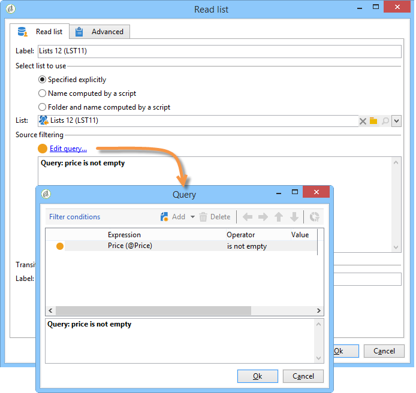

# Lista de lectura{#read-list}

Los datos procesados en un flujo de trabajo pueden proceder de listas en las que se han preparado o estructurado los datos (después de una segmentación previa o carga de archivo).

La actividad **[!UICONTROL Read list]** permite copiar los datos de una lista en la tabla de trabajo del flujo de trabajo, como los datos de una consulta. Entonces es accesible a través del flujo de trabajo.

La lista que se procese puede especificarse explícitamente, computarse mediante un lista de comandos o localizarse dinámicamente, de acuerdo con las opciones seleccionadas y los parámetros definidos en una actividad **[!UICONTROL Read list]**.

Si la lista no se especifica explícitamente, debe proporcionar una lista que se utilizará como plantilla para averiguar su estructura.

Una vez que se ha configurado la selección de la lista, puede añadir un filtro utilizando la opción **[!UICONTROL Edit query]** para mantener una parte de la población para el siguiente flujo de trabajo.

>[!CAUTION]
>
>Para poder crear un filtro en una actividad de lista de lectura, la lista relevante debe ser un tipo de “archivo”.

Las listas se pueden crear directamente en Adobe Campaign mediante el vínculo **[!UICONTROL Profiles and Targets > Lists]** de la página principal. También pueden crearse en un flujo de trabajo utilizando la actividad **[!UICONTROL List update]**.

**Ejemplo: Excluir una lista de direcciones de envío**

El ejemplo siguiente permite utilizar una lista de direcciones de correo electrónico para excluir del destino de envío de correo electrónico.

Los perfiles contenidos en la carpeta **New contacts** deben ser dirigidos a una acción de envío. Las direcciones de correo electrónico que se excluirán del destino se almacenan en una lista externa. En nuestro ejemplo, solo se necesita la información sobre las direcciones de correo electrónico para la exclusión.

1. La consulta de selección de la carpeta **New Contact** s debe permitirle cargar las direcciones de correo electrónico de los perfiles seleccionados, con el fin de permitir la alineación con la información de la lista.

   

1. En este caso, la lista se almacena en la carpeta **Lists** y se calcula su etiqueta.

   

1. Para excluir las direcciones de correo electrónico de la lista externa desde el destino principal, debe configurar la actividad de exclusión y especificar que la carpeta **New Contacts** contenga los datos que se van a mantener. Los datos conjuntos entre este conjunto y cualquier otro conjunto entrante de la actividad de exclusión se eliminarán del objetivo.

   

   Las reglas de exclusión se configuran en la sección central de la herramienta de edición. Haga clic en el botón **[!UICONTROL Add]** para definir el tipo de exclusión que se aplicará.

   Puede definir varias exclusiones en función del número de transiciones entrantes de la actividad.

1. En el campo **[!UICONTROL Exclusion set]**, seleccione la actividad **[!UICONTROL Read list]**: los datos de esta actividad se excluirán del conjunto principal.

   En nuestro ejemplo, tenemos una exclusión en las combinaciones: los datos contenidos en la lista se reconciliarán con los datos del conjunto principal a través del campo que contiene la dirección de correo electrónico. Para configurar la unión, seleccione **[!UICONTROL Joins]** en el campo **[!UICONTROL Change dimension]**.

   

1. A continuación, seleccione el campo correspondiente a la dirección de correo electrónico en los dos conjuntos (origen y destino). Las columnas se enlazan y los destinatarios cuya dirección de correo electrónico se encuentre en la lista de direcciones importadas se excluirán del objetivo.
