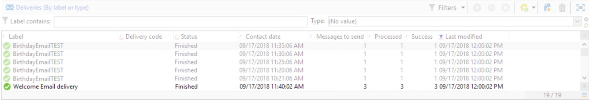

# Entrega recurrente{#recurring-delivery}

Una actividad de **[!UICONTROL Recurring delivery]** permite configurar una ocurrencia de plantilla de envío específica de una campaña.

 [Descubra esta función en vídeo](#recurring-delivery-video)

Esta actividad solo está disponible en la pestaña **[!UICONTROL Targeting and workflows]** ubicada en una campaña.

Para ello:

1. Seleccione la plantilla de envío en la que se basa la actividad.

   

1. Configure la plantilla de envío.

El proceso de configuración de esta actividad es similar a la creación de una plantilla de envío en términos de las opciones disponibles. Para obtener más información, consulte  .

Para ver un ejemplo de la actividad utilizada, consulte esta [sección](send-a-birthday-email.md#creating-a-recurring-delivery-in-a-targeting-workflow).

## Configuración de envíos recurrentes

Un **envío recurrente** creará una nueva instancia de envío cada vez que se ejecute. Por ejemplo, si el flujo de trabajo está programado para ejecutarse una vez a la semana, el resultado sería de 52 envíos al cabo de un año. Esto también significa que el registro y los registros de seguimiento generales se separarán por cada instancia de envío.

Si desea detener la ejecución de una entrega recurrente, debe cancelar completamente la campaña o detener el flujo de trabajo que la ejecuta. Al detener la entrega desde el panel de Campaign, solo se detendrá la ocurrencia de la entrega: las siguientes instancias de la entrega recurrente se seguirán creando en cada ejecución del flujo de trabajo.

>[!NOTE]
>
>No es posible enviar una prueba desde una actividad del tipo **[!UICONTROL Recurring delivery]**.
> 
>Para crear directamente una entrega a través de un flujo de trabajo de campaña, utilice las actividades específicas del canal que están preconfiguradas (por ejemplo **[!UICONTROL Email delivery]**).

## Videotutorial (#recurring-delivery-video)

En este vídeo se explica cómo configurar un envío recurrente y una actividad de planificador.

>[!VIDEO](https://video.tv.adobe.com/v/25040?quality=12)

Hay disponibles más vídeos de procedimientos para Campaign Classic [aquí](https://experienceleague.adobe.com/docs/campaign-classic-learn/tutorials/overview.html?lang=es).
