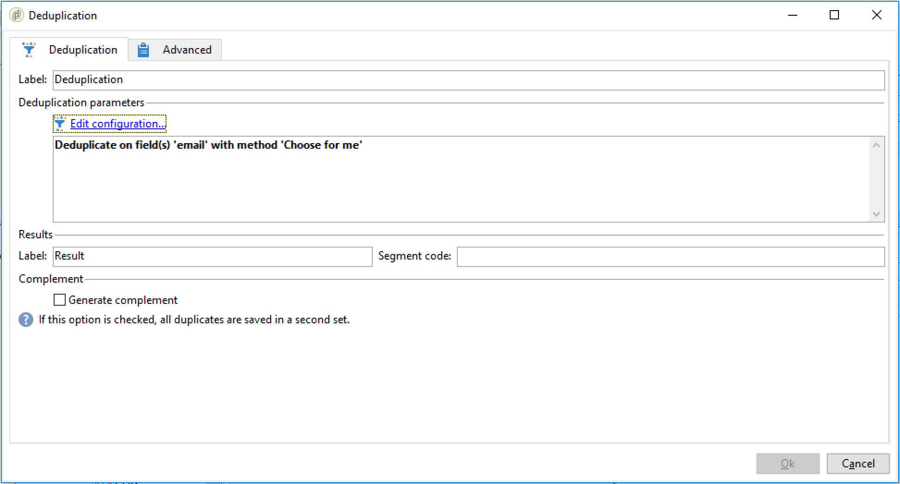

# Configuración de un flujo de trabajo de importación recurrente {#setting-up-a-recurring-import}


El uso de una plantilla de flujo de trabajo es una práctica recomendada si necesita importar con regularidad archivos con la misma estructura.

Este ejemplo muestra cómo se puede predefinir un flujo de trabajo para reutilizarlo a la hora de importar perfiles provenientes de un CRM en la base de datos de Adobe Campaign. Para obtener más información sobre todos los ajustes posibles de cada actividad, consulte esta [sección](activities.md).

1. Cree una nueva plantilla de flujo de trabajo desde **[!UICONTROL Resources > Templates > Workflow templates]**.
1. Añada las siguientes actividades:

   * **[!UICONTROL Data loading (file)]**: Defina la estructura esperada del archivo que contiene los datos que se van a importar.
   * **[!UICONTROL Enrichment]**: Reconcilie los datos importados con los datos de la base de datos.
   * **[!UICONTROL Split]**: Cree filtros para procesar registros de formas diferentes, dependiendo de si se podrían reconciliar o no.
   * **[!UICONTROL Deduplication]**: Deduplique los datos del archivo entrante antes de insertarlos en la base de datos.
   * **[!UICONTROL Update data]**: Actualice la base de datos con los perfiles importados.

   

1. Configure la actividad **[!UICONTROL Data Loading (file)]**:

   * Cargue un archivo de muestra para definir la estructura que desee. El archivo de muestra debe contener tan solo unas pocas líneas, pero todas las columnas necesarias para la importación. Compruebe y edite el formato del archivo para asegurarse de que el tipo de cada columna está correctamente definido: texto, fecha, entero, etc. Por ejemplo:

     ```
     lastname;firstname;birthdate;email;crmID
     Smith;Hayden;23/05/1989;hayden.smith@mailtest.com;123456
     ```

   * En la sección **[!UICONTROL Name of the file to load]** , seleccione **[!UICONTROL Upload a file from the local machine]** y deje el campo en blanco. Cada vez que cree un nuevo flujo de trabajo a partir de esta plantilla, puede especificar aquí el archivo que desee, siempre que se corresponda con la estructura definida.

     Puede utilizar cualquiera de las opciones, pero debe modificar la plantilla según corresponda. Por ejemplo, si selecciona **[!UICONTROL Specified in the transition]**, puede añadir una actividad de **[!UICONTROL File Transfer]** antes de recuperar el archivo de importación de un servidor FTP/SFTP. Con la conexión S3 o SFTP, también puede importar datos de segmentos a Adobe Campaign con la plataforma de datos del cliente en tiempo real de Adobe. Para obtener más información, consulte [Documentación](https://experienceleague.adobe.com/docs/experience-platform/destinations/catalog/email-marketing/adobe-campaign.html?lang=es).

     

1. Configure la actividad **[!UICONTROL Enrichment]**. El objetivo de esta actividad en este contexto es identificar los datos entrantes.

   * En la pestaña **[!UICONTROL Enrichment]**, seleccione **[!UICONTROL Add data]** y defina un vínculo entre los datos importados y la dimensión de segmentación de los destinatarios. En este ejemplo, el campo personalizado **CRM ID** se utiliza para crear la condición de unión. Utilice el campo o la combinación de campos que necesite siempre que permita identificar registros únicos.
   * En la pestaña **[!UICONTROL Reconciliation]** , deje la opción **[!UICONTROL Identify the document from the working data]** sin seleccionar.

   

1. Configure la actividad **[!UICONTROL Split]** para recuperar los destinatarios reconciliados en una transición, y los destinatarios que no pudieron ser reconciliados, pero que tengan datos suficientes en una segunda transición.

   La transición con los destinatarios reconciliados se puede utilizar después para actualizar la base de datos. La transición con destinatarios desconocidos se puede utilizar para crear nuevas entradas de destinatario en la base de datos si en el archivo hay un conjunto mínimo de información disponible.

   Los destinatarios que no se pueden reconciliar y no tienen datos suficientes se seleccionan en una transición saliente de complemento y se pueden exportar en un archivo independiente, o sencillamente se ignoran.

   * En la pestaña **[!UICONTROL General]** de la actividad, seleccione **[!UICONTROL Use the additional data only]** como ajuste de filtro y asegúrese de que el valor **[!UICONTROL Targeting dimension]** se establece automáticamente como **[!UICONTROL Enrichment]**.

     Marque la opción **[!UICONTROL Generate complement]** para ver si algún registro no se puede insertar en la base de datos. Si lo necesita, puede seguir procesando los datos complementarios: exportación de archivo, actualización de lista, etc.

   * En el primer subconjunto de la pestaña **[!UICONTROL Subsets]**, añada una condición de filtrado a la población entrante para seleccionar solo los registros cuya clave principal del destinatario sea distinta a 0. De esta forma, los datos del archivo que se reconcilien con los destinatarios de la base de datos se seleccionan dentro de ese subconjunto.

     

   * Añada un segundo subconjunto que seleccione registros no reconciliados con datos suficientes como para poder insertarlos en la base de datos. Por ejemplo: dirección de correo electrónico, nombre y apellidos.

     Los subconjuntos se procesan por orden de creación, lo que significa que cuando se procesa este segundo subconjunto, todos los registros que ya existen en la base de datos están seleccionados en el primer subconjunto.

     

   * Todos los registros que no están seleccionados en los dos primeros subconjuntos se seleccionan en la **[!UICONTROL Complement]**.

1. Configure la actividad **[!UICONTROL Update data]** ubicada después de la primera transición saliente de la actividad **[!UICONTROL Split]** configurada anteriormente.

   * Seleccione **[!UICONTROL Update]** como **[!UICONTROL Operation type]**, ya que la transición de entrada solo contiene destinatarios ya presentes en la base de datos.
   * En la sección **[!UICONTROL Record identification]**, seleccione **[!UICONTROL Using reconciliation keys]** y defina una clave entre la dimensión de segmentación y el vínculo creado en **[!UICONTROL Enrichment]**. En este ejemplo, se utiliza el campo personalizado **CRM ID**.
   * En la sección **[!UICONTROL Fields to update]**, indique los campos de la dimensión de destinatarios que desea actualizar con el valor de la columna correspondiente del archivo. Si los nombres de las columnas del archivo son idénticos o casi idénticos a los nombres de los campos de dimensión de los destinatarios, puede utilizar el botón de varita mágica para hacer coincidir automáticamente los diferentes campos.

     

1. Configure la actividad **[!UICONTROL Deduplication]** ubicada después de la transición que contiene los destinatarios no reconciliados:

   * Seleccione **[!UICONTROL Edit configuration]** y establezca la dimensión de segmentación en el esquema temporal generado a partir de la actividad **[!UICONTROL Enrichment]** del flujo de trabajo.

     

   * En este ejemplo, el campo de correo electrónico se utiliza para buscar perfiles únicos. Puede utilizar cualquier campo que esté rellenado y que forme parte de una combinación única.
   * En la pantalla **[!UICONTROL Deduplication method]**, seleccione **[!UICONTROL Advanced parameters]** y marque la opción **[!UICONTROL Disable automatic filtering of 0 ID records]** para asegurarse de que no se excluyan los registros que tengan una clave principal igual a 0 (que deberían ser todos los registros de esta transición).

   

1. Configure la actividad **[!UICONTROL Update data]** ubicada después de la actividad **[!UICONTROL Deduplication]** configurada anteriormente.

   * Seleccione **[!UICONTROL Insert]** como **[!UICONTROL Operation type]**, ya que la transición entrante solo contiene destinatarios que no están presentes en la base de datos.
   * En la sección **[!UICONTROL Record identification]** , seleccione **[!UICONTROL Directly using the targeting dimension]** y elija la dimensión **[!UICONTROL Recipients]** .
   * En la sección **[!UICONTROL Fields to update]**, indique los campos de la dimensión de destinatarios que desea actualizar con el valor de la columna correspondiente del archivo. Si los nombres de las columnas del archivo son idénticos o casi idénticos a los nombres de los campos de dimensión de los destinatarios, puede utilizar el botón de varita mágica para hacer coincidir automáticamente los diferentes campos.

     

1. Después de la tercera transición de la actividad **[!UICONTROL Split]**, añada una actividad **[!UICONTROL Data extraction (file)]** y una actividad **[!UICONTROL File transfer]** si desea realizar un seguimiento de los datos que no se insertan en la base de datos. Configure las actividades para exportar la columna que necesite y para transferir el archivo en un servidor FTP o SFTP desde donde pueda recuperarlo.
1. Añada una actividad **[!UICONTROL End]** y guarde la plantilla de flujo de trabajo.

Ahora la plantilla se puede utilizar y está disponible para cada nuevo flujo de trabajo. A continuación, es necesario especificar el archivo que contiene los datos que se van a importar en la actividad **[!UICONTROL Data loading (file)]** .


