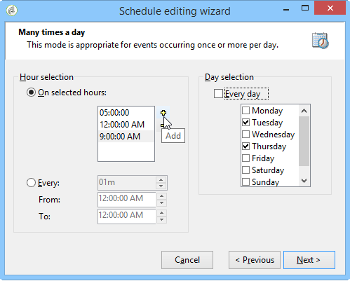

# Planificador {#scheduler}

El **Scheduler** es una tarea persistente que activa su transición en el momento especificado por su programación.

La actividad del **[!UICONTROL Scheduler]** debe considerarse como un inicio programado. Las reglas de colocación de actividad dentro del gráfico son las mismas que para la actividad **[!UICONTROL Start]**. Esta actividad no debe tener una transición entrante.

## Prácticas recomendadas {#best-practices}

* No planifique un flujo de trabajo para que se ejecute durante más de 15 minutos, ya que podría limitar el rendimiento general del sistema y crear bloques en la base de datos.

* Nunca utilice más de una **[!UICONTROL Scheduler]** actividad por rama en un flujo de trabajo. Consulte [Uso de actividades](workflow-best-practices.md#using-activities).

* El uso de una actividad de planificador puede llevar a que se realicen varias ejecuciones de un flujo de trabajo al mismo tiempo. Por ejemplo, puede hacer que un programador active la ejecución del flujo de trabajo cada hora, pero a veces la ejecución del flujo de trabajo completo tarda más de una hora.

  Puede preferir omitir la ejecución si el flujo de trabajo ya se está ejecutando. Para obtener más información sobre cómo evitar ejecuciones simultáneas de un flujo de trabajo, consulte [esta página](monitor-workflow-execution.md#preventing-simultaneous-multiple-executions).

* Tenga en cuenta que la transición puede activarse varias horas más tarde si el flujo de trabajo ejecuta una tarea a largo plazo como una importación, o si el módulo wfserver se detuvo durante un tiempo. En este caso, puede ser necesario restringir la ejecución de la tarea activada por el planificador a un determinado intervalo de tiempo.

## Configuración de la actividad Planificador {#configuring-scheduler-activity}

El planificador define la programación de activación de la transición. Para configurarlo, haga doble clic en el objeto gráfico y, a continuación, haga clic en **[!UICONTROL Change...]**.

Un asistente le permite definir la frecuencia y el periodo de validez de la actividad. Los pasos de configuración son los siguientes:

1. Seleccione la frecuencia de activación y haga clic en **[!UICONTROL Next]**.

   

1. Indique las horas y días de activación. Los parámetros de este paso dependen de la frecuencia seleccionada en el paso anterior. Si elige iniciar la actividad varias veces al día, las opciones de configuración serán las siguientes:

   

1. Defina el periodo de validez de la programación o especifique cuántas veces se va a ejecutar.

   

1. Compruebe la configuración y haga clic en **[!UICONTROL Finish]** para guardar.

   
