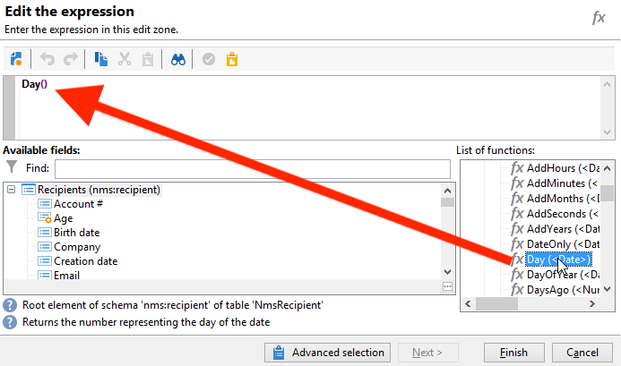
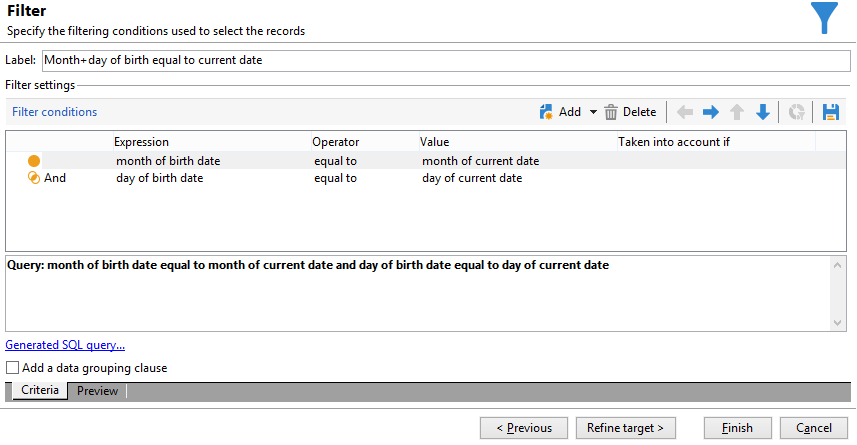

# Envío de un correo electrónico de cumpleaños{#sending-a-birthday-email}

Este caso de uso detalla cómo planificar la entrega de un correo electrónico recurrente a una lista de destinatarios en el día de su cumpleaños.

Para configurar este caso de uso, se ha creado el siguiente flujo de trabajo de objetivo:


Este flujo de trabajo (de ejecución diaria) selecciona todos los destinatarios que tienen su cumpleaños en la fecha actual.

Para ello, cree una campaña y agregue un [flujo de trabajo de campaña](campaign-workflows.md).

A continuación, siga los pasos detallados a continuación.

## Identificación de destinatarios que cumplen años {#identifying-recipients-whose-birthday-it-is}

Después de configurar la actividad **[!UICONTROL Scheduler]** para que el flujo de trabajo se inicie cada día, identifique todos los destinatarios cuya fecha de nacimiento sea igual a la fecha actual.

Para ello, siga los siguientes pasos:

1. Arrastre y coloque una actividad **[!UICONTROL Query]** en el flujo de trabajo y haga doble clic en ella.
1. Haga clic en el vínculo **Edit query** y seleccione **[!UICONTROL Filtering conditions]**.

   

1. Haga clic en la primera celda de la columna **[!UICONTROL Expression]** y haga clic en **[!UICONTROL Edit expression]** para abrir el editor de expresiones.

   

1. Haga clic en **[!UICONTROL Advanced selection]** para seleccionar el modo de filtrado.

   

1. Seleccione **[!UICONTROL Edit the formula using an expression]** y haga clic en **[!UICONTROL Next]** para mostrar el editor de expresiones.
1. En la lista de funciones, haga doble clic en **[!UICONTROL Day]**, a la cual se puede acceder mediante el nodo **[!UICONTROL Date]**. Esta función devuelve el número que representa el día correspondiente a la fecha establecida como parámetro.

   

1. En la lista de campos disponibles, haga doble clic en **[!UICONTROL Birth date]**. A continuación, la sección superior del editor muestra la siguiente fórmula:

   ```
   Day(@birthDate)
   ```

   Haga clic en **[!UICONTROL Finish]** para confirmar.

1. En el editor de consultas, en la primera celda de la columna **[!UICONTROL Operator]**, seleccione **[!UICONTROL equal to]**.

   

1. A continuación, haga clic en la primera celda de la segunda columna (**[!UICONTROL Value]**) y haga clic en **[!UICONTROL Edit expression]** para abrir el editor de expresiones.
1. En la lista de funciones, haga doble clic en **[!UICONTROL Day]**, a la cual se puede acceder mediante el nodo **[!UICONTROL Date]**.
1. Haga doble clic en la función **[!UICONTROL GetDate]** para recuperar la fecha actual.

   

   La sección superior del editor muestra la siguiente fórmula:

   ```
   Day(GetDate())
   ```

   Haga clic en **[!UICONTROL Finish]** para confirmar.

1. Repita este procedimiento para recuperar el mes de nacimiento correspondiente al mes actual. Para ello, haga clic en el botón **[!UICONTROL Add]** y repita los pasos del 3 al 10, sustituyendo **[!UICONTROL Day]** por **[!UICONTROL Month]**.

   La consulta completa es la siguiente:

   

Vincule el resultado de la actividad **[!UICONTROL Query]** a una actividad **[!UICONTROL Email delivery]** para enviar un correo electrónico a la lista de todos los destinatarios en su cumpleaños.

## Incluir destinatarios nacidos el 29 de febrero (opcional) {#including-recipients-born-on-february-29th--optional-}

Si se desea incluir todos los destinatarios nacidos el 29 de febrero, este caso de uso detalla cómo planificar la entrega de un correo electrónico recurrente a una lista de destinatarios para su cumpleaños, ya sea un año bisiesto o no.

Los pasos de implementación principales para este caso de uso son:

* Selección de destinatarios
* Selección de año bisiesto o no
* Selección de cualquier destinatario nacido el 29 de febrero

Para configurar este caso de uso, se ha creado el siguiente flujo de trabajo de objetivo:


Si el año actual **no es un año bisiesto** y el flujo de trabajo se ejecuta el 1 de marzo, se necesita seleccionar todos los destinatarios que hubieran tenido su cumpleaños el día anterior (29 de febrero) y añadirlos a la lista de destinatarios. En cualquier otro caso no se requiere ninguna acción adicional.

### Paso 1: Selección de los destinatarios {#step-1--selecting-the-recipients}

Después de configurar la actividad **[!UICONTROL Scheduler]** para que el flujo de trabajo se inicie cada día, identifique todos los destinatarios cuyo cumpleaños sea el día actual.

>[!NOTE]
>
>Si el año actual es un año bisiesto, se incluyen automáticamente todos los destinatarios nacidos el 29 de febrero.



La selección de los destinatarios cuyo cumpleaños corresponde a la fecha actual se presenta en la sección [Identifying recipients whose birthday it is](#identifying-recipients-whose-birthday-it-is).

### Paso 2: Seleccione si es un año bisiesto o no {#step-2--select-whether-or-not-it-is-a-leap-year}

La actividad **[!UICONTROL Test]** permite comprobar si es un año bisiesto o no y si la fecha actual es el 1 de marzo.

Si se verifica la prueba (el año no es un año bisiesto: no hay 29 de febrero y la fecha actual es de hecho 1 de marzo), la transición **[!UICONTROL True]** se activa y los destinatarios nacidos el 29 de febrero se añadirán a la entrega del 1 de marzo. En caso contrario, la transición **[!UICONTROL False]** se activa y solo los destinatarios nacidos en la fecha actual reciben la entrega.

Copie y pegue el código siguiente en la sección **[!UICONTROL Initialization script]** de la pestaña **[!UICONTROL Advanced]**.

```
function isLeapYear(iYear)
{
    if(iYear/4 == Math.floor(iYear/4))
    {
        if(iYear/100 != Math.floor(iYear/100))
        {
            // Divisible by 4 only -> Leap Year
            return 1;
        }
        else
        {
            if(iYear/400 == Math.floor(iYear/400))
            {
                // Divisible by 4, 100 and 400 -> Leap year
                return 1;
            }
        }
    }
    // all others: no leap year
    return 0;
}

// Return today's date and time
var currentTime = new Date()
// returns the month (from 0 to 11)
var month = currentTime.getMonth() + 1
// returns the day of the month (from 1 to 31)
var day = currentTime.getDate()
// returns the year (four digits)
var year = currentTime.getFullYear()

// is current year a leap year?
vars.currentIsALeapYear = isLeapYear(year);

// is current date the first of march?
if(month == 3 && day == 1) {
  // today is 1st of march
vars.firstOfMarch = 1;
}
```


Añada la siguiente condición en la sección **[!UICONTROL Conditional forks]**:

```
vars.currentIsALeapYear == 0 && vars.firstOfMarch == 1
```


### Paso 3: Seleccione cualquier destinatario nacido el 29 de febrero {#step-3--select-any-recipients-born-on-february-29th}

Cree una actividad **[!UICONTROL Fork]** y vincule una de las transiciones salientes a una actividad **[!UICONTROL Query]**.

En esta consulta, seleccione todos los destinatarios cuya fecha de nacimiento sea el 29 de febrero.


Combine los resultados con una actividad **[!UICONTROL Union]**.

Vincule los resultados de las dos ramas de actividad **[!UICONTROL Test]** a una actividad **[!UICONTROL Email delivery]** para enviar un correo electrónico a la lista de todos los destinatarios en su cumpleaños, incluso a aquellos nacidos el 29 de febrero durante un año no bisiesto.

## Creación de una entrega recurrente {#creating-a-recurring-delivery-in-a-targeting-workflow}

Añada una actividad de **Entrega recurrente** basada en la plantilla de correo electrónico de cumpleaños que desee enviar.

>[!CAUTION]
>
>Para que se ejecuten los flujos de trabajo, se deben iniciar los flujos de trabajo técnicos relacionados con el paquete de Campaign. Para obtener más información sobre esto, consulte la sección [Lista de flujos de trabajo técnicos](technical-workflows.md).
>
>Si los pasos de aprobación están habilitados para la campaña, las entregas solo se realizan una vez que estén confirmados los pasos. Para obtener más información, consulte   sección.


