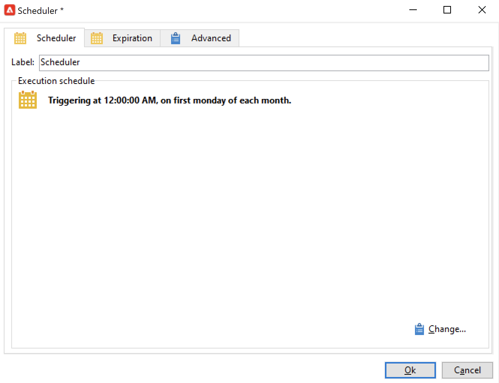

# Envío de un informe a una lista{#sending-a-report-to-a-list}


Este caso de uso detalla cómo generar un informe mensual preestablecido de **[!UICONTROL Tracking indicators]** en formato PDF y cómo enviarlo a una lista de destinatarios.


Los pasos de implementación principales para este caso de uso son:

* Creación de una lista de destinatarios que recibirán la entrega (consulte: [Paso 1: Crear la lista de destinatarios](#step-1--creating-the-recipient-list)).
* Creación de una plantilla de envío que permite generar un nuevo envío cada vez que se ejecute el flujo de trabajo (consulte [Paso 2: crear la plantilla de entrega](#step-2--creating-the-delivery-template)).
* Creación de un flujo de trabajo que permite generar el informe en formato PDF y enviarlo a la lista de destinatarios (consulte [Paso 3: crear el flujo de trabajo](#step-3--creating-the-workflow)).

## Paso 1: Creación de la lista de destinatarios {#step-1--creating-the-recipient-list}

Vaya a la pestaña **[!UICONTROL Profiles and targets]**, haga clic en el vínculo **[!UICONTROL Lists]** y, a continuación, en el botón **[!UICONTROL Create]**. Seleccione **[!UICONTROL New list]** y cree una nueva lista de destinatarios a los que enviar el informe.


Para obtener más información sobre la creación de listas, consulte esta sección .

## Paso 2: Creación de la plantilla de publicación {#step-2--creating-the-delivery-template}

1. Vaya al nodo **[!UICONTROL Resources > Templates > Delivery templates]** del explorador de Adobe Campaign y duplique la plantilla predeterminada **[!UICONTROL Email delivery]**.

   

   Para obtener más información sobre la creación de plantillas de envío, consulte esta sección .

1. Introduzca los distintos parámetros de plantilla: etiqueta, objetivo (la lista de destinatarios creados anteriormente), asunto y contenido.

   

1. Cada vez que se ejecuta el flujo de trabajo, se actualiza el informe **[!UICONTROL Tracking indicators]** (consulte el [Paso 3: Creación del flujo de trabajo](#step-3--creating-the-workflow)). Para incluir la versión más reciente del informe en la entrega, se debe añadir un **[!UICONTROL Calculated attachment]**:

   Para obtener más información sobre la creación de archivos adjuntos calculados, consulte esta sección .

   * Haga clic en el vínculo **[!UICONTROL Attachments]** y haga clic en **[!UICONTROL Add]**, luego seleccione **[!UICONTROL Calculated attachment]**.

      

   * Vaya al campo **[!UICONTROL Type]** y seleccione la cuarta opción: **[!UICONTROL File name is computed during delivery of each message (it may then depend on the recipient profile)]**.

      

      El valor introducido en el campo **[!UICONTROL Label]** no aparece en la entrega final.

   * Vaya a la zona de edición e introduzca la ruta de acceso y el nombre del archivo.

      

      >[!CAUTION]
      >
      >El archivo debe estar presente en el servidor. Su ruta y nombre deben ser idénticos a los introducidos en la actividad **[!UICONTROL JavaScript code]** del flujo de trabajo (consulte [Paso 3: crear el flujo de trabajo](#step-3--creating-the-workflow)).

   * Seleccione la pestaña **[!UICONTROL Advanced]** y marque **[!UICONTROL Script the name of the file name displayed in the mails sent]**. Vaya a la zona de edición e introduzca el nombre que desea asignar al archivo adjunto en la entrega final.

      

## Paso 3: Creación del flujo de trabajo {#step-3--creating-the-workflow}

El siguiente flujo de trabajo se creó para este caso de uso. Tiene tres actividades:

* Una actividad **[!UICONTROL Scheduler]** que permite ejecutar el flujo de trabajo una vez al mes,
* Una actividad **[!UICONTROL JavaScript code]** que permite generar el informe en formato PDF,
* una actividad **[!UICONTROL Delivery]** que utiliza la plantilla de envío creada anteriormente.


1. Ahora, vaya al nodo **[!UICONTROL Administration > Production > Technical workflows]** y cree un nuevo flujo de trabajo.

   

1. Comience agregando una actividad **[!UICONTROL Scheduler]** y configúrela para que el flujo de trabajo se ejecute en el primer lunes del mes.

   

   Para obtener más información sobre la configuración del planificador, consulte [planificador](scheduler.md).

1. A continuación, añada una actividad **[!UICONTROL JavaScript code]**.

   

   Introduzca el código siguiente en la zona de edición:

   ```
   var reportName = "deliveryFeedback";
   var path = "/tmp/deliveryFeedback.pdf";
   var exportFormat = "PDF";
   var reportURL = "<PUT THE URL OF THE REPORT HERE>";
   var _ctx = <ctx _context="global" _reportContext="deliveryFeedback" />
   var isAdhoc = 0;
   
   xtk.report.export(reportName, _ctx, exportFormat, path, isAdhoc);
   ```

   Se utilizan las siguientes variables:

   * **var reportName**: introduzca el nombre interno del informe en comillas dobles. En este caso, el nombre interno del informe **Indicador de seguimiento** es “deliveryFeedback”.
   * **var path**: introduzca la ruta donde se guarda el archivo (“tmp/files/”), el nombre que desea dar al archivo (“deliveryFeedback”) y la extensión de archivo (“.pdf”). En este caso, se ha utilizado el nombre interno como nombre de archivo. Los valores deben estar entre comillas dobles y separados por el carácter “+”.

      >[!CAUTION]
      >
      >El archivo debe guardarse en el servidor. Se debe introducir la misma ruta y el mismo nombre en la pestaña **[!UICONTROL General]** de la ventana de edición para el archivo adjunto calculado (consulte [Paso 2: crear la plantilla de entrega>](#step-2--creating-the-delivery-template)).

   * **var exportFormat**: introduzca el formato de exportación del archivo (“PDF”).
   * **var _ctx** (contexto): en este caso, se utiliza el informe **[!UICONTROL Tracking indicators]** en su contexto global.

1. Para terminar, añada una actividad **[!UICONTROL Delivery]** con las siguientes opciones:

   * **[!UICONTROL Delivery]**: seleccione **[!UICONTROL New, created from a template]** y la plantilla de envíos creada anteriormente.
   * Para los campos **[!UICONTROL Recipients]** y **[!UICONTROL Content]** , seleccione **[!UICONTROL Specified in the delivery]**.
   * **[!UICONTROL Action to execute]**: Seleccione **[!UICONTROL Prepare and start]**.
   * Desmarque **[!UICONTROL Generate an outbound transition]** y **[!UICONTROL Process errors]**.
   
