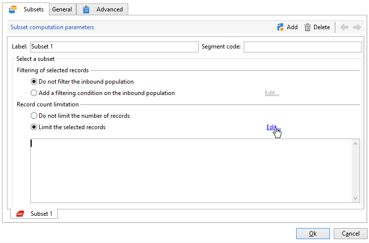
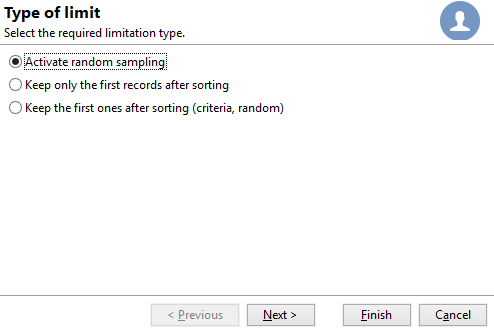

# División{#split}

La actividad del tipo **Split** permite dividir un segmento en varios subconjuntos. El segmento se construye con todos los resultados recibidos: todas las actividades anteriores deben terminar para que se ejecute esta actividad.

Esta actividad no desencadena una unión de poblaciones entrantes. Si varias transiciones se cruzan en una sola actividad, se recomienda que inserte una actividad **[!UICONTROL Union]** delante de ella.

Para ver un ejemplo de la actividad dividida que se está utilizando, consulte [esta sección](targeting-workflows.md#create-subsets-using-the-split-activity).

En [esta sección](cross-channel-delivery-workflow.md) se describe un ejemplo que muestra cómo usar la actividad Partición para segmentar el objetivo en diferentes poblaciones utilizando condiciones de filtrado.

Un ejemplo que muestra cómo usar una variable de instancia en una actividad de división está disponible en [Campaign Knowlegde Base](javascript-scripts-and-templates.md).

Para configurar esta actividad, defina el contenido del subconjunto y la etiqueta en la pestaña **[!UICONTROL Subsets]**, luego elija la dimensión de destino en la pestaña **[!UICONTROL General]**.

## Creación de subconjuntos {#create-subsets}

Para crear un subconjunto:

1. Haga clic en la etiqueta del campo correspondiente y seleccione el filtro que desea aplicar.
1. Para filtrar la población entrante, seleccione la opción **[!UICONTROL Add a filtering condition]** y haga clic en el enlace **[!UICONTROL Edit...]**.

   Seleccione el tipo de filtro que se aplicará a los datos para incluirlos en este conjunto.

   El proceso es el mismo que para una actividad de tipo **Query**.

   >[!NOTE]
   >
   >Puede filtrar los datos en un máximo de dos bases de datos externas (FDA).

1. Puede especificar el número máximo de registros que se extraerán del destino para crear el subconjunto. Para hacer esto, marque la opción **[!UICONTROL Limit the selected records]** y haga clic en el enlace **[!UICONTROL Edit...]**.

   Un asistente le permite elegir el modo de selección para los registros de este subconjunto. [Más información](#limit-the-number-of-subset-records).

   

1. Si lo desea, puede **añadir otros subconjuntos** con el botón **[!UICONTROL Add]**.

   

   >[!NOTE]
   >
   >Si la opción **[!UICONTROL Enable overlapping of output populations]** no está activada, los subconjuntos se crean en el orden de las pestañas. Utilice las flechas de la sección superior derecha de esta ventana para moverlas. Si el primer subconjunto recupera el 70% de la población inicial, por ejemplo, el siguiente subconjunto aplicará sus criterios de selección solo al 30% restante, y así sucesivamente.

   Para cada subconjunto creado, se agregará una transición saliente a la actividad dividida.

   

   Puede optar por generar una sola transición saliente (e identificar conjuntos mediante el código de segmento): para hacerlo, seleccione la opción **[!UICONTROL Generate subsets in the same table]** en la pestaña **[!UICONTROL General]**.

   Si se completa, el código de segmento de cada subconjunto se almacena automáticamente en una columna adicional. Se podrá acceder a esta columna en los campos personalizados en el nivel de entrega.

## Limitar el número de registros de subconjunto {#limit-the-number-of-subset-records}

Si no desea utilizar toda la población contenida en un subconjunto, puede limitar el número de registros que contendrá.

1. En la ventana de edición de subconjuntos, haga clic en la opción **[!UICONTROL Limit the selected records]** y luego en el enlace **[!UICONTROL Edit...]**.
1. Seleccione el tipo de límite que desee:

   * **[!UICONTROL Activate random sampling]**: esta opción toma una muestra aleatoria de los registros. El tipo de muestreo aleatorio depende del motor de la base de datos.
   * **[!UICONTROL Keep only the first records after sorting]**: esta opción permite definir una limitación basada en uno o varios órdenes de clasificación. Si selecciona el campo **[!UICONTROL Age]** como criterio de ordenación y 100 como límite, solo se mantendrán los 100 destinatarios más jóvenes.
   * **[!UICONTROL Keep the first ones after sorting (criteria, random)]**: Esta opción combina las dos opciones anteriores. Permite definir una limitación basada en uno o más pedidos de ordenación y, a continuación, aplicar una selección aleatoria en los primeros registros si alguno de los registros tiene los mismos valores que los criterios definidos.

      Por ejemplo, si selecciona el campo **[!UICONTROL Age]** como criterio de clasificación y luego define un límite de 100, pero los 2000 destinatarios más jóvenes en la base de datos tienen todos 18, entonces se seleccionarán 100 destinatarios aleatoriamente de esos 2000.
   

1. Si desea definir los criterios de ordenación, un paso adicional le permite definir las columnas y el orden de clasificación.

   

1. A continuación, elija el método de limitación de datos.

   

   Hay varias formas de hacerlo:

   * **[!UICONTROL Size (in %)]**: un porcentaje de registros. Por ejemplo, la configuración a continuación extrae el 10% de la población total.

      El porcentaje se aplica a la población inicial, no al resultado de la actividad.

   * **[!UICONTROL Size (as a % of the segment)]**: un porcentaje de registros relacionados únicamente con los subconjuntos y no con la población inicial.
   * **[!UICONTROL Maximum size]**: un número máximo de registros.
   * **[!UICONTROL By data grouping]**: puede establecer un límite en el número de registros en función de los valores de un campo específico de la población entrante. [Más información](#limit-the-number-of-subset-records-by-data-grouping).
   * **[!UICONTROL By data grouping (in %)]**: puede establecer un límite en el número de registros en función de los valores de un campo especificado de la población entrante con un porcentaje. [Más información](#limit-the-number-of-subset-records-by-data-grouping).
   * **[!UICONTROL By data distribution]**: si los campos de agrupación tienen demasiados valores o si desea evitar introducir los valores de nuevo para cada nueva actividad dividida, Adobe Campaign le permite configurar una limitación **[!UICONTROL By data distribution]** (módulo Distributed Marketing opcional). [Más información](#limit-the-number-of-subset-records-per-data-distribution).

1. Haga clic en **[!UICONTROL Finish]** para aprobar los criterios de selección del registro. La configuración definida se muestra en la ventana intermedia del editor.

## Limitar el número de registros de subconjunto por lote de datos {#limit-the-number-of-subset-records-by-data-grouping}

Puede limitar el número de registros por lote de datos. Este límite se puede realizar con un valor fijo o un porcentaje.

Por ejemplo, si selecciona el campo **[!UICONTROL Language]** como valor de grupo, puede definir una lista de registros para cada idioma.

1. Después de seleccionar los valores de limitación de datos, seleccione **[!UICONTROL By data grouping]** o **[!UICONTROL By data grouping (as a %)]** y haga clic en **[!UICONTROL Next]**.

   

1. A continuación, seleccione los campos de agrupación (el campo **[!UICONTROL Language]** por ejemplo) y haga clic en **[!UICONTROL Next]**.

   

1. Finalmente, especifique los umbrales de agrupación de datos (mediante los valores fijos o porcentajes según el método de agrupación seleccionado previamente). Para definir el mismo umbral para cada valor, por ejemplo, si desea definir el número de registros para cada idioma en 10, seleccione la opción **[!UICONTROL All data groupings are the same size]**. Para definir un límite diferente para cada valor, seleccione la opción **[!UICONTROL Limitations by grouping value]**. Esto le permitirá elegir una limitación diferente para inglés, francés, etc.

   

1. Haga clic en **[!UICONTROL Finish]** para aprobar la limitación y volver a la edición de la actividad dividida.

## Limitar el número de registros de subconjunto por distribución de datos {#limit-the-number-of-subset-records-per-data-distribution}

Si los campos de agrupación contienen un número demasiado elevado de valores o si desea evitar valores de restablecimiento para cada nueva actividad dividida, Adobe Campaign permite crear una limitación por cada distribución de datos. Al seleccionar [valores de limitación de datos](#create-subsets) ), seleccione **[!UICONTROL By data distribution]** y seleccione una plantilla en el menú desplegable. A continuación se muestra la creación de una plantilla de distribución de datos.

Para ver un ejemplo de **[!UICONTROL Local approval]** actividad con una plantilla de distribución, consulte [esta página](local-approval-activity.md).

>[!CAUTION]
>
>Esta función solo está disponible con la variable [Complemento Distributed Marketing](../distributed-marketing/about-distributed-marketing.md). Compruebe el acuerdo de licencia.

La plantilla de distribución de datos permite limitar el número de registros usando una lista de valores de agrupación. Para crear una plantilla de distribución de datos, siga los siguientes pasos:

1. Para crear la plantilla de distribución de datos, vaya al nodo **[!UICONTROL Resources > Campaign management > Data distribution]** y haga clic en **[!UICONTROL New]**.

   

1. La pestaña **[!UICONTROL General]** permite introducir la etiqueta y el contexto de ejecución de la distribución (dimensión de segmentación, campo de distribución).

   

   Se deben introducir los campos siguientes:

   * **[!UICONTROL Label]**: etiqueta para la plantilla de distribución.
   * **[!UICONTROL Targeting dimension]**: introduzca la dimensión objetivo a la que se aplicará la distribución de datos, **[!UICONTROL Recipient]** por ejemplo. Este esquema siempre debe ser compatible con los datos utilizados en el flujo de trabajo de segmentación.
   * **[!UICONTROL Distribution field]**: seleccione un campo mediante la dimensión de segmentación. Por ejemplo, si selecciona el campo **[!UICONTROL Email domain]**, la lista de destinatarios se desglosará por dominio.
   * **[!UICONTROL Distribution type]**: seleccione la forma en que se desglosará el valor de limitación del objetivo en la ficha **[!UICONTROL Distribution]**: **[!UICONTROL Percentage]** o **[!UICONTROL Set]**.
   * ** .
   * **[!UICONTROL Approval storage]**: si usa un [Aprobación local](local-approval.md) en el flujo de trabajo de objetivos, introduzca el esquema en el que se guardarán los resultados de aprobación. Debe especificar un esquema de almacenamiento por esquema de segmentación. Si utiliza el esquema de segmentación **[!UICONTROL Recipients]**, introduzca el esquema de almacenamiento predeterminado **[!UICONTROL Local approval of recipients]**.

      Si se trata de una simple limitación de la agrupación de datos sin aprobación local, no es necesario que introduzca el campo **[!UICONTROL Approvals storage]**.

1. Si está utilizando un [Aprobación local](local-approval.md) actividad, introduzca la variable **[!UICONTROL Advanced settings]** para la plantilla de distribución:

   

   Se deben introducir los campos siguientes:

   * **[!UICONTROL Approve targeted messages]**: compruebe esta opción si desea que todos los destinatarios se preseleccionen de la lista de destinatarios para aprobar. Si no selecciona esta opción, no se preseleccionará ningún destinatario.

      >[!NOTE]
      >
      >Esta opción se selecciona de forma predeterminada.

      

   * **[!UICONTROL Delivery label]**: permite definir una expresión para mostrar la etiqueta de entrega en la notificación de retorno. La expresión predeterminada proporciona información sobre la etiqueta estándar de la entrega (cadena calculada). Puede modificar esta expresión.

      

   * **[!UICONTROL Grouping field]**: este campo permite definir la agrupación utilizada para mostrar los destinatarios en la aprobación y las notificaciones de devolución.

      

   * **[!UICONTROL Web Interface]**: permite enlazar una aplicación web a la lista de destinatarios. En la aprobación y en la notificación de retorno, se puede hacer clic en cada destinatario y enlazarlos a la aplicación web seleccionada. El campo **[!UICONTROL Parameters]** (por ejemplo **[!UICONTROL recipientId]**) permite configurar el parámetro adicional que se utilizará en la URL y en la aplicación web.

1. La pestaña **[!UICONTROL Breakdown]** permite definir la lista de valores de distribución.

   

   * **[!UICONTROL Value]**: introduzca los valores de distribución.
   * **[!UICONTROL Percentage / Set]**: introduzca el límite de registros (fijo o porcentual) vinculado a cada valor.

      Esta columna se define mediante el campo **[!UICONTROL Distribution type]** dentro de la pestaña **[!UICONTROL General]**.

   * **[!UICONTROL Label]**: introduzca la etiqueta vinculada a cada valor.
   * **[!UICONTROL Group or operator]**: si está utilizando un[Aprobación local](local-approval.md) seleccione el operador o el grupo de operadores asignados a cada valor de distribución.

      Si se trata de una simple limitación de la agrupación de datos sin aprobación local, no es necesario que introduzca el campo **[!UICONTROL Group or operator]**.

      >[!CAUTION]
      >
      >Asegúrese de que se hayan asignado los permisos adecuados a los operadores.

## Parámetros de filtrado {#filtering-parameters}

Haga clic en la pestaña **[!UICONTROL General]** para introducir la etiqueta de actividad: Seleccione las dimensiones de destino y filtro para esta división. Si es necesario, puede cambiar estas dimensiones para un subconjunto determinado.

Seleccione la opción **[!UICONTROL Generate complement]** si desea utilizar la población restante. El complemento es el destino entrante menos la unión de los subconjuntos. A continuación, se agregará una transición saliente adicional a la actividad de la siguiente manera:

Para que esta opción funcione correctamente, los datos entrantes deben tener una clave principal.

Por ejemplo, si los datos se leen directamente desde una base de datos externa como Netezza (que no admite la noción de un índice) a través de una actividad **[!UICONTROL Data loading (RDBMS)]**, el complemento generado por la actividad **[!UICONTROL Split]** será incorrecto.

Para evitarlo, puede arrastrar y soltar la actividad **[!UICONTROL Enrichment]** justo antes de la actividad **[!UICONTROL Split]**. En la actividad **[!UICONTROL Enrichment]**, verifique y especifique en **[!UICONTROL Keep all additional data from the main set]** los datos adicionales las columnas que desee utilizar para configurar los filtros de la actividad **[!UICONTROL Split]**. A continuación, los datos de la transición entrante de la actividad **[!UICONTROL Split]** se almacenan localmente en una tabla temporal en el servidor de Adobe Campaign y el complemento se puede generar correctamente.

La opción **[!UICONTROL Enable overlapping of output populations]** permite administrar poblaciones que pertenecen a varios subconjuntos:

* Cuando el cuadro no está activado, la actividad de partición garantiza que un destinatario no pueda estar presente en varias transiciones de salida, aunque cumpla los criterios de varios subconjuntos. Se encuentran en el destino de la primera pestaña con criterios coincidentes.
* Cuando se selecciona el cuadro, los destinatarios se pueden encontrar en varios subconjuntos si cumplen con sus criterios de filtro. Adobe Campaign recomienda utilizar criterios exclusivos.

## Parámetros de entrada {#input-parameters}

* tableName
* esquema

Cada evento entrante debe especificar un objetivo definido por estos parámetros.

## Parámetros de salida {#output-parameters}

* tableName
* esquema
* recCount

Este conjunto de tres valores identifica el destino resultante de la exclusión. **[!UICONTROL tableName]** es el nombre de la tabla que registra los identificadores de destinatario, **[!UICONTROL schema]** es el esquema de la población (normalmente nms:recipient) y **[!UICONTROL recCount]** es el número de elementos de la tabla.

La transición asociada al complemento tiene los mismos parámetros.
