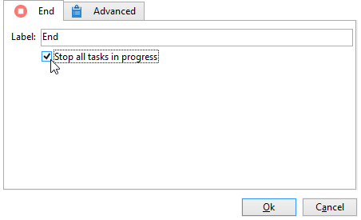

# Inicio y final{#start-and-end}

Las actividades **[!UICONTROL Start]** y **[!UICONTROL End]** permiten marcar de forma gráfica el inicio y el final de un flujo de trabajo. Estas actividades no tienen impacto funcional y, por tanto, son opcionales.

* **[!UICONTROL Start]**

  La ejecución de un flujo de trabajo comienza con actividades sin una transición entrante y actividades del tipo inicial.

  

* **[!UICONTROL End]**

  Puede configurar la actividad **[!UICONTROL End]** para interrumpir todas las tareas que estén en curso. Para ello, haga doble clic en la actividad para mostrar sus propiedades y marque la opción apropiada.

  

  Los datos de la tabla de trabajo se eliminan automáticamente cuando se habilita la actividad final. Si no es necesario y para evitar cargas innecesarias, puede optar por deshabilitar la transición en la última salida de actividad. Por ejemplo, en una salida de envío, si no hay ningún proceso programado, anule la selección de la opción correspondiente como se muestra a continuación:

  
