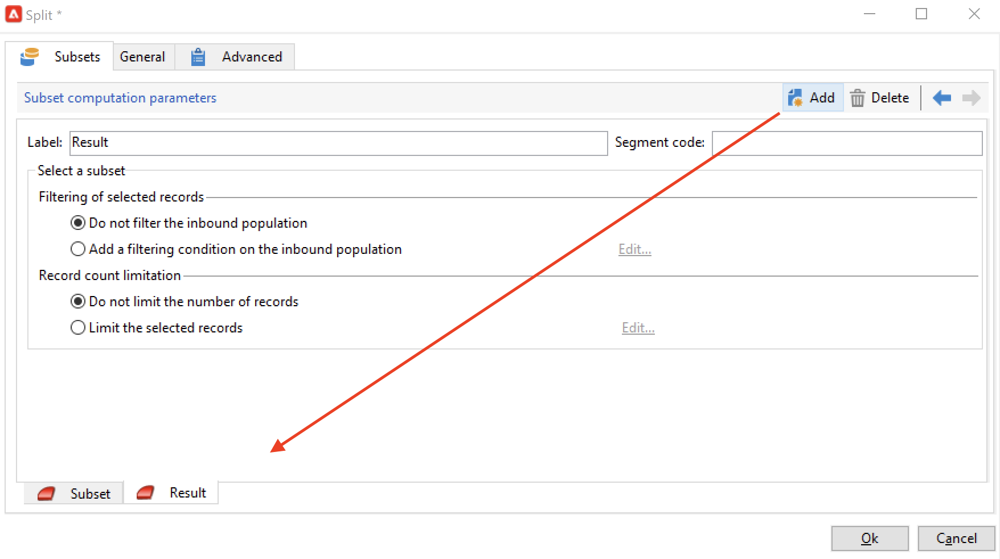

# Crear un flujo de trabajo de segmentación{#target-data}

El flujo de trabajo se puede utilizar para consultar la base de datos y segmentar los datos. El módulo de flujo de trabajo de Campaign es una potente herramienta para realizar actividades de administración de datos, extraer, enriquecer y transformar datos, administrar audiencias y refinar poblaciones.

Los flujos de trabajo de objetivos permiten crear varios objetivos de entrega. Gracias a las actividades de flujo de trabajo, se pueden crear consultas, definir uniones o exclusiones basadas en criterios específicos y añadir planificaciones. El resultado de esta dirección se puede transferir automáticamente a una lista que pueda servir como objetivo de las acciones de entrega.

Además de estas actividades, la gestión de datos permite manipular dichos datos y acceder a funciones avanzadas para satisfacer problemas complejos relacionados con los objetivos. Para obtener más información, consulte [Administración de datos](targeting-workflows.md#data-management).

Todas estas actividades se encuentran en la primera pestaña del flujo de trabajo.

>[!NOTE]
>
>Las actividades de segmentación se describen en esta [página](activities.md).

Los flujos de trabajo de objetivos se pueden crear y editar mediante el nodo **[!UICONTROL Profiles and Targets > Jobs > Targeting workflows]** del árbol de Adobe Campaign o a través del menú **[!UICONTROL Profiles and Targets > Targeting workflows]** de la página principal.

Dentro del marco de una campaña, los flujos de trabajo de objetivos se almacenan con todos los flujos de trabajo de la campaña.

## Pasos clave para crear un flujo de trabajo de segmentación {#implementation-steps-}

Los pasos para crear un flujo de trabajo de segmentación se describen en las siguientes secciones:

1. **Identificar** datos en la base de datos: consulte [Creación de consultas](#create-queries)
1. **Preparar** datos para satisfacer las necesidades de entrega: consulte [Enriquecimiento y modificación de datos](#enrich-and-modify-data)
1. **Usar** datos para realizar actualizaciones o dentro de una entrega: consulte [Actualización de la base de datos](use-workflow-data.md#update-the-database)

Los resultados de todos los enriquecimientos y todas las gestiones realizadas durante el establecimiento de objetivos se almacenan y están accesibles en los campos personalizados, en particular para utilizarlos al crear mensajes personalizados. Para obtener más información, consulte [Datos de destinatarios](use-workflow-data.md#target-data)..

## Establecimiento de objetivos y filtrado de dimensiones {#targeting-and-filtering-dimensions}

Durante las operaciones de segmentación de datos, la clave de establecimiento de objetivos se asigna a una dimensión de filtrado. La dimensión objetivo permite definir la población objetivo de la operación: destinatarios, beneficiarios de contratos, operadores, suscriptores, etc. La dimensión de filtrado permite seleccionar la población en función de determinados criterios: titulares de contrato, suscriptores a boletines, etc.

Por ejemplo, para seleccionar clientes que han tenido una póliza de seguro de vida durante más de 5 años, seleccione la siguiente dimensión de segmentación: **Clients** y la siguiente dimensión de filtrado: **Contract holder**. Después, puede definir las condiciones de filtrado dentro de la actividad de consulta.

Durante la fase de selección de la dimensión objetivo, solo se ofrecen en la interfaz las dimensiones de filtrado compatibles.

Estas dos dimensiones deben estar vinculadas. Por lo tanto, el contenido de la lista **[!UICONTROL Filtering dimension]** depende de la dimensión de segmentación especificada en el primer campo.

Por ejemplo, para los destinatarios (**recipient**), están disponibles las siguientes dimensiones de filtrado:

Mientras que para **Visitantes**, la lista contendrá las siguientes dimensiones de filtrado:

## Creación de consultas {#create-queries}

### Trabajar con datos adicionales {#select-data}

Una actividad **[!UICONTROL Query]** permite seleccionar datos básicos para crear la población objetivo. Para obtener más información, consulte [esta sección](query.md#create-a-query).

También puede utilizar las siguientes actividades para consultar y acotar los datos de la base de datos: [Incremental query](incremental-query.md), [Read list](read-list.md).

Se pueden recopilar datos adicionales que reenviar y procesar a lo largo del ciclo de vida del flujo de trabajo. Para obtener más información, consulte [Añadir datos](query.md#add-data) y [Editar datos adicionales](#edit-additional-data).

### Edición de datos adicionales {#edit-additional-data}

Una vez añadidos los datos adicionales, se pueden editar o utilizar para acotar el objetivo establecido en la actividad de consulta.

El enlace **[!UICONTROL Edit additional data...]** permite ver los datos añadidos y modificarlos o añadirlos a él.

Para añadir datos a las columnas de salida definidas anteriormente, selecciónelas en la lista de campos disponibles. Para crear una nueva columna de salida, haga clic en el icono **[!UICONTROL Add]**, luego seleccione el campo y haga clic en **[!UICONTROL Edit expression]**.

Haga clic en el **Selección avanzada** botón.

Defina un modo de cálculo para el campo que desee añadir, por ejemplo, un acumulado.

La opción **[!UICONTROL Add a sub-item]** permite adjuntar datos calculados a la colección. Esto permite seleccionar los datos adicionales de la colección o definir cálculos acumulados en los elementos de colección.

Los subelementos se representan en el subárbol de la colección a la que se asignan.

Las colecciones se muestran en la subpestaña **[!UICONTROL Collections]**. Puede filtrar los elementos recopilados haciendo clic en el icono **[!UICONTROL Detail]** de la colección seleccionada. El asistente de filtro permite seleccionar los datos recopilados y especificar las condiciones de filtrado que se deben aplicar a los datos de la colección.

### Definición de un objetivo mediante datos adicionales {#refine-the-target-using-additional-data}

Los datos adicionales recopilados pueden permitirle acotar el filtrado de datos de la base de datos. Para ello, haga clic en el enlace **[!UICONTROL Refine the target using additional data...]**: esto permite volver a filtrar los datos añadidos.

### Homogeneización de datos {#homogenize-data}

En las actividades de tipo **[!UICONTROL Union]** o **[!UICONTROL Intersection]**, puede elegir mantener solamente los datos adicionales compartidos para mantener la homogeneidad de los datos. En este caso, la tabla de trabajo temporal de salida de esta actividad solo contiene los datos adicionales encontrados en todos los conjuntos entrantes.

### Reconciliación con datos adicionales {#reconciliation-with-additional-data}

Durante las fases de conciliación de datos (**[!UICONTROL Union]**, **[!UICONTROL Intersection]**, etc. actividades), puede seleccionar las columnas que se utilizarán para la reconciliación de datos en las columnas adicionales. Para ello, configure una reconciliación sobre una selección de columnas y especifique el conjunto principal. A continuación, seleccione las columnas en la columna inferior de la ventana, como se muestra en el siguiente ejemplo:

Seleccione una expresión y confirme.

### Creación de subconjuntos {#create-subsets}

La actividad **[!UICONTROL Split]** permite crear subconjuntos sobre criterios definidos mediante consultas de extracción. Para cada subconjunto, al editar una condición de filtro en la población, puede acceder a la actividad de consulta estándar que permite definir las condiciones de segmentación de objetivos.

Puede dividir un destino en varios subconjuntos utilizando únicamente datos adicionales como condiciones de filtro o sumarlos a los datos de destino. También puede utilizar datos externos si ha adquirido la opción **Federated Data Access**.

Para obtener más información, consulte [esta sección](#create-subsets-using-the-split-activity).

## Datos de segmentos {#segment-data}

### Combinación de varios objetivos (unión) {#combine-several-targets--union-}

La actividad de unión permite combinar el resultado de varias actividades dentro de una transición. Los conjuntos no tienen que ser necesariamente homogéneos.

Estas son las opciones de reconciliación de datos disponibles:

* **[!UICONTROL Keys only]**

   Puede usar esta opción si las poblaciones de entrada son homogéneas.

* **[!UICONTROL All columns in common]**

   Esta opción le permite reconciliar los datos en función de todas las columnas que sean comunes a las distintas poblaciones de destino.

   Adobe Campaign identifica las columnas según su nombre. Se acepta un umbral de tolerancia: por ejemplo, se puede reconocer una columna “correo electrónico” como idéntica a una columna “@email”.

* **[!UICONTROL A selection of columns]**

   Seleccione esta opción para definir la lista de columnas a las que desea aplicar la reconciliación de datos.

   Para empezar, seleccione el conjunto principal (el que contiene los datos de origen) y las columnas que desea utilizar para el enlace.

   

   >[!CAUTION]
   >
   >Durante la reconciliación de datos, las poblaciones no se deduplican.

   Se puede restringir el tamaño de la población a un número determinado de registros. Para ello, haga clic en la opción correspondiente y especifique el número de registros que desee conservar.

   Especifique también la prioridad de las poblaciones entrantes: la sección inferior de la ventana muestra las transiciones entrantes de la actividad de unión y le permite ordenarlas utilizando las flechas azules a la derecha de la ventana.

   Los registros se toman primero de la población de la primera transición entrante en la lista, y después, si no se ha alcanzado el máximo, se toman de la población de la segunda transición entrante, etc.

   

### Extracción de datos conjuntos (intersección) {#extract-joint-data--intersection-}

La intersección permite recuperar únicamente las líneas compartidas por las poblaciones de las transiciones entrantes. Esta actividad debe configurarse como la actividad de unión.

Además, es posible mantener únicamente una selección de columnas o solo las columnas compartidas por la población entrante.

Esta actividad de intersección se detalla en la sección [Intersección](intersection.md).

### Exclusión de una población (exclusión) {#exclude-a-population--exclusion-}

La actividad de exclusión permite excluir los elementos de un objetivo desde una población objetivo diferente. La dimensión objetivo de salida de esta actividad es la del conjunto principal.

Si es necesario, se pueden manipular las tablas entrantes. De hecho, para excluir un objetivo de otra dimensión, se debe devolver este objetivo a la misma dimensión objetivo que el objetivo principal. Para ello, haga clic en el botón **[!UICONTROL Add]** y especifique las condiciones del cambio de dimensión.

La reconciliación de datos se lleva a cabo mediante un identificador, un eje de cambio o una unión.

### Creación de subconjuntos con la actividad División {#create-subsets-using-the-split-activity}

La actividad **[!UICONTROL Split]** es una actividad estándar que permite crear tantos conjuntos como sea necesario mediante una o varias dimensiones de filtro, así como una transición de salida por subgrupo o una transición única.

Los datos adicionales transmitidos por la transición entrante se pueden utilizar en los criterios de filtrado.

Para configurarlo, primero debe seleccionar unos criterios:

1. En el flujo de trabajo, arrastre y suelte una actividad **[!UICONTROL Split]**.
1. En la pestaña **[!UICONTROL General]**, seleccione la opción que desee: **[!UICONTROL Use data from the target and additional data]**, **[!UICONTROL Use the additional data only]** o **[!UICONTROL Use external data]**.
1. Si la opción **[!UICONTROL Use data from the target and additional data]** está seleccionada, la dimensión de destino permite utilizar todos los datos transmitidos por la transición entrante.

   

   Cuando se crean subconjuntos, se utilizan los parámetros de filtrado mencionados.

   Para definir las condiciones de filtrado, seleccione la opción **[!UICONTROL Add a filtering condition on the inbound population]** y haga clic en el enlace **[!UICONTROL Edit...]**. A continuación, especifique las condiciones de filtrado para crear este subconjunto.

   

   En **[!UICONTROL Split]** esta sección se describe un ejemplo de cómo utilizar las condiciones de filtrado en la actividad  para segmentar el objetivo en diferentes poblaciones.

   El campo **[!UICONTROL Label]** permite asignar un nombre al nuevo subconjunto, que coincide con la transición saliente.

   También se puede asignar un código de segmento al subconjunto para identificarlo y utilizarlo para dirigirlo a su población.

   Si es necesario, se pueden cambiar individualmente las dimensiones de filtrado y destino para cada subconjunto que desee crear. Para ello, edite la condición de filtrado del subconjunto y marque la opción **[!UICONTROL Use a specific filtering dimension]**.

   

1. Si se selecciona la opción **[!UICONTROL Use the additional data only]**, solo se ofrecen datos adicionales para el filtrado del subconjunto.

1. Si la opción **Federated Data Access** está activada, el **[!UICONTROL Use external data]** permite procesar datos en una base de datos externa ya configurada o crear una nueva conexión a una base de datos.

A continuación, es preciso añadir nuevos subconjuntos:

1. Haga clic en el botón **[!UICONTROL Add]** para definir las condiciones de filtrado.

   

1. Defina la dimensión de filtrado en la pestaña **[!UICONTROL General]** de la actividad (consulte más arriba). Se aplica a todos los subconjuntos de forma predeterminada.

   

1. Si es necesario, se puede cambiar la dimensión de filtrado, individualmente, para cada subconjunto. Esto permite crear un conjunto para todos los titulares de la tarjeta Gold, otro para todos los destinatarios que hicieron clic en el último boletín y un tercero para las personas de 18 a 25 años que realizaron una compra en la tienda en los últimos 30 días, utilizando todos la misma actividad de división. Para ello, seleccione la opción **[!UICONTROL Use a specific filtering dimension]** y seleccione los criterios de filtrado.

Una vez creados los subconjuntos, la actividad de división muestra de forma predeterminada tantas transiciones de salida como subconjuntos:

Puede agrupar todos estos subconjuntos en una sola transición de salida. En este caso, el vínculo a los respectivos subconjuntos se puede ver en el código del segmento, por ejemplo. Para ello, seleccione la opción **[!UICONTROL Generate all subsets in the same table]**.

Por ejemplo, puede colocar una sola actividad de entrega y personalizar el contenido de la entrega en función del código de segmento de cada grupo de destinatarios.

También se pueden crear subconjuntos mediante la actividad **[!UICONTROL Cells]**. Para obtener más información, consulte la sección [Celdas](cells.md).

### Uso de datos segmentados {#using-targeted-data}

Una vez identificados y preparados los datos, se pueden utilizar en los siguientes contextos:

* Se pueden actualizar los datos en la base de datos después de la manipulación de los mismos en las distintas fases del flujo de trabajo.

   Para obtener más información sobre esto, [Actualice los datos](update-data.md).

* También puede actualizar el contenido de listas existentes.

   Para obtener más información, consulte [Actualizar lista](list-update.md).

* Se pueden preparar o iniciar entregas directamente en el flujo de trabajo.

   Para obtener más información sobre esto, consulte [Entrega](delivery.md), [Control de entrega](delivery-control.md) y [Entrega continua](continuous-delivery.md).

## Administración de datos {#data-management}

En Adobe Campaign, la gestión de datos combina un conjunto de actividades para resolver problemas complejos relacionados con los objetivos mediante la oferta de herramientas más eficientes y flexibles. Las actividades de gestión de datos permiten implementar una administración coherente de todas las comunicaciones con un contacto mediante el uso de información relacionada con sus contratos, suscripciones, reacciones a las entregas, etc. La gestión de datos permite realizar un seguimiento del ciclo de vida de los datos durante las operaciones de segmentación, en particular:

* Simplificar y optimizar los procesos de segmentación al incluir datos que no se encuentran en la base de datos (creación de nuevas tablas: extensión local de cada flujo de trabajo de segmentación en función de la configuración).
* Mantener y transmitir cálculos de búfer, especialmente durante las fases de construcción de objetivos o para la administración de bases de datos.
* Acceso a bases externas (opcional): Bases de datos heterogéneas tomadas en cuenta durante el proceso de selección de objetivos.

Para implementar estas operaciones, Adobe Campaign ofrece:

* Actividades de recopilación de datos: [File transfer](file-transfer.md), [Data loading (file)](data-loading--file-.md), [Data loading (RDBMS)](data-loading--rdbms-.md), [Update data](update-data.md). Este primer paso de recopilación de datos prepara los datos para permitir que se procesen en otras actividades. Es necesario monitorizar varios parámetros para garantizar que el flujo de trabajo se ejecuta correctamente y proporciona los resultados esperados. Por ejemplo, al importar datos, la clave principal (Pkey) de estos datos debe ser exclusiva para cada registro.
* Actividades de establecimiento de objetivos enriquecidas con opciones de administración de datos: [Query](query.md), [Union](union.md), [Intersection](intersection.md), [Split](split.md). Esto permite configurar una unión o una intersección entre los datos de distintas dimensiones de destino, siempre y cuando sea posible la comparación de los mismos.
* Actividades de transformación de datos: [Enrichment](enrichment.md), [Change dimension](change-dimension.md).

>[!CAUTION]
>
>Cuando hay dos flujos de trabajo vinculados, la eliminación de un elemento de la lista de origen no significa que se eliminen todos los datos vinculados a él.
>  
>Por ejemplo, si se elimina un destinatario a través de un flujo de trabajo, el historial de entrega del destinatario no se elimina. Sin embargo, si se elimina un destinatario directamente en la carpeta “Destinatarios”, todos los datos vinculados a este sí se borran.

### Enriquecimiento y modificación de datos {#enrich-and-modify-data}

Además de la dimensión de destino, la dimensión de filtrado permite especificar la naturaleza de los datos recopilados. Consulte [esta sección](targeting-workflows.md#targeting-and-filtering-dimensions).

Los datos identificados y recopilados se pueden enriquecer, añadir y manipular para optimizar la construcción de objetivos. Para ello, además de las actividades de manipulación de datos detalladas en [esta sección](#segmen-data), utilice lo siguiente:

* La actividad **[!UICONTROL Enrichment]** permite añadir rápidamente columnas a un esquema, así como añadir información a ciertos elementos. Se detalla en la sección [Enrichment](enrichment.md) del repositorio de actividades.
* La actividad **[!UICONTROL Edit schema]** permite modificar la estructura de un esquema. Se detalla en la sección [Edit schema](edit-schema.md) del repositorio de actividades.
* La actividad **[!UICONTROL Change dimension]** permite cambiar la dimensión objetivo durante el ciclo de construcción del mismo. Se detalla en la sección [Change dimension](change-dimension.md).
