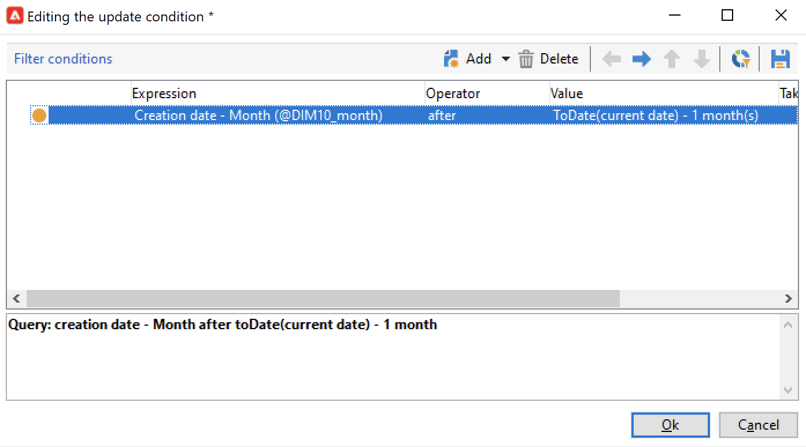

# Actualización de agregado{#update-aggregate}

Los agregados definidos en [cubos](../../v8/reporting/gs-cubes.md) para la generación de informes se pueden actualizar con una actividad específica. Una ficha **[!UICONTROL Workflow]** está disponible al configurar el agregado.

Obtenga más información acerca de los cubos y los agregados en [esta sección](../../v8/reporting/customize-cubes.md#calculate-and-use-aggregates).

Para actualizar un agregado, edite la actividad **[!UICONTROL Update aggregate]** y seleccione el cubo y el agregado que desea actualizar.

Puede configurar una **actualización completa** o una **actualización parcial**.

De forma predeterminada, se ejecuta una actualización completa durante cada cálculo. Para activar una actualización parcial, seleccione la opción y defina las condiciones de actualización.

Una práctica recomendada es agregar una actividad **[!UICONTROL Scheduler]** para configurar la frecuencia de las actualizaciones del cálculo.
