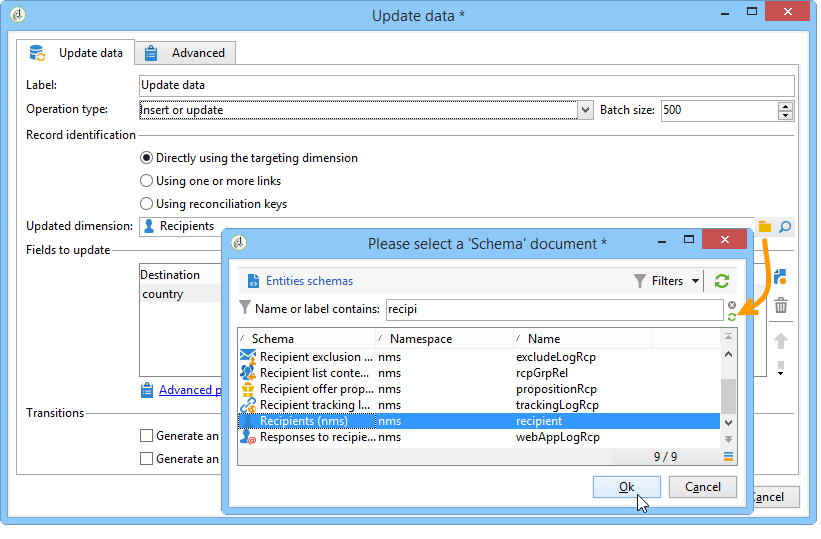
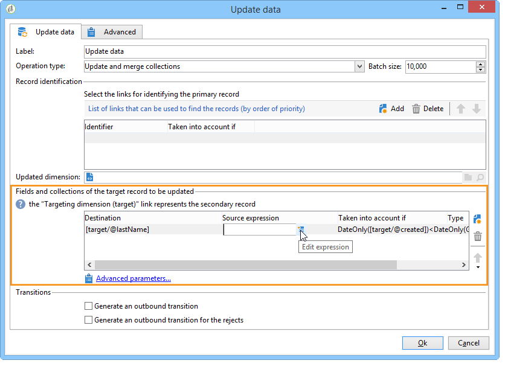

# Actualización de datos{#update-data}

Una actividad del tipo **Fecha de actualización** realiza una actualización masiva de los campos de la base de datos.

## Tipo de operación {#operation-type}

El campo **[!UICONTROL Operation type]** permite elegir el proceso que se lleva a cabo en la información de la base de datos:

* **[!UICONTROL Insert or update]**: añadir datos o actualizarlos si ya se han añadido.
* **[!UICONTROL Insert]**: solo añadir datos.
* **[!UICONTROL Update]**: solo actualizar datos.
* **[!UICONTROL Update and merge collections]**: actualizar datos y elegir un registro principal y enlazar los elementos relacionados con los duplicados en este registro principal. Los duplicados se pueden eliminar sin crear elementos adjuntos huérfanos.
* **[!UICONTROL Delete]**: eliminar datos.

El campo **[!UICONTROL Batch size]** permite seleccionar el número de elementos de transición entrantes que se deben actualizar. Por ejemplo, si establece 500, se actualizarán los 500 primeros registros analizados.

## Identificación de registro {#record-identification}

Especifique cómo identificar los registros de la base de datos:

* Si las entradas de datos están relacionadas con una dimensión de segmentación existente, seleccione la opción **[!UICONTROL By directly using the targeting dimension]** y, luego, en el campo **[!UICONTROL Updated dimension]**.

   Puede mostrar los campos de la dimensión seleccionada con el botón de lupa **[!UICONTROL Edit this link]**.

* De lo contrario, especifique uno o más vínculos que permitan la identificación de los datos en la base de datos o use directamente las claves de reconciliación.

## Selección de los campos que se van a actualizar {#selecting-the-fields-to-be-updated}

Utilice la opción **[!UICONTROL Automatically associate fields with the same name]** para que Adobe Campaign identifique automáticamente los campos que se van a actualizar.

También puede utilizar el icono **[!UICONTROL Insert]** para seleccionar manualmente los campos de base de datos que desea actualizar.

Seleccione todos los campos que desea actualizar y, si es necesario, agregue las condiciones según la actualización a realizar. Para ello, utilice la columna **[!UICONTROL Taken into account if]**. Las condiciones se aplican una tras la otra y se mantienen en el orden de la lista. Utilice las flechas de la derecha para cambiar el orden de las actualizaciones.

Puede utilizar el mismo campo de destino varias veces.

Dentro de una operación **[!UICONTROL Insert or update]**, puede seleccionar la campaña que desea aplicar, ya sea de forma individual o para cada campo. Para ello, seleccione el valor deseado en la columna **[!UICONTROL Operation]**.

Los campos **[!UICONTROL modifiedDate]**, **[!UICONTROL modifiedBy]**, **[!UICONTROL createdDate]** y **[!UICONTROL createdBy]** se actualizan automáticamente durante las actualizaciones de datos, a menos que el modo de administración esté configurado específicamente en la tabla de actualización de campos.

La actualización de registros solo se realiza en registros que contengan al menos una diferencia. Si los valores son iguales, no se realiza ninguna actualización.

El vínculo **[!UICONTROL Advanced parameters]** permite especificar opciones adicionales para trabajar con la actualización de datos y para administrar duplicados. También puede:

* **[!UICONTROL Disable automatic key management]**.
* **[!UICONTROL Disable audit]**.
* **[!UICONTROL Empty the destination value if the source value is empty (NULL)]**. Esta opción está seleccionada de forma predeterminada.
* **[!UICONTROL Update all columns with matching names]**.
* Especifique condiciones que consideren elementos de origen utilizando una expresión en el campo **[!UICONTROL Enabled if]**.
* Especifique condiciones que consideren duplicados mediante una expresión. Si marca la opción **[!UICONTROL Ignore records which concern the same target]** solo se va a considerar la primera en la lista de expresiones.

**[!UICONTROL Generate an outbound transition]**

Crea una transición saliente que se activará al final de la ejecución. La actualización normalmente indica el final de un flujo de trabajo de objetivos, por lo que la opción no se activa de forma predeterminada.

**[!UICONTROL Generate an outbound transition for the rejects]**

Crea una transición saliente que contiene registros que no se han procesado correctamente después de la actualización (por ejemplo, si hay un duplicado). Por lo general, la actualización marca el final de un flujo de trabajo de objetivos y, por lo tanto, la opción no está activada de forma predeterminada.

## Actualización y combinación de colecciones {#updating-and-merging-collections}

La actualización de datos y la combinación de colecciones le permite actualizar los datos contenidos en un registro utilizando datos de uno o varios registros secundarios, con el objetivo de mantener solo uno si lo desea. Estas actualizaciones se gestionan mediante un conjunto de reglas.

>[!NOTE]
>
>Esta opción también permite procesar las referencias a registros secundarios desde las tablas de trabajo del flujo de trabajo (targetWorkflow), envíos (targetDelivery) y listas (targetList). Si es necesario, estos vínculos aparecen en la lista donde se seleccionan los campos y las colecciones.

1. Seleccione la **[!UICONTROL Update and merge collections]** operación.

   

1. Seleccione el orden de prioridad de los vínculos. Esto permite identificar el registro principal. Los vínculos disponibles varían según la transición entrante.

   

1. Seleccione las colecciones que se van a mover al registro principal y los campos que se van a actualizar.

   Introduzca las reglas que se aplican a estas una vez que se identifiquen uno o varios registros secundarios. Para ello, puede utilizar el generador de expresiones. Para obtener más información, consulte  . Por ejemplo, si especifica que es el valor actualizado más recientemente de todos los registros que se deben conservar.

   A continuación introduzca las condiciones para tener en cuenta la regla.

   Finalmente, especifique el tipo de actualización que desea llevar a cabo. Por ejemplo, puede optar por eliminar los registros secundarios después de actualizar los datos.

   Por ejemplo, puede configurar la combinación de colecciones que contengan datos heterogéneos, como la lista de suscripciones de un destinatario. Con las reglas, también puede crear nuevos historiales de suscripciones a partir de suscripciones de registro secundario o incluso mover la lista de suscripciones de un registro secundario a un registro principal.

1. Especifique el orden en que desea que se procesen los registros secundarios, al seleccionar **[!UICONTROL Advanced parameters]** > **[!UICONTROL Duplicates]**.

   

Los datos de los registros secundarios están asociados al registro principal si las reglas definidas son procedentes. Según el tipo de actualización seleccionada, los registros secundarios se pueden eliminar.

## Ejemplo: Actualización de datos después de un enriquecimiento {#example--update-data-following-an-enrichment}

El [Paso 2: Escritura de datos enriquecidos en la sección de tabla](create-a-summary-list.md#step-2--writing-enriched-data-to-the--purchases--table) “Compras” del caso de uso que detalla la creación de una lista de recapitulación ofrece un ejemplo de una actualización de datos después de una actividad de enriquecimiento.

## Parámetros de entrada {#input-parameters}

* tableName
* esquema

Cada evento entrante debe especificar un objetivo definido por estos parámetros.
