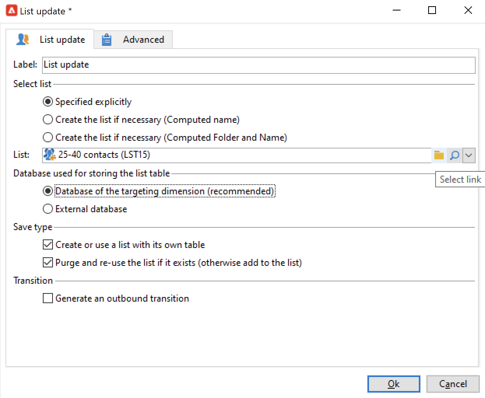

# Uso de datos de flujo de trabajo{#how-to-use-workflow-data}

Puede utilizar las actividades de flujo de trabajo para realizar varias tareas. A continuación, encontrará ejemplos de uso para actualizar la base de datos creando listas, administrando suscripciones, enviando mensajes a través de un flujo de trabajo o enriqueciendo los envíos y sus audiencias.

Hay un conjunto de casos de uso de flujo de trabajo disponibles en [esta sección](workflow-use-cases.md).

## Ciclo de vida de datos {#data-life-cycle}

### Tabla de trabajo temporal del flujo de trabajo {#work-table}

En los flujos de trabajo, los datos que pasan de una actividad a otra se almacenan en una tabla de trabajo temporal.

Estos datos se pueden mostrar y analizar haciendo clic con el botón derecho en la transición correspondiente.


Para ello, seleccione el menú correspondiente:

* **[!UICONTROL Display the target...]**

   Este menú muestra los datos disponibles de la población objetivo.

   

   Puede acceder a la estructura de la tabla de trabajo en la **[!UICONTROL Schema]** pestaña .

   

   Para obtener más información, consulte [esta sección](monitor-workflow-execution.md#worktables-and-workflow-schema).

* **[!UICONTROL Analyze target...]**

   Este menú permite acceder al asistente de análisis descriptivo que permite producir las estadísticas y los informes sobre los datos de transición.

   Para obtener más información, consulte la [documentación de Campaign Classic v7](https://experienceleague.adobe.com/docs/campaign-classic/using/reporting/analyzing-populations/about-descriptive-analysis.html){target=&quot;_blank&quot;}.

Los datos del público objetivo se depuran mientras se ejecuta el flujo de trabajo. Solo se puede acceder a la última tabla de trabajo. Puede configurar el flujo de trabajo para que todas las tablas de trabajo permanezcan accesibles: marque la opción **[!UICONTROL Keep the result of interim populations between two executions]** en las propiedades del flujo de trabajo.


>[!CAUTION]
>
>Esta opción debe **never** esté marcado en un **producción** flujo de trabajo. Esta opción se utiliza para analizar los resultados y está diseñada únicamente para fines de prueba y, por lo tanto, solo debe usarse en entornos de ensayo o desarrollo.


### Aprovechar los datos de destino {#target-data}

Los datos almacenados en la tabla de trabajo temporal del flujo de trabajo están disponibles para las tareas de personalización. Los datos se pueden utilizar en los campos personalizados.

Esto permite utilizar datos recopilados mediante una lista en una entrega, por ejemplo. Para ello, utilice la siguiente sintaxis:

```
%= targetData.FIELD %
```

Los elementos personalizados de tipo **[!UICONTROL Target extension]** (targetData) no están disponibles para flujos de trabajo de objetivos. El objetivo de la entrega debe generarse en el flujo de trabajo y especificarse en la transición entrante de la entrega.

En el siguiente ejemplo, está recopilando una lista de información sobre los clientes para utilizarla en un correo electrónico personalizado. Siga estos pasos:

1. Cree un flujo de trabajo para recopilar información, reconciliarla con los datos que ya se encuentran en la base de datos y, a continuación, iniciar una entrega.

   

1. En nuestro ejemplo, el contenido del archivo es el siguiente:

   ```
   Music,First name,Last name,Account,CD/DVD,Card
   Pop,David,BLAIR,4323,CD,0
   Rock,Daniel,ARCARI,3222,DVD,1
   Disco,Uma,ALTON,0488,DVD,0
   Jazz,Paul,BOLES,6475,CD,1
   Jazz,David,BOUKHARI,0841,DVD,1
   [...]
   ```

   Para cargar el archivo, configure la variable **[!UICONTROL Data loading (file)]** actividad como se muestra a continuación:

   

1. Configure las variables **[!UICONTROL Enrichment]** actividad para reconciliar los datos recopilados con la base de datos de Adobe Campaign. En este caso, la clave de la reconciliación es el número de cuenta:

   

1. A continuación, configure el **[!UICONTROL Delivery]**: se crea en función de una plantilla y la transición entrante especifica los destinatarios.

   

   >[!CAUTION]
   >
   >Solo se pueden utilizar datos contenidos en la transición para personalizar la entrega. Los campos personalizados de tipo **targetData** solo están disponibles para la población entrante de la actividad **[!UICONTROL Delivery]**.

1. En la plantilla de entrega, utilice los campos recopilados en el flujo de trabajo.

   Para ello, inserte los campos personalizados de tipo **[!UICONTROL Target extension]**.

   

   Aquí, queremos insertar el género musical favorito del cliente y el tipo de medio (CD o DVD) como se indica en el archivo recopilado por el flujo de trabajo.

   Además, vamos a añadir un cupón para los titulares de la tarjeta de fidelidad. Por ejemplo, para los destinatarios para los que el valor “Tarjeta” sea igual a 1.

   

   El tipo de datos **[!UICONTROL Target extension]** (targetData) se inserta en las entregas utilizando las mismas características que en todos los campos personalizados. También pueden utilizarse en el asunto, en las etiquetas de los vínculos o en los propios vínculos.


## Actualizar la base de datos {#update-the-database}

Todos los datos recopilados pueden utilizarse para actualizar la base de datos o en las entregas. Por ejemplo, puede enriquecer las opciones de personalización del contenido del mensaje (incluir el número de los contratos en el mensaje, especificar el carro de la compra medio en el último año, etc.) o detallar la población objetivo (enviar un mensaje a los cotitulares del contrato, dirigirse a los 1000 mejores suscriptores de los servicios en línea, etc.). Estos datos también se pueden exportar o archivar en una lista.

### Actualizar listas  {#list-updates}

Los datos de la base de datos de Adobe Campaign y de las listas existentes pueden actualizarse mediante dos actividades específicas:

* La actividad **[!UICONTROL List update]** permite almacenar tablas de trabajo en una lista de datos.

   Puede seleccionar una lista existente o crearla. En este caso, se calculan el nombre y, posiblemente, la carpeta de registros.

   

   Consulte [Actualización de listas](list-update.md).

* La actividad **[!UICONTROL Update data]** realiza una actualización en masa de los campos de la base de datos.

   Para obtener más información, consulte [Actualización de datos](update-data.md).

### Administración de suscripciones {#subscription-management}

Para obtener información sobre las suscripciones y las bajas de un servicio informativo para los destinatarios a través de un flujo de trabajo, consulte [Servicios de suscripción](subscription-services.md).


