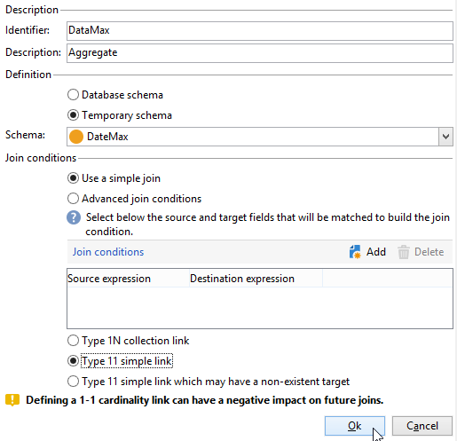

# Uso de acumulados{#using-aggregates}

Este caso de uso detalla cómo identificar automáticamente los últimos destinatarios agregados a la base de datos.

Con el proceso siguiente, la fecha de creación de los destinatarios de la base de datos se compara con la última fecha conocida en la que se creó un destinatario con un agregado. Asimismo, se seleccionan todos los destinatarios creados en el mismo día.

Para realizar un filtro **Creation date = max (Creation date)** en los destinatarios, se debe ejecutar un flujo de trabajo para seguir estos pasos:

1. Recupere los destinatarios de la base de datos utilizando una consulta básica. Para obtener más información, consulte [Creación de una consulta](query.md#creating-a-query).
1. Calcule la última fecha conocida en que se creó un destinatario con el resultado generado a partir de la función de agregación **max (Creation date)** .
1. Enlace cada destinatario al resultado de la función de agregación en el mismo esquema.
1. Filtre los destinatarios con el agregado a través del esquema editado.

## Paso 1: Cálculo del resultado agregado {#step-1--calculating-the-aggregate-result}

1. Cree una consulta. En este caso, el objetivo es calcular la última fecha de creación conocida de todos los destinatarios de la base de datos. Por lo tanto, la consulta no contiene ningún filtro.
1. Seleccione **[!UICONTROL Add data]**.
1. En las ventanas que se abren, seleccione **[!UICONTROL Data linked to the filtering dimension]** y luego **[!UICONTROL Filtering dimension data]**.
1. En la ventana **[!UICONTROL Data to add]**, agregue una columna que calcule el valor máximo del campo **Creation date** en la tabla de destinatarios. Se puede utilizar el editor de expresiones o ingresar **max(@created)** directamente en un campo de la columna **[!UICONTROL Expression]**. A continuación, haga clic en el botón **[!UICONTROL Finish]** .

   

1. Haga clic en **[!UICONTROL Edit additional data]**, luego en **[!UICONTROL Advanced parameters...]**. Marque la opción **[!UICONTROL Disable automatic adding of the primary keys of the targeting dimension]**.

   Esta opción garantiza que todos los destinatarios no se muestren como resultado y que los datos agregados explícitamente no se mantengan. En este caso, hace referencia a la última fecha de creación de un destinatario.

   Deje la opción **[!UICONTROL Remove duplicate rows (DISTINCT)]** marcada.

## Paso 2: Vinculación de destinatarios con el resultado de la función de añadir {#step-2--linking-the-recipients-and-the-aggregation-function-result}

Para vincular la consulta de los destinatarios a la consulta que lleva a cabo el cálculo de la función de agregación, se debe utilizar una actividad de edición de esquema.

1. Defina la consulta para los destinatarios como un conjunto principal.
1. En la pestaña **[!UICONTROL Links]**, agregue un vínculo nuevo e introduzca la información en la ventana que se abre de la siguiente manera:

   * Seleccione el esquema temporal relacionado con el agregado. Los datos de este esquema se agregan a los miembros del conjunto principal.
   * Seleccione **[!UICONTROL Use a simple join]** para vincular el resultado del agregado a cada destinatario del conjunto principal.
   * Finalmente, especifique que el vínculo es un **[!UICONTROL Type 11 simple link]**.

   

Así, el resultado de la agregación se vincula a todos los destinatarios.

## Paso 3: Filtrado de destinatarios mediante el agregado. {#step-3--filtering-recipients-using-the-aggregate-}

Una vez establecido el vínculo, el resultado del agregado y los destinatarios forman parte del mismo esquema temporal. Por lo tanto, es posible crear un filtro en el esquema para comparar la fecha de creación de los destinatarios y la última fecha de creación conocida, representada mediante la función de agregación. Este filtro se lleva a cabo mediante una actividad de división.

1. En la pestaña **[!UICONTROL General]**, seleccione **Recipients** como entorno de segmentación y **Edit schema** como entorno de filtrado (para filtrar en la actividad de esquema de transición entrante).
1. En la pestaña **[!UICONTROL subsets]**, seleccione **[!UICONTROL Add a filtering condition on the inbound population]** y haga clic en **[!UICONTROL Edit...]**.
1. Mediante el editor de expresiones, agregue un criterio de igualdad entre la fecha de creación de los destinatarios y la fecha de creación calculada mediante el agregado.

   Los campos de fecha de la base de datos suelen guardarse en milisegundos. Por lo tanto, se deben ampliar para todo el día a fin de evitar recuperar destinatarios creados solo en ese mismo milisegundo.

   Para ello, utilice la función **ToDate**, disponible en el editor de expresiones, que convierte fechas y horas en fechas simples.

   Por lo tanto, las expresiones que se utilizan en los criterios son:

   * **[!UICONTROL Expression]**: `toDate([target/@created])`.
   * **[!UICONTROL Value]**: `toDate([datemax/expr####])`, donde expr#### se relaciona con el agregado especificado en la consulta de función de añadir.

   

De ese modo, el resultado de la actividad de división se relaciona con los destinatarios creados el mismo día que la última fecha de creación conocida.

A continuación, se puede agregar otras actividades como una actualización de lista o una entrega para enriquecer el flujo de trabajo.
