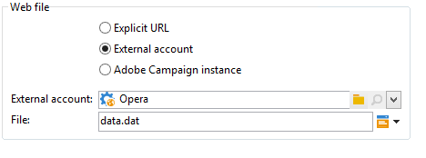

# Descarga web{#web-download}

La actividad **Web download** inicia la descarga de un archivo en una dirección URL explícita, una cuenta externa o una instancia de Adobe Campaign. Se utiliza el protocolo HTTP. Puede ser una descarga GET o POST.

## Propiedades {#properties}

1. **Selecting the Web file**

   Para especificar el archivo que se va a descargar, puede introducir la URL del archivo, utilizar la cuenta HTTP externa donde el archivo se almacena o cargar el archivo mediante una instancia de Adobe Campaign. Los parámetros disponibles se detallan a continuación:

   * Para introducir directamente la URL del archivo a descargar, seleccione la opción **[!UICONTROL Explicit URL]** y especifique la URL en el campo correspondiente. Esta URL se puede construir con datos variables.

     

   * Para utilizar un **[!UICONTROL External account]**, seleccione la cuenta de la lista desplegable y especifique el archivo a descargar.

     Las cuentas externas se configuran en el nodo **[!UICONTROL Administration > Platform > External accounts]** del árbol de Adobe Campaign. Los parámetros de la cuenta se pueden editar mediante el icono **[!UICONTROL Edit link]**.

     

   * Para descargar el archivo desde la instancia de Adobe Campaign, seleccione la opción **[!UICONTROL Adobe Campaign Instance]**.

     

1. **File historization**

   El enlace **[!UICONTROL File historization settings...]** permite especificar el directorio de almacenamiento de archivos y su frecuencia de depuración.

   

   Estas son las opciones disponibles:

   * **[!UICONTROL Use a default storage directory]**: el archivo siempre se mueve antes de procesarse. Si se selecciona esta opción, el archivo se mueve al directorio de almacenamiento predeterminado (el directorio **vars** de la carpeta de instalación de Adobe Campaign). Para especificar un directorio de almacenamiento, anule la selección del cuadro e introduzca su ruta en el campo **[!UICONTROL Storage directory]**
   * **[!UICONTROL Number of files]**: introduzca el número máximo de archivos que se guardarán en el directorio de almacenamiento.
   * **[!UICONTROL Maximum size (in Mb)]**: introduzca la capacidad máxima del directorio de almacenamiento (en megabytes).

   Cada archivo se conserva durante 24 horas. Después se somete a las reglas de depuración definidas. La depuración se realiza justo antes del inicio de la actividad y, por tanto, no tiene en cuenta el archivo de flujo de trabajo en curso.

   Los archivos se eliminan en función de su antigüedad (del más antiguo al más reciente). Los archivos más antiguos se purgan hasta que se hayan comprobado ambas reglas de purga. Por lo tanto, si se define un límite de 100 archivos, significa que el directorio de almacenamiento contendrá siempre los 100 archivos más recientes (antes del inicio del flujo de trabajo), así como los que se procesan en el flujo de trabajo en curso.

   Cuando no desee definir un límite para las opciones **[!UICONTROL Number of files]** y **[!UICONTROL Maximum size (in Mb)]**, introduzca 0 como valor.

1. **Parámetros avanzados**

   El enlace **[!UICONTROL Advanced parameters...]** permite especificar las siguientes opciones adicionales:

   * **[!UICONTROL Follow redirections]**: la redirección de archivos permite utilizar anulaciones para dirigir la entrada o salida de datos a un dispositivo de un tipo diferente.
   * **[!UICONTROL Add the HTTP headers to the file]**: en algunos casos, es posible que desee añadir encabezados HTTP adicionales a un archivo. Lo más habitual es que estos encabezados se utilicen para proporcionar información adicional para la resolución de problemas, para [Cross-origin Resource Sharing (CORS)](https://developer.mozilla.org/docs/Web/HTTP/CORS) o para establecer directivas específicas de almacenamiento en caché.
   * **[!UICONTROL Ignore the HTTP return code]**: los códigos de retorno HTTP, también conocidos como códigos de estado HTTP, indican el resultado de una solicitud HTTP.

   

   La opción **[!UICONTROL Process errors]** se detalla en [Procesamiento de errores](monitor-workflow-execution.md#processing-errors).

## Parámetros de salida {#output-parameters}

* filename: Nombre completo del archivo descargado.
