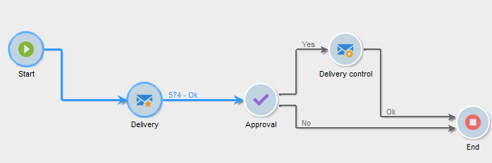

# Ciclo de vida del flujo de trabajo {#workflow-life-cycle}

El ciclo de flujo de trabajo tiene tres pasos principales.

* **Edición en curso**

  Esta es la fase de diseño inicial: cuando se crea un nuevo flujo de trabajo, su estado es “En proceso de edición”. El flujo de trabajo aún no se gestiona mediante el servidor y puede modificarse sin riesgo.

* **Inicio**

  Una vez completada la fase de inicial de diseño, se puede iniciar el flujo de trabajo. En esta fase, el servidor gestiona la instancia y se ejecutan las tareas individuales. El flujo de trabajo se puede seguir modificando, con ciertas precauciones.

* **Finalizado**

  Un flujo de trabajo está “Finalizado” cuando ya no hay tareas en curso o cuando un operador ha detenido explícitamente la instancia.

Por ejemplo, las actividades **Inicio** y **entrega** se destacan, mientras que la actividad de **Aprobación** parpadea en el flujo de trabajo inferior.

Esto significa que las dos primeras actividades se han ejecutado correctamente y que la aprobación está en curso, es decir, que se ha creado, pero aún no ha finalizado.

Los caracteres **574 -Ok** que se muestran encima de la transición a continuación de la actividad **entrega** indican que la preparación de la entrega se ha dirigido a 574 destinatarios y que la operación se ha completado correctamente. Esta información, que se añade a las transiciones cuando se ejecutan, se calcula mediante las actividades que procesan datos.

El flujo de trabajo se inicia y está esperando a que un operador que pertenezca al grupo especificado en la actividad **Aprobación** tome una decisión. Se notifica a los operadores que pertenecen al grupo y a los que tienen una dirección de correo electrónico o un número de móvil.

Para obtener más información sobre cómo monitorizar los flujos de trabajo, consulte [esta sección](monitor-workflow-execution.md).
