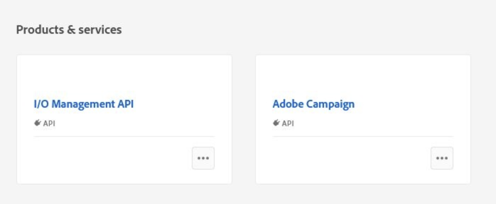
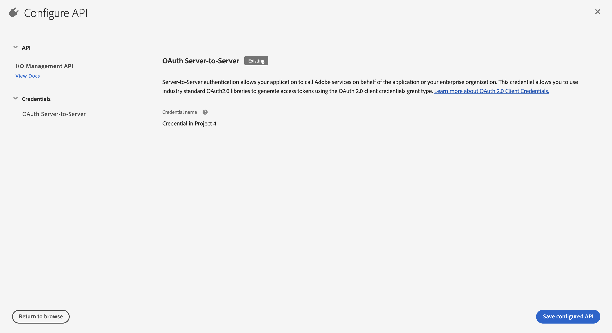

# Migración de los operadores técnicos de Campaign a Adobe Developer Console {#migrate-tech-users-to-ims}

Como parte del esfuerzo por reforzar la seguridad y el proceso de autenticación, a partir de la versión 8.5 de Campaign, se está mejorando el proceso de autenticación en la versión 8 de Campaign. Los operadores técnicos ahora pueden usar [Adobe Identity Management System (IMS)](https://helpx.adobe.com/es/enterprise/using/identity.html){target="_blank"} para conectarse a Campaign. Obtenga más información acerca del nuevo proceso de autenticación de servidor a servidor en [Documentación de Adobe Developer Console](https://developer.adobe.com/developer-console/docs/guides/authentication/ServerToServerAuthentication/){target="_blank"}.

Un operador técnico es un perfil de usuario de Campaign que se ha creado explícitamente para la integración de API. Este artículo detalla los pasos necesarios para migrar un operador técnico a una cuenta técnica a través de la consola de Adobe Developer.


## ¿Se ha visto afectado?{#ims-impacts}

Si realiza llamadas de API desde un sistema externo a Campaign a su instancia de Campaign Marketing o a la instancia de Real-Time Message Center, debe migrar los operadores técnicos a cuentas técnicas a través de Adobe Developer Console, como se detalla a continuación.

Este cambio es aplicable a partir de Campaign v8.5 y será **obligatorio** a partir de Campaign v8.6.


## Proceso de migración {#ims-migration-procedure}

Siga los siguientes pasos para crear cuentas técnicas dentro de Adobe Developer Console y luego utilice esas cuentas recién creadas para poder cambiar los métodos de autenticación de todos los sistemas externos que realizan llamadas de API en Adobe Campaign.

A continuación se ofrece una descripción general de los pasos:

* Creación de un proyecto dentro de Adobe Developer Console
* Asignar las API adecuadas al proyecto recién creado
* Concesión de los perfiles de producto de Campaign necesarios al proyecto
* Actualizar las API para utilizar las credenciales de la cuenta técnica recién creada
* Eliminación de los operadores técnicos heredados de la instancia de Campaign

### Requisitos previos para la migración{#ims-migration-prerequisites}

<!--To be able to create the technical accounts which replace the technical operators, the prerequisite that the proper Campaign Product Profiles exist within the Admin Console for all Campaign instances need to be validated. You can learn more about Product Profiles within the Adobe Console in [Adobe Developer Console documentation](https://developer.adobe.com/developer-console/docs/guides/projects/){target="_blank"}.-->

Para las llamadas de API a las instancias del Centro de mensajes, se debería haber creado un perfil de producto durante la actualización a Campaign v8.5 o durante el aprovisionamiento de la instancia. Este perfil de productos se denomina:

`campaign - <your campaign instance> - messagecenter`

Si ya ha estado utilizando la autenticación basada en IMS para el acceso de los usuarios a Campaign, los perfiles de producto necesarios para las llamadas de API ya deben existir dentro del Admin Console. Si utiliza un grupo de operadores personalizado en Campaign para las llamadas de API a la instancia de Marketing, debe crear ese perfil de producto dentro del Admin Console.

Para otros casos, debe ponerse en contacto con el administrador de transición de Adobe para que los equipos técnicos de Adobe puedan migrar los grupos de operadores existentes y los derechos asignados a los perfiles de producto dentro del Admin Console.


### Paso 1: Creación de su proyecto de Campaign en Adobe Developer Console {#ims-migration-step-1}

Las integraciones se crean como parte de un **Proyecto** en Adobe Developer Console. Obtenga más información acerca de los proyectos en [Documentación de Adobe Developer Console](https://developer.adobe.com/developer-console/docs/guides/projects/){target="_blank"}.

Puede utilizar cualquier proyecto creado anteriormente por usted o puede crear un nuevo proyecto. Los pasos para crear un proyecto se detallan en la [documentación de Adobe Developer Console](https://developer.adobe.com/developer-console/docs/guides/getting-started/){target="_blank"}. Puede encontrar los pasos clave a continuación

<!--
For this migration, you must add below APIs in your project: **I/O Management API** and **Adobe Campaign**.

-->

Para crear un nuevo proyecto, haz clic en **Crear nuevo proyecto** desde la pantalla principal de Adobe Developer Console.


Puede usar el botón **Editar proyecto** para cambiar el nombre de este proyecto.


### Paso 2: Añadir API al proyecto {#ims-migration-step-2}

Desde la pantalla del proyecto recién creado, añada la API necesaria para poder utilizar este proyecto como una cuenta técnica para sus llamadas de API a Adobe Campaign.

Para añadir API al proyecto, siga estos pasos:

1. Haga clic en **Agregar API** para seleccionar las API que desea agregar a su proyecto.
   
1. Seleccione y añada la API de Adobe Campaign a su proyecto marcando la casilla en la esquina superior derecha de la tarjeta de Adobe Campaign que aparece cuando pasa el ratón sobre la tarjeta
   
1. Haz clic en **Siguiente** en la parte inferior de la pantalla.

### Paso 3: Selección del tipo de autenticación  {#ims-migration-step-3}

En la pantalla **Configurar API**, seleccione el tipo de autenticación necesario. Se requiere autenticación de **servidor a servidor OAuth** para este proyecto. Asegúrese de que esté seleccionado y haga clic en **Siguiente** en la parte inferior de la pantalla.


<!--
Once your project is created in the Adobe Developer Console, add an API that uses Server-to-Server authentication. Learn how to set up the OAuth Server-to-Server credential in [Adobe Developer Console documentation](https://developer.adobe.com/developer-console/docs/guides/authentication/ServerToServerAuthentication/implementation/){target="_blank"}.

When the API has been successfully connected, you can access the newly generated credentials including Client ID and Client Secret, as well as generate an access token.-->

### Paso 4: Selección de los perfiles de producto {#ims-migration-step-4}

Como se describe en la sección Requisitos previos, debe asignar los perfiles de producto adecuados para que los utilice el proyecto. En este paso, debe seleccionar los perfiles de producto que se utilizarán en la cuenta técnica que se está creando.

Si esta cuenta técnica se usa para realizar llamadas de API a la instancia del Centro de mensajes, asegúrese de seleccionar el Adobe Crear perfil de producto que termina con `messagecenter`.

Para las llamadas API a las instancias de marketing, seleccione el perfil de producto correspondiente a la instancia y al grupo de operadores.

Una vez seleccionados los perfiles de producto necesarios, haga clic en **Guardar la API configurada** en la parte inferior de la pantalla.

<!--
You can now add your Campaign product profile to the project, as detailed below:

1. Open the Adobe Campaign API.
1. Click the **Edit product profiles** button

    

1. Assign all the relevant Product Profiles to the API, for example 'messagecenter', and save your changes.
1. Browse to the **Credential details** tab of your project, and copy the **Technical Account Email** value.-->

### Paso 5: Añadir la API de administración de E/S al proyecto {#ims-migration-step-5}


En la pantalla del proyecto, haga clic en **[!UICONTROL + Add to Project]** y elija **[!UICONTROL API]** en la parte superior izquierda de la pantalla para poder agregar la API de administración de E/S a este proyecto.


En la pantalla **Agregar una API**, desplácese hacia abajo para encontrar la tarjeta **API de administración de E/S**. Selecciónelo haciendo clic en la casilla de verificación que aparece al pasar el ratón por encima de la tarjeta. Luego haz clic en **Siguiente** en la parte inferior de la pantalla.


En la pantalla **Configurar API**, la autenticación de servidor a servidor OAuth ya existe. Haga clic en **Guardar API configurada** en la parte inferior de la pantalla.




Esto le lleva de nuevo a la pantalla Proyecto dentro de la API de administración de I/O del proyecto recién creado. Haga clic en el nombre del proyecto en las rutas de exploración en la parte superior de la pantalla para que vuelva a la página principal de Detalles del proyecto.


### Paso 6: Verificación de la configuración del proyecto {#ims-migration-step-6}

Revise el proyecto para asegurarse de que tiene un aspecto similar al siguiente con la **API de administración de E/S** y la **API de Adobe Campaign** visibles en la sección Productos y servicios y **OAuth Server-to-Server** en la sección Credenciales.


### Paso 7: Validación de la configuración {#ims-migration-step-7}

Para probar la conexión, siga los pasos detallados en la [guía de credenciales de Adobe Developer Console](https://developer.adobe.com/developer-console/docs/guides/authentication/ServerToServerAuthentication/implementation/#generate-access-tokens){target="_blank"} para generar un token de acceso y copie el comando cURL de muestra proporcionado. Puede crear una llamada soap utilizando estas credenciales para probar que puede autenticarse y conectarse correctamente a las instancias de Adobe Campaign. Se recomienda realizar esta validación antes de realizar todos los cambios en las integraciones de API de terceros.

### Paso 8: Actualización de las integraciones de API de terceros {#ims-migration-step-8}

Ahora debe actualizar todas las integraciones de API que realizan llamadas a Adobe Campaign para utilizar la cuenta técnica recién creada.

Para obtener más información sobre los pasos de integración de la API, incluido un código de ejemplo para una integración sin problemas, consulte la [documentación de autenticación de Adobe Developer Console](https://developer.adobe.com/developer-console/docs/guides/authentication/ServerToServerAuthentication/){target="_blank"}.

SOAP A continuación, se muestran ejemplos de llamadas de que muestran las llamadas de migración antes y después de para los sistemas de terceros.

Al utilizar la autenticación de Adobe Identity Management System (IMS), para generar un archivo WSDL, debe agregar `Authorization: Bearer <IMS_Technical_Token_Token>` en la llamada de postman:

```
curl --location --request POST 'https://<instance_url>/nl/jsp/schemawsdl.jsp?schema=nms:rtEvent' \--header 'Authorization: Bearer <Technical account access token>'
```

Una vez completado y validado el proceso de migración, las llamadas Soap se actualizan de la siguiente manera:

* Antes de la migración: no se admitía el token de acceso de la cuenta técnica.

  ```sql
  POST /nl/jsp/soaprouter.jsp HTTP/1.1
  Host: localhost:8080
  Content-Type: application/soap+xml;
  SOAPAction: "nms:rtEvent#PushEvent"
  charset=utf-8
  
  <?xml version="1.0" encoding="utf-8"?>  <soapenv:Envelope xmlns:soapenv="http://schemas.xmlsoap.org/soap/envelope/" xmlns:urn="urn:nms:rtEvent">
  <soapenv:Header/>
  <soapenv:Body>
      <urn:PushEvent>
          <urn:sessiontoken>SESSION_TOKEN</urn:sessiontoken>
          <urn:domEvent>
              <!--You may enter ANY elements at this point-->
              <rtEvent type="type" email="name@domain.com"/>
          </urn:domEvent>
      </urn:PushEvent>
  </soapenv:Body>
  </soapenv:Envelope>
  ```

* Después de la migración: no se admite el token de acceso de la cuenta técnica. Se espera que el token de acceso se proporcione en el encabezado `Authorization` como token de portador. El uso del token de sesión debe ignorarse aquí, como se muestra en el siguiente ejemplo de llamada soap.

  ```sql
  POST /nl/jsp/soaprouter.jsp HTTP/1.1
  Host: localhost:8080
  Content-Type: application/soap+xml;
  SOAPAction: "nms:rtEvent#PushEvent"
  charset=utf-8
  Authorization: Bearer <IMS_Technical_Token_Token>
  
  <?xml version="1.0" encoding="utf-8"?>  <soapenv:Envelope xmlns:soapenv="http://schemas.xmlsoap.org/soap/envelope/" xmlns:urn="urn:nms:rtEvent">
  <soapenv:Header/>
  <soapenv:Body>
      <urn:PushEvent>
          <urn:sessiontoken></urn:sessiontoken>
          <urn:domEvent>
              <!--You may enter ANY elements at this point-->
              <rtEvent type="type" email="name@domain.com"/>
          </urn:domEvent>
      </urn:PushEvent>
  </soapenv:Body>
  </soapenv:Envelope>
  ```

### Paso 9: (opcional) Actualización del operador de cuenta técnica dentro de la consola del cliente de Campaign {#ims-migration-step-9}

Este paso es opcional y solo está disponible dentro de las instancias de Marketing, no dentro de ninguna instancia del Centro de mensajes. Si se han definido permisos de carpeta específicos o derechos asignados para el operador técnico, no a través de los grupos de operadores asignados. Ahora deberá actualizar el usuario de la cuenta técnica recién creada en el Admin Console para conceder los permisos de carpeta o los derechos asignados necesarios.

Tenga en cuenta que el usuario de cuenta técnica NO existirá en Adobe Campaign hasta que se realice al menos una llamada de API a la instancia de Campaign, momento en el que IMS creará el usuario dentro de Campaign. Si no puede localizar a los usuarios técnicos en Campaign, asegúrese de que ha podido enviar correctamente una llamada de API como se describe [en el paso 7](#ims-migration-step-7).

1. Para aplicar los cambios necesarios para el nuevo usuario de cuenta técnica, localícelos en la consola del cliente de Campaign por dirección de correo electrónico. Esta dirección de correo electrónico se creó durante los pasos Creación de proyecto y Autenticación anteriores.

   Puede encontrar esta dirección de correo electrónico haciendo clic en el encabezado **Servidor a servidor OAuth** en la sección **Credenciales** del proyecto.

   

   En la pantalla Credenciales, desplácese hacia abajo para localizar el **&#x200B; de correo electrónico de la cuenta técnica de &#x200B;** y haga clic en el botón **Copiar**.

   

1. Ahora debe actualizar el operador técnico recién creado en la consola del cliente de Adobe Campaign. Debe aplicar los permisos de carpeta de operador técnico existentes al nuevo operador técnico.

   Para actualizar este operador, siga estos pasos:

   1. Desde el explorador de la consola del cliente de Campaign, vaya a **Administración > Administración de acceso > Operadores**.
   1. Acceda al operador técnico existente utilizado para las API.
   1. Vaya a los permisos de la carpeta y compruebe los derechos.
   1. Aplique los mismos permisos al operador técnico recién creado. El correo electrónico de este operador es el valor de **Correo electrónico de cuenta técnica** copiado anteriormente.
   1. Guarde los cambios.


>[!CAUTION]
>
>El nuevo operador técnico debe haber realizado al menos una llamada de API para añadirla a la consola del cliente de Campaign.
>

### Paso 10: Eliminación del operador técnico antiguo de Adobe Campaign {#ims-migration-step-10}

Una vez que haya migrado todos los sistemas de terceros para utilizar la nueva cuenta técnica con autenticación IMS, puede eliminar el operador técnico antiguo de la consola del cliente de Campaign.

Para ello, inicie sesión en la consola del cliente de Campaign, navegue hasta **Administración > Administración de acceso > Operadores**, busque los usuarios técnicos antiguos y elimínelos.
