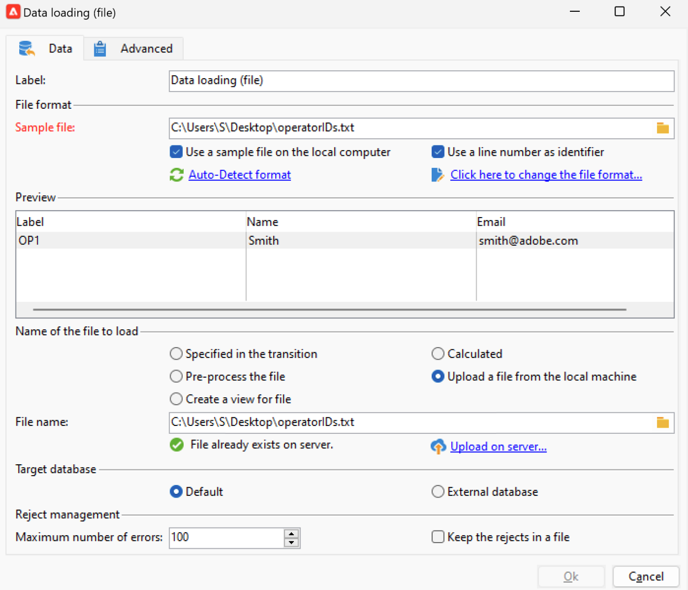
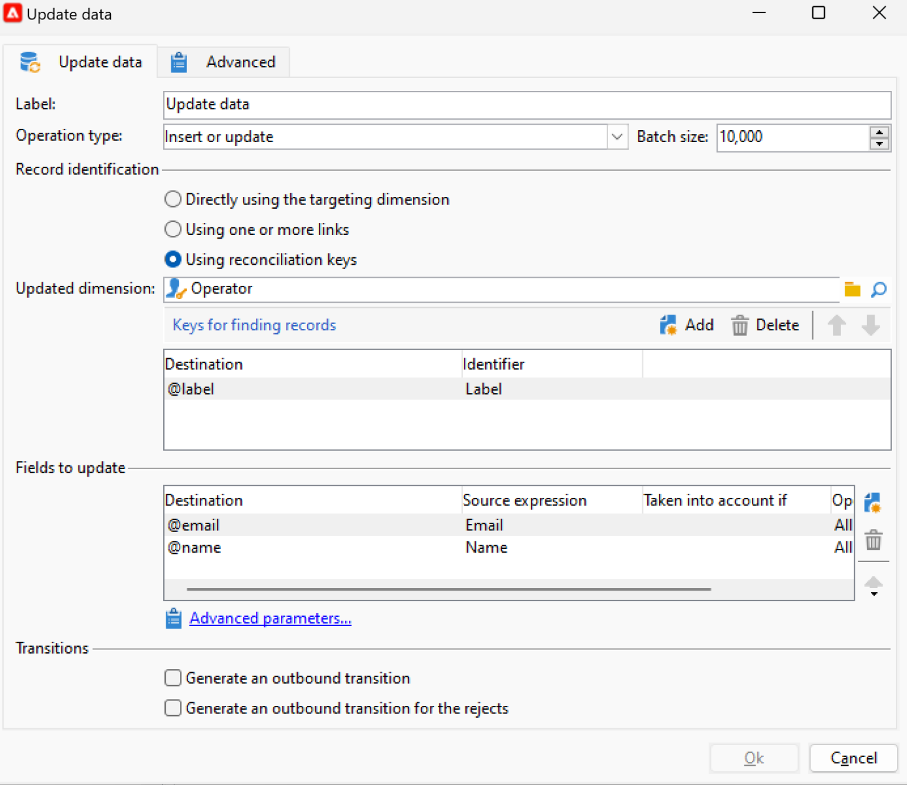

# Migración de operadores de Campaign a Adobe Identity Management System (IMS) {#migrate-users-to-ims}

A partir de la versión 8.6 de Campaign, se está mejorando el proceso de autenticación en la versión 8 de Campaign. Todos los operadores usarán [Adobe Identity Management System (IMS)](https://helpx.adobe.com/es/enterprise/using/identity.html){target="_blank"} **solo** para conectarse a Campaign. Ya no se permitirá conectarse con usuario/contraseña (también conocido como autenticación nativa). Adobe recomienda realizar esta migración en Campaign 8.5.2 para poder migrar sin problemas a Campaign 8.6.

Como cliente de servicios administrados de Campaign Classic v7, si está migrando a Campaign v8, este procedimiento también se le aplica.

Este artículo detalla los pasos necesarios para migrar un operador técnico a una cuenta técnica en la consola de Adobe Developer.

## ¿Qué ha cambiado?{#move-to-ims-changes}

Con Campaign v8, todos los usuarios normales ya deben conectarse a la consola del cliente de Adobe Campaign con su Adobe ID, a través de Adobe Identity Management System (IMS). Sin embargo, con algunas configuraciones anteriores, las conexiones de usuario y contraseña seguían estando disponibles. **Ya no se permite esto a partir de la versión 8.6 de Campaign.**

Además, como parte del esfuerzo por reforzar la seguridad y el proceso de autenticación, la aplicación cliente de Adobe Campaign ahora llama a las API de Campaign directamente mediante el token de cuenta técnica de IMS. La migración para operadores técnicos se detalla en un artículo dedicado, disponible en [esta página](ims-migration.md).

Este cambio es aplicable a partir de Campaign v8.5.2 y es **obligatorio** a partir de Campaign v8.6.

## ¿Se ha visto afectado?{#migrate-ims-impacts}

Si los operadores de su organización se conectan a la consola del cliente de Campaign mediante su inicio de sesión/contraseña (también conocido como. (autenticación nativa), se ha visto afectado y debe migrar estos operadores a Adobe IMS como se detalla a continuación.

La migración a [Adobe Identity Management System (IMS)](https://helpx.adobe.com/es/enterprise/using/identity.html){target="_blank"} es un imperativo de seguridad para hacer que sus entornos sean seguros y estandarizados, ya que la mayoría de las otras soluciones y aplicaciones de Adobe Experience Cloud ya están en IMS.

>[!IMPORTANT]
>
>**Impacto del acceso al Panel de control de Campaign**
>
>Una vez que migre a los usuarios a IMS, tenga en cuenta que cualquier Perfil de producto de Adobe Admin Console que contenga la palabra &quot;admin&quot; en su nombre (como &quot;Administradores&quot;, &quot;admin&quot;, &quot;administradores&quot;, &quot;administrador de aprobación&quot;, etc.) concederá automáticamente acceso al Panel de control de Campaign de Campaign. Panel de control de Campaign es una herramienta de autoservicio que permite realizar cambios significativos en las instancias de Campaign.
>
>Revise atentamente las convenciones de nomenclatura de Perfil de producto para asegurarse de que solo los usuarios autorizados tengan acceso al Panel de control de Campaign. Obtenga más información acerca de la administración de permisos de Panel de control de Campaign en la [documentación de Panel de control de Campaign](https://experienceleague.adobe.com/docs/control-panel/using/discover-control-panel/managing-permissions.html?lang=es){target="_blank"}.

## ¿Cómo realizar la migración?{#ims-migration-procedure}

### Requisitos previos{#ims-migration-prerequisites}

Antes de iniciar el proceso de migración, debe ponerse en contacto con su representante de Adobe (Transition Manager) para que los equipos técnicos de Adobe puedan migrar los grupos de operadores y los derechos asignados existentes a Adobe Identity Management System (IMS).

### Pasos clave {#ims-migration-steps}

A continuación se enumeran los pasos clave para esta migración:

1. Adobe actualiza sus entornos a Campaign v8.5.2.
1. Después de la actualización, aún puede crear nuevos usuarios con ambos métodos, como usuario nativo o con IMS.
1. El administrador de Campaign interno debe añadir correos electrónicos únicos a todos los usuarios nativos en la consola del cliente de Campaign y confirmar en el administrador de transición de Adobe una vez que lo haya hecho. Este paso se detalla en [esta sección](#ims-migration-id).
1. Trabaje con Adobe para asegurar una fecha para que Adobe ejecute la migración automatizada para sus usuarios no técnicos (operadores) y perfiles de producto. Este paso requiere un intervalo de horas sin tiempo de inactividad en ninguna de las instancias.
1. El administrador de Campaign interno valida estos cambios y proporciona una firma. Después de esta migración, ya no debe crear ningún operador adicional que se autentique con este inicio de sesión y contraseña.

Ahora puede migrar sus operadores técnicos a Adobe Developer Console como se detalla en [esta nota técnica](ims-migration.md). Este paso es obligatorio si utiliza las API de Campaign.

Una vez completada esta migración, confirme en el Administrador de transición de Adobe: Adobe marca la migración como completada y bloquea la creación de nuevos usuarios nativos y el inicio de sesión de usuarios nativos. A continuación, su entorno está protegido y estandarizado.

## Preguntas frecuentes {#ims-migration-faq}

### ¿Cuándo puedo iniciar la migración? {#ims-migration-start}

Un requisito previo para la migración a [Adobe Identity Management System (IMS)](https://helpx.adobe.com/es/enterprise/using/identity.html){target="_blank"} es actualizar su entorno a Campaign v8.5.2.

Puede iniciar la migración de IMS en el entorno de ensayo, una vez que se haya actualizado a Campaign v8.5.2 y, en consecuencia, planificar el entorno de producción.

### ¿Qué sucede después de la actualización de la compilación a Campaign v8.5.2? {#ims-migration-after-upgrade}

Una vez que los entornos se hayan actualizado a Campaign v8.5.2, puede iniciar la transición a [Adobe Identity Management System (IMS)](https://helpx.adobe.com/es/enterprise/using/identity.html){target="_blank"}.

La creación de nuevos usuarios nativos sigue estando permitida hasta que se complete la migración de IMS.

### ¿Cuándo se completa la migración? {#ims-migration-end}

Una vez completada la migración de usuarios finales y la migración de usuarios técnicos a Adobe Identity Management System (IMS), debe ponerse en contacto con Adobe Transition Manager para que Adobe pueda marcar la migración como completada, bloquear la creación de usuarios desde la consola del cliente y desactivar el inicio de sesión de usuarios nativos.

### ¿Cómo se crean usuarios después de la migración? {#ims-migration-native}

Una vez completada la migración de IMS, Adobe aplicará las restricciones que bloquearán la creación de nuevos usuarios nativos. Estas restricciones no se aplican hasta que se completa la migración de IMS.

Para nuevos clientes: no se permite la creación de nuevos usuarios nativos desde el principio.

Como administrador de Campaign, puede conceder permisos a los usuarios de su organización a través de Adobe Admin Console y la consola del cliente de Campaign. Los usuarios inician sesión en Adobe Campaign con su Adobe ID. Obtenga más información en [esta documentación](../../v8/start/gs-permissions.md).

### ¿Cómo se agregan correos electrónicos para los usuarios nativos actuales? {#ims-migration-id}

Como administrador de Campaign, debe agregar ID de correo electrónico a todos los usuarios nativos desde la consola del cliente. Para realizar esto, siga los pasos a continuación:

1. Conéctese a la consola del cliente y vaya a **Administración > Administración de acceso > Operadores**.
1. Seleccione el operador que desea actualizar en la lista de operadores.
1. Escriba el correo electrónico del operador en la sección **Puntos de contacto** del formulario del operador.
1. Guarde los cambios.

Como supervisor del flujo de trabajo o administrador de Campaign, también puede realizar una actualización masiva de los operadores con un flujo de trabajo.

+++Pasos clave para actualizar los operadores con un flujo de trabajo

Para realizar una actualización masiva de los operadores nativos, siga estos pasos:

1. Cree un flujo de trabajo para extraer en un archivo CSV todos los operadores que se conecten a Campaign con el modo de autenticación nativo. Utilice una actividad **Query** y una actividad **Data extraction (file)** para crear el archivo CSV. Según los datos de perfil de cada operador, puede exportar las siguientes columnas: `Name, Label`.

   Obtenga más información acerca de la actividad **Consulta** en [esta página](../../automation/workflow/query.md)

   Obtenga más información acerca de la actividad **Extracción de datos (archivo)** en [esta página](../../automation/workflow/extraction-file.md)

1. Actualice el archivo CSV con una nueva columna que contenga los correos electrónicos de los operadores.

1. Cree un flujo de trabajo para importar datos actualizados, con una actividad **Data loading (file)** y una actividad **Update data** en el flujo de trabajo.

   {width="70%"}

1. Edite la actividad **Data loading (file)** y defina la configuración para cargar el archivo CSV actualizado, según el ejemplo siguiente.

   {width="70%"}

   Obtenga más información acerca de la actividad **Carga de datos (archivo)** en [esta página](../../automation/workflow/data-loading-file.md)

1. Edite la actividad **Actualizar datos** y defina la configuración según el ejemplo siguiente. Tenga en cuenta que la **dimensión actualizada** se ha cambiado a `Operators (xtk)`.

   {width="70%"}

   Más información sobre la actividad **Actualizar datos** en [esta página](../../automation/workflow/update-data.md)

1. Ejecute el flujo de trabajo y compruebe los resultados. La dirección de correo electrónico se ha añadido al perfil del operador.

   {width="70%"}

+++

### ¿Cómo iniciar sesión en Campaign a través de IMS? {#ims-migration-log}

Aprenda a conectarse a Campaign con su Adobe ID en [esta sección](../../v8/start/connect.md).

### ¿Habrá un tiempo de inactividad durante esta migración? {#ims-migration-downtime}

Para finalizar la migración (migrar usuarios y perfiles de producto), Adobe necesita un intervalo de una hora sin tiempo de inactividad en ninguna de las instancias (flujos de trabajo, etc.).

Durante este periodo, todos los usuarios de Campaign deben cerrar la sesión y volver a iniciarla con su Adobe ID una vez finalizada la migración a IMS.

### ¿Qué les sucede a los usuarios que iniciaron sesión durante la migración de usuarios de IMS? {#ims-migration-log-off}

Adobe recomienda encarecidamente que todos los usuarios cierren sesión durante la ventana de migración.

### Los usuarios de mi organización ya están utilizando IMS, ¿aún necesito realizar la migración de IMS?{#ims-migration-needed}

Esta migración tiene dos aspectos: migración de usuarios finales y migración de usuarios técnicos (utilizados en las API de su código personalizado).

Si todos los usuarios (operadores de Campaign) están en IMS, no es necesario que realice esta migración. Sin embargo, aún debe migrar a los usuarios técnicos que pueda haber utilizado en el código personalizado. Obtenga más información en [esta página](ims-migration.md).

Una vez completada esta migración, debe ponerse en contacto con el administrador de transición de Adobe para que Adobe finalice la migración.

### ¿Cómo se puede ver el tipo de autenticación de los operadores?

Obtenga información sobre cómo ver el tipo de autenticación de los operadores en Campaign:

1. Desde **Explorer**, acceda a **Administration** `>` **Access Management** `>` **Operators**.

1. Haga clic con el botón derecho en la fila del encabezado y seleccione el menú **Configurar lista**.

   

1. Agregar **cuenta deshabilitada** y **tipo de autenticación** como **columnas de salida**.

   

Ahora puede ver la lista de sus **Operadores** y su **Tipo de autenticación**.

## Vínculos útiles {#ims-useful-links}

* [Migración de usuarios técnicos a la consola de Adobe Developer](ims-migration.md)
* [Cómo conectarse a Adobe Campaign v8](../../v8/start/connect.md)
* [Acceso y permisos en Adobe Campaign v8](../../v8/start/gs-permissions.md)
* [Notas de la versión de Adobe Campaign v8](../../v8/start/release-notes.md)
* [Qué es Adobe Identity Management System (IMS)](https://helpx.adobe.com/es/enterprise/using/identity.html){target="_blank"}
