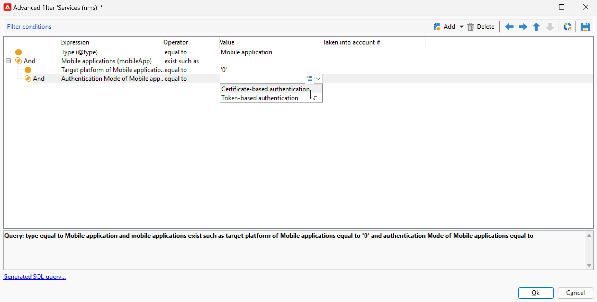

# Cambios del canal de notificaciones push {#push-upgrade}

Puede utilizar Campaign para enviar notificaciones push a dispositivos iOS y Android. Para ello, Campaign se basa en los servicios de suscripción de aplicaciones móviles.

Algunos cambios importantes en el servicio Android Firebase Cloud Messaging (FCM) se lanzarán en 2024 y pueden afectar a su implementación de Adobe Campaign. Es posible que sea necesario actualizar la configuración de los servicios de suscripción para los mensajes push de Android a fin de admitir este cambio.

Además, Adobe recomienda encarecidamente pasar a la conexión basada en tokens a APNS en lugar de a una conexión basada en certificados, que es más segura y escalable.

## Servicio Google Android Firebase Cloud Messaging (FCM) {#fcm-push-upgrade}

### ¿Qué ha cambiado? {#fcm-changes}

Como parte del esfuerzo continuo de Google por mejorar sus servicios, las API de FCM existentes dejarán de usarse el **martes, 22 de julio de 2024**. Obtenga más información acerca del protocolo HTTP de Firebase Cloud Messaging en [Documentación de Google Firebase](https://firebase.google.com/docs/cloud-messaging/migrate-v1){target="_blank"}.

Adobe Campaign Classic v7 y Adobe Campaign v8 ya admiten las últimas API para enviar mensajes de notificación push. Sin embargo, algunas implementaciones antiguas aún dependen de las API heredadas. Estas implementaciones deben actualizarse.

### ¿Se ha visto afectado? {#fcm-impact}

Si la implementación actual admite servicios de suscripción que se conecten a FCM mediante las API heredadas, se verá afectado. La transición a las API más recientes es obligatoria para evitar cualquier interrupción del servicio. En ese caso, los equipos de Adobe se pondrán en contacto con usted.

Para comprobar si se ha visto afectado, puede filtrar su **Servicios y suscripciones** según el filtro siguiente:

* Si alguno de los servicios de notificaciones push activos utiliza **HTTP (heredado)** API, su configuración se verá directamente afectada por este cambio. Debe revisar las configuraciones actuales y pasar a las API más nuevas como se describe a continuación.

* Si su configuración utiliza exclusivamente **HTTP v1** API para notificaciones push de Android, por lo que ya cumple los requisitos y no es necesario que realice ninguna otra acción.

### ¿Cómo realizar la actualización? {#fcm-transition-procedure}

#### Requisitos previos {#fcm-transition-prerequisites}

* Para Campaign Classic v7, se ha añadido la compatibilidad con HTTP v1 en la versión 20.3.1. Si su entorno se está ejecutando en una versión anterior, un requisito previo para la transición a HTTP v1 es actualizar el entorno a [última compilación de Campaign Classic](https://experienceleague.adobe.com/docs/campaign-classic/using/release-notes/latest-release.html){target="_blank"}. Para Campaign v8, HTTP v1 es compatible con todas las versiones y no se necesita ninguna actualización.

* El archivo JSON de la cuenta del servicio Android Firebase Admin SDK es necesario para mover la aplicación móvil a HTTP v1. Obtenga información sobre cómo obtener este archivo en [Documentación de Google Firebase](https://firebase.google.com/docs/admin/setup#initialize-sdk){target="_blank"}.

* Para implementaciones híbridas, alojadas y de Managed Services, además del procedimiento de transición que se muestra a continuación, póngase en contacto con el Adobe de trabajo para actualizar el servidor de ejecución en tiempo real (RT). El servidor intermediario no se ve afectado.

* Como usuario On-Premise de Campaign Classic v7, debe actualizar los servidores de ejecución de marketing y en tiempo real. El servidor intermediario no se ve afectado.

#### Procedimiento de transición {#fcm-transition-steps}

Para mover el entorno a HTTP v1, siga estos pasos:

1. Vaya a la lista de **Servicios y suscripciones**.
1. Enumerar todas las aplicaciones móviles mediante **HTTP (heredado)** Versión de API.
1. Para cada una de estas aplicaciones móviles, configure el **Versión de API** hasta **HTTP v1**.
1. Haga clic en **[!UICONTROL Load project json file to extract project details...]** para cargar directamente el archivo con clave JSON.

   También puede introducir manualmente los siguientes detalles:

   * **[!UICONTROL Project Id]**
   * **[!UICONTROL Private Key]**
   * **[!UICONTROL Client Email]**

   

1. Clic **[!UICONTROL Test the connection]** para comprobar que la configuración es correcta y que el servidor de marketing tiene acceso a FCM. Tenga en cuenta que para las implementaciones intermediarias, la variable **[!UICONTROL Test connection]** no puede comprobar si el servidor tiene acceso al servicio Android Firebase Cloud Messaging (FCM).
1. Como opción, puede enriquecer el contenido de un mensaje push con algunos **[!UICONTROL Application variables]** si es necesario. Son totalmente personalizables y una parte de la carga útil de mensajes se envía al dispositivo móvil.
1. Haga clic en **[!UICONTROL Finish]** y luego en **[!UICONTROL Save]**.

A continuación se muestran los nombres de carga útil de FCM para personalizar aún más la notificación push. Estas opciones están detalladas [aquí](#fcm-apps).

| Tipo de mensaje | Elemento de mensaje configurable (nombre de carga útil de FCM) | Opciones configurables (nombre de carga útil de FCM) |
|:-:|:-:|:-:|
| mensaje de datos | N/A | validate_only |
| mensaje de notificación | title, body, android_channel_id, icon, sound, tag, color, click_action, image, ticker, sticky, visibility, notification_priority, notification_count   | validate_only |

>[!NOTE]
>
>Una vez aplicados estos cambios en todo el servidor, todos los nuevos envíos de notificaciones push a dispositivos Android utilizan la API HTTP v1. Los envíos push existentes en reintento, en curso y en uso siguen utilizando la API HTTP (heredada).

### ¿Cuál es el impacto para mis aplicaciones de Android? {#fcm-apps}

No se requieren cambios específicos en el código de las aplicaciones móviles de Android y el comportamiento de las notificaciones no debe cambiar.

Sin embargo, con HTTP v1, puede personalizar aún más la notificación push con **[!UICONTROL HTTPV1 additional options]**.

Puede hacer lo siguiente:

* Utilice el **[!UICONTROL Ticker]** para establecer el texto del valor de la notificación.
* Utilice el **[!UICONTROL Image]** para establecer la dirección URL de la imagen que se mostrará en la notificación.
* Utilice el **[!UICONTROL Notification Count]** para establecer la cantidad de información nueva no leída que se mostrará directamente en el icono de la aplicación.
* Configure las variables **[!UICONTROL Sticky]** Opción a false para que la notificación se descarte automáticamente cuando el usuario haga clic en ella. Si se establece en true, la notificación se seguirá mostrando incluso cuando el usuario haga clic en ella.
* Configure las variables **[!UICONTROL Notification Priority]** nivel de la notificación al predeterminado, mínimo, bajo o alto.
* Configure las variables **[!UICONTROL Visibility]** nivel de notificación a público, privado o secreto.

Para obtener más información sobre **[!UICONTROL HTTP v1 additional options]** y cómo rellenar estos campos, consulte la [documentación de FCM](https://firebase.google.com/docs/reference/fcm/rest/v1/projects.messages#androidnotification){target="_blank"}.

## Servicio de notificaciones push de Apple iOS (APN) {#apns-push-upgrade}

### ¿Qué ha cambiado? {#ios-changes}

Como recomienda Apple, debe proteger sus comunicaciones con el servicio de notificaciones push de Apple (APN) mediante tokens de autenticación sin estado.

La autenticación basada en tokens ofrece una forma sin estado de comunicarse con APNS. La comunicación sin estado es más rápida que la comunicación basada en certificados porque no requiere que los APN busquen el certificado u otra información relacionada con el servidor de su proveedor. El uso de la autenticación basada en token ofrece otras ventajas:

* Puede utilizar el mismo token desde varios servidores de proveedores.

* Puede utilizar un token para distribuir notificaciones para todas las aplicaciones de la empresa.

Obtenga más información acerca de las conexiones basadas en tokens a APNS en [Documentación para desarrolladores de Apple](https://developer.apple.com/documentation/usernotifications/establishing-a-token-based-connection-to-apns){target="_blank"}.

Adobe Campaign Classic v7 y Adobe Campaign v8 admiten conexiones basadas en tokens y en certificados. Si la implementación depende de una conexión basada en certificados, Adobe le recomienda encarecidamente que la actualice a una conexión basada en tokens.

### ¿Se ha visto afectado? {#ios-impact}

Si la implementación actual depende de solicitudes basadas en certificados para conectarse a APNS, se verá afectado. Se recomienda la transición a una conexión basada en token.

Para comprobar si se ha visto afectado, puede filtrar su **Servicios y suscripciones** según el filtro siguiente:

* Si alguno de los servicios de notificaciones push activos utiliza **Autenticación basada en certificados** modo (.p12), las implementaciones actuales deben revisarse y moverse a un **Autenticación basada en tokens** modo (.p8) como se describe a continuación.

* Si su configuración utiliza exclusivamente **Autenticación basada en tokens** modo para notificaciones push de iOS, la implementación ya está actualizada y no es necesario que realice más acciones.

### ¿Cómo realizar la actualización? {#ios-transition-procedure}

#### Requisitos previos {#ios-transition-prerequisites}

* Para Campaign Classic v7, la compatibilidad de **Autenticación basada en tokens** se ha añadido el modo en la versión 20.2. Si su entorno se está ejecutando en una versión anterior, un requisito previo para este cambio es actualizar su entorno a la versión de [última compilación de Campaign Classic](https://experienceleague.adobe.com/docs/campaign-classic/using/release-notes/latest-release.html){target="_blank"}. Para la versión 8 de Campaign, **Autenticación basada en tokens** Todas las versiones admiten el modo y no se necesita ninguna actualización.

* Necesita una clave de firma de token de autenticación de APNS para generar los tokens que utiliza su servidor. Puede solicitar esta clave a su cuenta de desarrollador de Apple, tal como se explica en [Documentación para desarrolladores de Apple](https://developer.apple.com/documentation/usernotifications/establishing-a-token-based-connection-to-apns){target="_blank"}.

* Para implementaciones híbridas, alojadas y de Managed Services, además del procedimiento de transición que se muestra a continuación, póngase en contacto con el Adobe de trabajo para actualizar el servidor de ejecución en tiempo real (RT). El servidor intermediario no se ve afectado.

* Como usuario On-Premise de Campaign Classic v7, debe actualizar los servidores de ejecución de marketing y en tiempo real. El servidor intermediario no se ve afectado.

#### Procedimiento de transición {#ios-transition-steps}

Para mover las aplicaciones móviles de iOS al modo de autenticación basado en tokens, siga estos pasos:

1. Vaya a la lista de **Servicios y suscripciones**.
1. Enumerar todas las aplicaciones móviles mediante **Autenticación basada en certificados** modo (.p12).
1. Edite cada una de estas aplicaciones móviles y vaya a la **Certificado/Clave privada** pestaña.
1. Desde el **Modo de autenticación** menú desplegable, seleccione **Autenticación basada en tokens** modo (.p8).
1. Rellene la configuración de conexión de APNS **[!UICONTROL Key Id]**, **[!UICONTROL Team Id]** y **[!UICONTROL Bundle Id]** a continuación, seleccione el certificado p8 haciendo clic en **[!UICONTROL Enter the private key...]**.

   

1. Clic **[!UICONTROL Test the connection]** para comprobar que la configuración es correcta y que el servidor tiene acceso a APNS. Tenga en cuenta que para las implementaciones intermediarias, la variable **[!UICONTROL Test connection]** El botón no puede comprobar si el servidor tiene acceso a APNS.
1. Haga clic en **[!UICONTROL Next]** para configurar la aplicación de producción y siga los mismos pasos detallados anteriormente.
1. Haga clic en **[!UICONTROL Finish]** y luego en **[!UICONTROL Save]**.

La aplicación de iOS ahora se mueve al modo de autenticación basado en token.
