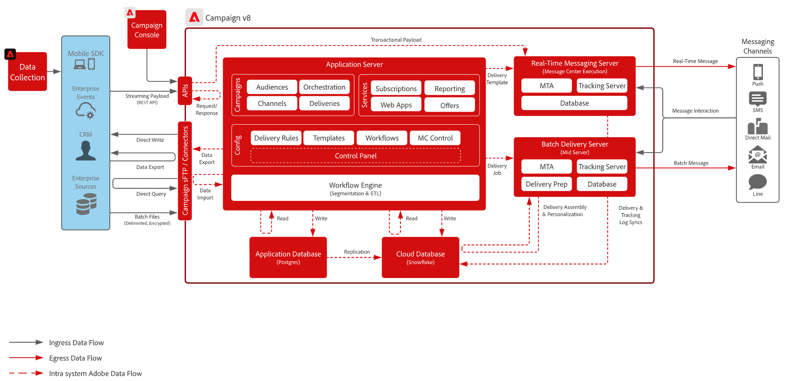
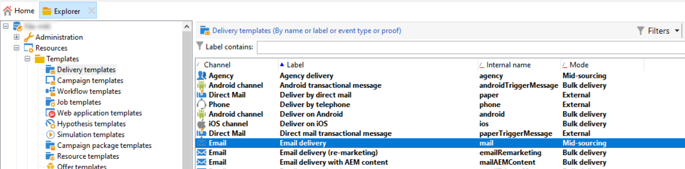
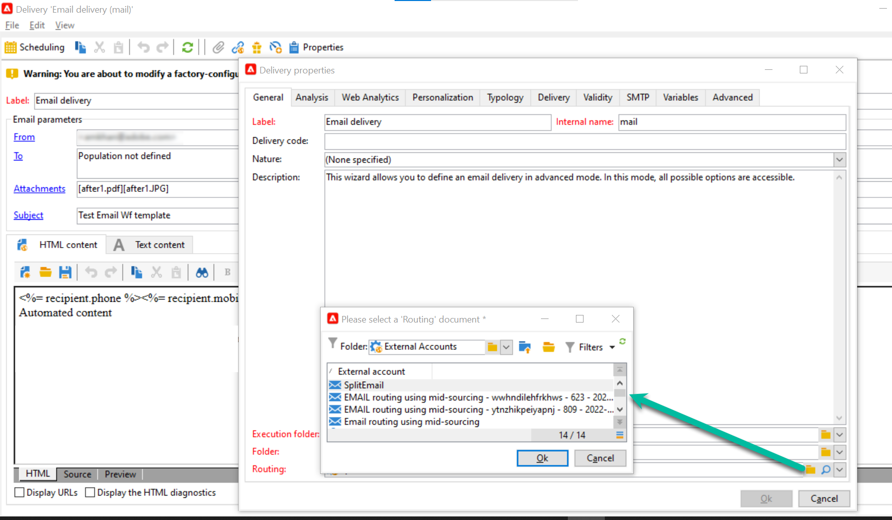

# Introducción a la arquitectura de Campaign{#gs-ac-archi}

## Entornos {#environments}

Campaign está disponible como instancias individuales y cada instancia representa un entorno de Campaign completo.

Hay dos tipos de entornos disponibles:

* **Entorno de producción**: aloja las aplicaciones para profesionales del negocio.

* **Entorno que no es de producción**: se utiliza para varias pruebas de rendimiento y calidad antes de que los cambios en la aplicación se inserten en el entorno de producción.

Puede exportar e importar paquetes de un entorno a otro.

 Obtenga más información sobre los paquetes en [Documentación de Campaign Classic v7](https://experienceleague.adobe.com/docs/campaign-classic/using/getting-started/administration-basics/working-with-data-packages.html){target="_blank"}

## Modelos de implementación {#ac-deployment}

Hay dos modelos de implementación disponibles: **Implementación de FDA de Campaign** (P1-P3) y **Implementación de Campaign Enterprise (FDAC)** (P4).

### Implementación de FDA de Campaign {#ac-deployment-fda}

En su [Implementación de FDA](fda-deployment.md), [!DNL Adobe Campaign] v8 se puede conectar a [!DNL Snowflake] para acceder a los datos a través de la capacidad Acceso de datos federado: puede acceder a datos externos y procesar la información almacenada en su [!DNL Snowflake] base de datos sin cambiar la estructura de los datos de Adobe Campaign. PostgreSQL es la base de datos principal y puede utilizar Snowflake como base de datos secundaria para ampliar el modelo de datos y almacenar los datos en Snowflake. Posteriormente, puede ejecutar ETL, segmentación e informes en un conjunto de datos grande con un rendimiento sobresaliente.

>[!NOTE]
>
>En este modelo de implementación, la variable [!DNL Snowflake] la base de datos secundaria solo está disponible bajo petición. Para actualizar la implementación con [!DNL Snowflake], póngase en contacto con el administrador de transición de Adobe.
>

### Implementación de Campaign Enterprise (FDAC) {#ac-deployment-ffda}

En el contexto de un [Implementación empresarial (FDAC)](enterprise-deployment.md), [!DNL Adobe Campaign] v8 funciona con dos bases de datos: un local [!DNL Campaign] base de datos para la mensajería en tiempo real y consultas unitarias y escritura a través de API de la interfaz de usuario, y a Cloud [!DNL Snowflake] base de datos para la ejecución de campañas, consultas por lotes y la ejecución del flujo de trabajo.

La versión 8 de Campaign Enterprise incorpora el concepto de **Acceso de datos federado completo** (FDAC): todos los datos ahora son remotos en la base de datos en la nube. Con esta nueva arquitectura, la implementación de Campaign v8 Enterprise (FDAC) simplifica la administración de datos: no se requiere ningún índice en la base de datos en la nube. Basta con crear las tablas, copiar los datos y empezar. La tecnología de la base de datos en la nube no requiere ningún mantenimiento específico para garantizar el nivel de rendimiento.

## Ejecución de envío dividido {#split}

>[!AVAILABILITY]
>
>Esta función solo está disponible para clientes con varias configuraciones de instancias de MID.

Según el paquete de Campaign v8, se le proporciona un número específico de instancias intermediarias encargadas de ejecutar los envíos.

De forma predeterminada, las cuentas externas de todos los canales utilizan un **[!UICONTROL Alternate]** modo de enrutamiento, lo que significa que se realiza una entrega de cada instancia intermediaria a la vez de forma alternativa.

Para garantizar un mejor rendimiento tanto en términos de velocidad como de escala, puede permitir que los envíos se dividan automáticamente en varias instancias intermediarias para que se entreguen más rápido a los destinatarios. Esta operación es transparente al ejecutar el envío desde la instancia de marketing: una vez realizado el envío, todos los registros se consolidan juntos, antes de enviarse de nuevo a la instancia de marketing en un solo objeto de envío.

Para ello, agregue cuentas externas adicionales con la variable **[!UICONTROL Split]** los modos de enrutamiento se crean en el aprovisionamiento de cada canal:

* Envío dividido: correo electrónico (splitDeliveryEmail)
* Envío dividido: SMS (splitDeliverySMS)
* Envío dividido: iOS (splitDeliveryIOS)
* Envío dividido: Android (splitDeliveryAndroid)

>[!IMPORTANT]
>
>El modo de enrutamiento dividido está habilitado de forma predeterminada para la cuenta &quot;Split Delivery - Email&quot;. Para el resto de cuentas externas de canales, póngase en contacto con el administrador de transición de Adobe para activar la opción.
>
>De forma predeterminada, el valor de tamaño del umbral para dividir una entrega entre varios medios es 100 000. Puede cambiar este valor en la opción &quot;NmsDelivery_MultiMidSplitThreshold&quot; en el **[!UICONTROL Administration]** / **[!UICONTROL Platform]** / **[!UICONTROL Options]** menú.

Para que las cuentas externas divididas sean la cuenta predeterminada para realizar envíos, debe cambiar el proveedor de enrutamiento en las plantillas de envío. Para ello, siga estos pasos:

1. Vaya a **[!UICONTROL Resources]** / **[!UICONTROL Templates]** / **[!UICONTROL Delivery templates]** y abra la plantilla de envío deseada. En este ejemplo, deseamos editar la plantilla de envíos de correo electrónico.

   

1. Haga clic en **[!UICONTROL Properties]** y cambie el proveedor de enrutamiento a la cuenta externa de envío dividida correspondiente.

   

1. Guarde los cambios. Todos los envíos realizados con la plantilla utilizan el modo de enrutamiento dividido de forma predeterminada.

<!--In addition, you can select split external accounts as the default routing provider for all future delivery templates. To do this, change the value of the **[!UICONTROL xtkoption NmsBroadcast_DefaultProvider]** option to the name of the split account.

 -->

## Arquitectura del centro de mensajes{#transac-msg-archi}

La mensajería transaccional (Centro de mensajes) es el módulo de Campaign diseñado para gestionar mensajes de activación.

 Aprenda a enviar mensajes transaccionales en [esta sección](../send/transactional.md).

En respuesta a una acción de un cliente en un sitio web, se envía un evento de Campaign a través de una API de REST, y la plantilla de mensaje se rellena con la información o los datos proporcionados a través de la llamada de API, y se envía un mensaje transaccional en tiempo real al cliente. Estos mensajes se pueden enviar por separado o en serie por correo electrónico, SMS o notificaciones push.

En esta arquitectura específica, la celda de ejecución se separa de la instancia de control para garantizar una alta disponibilidad y administración de la carga.

* El **Instancia de control** (o instancia de Marketing) los utilizan los especialistas en marketing y los equipos de TI para crear, configurar y publicar plantillas de mensajes. Esta instancia también centraliza la monitorización y el historial de eventos.

   Obtenga información sobre cómo crear y publicar plantillas de mensajes en [esta sección](../send/transactional.md).

* El **Instancia de ejecución** recupera los eventos entrantes (restablecimiento de contraseña o pedidos de un sitio web por ejemplo) y envía mensajes personalizados. Puede haber más de una instancia de ejecución para procesar mensajes a través del equilibrador de carga y escalar el número de eventos que se van a procesar para obtener la máxima disponibilidad.

>[!CAUTION]
>
>La instancia de control y las instancias de ejecución deben estar instaladas en diferentes equipos. No pueden compartir la misma instancia de Campaign.

### Autenticación

Para utilizar estas funcionalidades, los usuarios de Adobe Campaign inician sesión en la instancia de control para crear plantillas de mensajes transaccionales, generar la vista previa del mensaje utilizando una lista de semilla, mostrar informes y supervisar las instancias de ejecución.

* Instancia de ejecución única Al interactuar con una instancia de ejecución del Centro de mensajes alojada en el Adobe, un sistema externo puede recuperar primero un token de sesión (que, de forma predeterminada, caduca en 24 horas), realizando una llamada de API al método de inicio de sesión, utilizando para ello el inicio de sesión y la contraseña de la cuenta proporcionados.
A continuación, con el sessionToken proporcionado por la instancia de ejecución en respuesta a la llamada anterior, la aplicación externa puede realizar invocaciones de la API de SOAP (rtEvents o batchEvents) para enviar comunicaciones, sin necesidad de incluir en cada llamada SOAP el inicio de sesión y la contraseña de la cuenta.

* Varias instancias de ejecución En una arquitectura de ejecución de varias celdas con varias instancias de ejecución detrás de un equilibrador de carga, el método de inicio de sesión invocado por la aplicación externa pasa por el equilibrador de carga: por ese motivo, no se puede utilizar una autenticación basada en token. Se requiere una autenticación basada en usuario/contraseña.

Obtenga más información acerca de los eventos de mensajería transaccional en [esta página](../send/event-processing.md).
