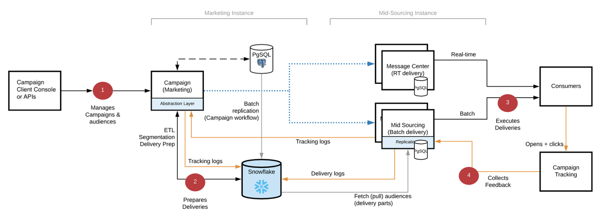

# [!DNL Campaign] Implementación de FDAC {#gs-ac-ffda}

Mediante [[!DNL Snowflake]](https://www.snowflake.com/), una tecnología de base de datos en la nube, la implementación de Adobe Campaign Enterprise Full Federated Access (FDAC) mejora considerablemente su escala y velocidad, con la capacidad de administrar una cantidad más significativa de perfiles de clientes, así como tasas de entrega y transacciones por hora mucho más altas.

## Ventajas {#ffda-benefits}

La versión 8 de Campaign Enterprise (FDAC) ofrece una escala de extremo a extremo en cualquier paso del proceso, desde la segmentación hasta la creación de informes final:

* Escalar el volumen de datos que puede gestionar (hasta 8 TB)
* Escalar el rendimiento de las consultas para segmentación y direccionamiento, pero también el consumo y la salida de datos
* Escalar la preparación del envío (de horas a minutos)

Este es un cambio fundamental en la arquitectura del software. Ahora, los datos son remotos y Campaign federa todos los datos, incluidos los perfiles. Los procesos de [!DNL Campaign] ahora escalan de extremo a extremo, desde el direccionamiento hasta la ejecución del mensaje: la ingesta de datos, la segmentación, el direccionamiento, las consultas y las entregas ahora se ejecutan normalmente en minutos. Esta nueva versión resuelve el desafío del escalado por completo, pero mantiene el mismo nivel de flexibilidad y extensibilidad. El número de perfiles es casi ilimitado y se puede ampliar la retención de datos.

El almacenamiento en la nube se realiza en **[!DNL Snowflake]**: una nueva **cuenta externa** garantiza la conectividad con la base de datos en la nube. Está configurado por Adobe y no debe modificarse. [Más información](../config/external-accounts.md)

Cualquier esquema o tabla integrada que deba moverse o replicarse en la base de datos en la nube viene con una extensión de esquema integrada en el área de nombres **xxl.** Estas extensiones contienen cualquier modificación necesaria para mover esquemas integrados de la base de datos de [!DNL Campaign] local a la base de datos de [!DNL Snowflake] en la nube y adaptar su estructura en consecuencia: nuevo UUID, vínculos actualizados, etc.

>[!CAUTION]
>
> Los datos del cliente no se almacenan en la base de datos local [!DNL Campaign]. Como consecuencia, cualquier tabla personalizada debe crearse en la base de datos en la nube.
>

## Arquitectura de Campaign Enterprise (FDAC){#ffda-archi}

En un [Implementación empresarial (FDAC)](../architecture/enterprise-deployment.md), [!DNL Adobe Campaign] v8 funciona con dos bases de datos: un local [!DNL Campaign] base de datos para la mensajería en tiempo real y consultas unitarias y escritura a través de API de la interfaz de usuario, y a Cloud [!DNL Snowflake] base de datos para la ejecución de campañas, consultas por lotes y la ejecución del flujo de trabajo.

La versión 8 de Campaign Enterprise incorpora el concepto de **Acceso de datos federado completo** (FDAC): todos los datos ahora son remotos en la base de datos en la nube.

Hay API específicas disponibles para administrar los datos entre la base de datos local y la base de datos en la nube. Descubra cómo funcionan estas nuevas API y cómo utilizarlas en [esta página](new-apis.md).

La comunicación general entre servidores y procesos se realiza según el siguiente esquema:

* Los módulos de administración de ejecución y rechazos están desactivados en la instancia.
* La aplicación está configurada para ejecutar mensajes en un servidor &quot;intermediario&quot; remoto que se administra mediante llamadas SOAP (a través de HTTP o HTTPS).

El [!DNL Snowflake] La base de datos de marketing se utiliza para:

* Almacenar todos los datos de clientes: perfiles, datos personalizados como transacciones, productos, ubicaciones, etc.
* Almacena todos los eventos y datos de comportamiento generados o recopilados por Campaign, como registros de envío, registros de seguimiento, registros push, etc.
* Almacena todos los agregados de datos de lo anterior.
* Almacenar una copia (h+1) de las tablas de referencia (como envíos, enumeraciones, países, etc.) que se utilizan en flujos de trabajo, campañas e informes.
* Ejecutar todos los procesos por lotes y las cargas de trabajo

La base de datos PostgreSQL de la instancia de marketing se utiliza para lo siguiente:

* Ejecutar ciertas cargas de trabajo, como las API de bajo volumen.
* Almacene todos los datos de Campaign, incluida la configuración de entrega y campaña, el flujo de trabajo y las definiciones de servicio.
* Almacena todas las tablas de referencia integradas (enumeraciones, países, etc.) que se replican en [!DNL Snowflake].

  Sin embargo, no puede:
   * crear personalizaciones para los datos del cliente; por ejemplo, no cree una tabla doméstica en PostgreSQL, sino solo en Snowflake
   * almacene cualquier registro de envío, registro de seguimiento, etc. en la dimensión de segmentación de FDAC.
   * almacene un gran volumen de datos.

La base de datos PostgreSQL en la instancia intermediaria se utiliza para lo siguiente:

* Ejecute envíos por lotes y en tiempo real (RT).
* Envío de registros de envío y seguimiento: tenga en cuenta que los ID de envío y registro de seguimiento son UUID y no ID de 32 bits.
* Recopilar y almacenar datos de seguimiento.

## Impactos{#ffda-impacts}

### [!DNL Campaign] Mecanismo de ensayo de API{#staging-api}

Con [!DNL Campaign] En la base de datos de la nube, no se recomiendan las llamadas unitarias de ráfaga debido al rendimiento (latencia y concurrencia). Siempre se prefiere la operación por lotes. Para garantizar un rendimiento óptimo de las API, Campaign sigue gestionando las llamadas a la API en el nivel de base de datos local.

 [El mecanismo de ensayo de la API se detalla en esta página](staging.md)

### Nuevas API{#new-apis}

Hay nuevas API disponibles para administrar la sincronización de datos entre [!DNL Campaign] base de datos local y base de datos en la nube. También se ha introducido un nuevo mecanismo para gestionar llamadas de API en el nivel de base de datos local para evitar la latencia y aumentar el rendimiento general.

 [Las nuevas API se detallan en esta página](new-apis.md)

### Replicación de datos{#data-replication}

Un flujo de trabajo técnico específico gestiona la replicación de tablas que deben estar presentes en ambos lados (base de datos local de Campaign y base de datos en la nube). Este flujo de trabajo se activa cada hora y depende de una nueva biblioteca JavaScript integrada.

>[!NOTE]
>
> Se han creado varias políticas de replicación en función del tamaño de la tabla (XS, XL, etc.).
> Algunas tablas se duplican en tiempo real, mientras que otras lo hacen cada hora. Algunas tablas sufrirán actualizaciones incrementales, mientras que otras se actualizarán por completo.
>

[Más información acerca de la replicación de datos](replication.md)

### Administración de ID{#id-mgt-ffda}

Los objetos de Campaign v8 ahora utilizan un **ID único universal (UUID)**, que permite valores únicos ilimitados para identificar datos..

Tenga en cuenta que este ID se basa en cadenas y no en secuencias. La clave principal no es un valor numérico en Campaign v8, y debe utilizar los atributos **autouuid** y **autopk** en los esquemas.

En Campaign Classic v7 y versiones anteriores, la unicidad de una clave dentro de un esquema (es decir, una tabla) se gestiona en el nivel del motor de la base de datos. De forma más general, los motores de base de datos clásicos como PostgreSQL, Oracle o SQL Server incluyen un mecanismo nativo para evitar la inserción de filas duplicadas basadas en una columna o un conjunto de columnas a través de claves principales o índices únicos. El ID duplicado no existe en estas versiones cuando el índice adecuado y las claves principales se establecen en el nivel de base de datos.

Adobe Campaign v8 viene con Snowflake como base de datos principal. Como aumenta drásticamente la escala de las consultas, la arquitectura distribuida de la base de datos de Snowflake no proporciona esos mecanismos para administrar y, a continuación, hacer cumplir la unicidad de una clave dentro de una tabla. Como consecuencia, con Adobe Campaign v8, nada impide la ingesta de claves duplicadas en una tabla. Los usuarios finales ahora son responsables de garantizar la coherencia de las claves en la base de datos de Adobe Campaign. [Más información](keys.md)

### Disponibilidad de funciones {#feature-availability}

Algunas funciones no están disponibles en el contexto de una implementación empresarial (FDAC) de Campaign, como:

* Administración de recursos de marketing
* Cupones
* Seguimiento web
* Encuestas

**Temas relacionados**

* [Prácticas recomendadas del modelo de datos](../dev/datamodel-best-practices.md)
