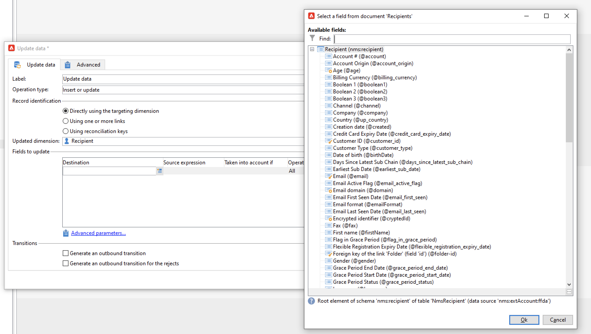
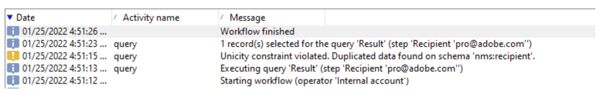

# Administración de claves y unicidad {#key-management}

En el contexto de una implementación [empresarial (FDAC)](enterprise-deployment.md), la clave principal es un identificador único universal (UUID), que es una cadena de caracteres. Para crear este UUID, el elemento principal del esquema debe contener los atributos **autouuid** y **autopk** establecidos en **true**.

La versión 8 de Adobe Campaign usa [!DNL Snowflake] como base de datos principal. La arquitectura distribuida de la base de datos [!DNL Snowflake] no proporciona ningún mecanismo para garantizar la unicidad de una clave dentro de una tabla: los usuarios finales son responsables de la coherencia de claves dentro de la base de datos de Adobe Campaign.

Evitar duplicados en las claves, y especialmente en las claves principales, es obligatorio para conservar la coherencia de la base de datos relacional. Los duplicados en las claves principales producen problemas con las actividades del flujo de trabajo de administración de datos como **Consulta**, **Reconciliación**, **Actualización de datos** y más. Esto es fundamental para definir criterios de reconciliación adecuados al actualizar [!DNL Snowflake] tablas.

>[!CAUTION]
>
>Las claves duplicadas no están restringidas a UUID. Puede ocurrir en con los ID, incluidas las claves personalizadas creadas en tablas personalizadas.

## Servicio de unicidad{#unicity-service}

El servicio de unicidad es un componente de Cloud Database Manager que ayuda a los usuarios a preservar y controlar la integridad de las restricciones clave únicas dentro de las tablas de Cloud Database. Esto le permite reducir el riesgo de insertar claves duplicadas.

Como la base de datos de Cloud no impone restricciones de unicidad, el servicio de unicidad reduce el riesgo de insertar duplicados al administrar los datos con Adobe Campaign.

### Flujo de trabajo de unicidad{#unicity-wf}

El servicio de unicidad incluye un flujo de trabajo integrado **[!UICONTROL Unicity alerting]** dedicado para supervisar las restricciones de unicidad y avisar cuando se detecten duplicados.

Este flujo de trabajo técnico está disponible en el nodo **[!UICONTROL Administration > Production > Technical workflows > Full FFDA Unicity]** del explorador de Campaign. **No se debe modificar**.

Este flujo de trabajo comprueba todos los esquemas personalizados e integrados para detectar filas duplicadas.

Si el flujo de trabajo **[!UICONTROL Unicity alerting]** (ffdaUnicity) detecta claves duplicadas, estas se agregan a una tabla **Audit Unicity** específica, que incluye el nombre del esquema, el tipo de clave, el número de filas afectadas y la fecha. Puede acceder a las claves duplicadas desde el nodo **[!UICONTROL Administration > Audit > Key Unicity]**.

Como administrador de bases de datos, puede utilizar una actividad SQL para eliminar los duplicados o ponerse en contacto con el servicio de atención al cliente de Adobe para obtener más información.

### Alerta{#unicity-wf-alerting}

Se envía una notificación específica al grupo de operadores **[!UICONTROL Workflow Supervisors]** cuando se detectan claves duplicadas. El contenido y la audiencia de esta alerta se pueden cambiar en la actividad **Alerta** del flujo de trabajo **[!UICONTROL Unicity alerting]**.

## Protecciones adicionales{#duplicates-guardrails}

Campaign viene con un conjunto de nuevas protecciones para evitar la inserción de claves duplicadas en la base de datos [!DNL Snowflake].

>[!NOTE]
>
>Estas protecciones están disponibles a partir de la versión 8.3 de Campaign. Para comprobar su versión, consulte [esta sección](../start/compatibility-matrix.md#how-to-check-your-campaign-version-and-buildversion)

### Preparación del envío{#remove-duplicates-delivery-preparation}

Adobe Campaign elimina automáticamente cualquier UUID duplicado de una audiencia durante la preparación de la entrega. Este mecanismo evita que se produzcan errores al preparar una entrega. Como usuario final, puede comprobar esta información en los registros de envío: algunos destinatarios pueden excluirse del destinatario principal debido a la clave duplicada. En ese caso, se muestra la siguiente advertencia: `Exclusion of duplicates (based on the primary key or targeted records)`.

### Actualización de datos en un flujo de trabajo{#duplicates-update-data}

En el contexto de una implementación [Enterprise (FDAC) deployment](enterprise-deployment.md), no se puede seleccionar una clave interna (UUID) como campo para actualizar los datos en un flujo de trabajo.

### Consulta de un esquema con duplicados{#query-with-duplicates}

Cuando un flujo de trabajo empieza a ejecutar una consulta en un esquema, Adobe Campaign comprueba si se ha informado de algún registro duplicado en la [tabla de unicidad de auditoría](#unicity-wf). Si es así, el flujo de trabajo registra una advertencia, ya que la operación posterior en los datos duplicados podría afectar al resultado del flujo de trabajo.

Esta comprobación se realiza en las siguientes actividades de flujo de trabajo:

* Consulta
* Consulta incremental
* Lista de lectura