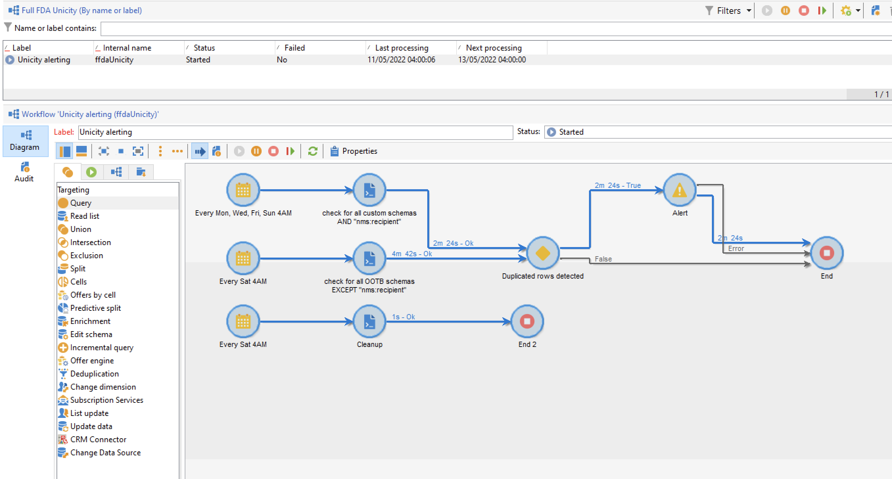

# Administración de claves y unicidad {#key-management}

En el contexto de un [Implementación empresarial (FFDA)](enterprise-deployment.md), la clave principal es un identificador único universal (UUID), que es una cadena de caracteres. Para crear este UUID, el elemento principal del esquema debe contener la variable **autouuid** y **autopk** atributos definidos en **true**.

Adobe Campaign v8 utiliza [!DNL Snowflake] como base de datos principal. La arquitectura distribuida del [!DNL Snowflake] la base de datos no proporciona un mecanismo para garantizar la unicidad de una clave dentro de una tabla: los usuarios finales son responsables de la coherencia clave dentro de la base de datos de Adobe Campaign.

Evitar duplicados en las claves, y especialmente en las claves principales, es obligatorio para preservar la coherencia de la base de datos relacional. Los duplicados en las claves principales producen problemas con las actividades de flujo de trabajo de administración de datos como **Consulta**, **Reconciliación**, **Actualización de datos**, y más. Esto es fundamental para definir los criterios de reconciliación adecuados al actualizar [!DNL Snowflake] tablas.

>[!CAUTION]
>
>Las claves duplicadas no están restringidas a los UUID. Puede suceder en con los ID, incluidas las claves personalizadas creadas en tablas personalizadas.

## Servicio de unicidad{#unicity-service}

Unicity Service es un componente de Cloud Database Manager que ayuda a los usuarios a preservar y controlar la integridad de las restricciones clave únicas dentro de las tablas de Cloud Database. Esto le permite reducir el riesgo de insertar claves duplicadas.

Como la base de datos de nube no impone restricciones de unicidad, el servicio de Unicity reduce el riesgo de insertar duplicados al administrar los datos con Adobe Campaign.

### Flujo de trabajo único{#unicity-wf}

El servicio de unicidad viene con una **[!UICONTROL Unicity alerting]** flujo de trabajo integrado para controlar las restricciones de unicidad y avisar cuando se detectan duplicados.

Este flujo de trabajo técnico está disponible en la **[!UICONTROL Administration > Production > Technical workflows > Full FFDA Unicity]** del explorador de Campaign. **No debe modificarse**.

Este flujo de trabajo comprueba todos los esquemas personalizados e integrados para detectar filas duplicadas.

Si la variable **[!UICONTROL Unicity alerting]** El flujo de trabajo (ffdaUnicity) detecta algunas claves duplicadas, que se añaden a una **Unicidad de auditoría** , que incluye el nombre del esquema, el tipo de clave, el número de filas afectadas y la fecha. Puede acceder a las claves duplicadas desde el **[!UICONTROL Administration > Audit > Key Unicity]** nodo .

Como administrador de bases de datos, puede utilizar una actividad SQL para eliminar los duplicados o ponerse en contacto con el Servicio de atención al cliente de Adobe para obtener más información.

### Alerta{#unicity-wf-alerting}

Se envía una notificación específica al **[!UICONTROL Workflow Supervisors]** grupo de operadores cuando se detectan claves duplicadas. El contenido y la audiencia de esta alerta se pueden cambiar en la variable **Alerta** actividad de **[!UICONTROL Unicity alerting]** flujo de trabajo.

## Protecciones adicionales{#duplicates-guardrails}

Campaign viene con un conjunto de nuevas protecciones para evitar la inserción de claves duplicadas en [!DNL Snowflake] base de datos.

>[!NOTE]
>
>Estas protecciones están disponibles a partir de Campaign v8.3. Para comprobar su versión, consulte [esta sección](../start/compatibility-matrix.md#how-to-check-your-campaign-version-and-buildversion)

### Preparación de la entrega{#remove-duplicates-delivery-preparation}

Adobe Campaign elimina automáticamente cualquier UID duplicado de una audiencia durante la preparación del envío. Este mecanismo evita que se produzca cualquier error al preparar una entrega. Como usuario final, puede comprobar esta información en los registros de envío: algunos destinatarios pueden excluirse del destinatario principal debido a la clave duplicada. En ese caso, se muestra la siguiente advertencia: `Exclusion of duplicates (based on the primary key or targeted records)`.

### Actualización de datos en un flujo de trabajo{#duplicates-update-data}

En el contexto de un [Implementación empresarial (FFDA)](enterprise-deployment.md), no puede seleccionar una clave interna (UUID) como campo para actualizar los datos en un flujo de trabajo.

Cuando se utiliza una clave de reconciliación explícita, la variable **Actualización de datos** activity garantiza automáticamente la unicidad del esquema de destino en función de esta clave mediante:

1. Deduplicación de datos entrantes (de transición)
1. Deduplicación de datos con tabla de destino (combinación)

>[!CAUTION]
>
>Esta protección solo se aplica con la opción **[!UICONTROL Using reconciliation keys]**.

### Consultar un esquema con duplicados{#query-with-duplicates}

Cuando un flujo de trabajo comienza a ejecutar una consulta en un esquema, Adobe Campaign comprueba si se ha informado de algún registro duplicado en la variable [Tabla de Unicidad de Auditoría](#unicity-wf). Si es así, el flujo de trabajo registra una advertencia, ya que la operación posterior en los datos duplicados podría afectar al resultado del flujo de trabajo.

Esta comprobación se realiza en las siguientes actividades de flujo de trabajo:

* Consulta
* Consulta incremental
* Lista de lectura