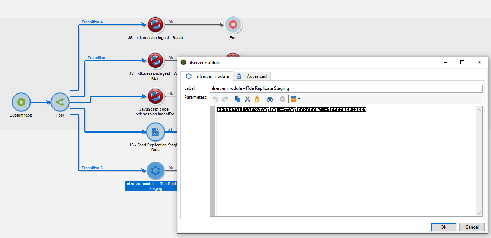

# Flujos de trabajo técnicos y duplicación de datos {#wf-data-replication}

## Flujos de trabajo técnicos {#tech-wf}

En el contexto de un [Implementación empresarial (FDAC)](enterprise-deployment.md), Adobe Campaign incluye un conjunto de flujos de trabajo técnicos integrados. Los flujos de trabajo técnicos ejecutan procesos o trabajos, programados de forma regular en el servidor.

Estos flujos de trabajo realizan operaciones de mantenimiento en la base de datos, aprovechan la información de seguimiento en los registros de envío, crean campañas recurrentes y mucho más.

 La lista completa de flujos de trabajo técnicos se detalla en [esta página](https://experienceleague.adobe.com/docs/campaign/automation/workflows/introduction/wf-type/technical-workflows.html).

Además de estos flujos de trabajo técnicos, Campaign v8 se basa en flujos de trabajo técnicos específicos para administrar [replicación de datos](#data-replication).

* **[!UICONTROL Replicate Reference tables]**
Este flujo de trabajo realiza la replicación automática de las tablas integradas que deben estar presentes en la base de datos local de Campaign (Postgres) y en la base de datos en la nube ([!DNL Snowflake]). Está programado para ejecutarse cada hora, a diario. If **lastModified** existe, la replicación se produce de forma incremental; de lo contrario, se replica toda la tabla. El orden de las tablas de la matriz siguiente es el orden utilizado por el flujo de trabajo de replicación.
* **[!UICONTROL Replicate Staging data]**
Este flujo de trabajo duplica los datos de ensayo para las llamadas unitarias. Está programado para ejecutarse cada hora, a diario.
* **[!UICONTROL Deploy FFDA immediately]**\
  Este flujo de trabajo realiza una implementación inmediata en la base de datos en la nube.
* **[!UICONTROL Replicate FFDA data immediately]**
Este flujo de trabajo duplica los datos XS de una cuenta externa determinada.

Estos flujos de trabajo técnicos están disponibles en **[!UICONTROL Administration > Production > Technical workflows > Full FFDA Replication]** del explorador de Campaign. **No deben modificarse.**

Si es necesario, puede iniciar la sincronización de datos manualmente. Para ello, haga clic con el botón derecho en la **Planificador** actividad y seleccione **Ejecutar ahora las tareas pendientes**.

## Replicación de datos {#data-replication}

Algunas tablas integradas se duplican de la base de datos local de Campaign a [!DNL Snowflake] Base de datos en la nube a través de flujos de trabajo específicos descritos anteriormente.

Comprenda qué bases de datos utiliza Adobe Campaign v8, por qué se replican los datos, qué datos se replican y cómo funciona el proceso de replicación.

>[!VIDEO](https://video.tv.adobe.com/v/334460?quality=12)


### Políticas de replicación de datos {#data-replication-policies}

Las políticas de replicación se basan en el tamaño de las tablas. Algunas tablas se duplican en tiempo real, mientras que otras lo hacen cada hora. Algunas tablas sufrirán actualizaciones incrementales cuando otras se sustituyan.

Además de la función integrada **Replicar tablas de referencia** flujo de trabajo técnico, puede forzar la duplicación de datos en los flujos de trabajo.

Puede hacer lo siguiente:

* añadir un específico **Código JavaScript** actividad con el siguiente código:

```
nms.replicationStrategy.StartReplicateStagingData("dem:sampleTable")
```


* añadir un específico **nlmodule** actividad con el siguiente comando:

```
nlserver ffdaReplicateStaging -stagingSchema -instance:acc1
```




**Temas relacionados**

* [Descubra más información sobre cómo empezar a utilizar flujos de trabajo](https://experienceleague.adobe.com/docs/campaign/automation/workflows/introduction/about-workflows.html?lang=es)

* [Períodos de retención de datos](../dev/datamodel-best-practices.md#data-retention)
