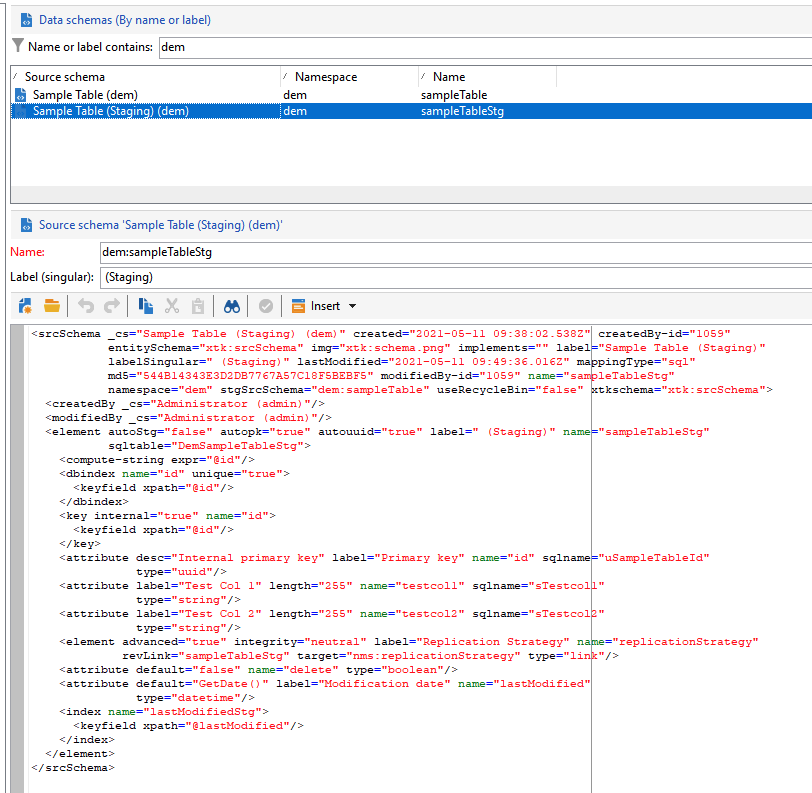

# Mecanismo de ensayo de API de Campaign

En el contexto de un [Implementación empresarial (FDAC)](enterprise-deployment.md)Por lo tanto, no se recomienda la limpieza de llamadas unitarias con respecto a los rendimientos (latencia y concurrencia). Siempre se prefiere la operación por lotes. Para mejorar el rendimiento, las API de ingesta se redirigen a la base de datos local.

La capacidad de ensayo de Campaign está habilitada de forma predeterminada en algunos esquemas integrados. También podemos habilitarlo en cualquier esquema personalizado. Mecanismo de ensayo en pocas palabras:

* La estructura del esquema de datos está duplicada en la tabla de ensayo local
* Las nuevas API dedicadas a la ingesta de datos fluyen directamente a la tabla de ensayo local. [Más información](new-apis.md)
* Un flujo de trabajo programado déclencheur cada hora y sincroniza los datos con la base de datos en la nube. [Más información](replication.md)

Algunos esquemas integrados están clasificados de forma predeterminada, como nmsSubscriptionRcp, nmsAppSubscriptionRcp, nmsRecipient.

Las API de Campaign Classic v7 siguen estando disponibles, pero no pueden beneficiarse de este nuevo mecanismo de ensayo: las llamadas de API fluyen directamente a la base de datos en la nube. El Adobe recomienda utilizar el nuevo mecanismo de ensayo lo más posible para reducir la presión general y la latencia en la base de datos de Campaign Cloud.

>[!CAUTION]
>
>* Con este nuevo mecanismo, ahora se puede sincronizar los datos para la exclusión del canal, las suscripciones, las bajas de suscripción o el registro móvil **asíncrono**.
>
>* El ensayo solo se aplica a los esquemas almacenados en la base de datos en la nube. No habilite el ensayo en esquemas duplicados. No habilite Ensayo en esquemas locales. No habilitar Ensayo en un esquema Ensayado
>

## Pasos de implementación {#implement-staging}

Para implementar el mecanismo de ensayo de Campaign en una tabla específica, siga los pasos a continuación:

1. Cree un esquema personalizado de ejemplo en la base de datos de Campaign Cloud. No hay ningún ensayo habilitado en este paso.

   ```
   <srcSchema _cs="Sample Table (dem)" created="YYYY-DD-MM"
           entitySchema="xtk:srcSchema" img="xtk:schema.png" label="Sample Table"
           lastModified="YYYY-DD-MM HH:MM:SS.TZ" mappingType="sql" md5="XXX"
           modifiedBy-id="0" name="sampleTable" namespace="dem" xtkschema="xtk:srcSchema">
   <element autopk="true" autouuid="true" dataSource="nms:extAccount:ffda" label="Sample Table"
           name="sampleTable">
       <attribute label="Test Col 1" length="255" name="testcol1" type="string"/>
       <attribute label="Test Col 2" length="255" name="testcol2" type="string"/>
   </element>
   </srcSchema>
   ```

    Obtenga más información acerca de la creación de esquemas personalizados en [esta página](../dev/create-schema.md).

1. Guarde y actualice la estructura de la base de datos.  [Más información](../dev/update-database-structure.md)

1. Habilite el mecanismo de ensayo en la definición del esquema añadiendo la variable **autoStg=&quot;true&quot;** parámetro.

   ```
   <srcSchema _cs="Sample Table (dem)" "YYYY-DD-MM"
           entitySchema="xtk:srcSchema" img="xtk:schema.png" label="Sample Table"
           lastModified="YYYY-DD-MM HH:MM:SS.TZ" mappingType="sql" md5="XXX"
           modifiedBy-id="0" name="sampleTable" namespace="dem" xtkschema="xtk:srcSchema">
   <element autoStg="true" autopk="true" autouuid="true" dataSource="nms:extAccount:ffda" label="Sample Table"
           name="sampleTable">
       <attribute label="Test Col 1" length="255" name="testcol1" type="string"/>
       <attribute label="Test Col 2" length="255" name="testcol2" type="string"/>
   </element>
   </srcSchema>
   ```

1. Guarde la modificación. Hay disponible un nuevo esquema de ensayo, que es una copia local del esquema inicial.

   

1. Actualizar la estructura de la base de datos. La tabla de ensayo se creará en la base de datos local de Campaign.
