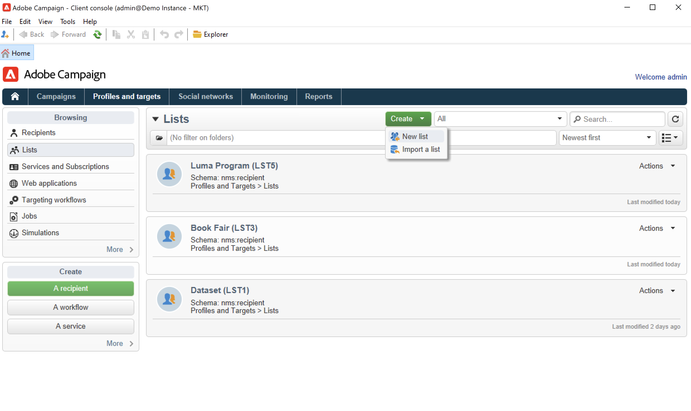

# Creación de una audiencia en una lista {#create-segments}

Utilice las listas de Campaign para crear y organizar sus audiencias.

Una lista es un conjunto estático de contactos que puede centrarse en acciones de envío o actualizarse durante una importación u otra acción de flujo de trabajo. Por ejemplo, una población extraída de la base de datos mediante una consulta se puede almacenar como una lista.

Las listas se crean y administran mediante el vínculo **[!UICONTROL Lists]** en la ficha **[!UICONTROL Profiles and targets]**. Estas listas se basan en la tabla de perfil de Adobe Campaign predeterminada (nms:recipient). [Más información](../dev/datamodel.md#ootb-profiles.md)

Puede crear una lista con la actividad **Actualizar lista** en un flujo de trabajo. Esta actividad almacena la población resultante en una lista. Utilícela para crear una lista nueva o actualizar una existente. Para crear listas que contengan otros tipos de datos que no sean la tabla de perfil integrada, debe ejecutar un flujo de trabajo. Por ejemplo: si utiliza una consulta en la tabla del visitante y luego actualiza la lista, puede crear una lista de visitantes. [Más información](#create-a-list-wf).

Vea este vídeo para obtener más información sobre la administración de listas en Adobe Campaign.

>[!VIDEO](https://video.tv.adobe.com/v/334909?quality=12)

## Creación de una lista de contactos {#create-a-list-of-contacts}

Para crear una lista de contactos, siga los pasos a continuación:

1. Haga clic en el botón **[!UICONTROL Create]** y seleccione **[!UICONTROL New list]**.

   

1. Introduzca la información en la ficha **[!UICONTROL Edit]**, en la ventana de creación de lista.

   

   * Introduzca el nombre de la lista en el campo **[!UICONTROL Label]** y, si es necesario, cambie el nombre interno.
   * Añada una descripción para esta lista.
   * Puede especificar una fecha de caducidad: cuando se llegue a esta fecha, la lista se depura y se elimina automáticamente.

1. En la ficha **[!UICONTROL Content]**, haga clic en **[!UICONTROL Add]** para seleccionar los perfiles pertenecientes a la lista.

   

   Puede crear un nuevo perfil y agregarlo a la lista directamente desde esta ventana utilizando el icono **[!UICONTROL Create]**. El perfil se añadirá a la base de datos.

1. Haga clic en **[!UICONTROL Save]** para guardar la lista. A continuación, se añade a la descripción general de las listas.

## Convertir contactos filtrados en una lista {#convert-data-to-a-list}

Puede seleccionar perfiles y añadirlos a una lista. Para realizar esto, siga los pasos a continuación:

1. En el explorador de Campaign, seleccione perfiles y haga clic con el botón derecho.

   Estos perfiles se pueden filtrar para satisfacer criterios específicos.

1. Seleccione **[!UICONTROL Actions > Associate selection with a list...]**.

   

1. Seleccione una lista existente o cree una nueva lista y haga clic en **[!UICONTROL Next]**.

   

1. Haga clic en el botón **[!UICONTROL Start]**.

   

Seleccione la opción **[!UICONTROL Recreate the list]** para eliminar el contenido existente de la lista y optimizar la creación de la lista (no se necesita ninguna consulta para comprobar si los perfiles ya están vinculados a la lista).

Si desactiva la opción **[!UICONTROL No trace of this job is saved in the database]**, puede seleccionar (o crear) la carpeta de ejecución en la que se almacenará la información vinculada a este proceso.

La sección superior de la ventana permite controlar la ejecución. El botón **[!UICONTROL Stop]** permite detener el proceso. Los contactos que ya se han procesado se vincularán a la lista.

Una vez finalizada la ejecución, acceda al menú **[!UICONTROL Profiles and Targets > Lists]** y seleccione la lista: la pestaña **[!UICONTROL Content]** muestra los perfiles vinculados a esta lista.

## Creación de una lista con un flujo de trabajo  {#create-a-list-wf}

Puede utilizar la actividad **[!UICONTROL List update]** para crear una lista o agregar una población a una lista de destinatarios.

En el ejemplo siguiente, se crea una lista de todos los destinatarios entre 25 y 40.

1. Seleccione **[!UICONTROL Profiles and targets]** y **[!UICONTROL Targeting workflows]** y, a continuación, cree un nuevo flujo de trabajo desde el botón **[!UICONTROL Create]**.
1. Escriba una etiqueta para este flujo de trabajo, por ejemplo &#39;25-40 contactos&#39;, agregue una descripción y haga clic en **[!UICONTROL Next]**.

   

1. Inserte una actividad **[!UICONTROL Query]** para definir la población objetivo y edite la consulta.

   

1. Defina las condiciones de filtro como se muestra a continuación:

   

   Aprenda a crear una consulta en un flujo de trabajo en [esta sección](https://experienceleague.adobe.com/docs/campaign/automation/workflows/wf-activities/targeting-activities/query.html?lang=es){target="_blank"}.

1. Añada una etiqueta para esta consulta y guarde los cambios.
1. Agregue una actividad **[!UICONTROL List update]** y edítela.

   

1. Introduzca una etiqueta para la actividad.
1. Seleccione la opción **[!UICONTROL Create the list if necessary (Computed name)]** para mostrar que la lista se cree una vez que se haya ejecutado el primer flujo de trabajo y se haya actualizado con las siguientes ejecuciones.
1. Seleccione una carpeta e introduzca una etiqueta para la lista.
1. Seleccione **[!UICONTROL Database of the targeting dimension]** para almacenar la tabla.
1. Deje activada la opción **[!UICONTROL Purge the list if it exists (otherwise add to the list)]** para eliminar destinatarios que no coincidan con los criterios de objetivo y para insertar los nuevos en la lista.
1. También deje la opción **[!UICONTROL Create or use a list with its own table]** marcada.
1. Deje la opción **[!UICONTROL Generate an outbound transition]** sin marcar.
1. Haga clic en **[!UICONTROL Ok]** y guarde el flujo de trabajo.
1. Inicie el flujo de trabajo.

   A continuación, se crea la lista de destinatarios coincidentes. Puede acceder a esta lista desde la entrada **[!UICONTROL Lists]** de la página principal.

   

   Puede hacer que este flujo de trabajo sea recurrente si agrega un planificador al flujo de trabajo. [Más información](https://experienceleague.adobe.com/docs/campaign/automation/workflows/wf-activities/flow-control-activities/scheduler.html?lang=es){target="_blank"}.

## Eliminación de perfiles de una lista {#remove-a-profile-from-a-list}

Para quitar un perfil de una lista, edite la lista, selecciónelo en la ficha **[!UICONTROL Content]** y, a continuación, haga clic en el icono **[!UICONTROL Delete]**.

## Eliminación de una lista de perfiles {#delete-a-list-of-profiles}

Para eliminar una lista, navegue hasta ella desde el Explorador de Campaign, selecciónela y haga clic con el botón derecho del ratón. Elija **[!UICONTROL Delete]**. Un mensaje de advertencia le pedirá que confirme la eliminación.

>[!NOTE]
>
>Cuando se elimina una lista, los perfiles de la lista no se ven afectados; no obstante, los datos del perfil se actualizan.
