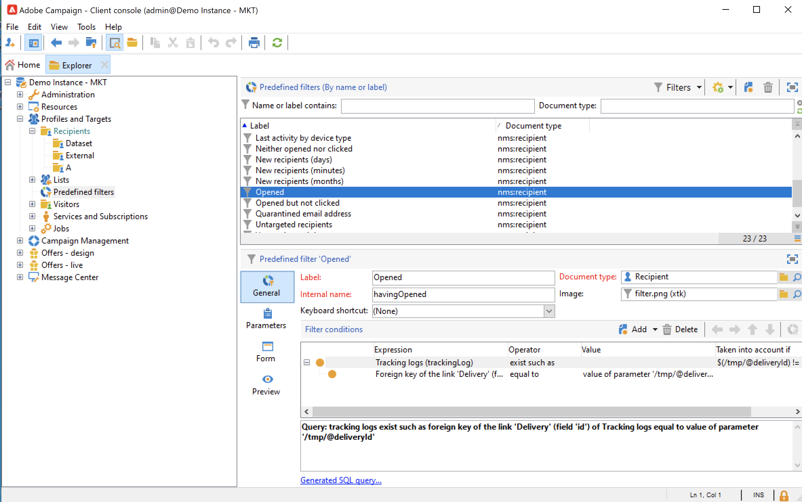
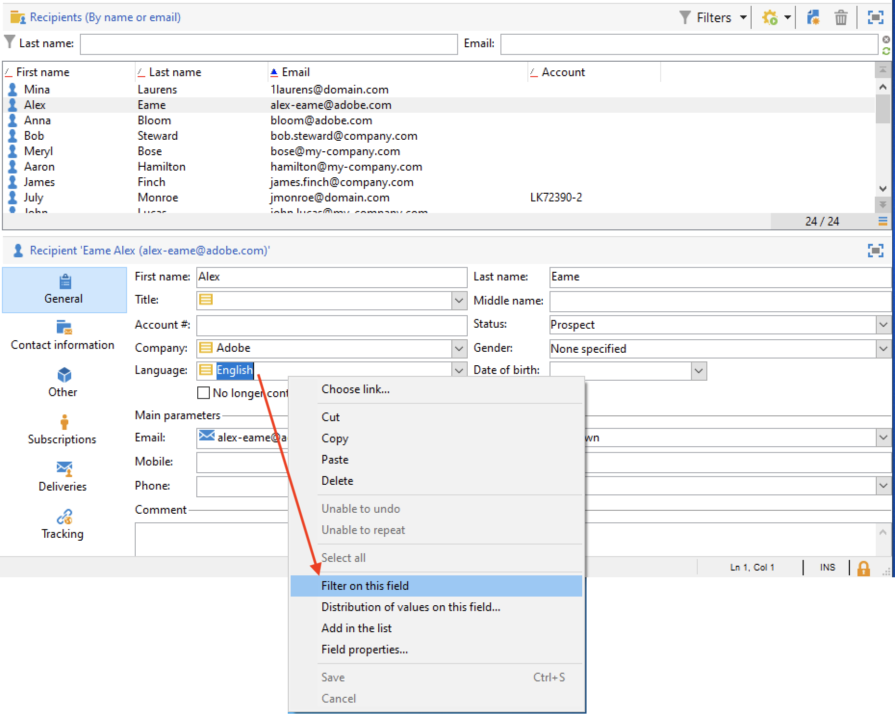
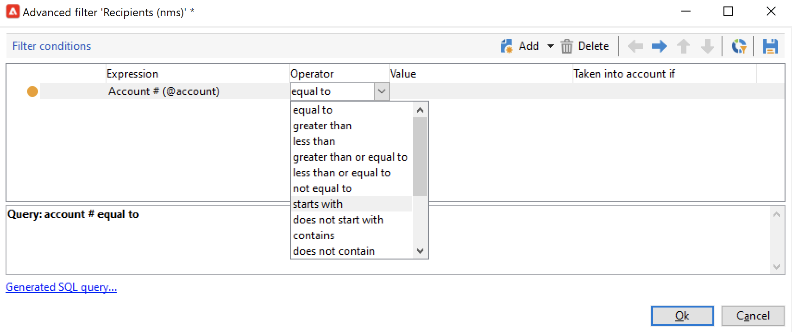
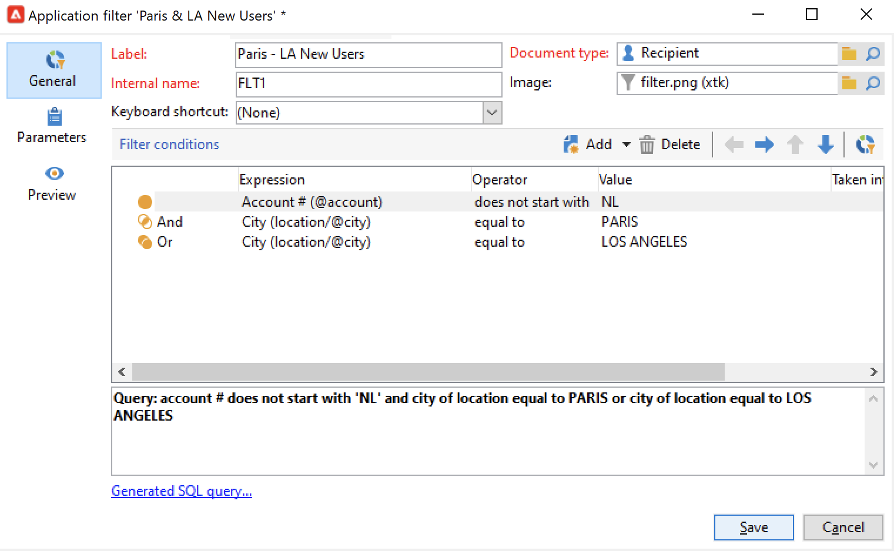

# Trabajo con filtros{#create-filters}

El filtrado de datos es el proceso de reducir un conjunto de datos a solo los registros que coinciden con criterios específicos. Este subconjunto se puede utilizar para acciones segmentadas (como actualizaciones o creación de audiencias) o para análisis.

Al navegar por Campaign, los datos se muestran en listas. Puede aplicar filtros integrados para acceder rápidamente a un subconjunto definido, como direcciones en cuarentena, destinatarios sin objetivo o registros dentro de un intervalo de edad o fecha de creación específicos.

Además, puede crear filtros personalizados, guardarlos para usarlos en el futuro y compartirlos con otros usuarios de Campaign.

Los filtros se aplican **dinámicamente**: cada vez que los datos cambian, los resultados filtrados se actualizan automáticamente.

>[!NOTE]
>
>Los ajustes de configuración de la interfaz de usuario se definen localmente en el dispositivo. A veces puede ser necesario limpiar estos datos, especialmente si surgen problemas al actualizarlos. Para ello, utilice el menú **[!UICONTROL File > Clear the local cache]**.

Los siguientes tipos de filtros están disponibles en Adobe Campaign:

* [Filtros predefinidos](#predefined-filters)
* [Filtros rápidos](#quick-filters)
* [Filtros personalizados avanzados](#advanced-filters)

## Filtros predefinidos{#predefined-filters}

### Filtros predefinidos en los paneles

De forma predeterminada, Adobe Campaign muestra todos los registros de base de datos para los que el operador tiene permiso de lectura. Puede filtrar estos datos mediante las opciones disponibles en la sección superior de la ventana del explorador.

Existen varias maneras de filtrar los datos que se van a mostrar. Si es necesario, se pueden utilizar juntos. Examine las pestañas siguientes para obtener más información sobre las opciones de filtrado.

>[!BEGINTABS]

>[!TAB Filtrar por carpeta]

Para filtrar los datos según su carpeta, haga clic en el icono **[!UICONTROL Folder]** y seleccione la carpeta que contiene los datos que se van a mostrar.

Solo se muestran los perfiles de la carpeta:

Utilice la cruz a la derecha del campo de selección de carpetas para volver al modo de visualización predeterminado.

>[!TAB Filtrar por estado]

Según el tipo de información que se muestre, puede aplicar un filtro por estatus o por estado.

Por ejemplo, para las entregas, puede elegir mostrar solo las entregas finalizados como se muestra a continuación:

>[!TAB Ordenar por]

Puede seleccionar el orden de los datos ofrecidos en las páginas mediante la lista desplegable a la derecha del campo de filtro “por carpeta”. El contenido de este campo depende del tipo de datos de la página.

Por ejemplo, puede ordenar las tareas por prioridad, fecha de creación u orden alfabético.

>[!TAB Búsqueda rápida]

Utilice el campo de búsqueda para acceder rápidamente al elemento que está buscando: introduzca los caracteres incluidos en la etiqueta o el nombre interno del elemento que desea mostrar y, a continuación, confirme la aplicación de un filtro automático a los datos de la página.

Para volver a mostrar todos los elementos, haga clic en la cruz para eliminar el contenido del campo de búsqueda.

>[!ENDTABS]

### Filtros predefinidos en el explorador

Los filtros predefinidos están disponibles en el botón **Filters** situado encima de cada lista.

Por ejemplo, para los perfiles, están disponibles los siguientes filtros integrados:

Puede acceder a los detalles de los filtros en el nodo **[!UICONTROL Profiles and Targets > Pre-defined filters]** del Explorador.

>[!NOTE]
>
>Para las demás listas de datos, los filtros predefinidos se almacenan en el nodo **[!UICONTROL Administration > Configuration > Predefined filters]**.

Seleccione un filtro para mostrar su definición.

Utilice la última pestaña para previsualizar los datos filtrados.

+++  Filtros predefinidos integrados para perfiles

<table> 
 <tbody> 
  <tr> 
   <td> <strong>Etiqueta</strong>  </td> 
   <td> <strong>Consulta</strong>  </td> 
  </tr> 
  <tr> 
   <td> Abierto  </td> 
   <td> Selecciona los destinatarios que han abierto una entrega.  </td> 
  </tr> 
  <tr> 
   <td> Abierto pero sin clic  </td> 
   <td> Selecciona los destinatarios que han abierto una entrega, pero no han hecho clic en un vínculo.  </td> 
  </tr> 
  <tr> 
   <td> Destinatarios inactivos  </td> 
   <td> Selecciona destinatarios que no han abierto una entrega en X meses.  </td> 
  </tr> 
  <tr> 
   <td> Última actividad por tipo de dispositivo  </td> 
   <td> Selecciona los destinatarios que han hecho clic o abierto la entrega Y con el dispositivo X en los últimos Z días.  </td> 
  </tr> 
  <tr> 
   <td> Última actividad por tipo de dispositivo (seguimiento).  </td> 
   <td> Selecciona los destinatarios que han hecho clic o abierto la entrega Y con el dispositivo X en los últimos Z días.  </td> 
  </tr> 
  <tr> 
   <td> Destinatarios no específicos  </td> 
   <td> Selecciona los destinatarios que nunca se han identificado a través del canal Y en los meses X.  </td> 
  </tr> 
  <tr> 
   <td> Destinatarios muy activos  </td> 
   <td> Selecciona destinatarios que han hecho clic en una entrega por lo menos X veces en los últimos Y meses.  </td> 
  </tr> 
  <tr> 
 <td> Dirección de correo electrónico incluida en la lista de bloqueados  </td> 
    <td> Selecciona destinatarios cuya dirección de correo electrónico se encuentra en la de lista de bloqueados.  </td>
  </tr> 
  <tr> 
   <td> Dirección de correo en cuarentena  </td> 
   <td> Selecciona destinatarios cuya dirección de correo está en cuarentena.  </td> 
  </tr> 
  <tr> 
   <td> Direcciones de correo duplicadas en la carpeta  </td> 
   <td> Selecciona destinatarios cuya dirección de correo está duplicada en la carpeta.  </td> 
  </tr> 
  <tr> 
   <td> No se ha abierto ni se ha hecho clic  </td> 
   <td> Selecciona los destinatarios que no han abierto ninguna entrega ni han hecho clic en una entrega.  </td> 
  </tr> 
  <tr> 
   <td> Nuevos destinatarios (días)  </td> 
   <td> Selecciona los destinatarios creados en los últimos X días.  </td> 
  </tr> 
  <tr> 
   <td> Nuevos destinatarios (minutos)  </td> 
   <td> Selecciona los destinatarios creados en los últimos X minutos.  </td> 
  </tr> 
  <tr> 
   <td> Nuevos destinatarios (meses)  </td> 
   <td> Selecciona los destinatarios creados en los últimos X meses.  </td> 
  </tr> 
  <tr> 
   <td> Por suscripción  </td> 
   <td> Selecciona los destinatarios por suscripción.  </td> 
  </tr> 
  <tr> 
   <td> Al hacer clic en un vínculo específico  </td> 
   <td> Selecciona los destinatarios que hicieron clic en una URL determinada de una entrega.  </td> 
  </tr> 
  <tr> 
   <td> Por comportamiento tras la entrega  </td> 
   <td> Selecciona los destinatarios según su comportamiento tras recibir una entrega.  </td> 
  </tr> 
  <tr> 
   <td> Por fecha de creación  </td> 
   <td> Selecciona los destinatarios por fecha de creación, durante un periodo que abarca desde X meses (fecha actual menos n meses) hasta Y meses (fecha actual menos n meses).  </td> 
  </tr> 
  <tr> 
   <td> Por lista  </td> 
   <td> Selecciona los destinatarios por lista.  </td> 
  </tr> 
  <tr> 
   <td> Por número de clics  </td> 
   <td> Selecciona los destinatarios que hicieron clic en una entrega en los últimos X meses.  </td> 
  </tr> 
  <tr> 
   <td> Por número de mensajes recibidos  </td> 
   <td> Selecciona los destinatarios según el número de mensajes recibidos.  </td> 
  </tr> 
  <tr> 
   <td> Por número de aperturas  </td> 
   <td> Selecciona los destinatarios que abrieron entre X e Y entregas durante la cantidad de tiempo Z.  </td> 
  </tr> 
  <tr> 
   <td> Por nombre o email  </td> 
   <td> Selecciona los destinatarios según su nombre o correo electrónico.  </td> 
  </tr> 
  <tr> 
   <td> Por intervalo de edad  </td> 
   <td> Selecciona los destinatarios según su edad.  </td> 
  </tr> 
 </tbody> 
</table>

+++

#### Filtros predeterminados{#default-filters}

Los campos encima de cada lista le permiten usar el **filtro predeterminado predefinido** para esta lista. Para la lista de destinatarios, puede filtrar el nombre y la dirección de correo electrónico de forma predeterminada.

>[!NOTE]
>
>El carácter **%** reemplaza cualquier cadena de caracteres. Por ejemplo, escriba `%@gmail.com` en el campo Correo electrónico para mostrar todos los perfiles con una dirección de Gmail. Escriba `%@L` en el campo Apellidos para mostrar todos los perfiles con una L en su apellido.

Para cambiar el filtro predeterminado de una lista de destinatarios, vaya al nodo **[!UICONTROL Profiles and Targets > Predefined filters]**.

Para el resto de tipos de datos, configure el filtro predeterminado mediante el nodo **[!UICONTROL Administration > Configuration > Predefined filters]**.

Siga estos pasos:

1. Seleccione el filtro que desea utilizar de forma predeterminada.
1. Haga clic en la pestaña **[!UICONTROL Parameters]** y seleccione **[!UICONTROL Default filter for the associated document type]**.

   

1. Anule la selección de esa misma opción para el filtro predefinido por defecto actual.
1. Haga clic en **[!UICONTROL Save]** para aplicar el filtro.
1. Vaya a la carpeta Destinatario y haga clic en el icono **[!UICONTROL Remove this filter]** a la derecha del filtro actual: el nuevo filtro predeterminado está disponible.
   

## Filtros rápidos{#quick-filters}

Puede establecer y combinar **Filtros rápidos** para generar filtros personalizados en campos específicos.

Una vez añadidos, los campos de filtro rápido se muestran encima de la lista de datos, uno tras otro. Pueden eliminarse de forma independiente.

Los filtros rápidos son específicos de cada operador y se reinician cada vez que el operador borra la caché de su consola de cliente.

Si necesita reutilizar un filtro, cree un **filtro avanzado** y guárdelo. [Más información](#advanced-filters).

Para crear un **filtro rápido**, siga estos pasos:

1. Haga clic con el botón derecho en el campo que desee filtrar y seleccione **[!UICONTROL Filter on this field]**.

   

   Los campos de filtro predeterminados se muestran encima de la lista.

   

1. Seleccione las opciones de filtro.
1. Si es necesario, utilice el icono gris del lado derecho de un filtro para eliminarlo.
1. Puede combinar filtros para restringir el filtro.

   

Si necesita filtrar por un campo que no está disponible en el formulario, sino en las columnas, y filtrar en esa columna. Para ello,

1. Haga clic en el icono **[!UICONTROL Configure list]**.

   

1. Seleccione la columna que desea mostrar, por ejemplo la edad de los destinatarios, y haga clic en **Ok**.

   

1. Haga clic con el botón derecho en la columna **Age** de la lista de destinatarios y seleccione **[!UICONTROL Filter on this column]**.

   

   A continuación, puede seleccionar las opciones de filtrado de edad. Añada otro filtro en la página para definir un intervalo.

   

## Filtros avanzados{#advanced-filters}

Combine criterios complejos en **filtros avanzados** personalizados. Utilice estos filtros para crear una consulta compleja o una combinación de consultas sobre los datos. Estos filtros se pueden guardar y compartir con otros usuarios de Campaign.

### Creación de un filtro avanzado{#create-adv-filters}

Para crear un **filtro avanzado**, haga clic en el botón **[!UICONTROL Filters]** y seleccione **[!UICONTROL Advanced filter...]**.

También puede hacer clic con el botón derecho en la lista de datos y seleccionar **[!UICONTROL Advanced filter...]**.

Defina las condiciones de filtrado. En el siguiente ejemplo, filtrará los destinatarios cuyo número de cuenta no comience por NL y que vivan en París o Los Ángeles.

1. Haga clic en el icono **[!UICONTROL Edit expression]** de la columna **[!UICONTROL Expression]**.

   

1. Seleccione el campo por el que filtrar.
1. Seleccione el operador que se aplicará en la lista desplegable.

   

1. Seleccione un valor esperado de la columna **[!UICONTROL Value]**. Puede combinar varios filtros para restringir la consulta. Para añadir una condición de filtro, haga clic en **[!UICONTROL Add]**.

   

   >[!NOTE]
   >
   >Puede asignar una jerarquía a las expresiones o cambiar el orden de las expresiones de consulta mediante las flechas de la barra de herramientas.

1. Hay tres operadores disponibles para combinar expresiones: **And**, **Or**, **Except**. Haga clic en la flecha para cambiar a **Or**.

   

1. Haga clic en **[!UICONTROL Ok]** para crear el filtro y aplicarlo a la lista actual.

El filtro aplicado se muestra encima de la lista.

Para editar o modificar este filtro, haga clic en su vínculo de descripción en azul, encima de la lista.

### Guardado de un filtro avanzado{#save-adv-filters}

Puede guardar un filtro avanzado como [filtro predefinido](#predefined-filters), de modo que pueda reutilizarlo y compartirlo con otros usuarios de Campaign.

Para guardar un filtro avanzado, siga los pasos a continuación:

1. Haga clic en la descripción del filtro para editarlo.
1. Haga clic en el icono **[!UICONTROL Save as filter]** en la sección superior derecha de la ventana.

   

1. Introduzca un nombre para este filtro y guárdelo.

   

El filtro se ha agregado a [filtros predefinidos](#predefined-filters). Se puede actualizar desde este nodo.

>[!NOTE]
>
>Puede agregar un método abreviado para que el filtro lo active desde el teclado.

Este filtro también está disponible en los filtros predefinidos de la lista de destinatarios.

### Uso de un filtro para definir un segmento {#filter-as-segment}

Puede utilizar y combinar filtros para crear un segmento de población objetivo.

Una vez guardados, los filtros avanzados están disponibles al seleccionar la población objetivo de un mensaje, en la sección **[!UICONTROL User filters]**.

>[!NOTE]
>
>Use **[!UICONTROL Exclude recipients from this segment]** para dirigirse únicamente a los contactos que no coincidan con los criterios de filtro.

### Uso de funciones para crear filtros avanzados{#use-functions-adv-filters}

Para realizar funciones de filtrado avanzadas, utilice funciones para definir el contenido del filtro. El editor de filtros avanzado aprovecha todas las funcionalidades del editor de consultas de Campaign.

Aprenda a crear consultas avanzadas en estos ejemplos completos:

* Aprenda a segmentar atributos de destinatario simples en [esta página](https://experienceleague.adobe.com/docs/campaign/automation/workflows/wf-activities/targeting-activities/query.html){target="_blank"}.
* Aprenda a filtrar los destinatarios no contactados durante los últimos 7 días en [esta página](https://experienceleague.adobe.com/docs/campaign/automation/workflows/use-cases/designing-queries/query-many-to-many-relationship.html){target="_blank"}.
* Obtenga información sobre cómo recuperar la lista de operadores que pueden filtrar las cuentas activas en [esta página](https://experienceleague.adobe.com/docs/campaign/automation/workflows/use-cases/designing-queries/create-a-filter.html){target="_blank"}.
* Aprenda a crear una audiencia de correo electrónico de cumpleaños en [esta página](https://experienceleague.adobe.com/docs/campaign/automation/workflows/use-cases/deliveries/send-a-birthday-email.html?lang=es){target="_blank"}.

### Parámetros avanzados para filtros predefinidos {#param-for-data-filters}

Los parámetros avanzados están disponibles para filtros predefinidos. Para acceder a ellos, vaya a la pestaña **[!UICONTROL Parameters]** del filtro.

* Para mostrar el filtro de forma predeterminada para todas las listas basadas en este tipo de documento, seleccione la opción **[!UICONTROL Default filter for the associated document type]**.

  Por ejemplo, el filtro **[!UICONTROL By name or login]** se aplica a los operadores Esta opción está seleccionada, por lo que el filtro siempre se muestra en todas las listas de operadores.

* Para que un filtro esté disponible para todos los operadores de Campaign, seleccione la opción **[!UICONTROL Filter shared with other operators]**.

* Para definir un formulario y seleccionar los criterios de filtrado, seleccione la opción **[!UICONTROL Use parameter entry form]**. Este formulario se debe especificar en formato XML en la ficha **[!UICONTROL Form]**. Por ejemplo, el filtro predefinido integrado **[!UICONTROL Recipients who have opened]**, disponible en la lista de destinatarios, muestra un campo de filtro que le permite seleccionar la entrega a la que se aplica el filtro.

* El vínculo **[!UICONTROL Advanced parameters]** le permite definir configuraciones adicionales.

   * Puede asociar una tabla SQL con el filtro para que sea común a todos los editores que compartan la tabla.
   * Para evitar que cualquier usuario anule el filtro, seleccione la opción **[!UICONTROL Do not restrict the filter]**. Por ejemplo, esta opción está activa para los filtros &quot;Destinatarios de una entrega&quot; y &quot;Destinatarios de entregas pertenecientes a una carpeta&quot;, que están disponibles en el asistente de entregas. Estos filtros no se pueden sobrecargar.

