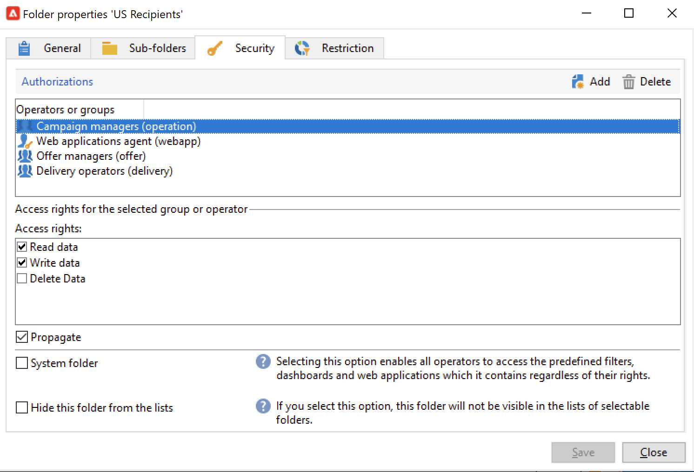

# Administrar carpetas y vistas {#folders-and-views}

Las carpetas de campaña son nodos del árbol del explorador. En función de su tipo, contienen ciertos tipos de datos.

Una vista es una carpeta específica que no contiene datos, pero que muestra datos almacenados físicamente en otras carpetas del mismo tipo. Por ejemplo, si convierte una carpeta de entrega en una vista, esta carpeta muestra todos los envíos. Estos datos se pueden filtrar.

>[!NOTE]
>Para distinguir vistas de carpetas estándar, su nombre se muestra en azul claro en lugar de negro.

Tenga en cuenta que puede asignar permisos a las carpetas para restringir el acceso a ciertos datos. [Más información](#restrict-access-to-a-folder)

## Prácticas recomendadas al trabajar con carpetas

* **Usar carpetas integradas** para facilitar a todas las personas involucradas en el proyecto el uso, mantenimiento y resolución de problemas de la aplicación. Evite crear estructuras de carpetas personalizadas para destinatarios, listas, envíos, etc., pero utilice las carpetas estándar como **Administración**, **Profiles &amp; Targets**, **Administración de campañas**.

* **Crear subcarpetas**, por ejemplo, guarde los flujos de trabajo técnicos en la carpeta integrada : **[!UICONTROL Administration > Production > Technical Workflows]** y cree subcarpetas por tipo de flujo de trabajo.

* **Definir y aplicar una convención de nombres**, por ejemplo, puede asignar un nombre a los flujos de trabajo en orden alfabético, de modo que aparezcan ordenados en orden de ejecución, como:

   A1 - importar destinatarios, comienza a las 10:00; A2 - importar entradas, empieza a las 11:00.

## Crear una carpeta{#create-a-folder}

Para crear una carpeta, haga clic con el botón derecho en una carpeta existente y utilice el menú contextual.

Para crear el mismo tipo de carpeta que el que ha seleccionado, elija la primera opción del menú contextual. Por ejemplo, en una carpeta Recipients , seleccione **[!UICONTROL Create a new 'Recipients' folder]**.

Puede arrastrar y soltar la nueva carpeta para organizar el árbol del explorador de Campaign según sus necesidades.

Para crear otro tipo de carpeta, haga clic con el botón derecho en una carpeta existente y seleccione **[!UICONTROL Add new folder]**. Puede crear todos los tipos de carpetas, según los datos que desee almacenar.

>[!CAUTION]
>Estos cambios se aplican a todos los usuarios de Campaign.

## Conversión de una carpeta en una vista{#turn-a-folder-to-a-view}

Una vista es una carpeta específica que no contiene datos, pero que muestra datos almacenados físicamente en otras carpetas del mismo tipo.

Puede convertir cualquier carpeta en una vista, pero la carpeta debe estar vacía. Los datos almacenados en la carpeta se eliminan al convertir la carpeta en una vista.

>[!CAUTION]
>
>Una vista muestra datos y proporciona acceso a ellos, incluso si los datos no están almacenados físicamente en la carpeta de vista. Para tener acceso al contenido, el operador debe tener los permisos adecuados en las carpetas de origen, al menos acceso de lectura.
>
>Para conceder acceso a una vista sin conceder acceso a su carpeta de origen, no conceda acceso de lectura al nodo principal de la carpeta de origen.

En el siguiente ejemplo, crearemos una nueva carpeta para mostrar solo los envíos de EE. UU., según su nombre interno.

1. Cree un **[!UICONTROL Deliveries]** carpeta y asígnele el nombre **Entregas en EE. UU.**.
1. Haga clic con el botón derecho en esta carpeta y seleccione **[!UICONTROL Properties...]**.
1. En la pestaña **[!UICONTROL Restriction]**, seleccione **[!UICONTROL This folder is a view]**. Eso hace que se muestren todas las entregas de la base de datos.

   

1. Defina los criterios de filtro desde el editor de consultas en la sección central de la ventana: solo se muestran en la carpeta las entregas correspondientes al filtro .

   

   >[!NOTE]
   >
   >Obtenga información sobre cómo diseñar consultas en [esta página](create-filters.md#advanced-filters)

>[!CAUTION]
>
>Al administrar [mensajería transaccional](../send/transactional.md) eventos, la variable **[!UICONTROL Real time events]** o **[!UICONTROL Batch events]** las carpetas no deben configurarse como vistas en las instancias de ejecución, ya que esto podría provocar problemas de permisos.

## Organizar las carpetas{#organize-your-folders}

De forma predeterminada, se añade una nueva carpeta en la parte superior de la jerarquía.

Examine la **Subcarpetas** de las propiedades de una carpeta para organizar sus subcarpetas.

Puede mover las carpetas con las flechas a la derecha o seleccionar la **[!UICONTROL Sort the sub-folders in alphabetical order]** para ordenarlos automáticamente.

## Filtrado de datos en una carpeta{#filter-data-in-a-folder}

Para filtrar los datos almacenados en una carpeta, acceda a las propiedades de la carpeta y seleccione la pestaña Restriction .

Por ejemplo, la carpeta siguiente solo contiene contactos con una dirección de correo electrónico cuyo origen no está marcado como &quot;Externo&quot; o está vacío.

## Restringir el acceso a una carpeta{#restrict-access-to-a-folder}

Utilice permisos en carpetas para organizar y controlar el acceso a los datos de Campaign.

Para editar permisos en una carpeta específica de Campaign, siga los pasos a continuación:

1. Haga clic con el botón derecho en la carpeta y seleccione **[!UICONTROL Properties...]**.
1. Vaya a la **[!UICONTROL Security]** para ver las autorizaciones de esta carpeta.

   

* Hasta **autorizar un grupo o un operador**, haga clic en **[!UICONTROL Add]** y seleccione el grupo u operador para asignar autorizaciones para esta carpeta.
* Hasta **prohibir un grupo o un operador**, haga clic en **[!UICONTROL Delete]** y seleccione el grupo u operador para quitar la autorización de esta carpeta.
* Hasta **seleccione los derechos asignados a un grupo o a un operador**, seleccione el grupo u operador, seleccione los derechos de acceso que desee conceder y anule la selección de los demás.

### Propagación de permisos {#propagate-permissions}

Para propagar autorizaciones y derechos de acceso, seleccione el **[!UICONTROL Propagate]** en las propiedades de la carpeta.

Las autorizaciones definidas en esta ventana se aplican a todas las subcarpetas del nodo actual. Siempre puede sobrecargar estas autorizaciones para cada una de las subcarpetas.

>[!NOTE]
>
>Desmarcando la **[!UICONTROL Propagate]** para una carpeta no la borra para las subcarpetas: debe borrarlo explícitamente para cada una de las subcarpetas.

### Concesión de acceso a todos los operadores {#grant-access-to-all-operators}

En el **[!UICONTROL Security]** , seleccione **[!UICONTROL System folder]** para permitir el acceso a todos los operadores, independientemente de sus permisos.

Si se borra esta opción, se debe volver a añadir explícitamente el operador (o su grupo) a la lista de autorizaciones para que tengan acceso.
