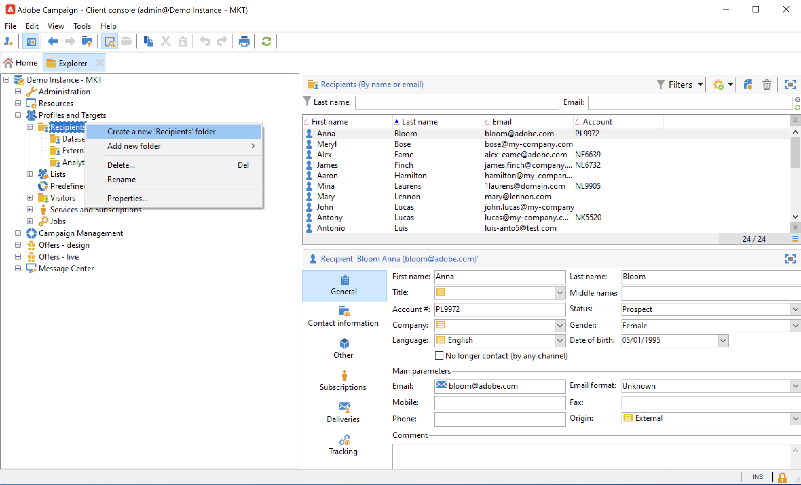

# Administrar carpetas y vistas {#folders-and-views}

Las carpetas de Campaign son nodos del árbol del explorador. Según su tipo, contienen ciertos tipos de datos.

Una vista es una carpeta específica que no contiene datos, pero muestra datos almacenados físicamente en otras carpetas del mismo tipo. Por ejemplo, si convierte una carpeta de envíos en una vista, esta carpeta mostrará todas las entregas. Estos datos se pueden filtrar.

>[!NOTE]
>Para distinguir vistas de carpetas estándar, su nombre se muestra en azul claro en lugar de negro.
>

Tenga en cuenta que puede asignar permisos a las carpetas para restringir el acceso a determinados datos. [Más información](#restrict-access-to-a-folder)

## Prácticas recomendadas al trabajar con carpetas{#best-practices-folders}

* **Uso de carpetas integradas** para facilitar el uso, mantenimiento y solución de problemas de la aplicación a todas las personas involucradas en el proyecto. Evite crear estructuras de carpetas personalizadas para destinatarios, listas, envíos, etc., pero utilice las carpetas estándar como **Administration**, **Perfiles y objetivos**, **Administración de campañas**.

* **Creación de subcarpetas**, por ejemplo, guarde los flujos de trabajo técnicos en la carpeta integrada: **[!UICONTROL Administration > Production > Technical Workflows]** y cree subcarpetas por tipo de flujo de trabajo.

* **Definición y aplicación de una convención de nombres** Por ejemplo, puede asignar un nombre a los flujos de trabajo en orden alfabético, de modo que aparezcan ordenados en orden de ejecución, como:

  A1 - importar destinatarios, comienza a las 10:00; A2 - importar tickets, comienza a las 11:00.

## Crear una carpeta{#create-a-folder}

Para crear una carpeta, haga clic con el botón derecho en una carpeta existente y utilice el menú contextual.

Para crear el mismo tipo de carpeta que la seleccionada, elija la primera opción en el menú contextual. Por ejemplo, en una carpeta Destinatarios, seleccione **[!UICONTROL Create a new 'Recipients' folder]**.

Puede arrastrar y soltar la nueva carpeta para organizar el árbol del explorador de Campaign según sea necesario.

Para crear otro tipo de carpeta, haga clic con el botón derecho en una carpeta existente y seleccione **[!UICONTROL Add new folder]**. Puede crear todos los tipos de carpetas, según los datos que desee almacenar.

>[!CAUTION]
>Estos cambios se aplican a todos los usuarios de Campaign.
>

## Convertir una carpeta en una vista{#turn-a-folder-to-a-view}

Una vista es una carpeta específica que no contiene datos, pero muestra datos almacenados físicamente en otras carpetas del mismo tipo.

Puede convertir cualquier carpeta en una vista, pero la carpeta debe estar vacía. Cualquier dato almacenado en la carpeta se eliminará al convertir la carpeta en una vista.

>[!CAUTION]
>
>Una vista muestra datos y proporciona acceso a ellos, incluso si los datos no están almacenados físicamente en la carpeta de vista. Para tener acceso al contenido, el operador debe tener los permisos adecuados en las carpetas de origen, al menos acceso de lectura.
>
>Para conceder acceso a una vista sin conceder acceso a su carpeta de origen, no conceda acceso de lectura al nodo principal de la carpeta de origen.

En el siguiente ejemplo, crearemos una nueva carpeta para mostrar solo los envíos de EE. UU., según su nombre interno.

1. Crear un **[!UICONTROL Deliveries]** carpeta y asígnele un nombre **Envíos de EE. UU.**.
1. Haga clic con el botón derecho en esta carpeta y seleccione **[!UICONTROL Properties...]**.
1. En la pestaña **[!UICONTROL Restriction]**, seleccione **[!UICONTROL This folder is a view]**. Eso hace que se muestren todas las entregas de la base de datos.

   

1. Defina los criterios de filtro desde el editor de consultas en la sección central de la ventana: en la carpeta solo se muestran las entregas correspondientes al filtro.

   

   >[!NOTE]
   >
   >Aprenda a diseñar consultas en [esta página](create-filters.md#advanced-filters)

>[!CAUTION]
>
>Al administrar [mensajería transaccional](../send/transactional.md) eventos, el **[!UICONTROL Real time events]** o **[!UICONTROL Batch events]** las carpetas no deben configurarse como vistas en las instancias de ejecución, ya que esto podría provocar problemas con los permisos.

## Organizar las carpetas{#organize-your-folders}

De forma predeterminada, se agrega una carpeta nueva en la parte superior de la jerarquía.

Examine la **Subcarpetas** de las propiedades de una carpeta para organizar sus subcarpetas.

Puede mover las carpetas con las flechas a la derecha o seleccionar la **[!UICONTROL Sort the sub-folders in alphabetical order]** para ordenarlos automáticamente.

## Filtrado de datos en una carpeta{#filter-data-in-a-folder}

Para filtrar los datos almacenados en una carpeta, acceda a las propiedades de la carpeta y seleccione la pestaña Restriction.

Por ejemplo, la carpeta a continuación solo contendrá contactos con una dirección de correo electrónico y cuyo origen no esté marcado como &quot;Externo&quot; o esté vacío.

## Restringir el acceso a una carpeta{#restrict-access-to-a-folder}

Utilice permisos en las carpetas para organizar y controlar el acceso a los datos de Campaign. Obtenga más información acerca de los permisos de en las carpetas de [esta sección](../start/folder-permissions.md).
