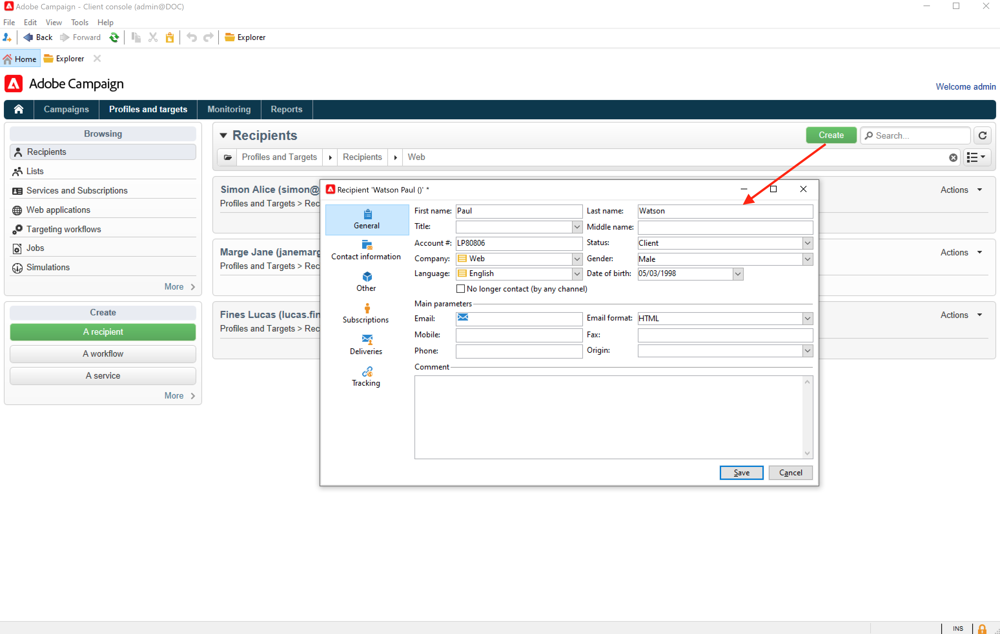

# Introducción a perfiles y públicos{#gs-profiles-and-audiences}

Los perfiles son contactos almacenados en la base de datos de Campaign, como clientes, suscriptores de un servicio o clientes potenciales. Existen muchos mecanismos para adquirir perfiles y desarrollar esta base de datos: recopilación en línea a través de formularios web, importación manual o automática de archivos de texto, replicación con bases de datos de compañías u otros sistemas de información. Con Adobe Campaign, puede incorporar el historial de marketing, la información de compra, las preferencias, los datos CRM y cualquier dato PI relevante en una vista consolidada para analizar y actuar en consecuencia. Los perfiles contienen toda la información necesaria para la segmentación, el cumplimiento y el seguimiento de personas.

Un perfil es un registro de la tabla **nmsRecipient** o una tabla externa que almacena todos los atributos del perfil, como el nombre, los apellidos, la dirección de correo electrónico, un ID de cookie, el ID de cliente, el identificador móvil u otra información relacionada con un canal determinado. Otras tablas vinculadas a la tabla de destinatarios contienen datos relacionados con el perfil, como la tabla de &quot;logs&quot; de envío que contiene registros de todas las entregas realizadas a los destinatarios. Obtenga más información acerca de los perfiles integrados y las tablas de destinatarios en [esta sección](../dev/datamodel.md#ootb-profiles).

En Adobe Campaign, **los destinatarios** son los perfiles predeterminados a los que se dirigen los envíos (correos electrónicos, SMS, etc.).

Los datos de destinatario almacenados en la base de datos permiten filtrar el destinatario que recibirá cualquier envío dado y añadir datos de personalización en el contenido de los envíos. Existen otros tipos de perfiles en la base de datos. Están diseñados para usos diferentes. Por ejemplo se crean perfiles semilla para probar los envíos antes de enviarlos al público objetivo final.

Para rellenar Adobe Campaign con datos de perfil, puede:

* [importar archivos de datos](../start/import.md) desde un origen de datos externo como un sistema CRM o un archivo plano
* [crear formularios web](../dev/webapps.md) para permitir que los clientes introduzcan su propia información y creen su propio perfil
* [asignar a una base de datos externa](../connect/fda.md) donde se almacenan los perfiles
* introduzca los perfiles manualmente en la consola del cliente, como se muestra a continuación:

<!--You can also select your message audience in an external file: recipients are stored not in the database, but in files. These are known as "external" deliveries. These contacts can be imported or not in Adobe Campaign. [Learn more](external-profiles.md).-->

Una vez importadas, puede crear audiencias para enviar los mensajes. Aprenda a crear audiencias [en esta sección](create-audiences.md).