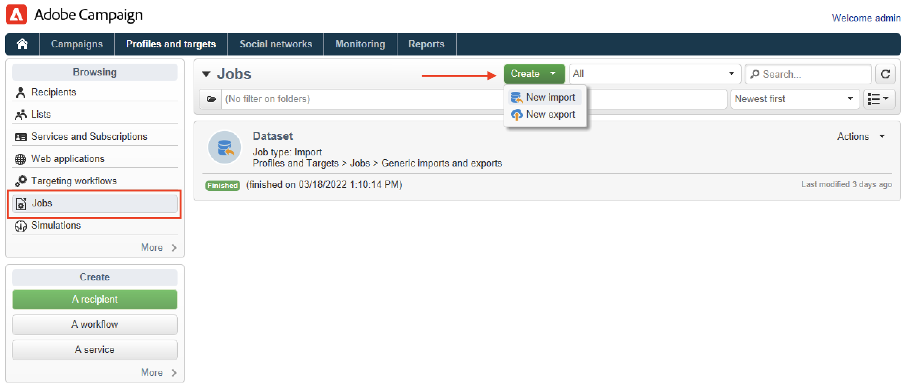

# Importación de perfiles de un archivo{#create-profiles}

Para rellenar la base de datos de Campaign, puede [adición manual de perfiles](create-profiles.md) o importar perfiles como se detalla a continuación. También puede utilizar archivos importados para actualizar los datos de contacto.

## Importación de perfiles con un flujo de trabajo {#import-profiles-with-a-wf}

Los flujos de trabajo pueden ser una forma útil de automatizar algunos de los procesos de importación. Tanto si se importan datos desde un archivo local como desde un SFTP, puede utilizar flujos de trabajo para estandarizar los procedimientos de gestión de datos.

### Uso de datos de una lista: Leer lista {#data-from-read-list}

Prepare y estructurar los datos en un archivo para importarlos con un flujo de trabajo. [Más información](https://experienceleague.adobe.com/docs/campaign/automation/workflows/wf-activities/targeting-activities/read-list.html){target="_blank"}.

### Carga de datos desde un archivo {#data-from-a-file}

Los datos procesados en un flujo de trabajo se pueden extraer de un archivo estructurado para que se puedan importar en Adobe Campaign. [Más información](https://experienceleague.adobe.com/docs/campaign/automation/workflows/wf-activities/action-activities/data-loading--file-.html){target="_blank"}.

Una vez recopilados los datos, puede utilizarlos en sus flujos de trabajo, por ejemplo para enriquecer una entrega o actualizar la base de datos. Para obtener más información, consulte [esta sección](https://experienceleague.adobe.com/docs/campaign/automation/workflows/introduction/use-workflow-data.html){target="_blank"}.

## Importaciones de una sola vez{#import-jobs}

Adobe Campaign proporciona una capacidad de importación genérica que le permite, por ejemplo, extraer una lista de clientes o clientes potenciales que luego formarán parte de una población de destinatarios o suministrar datos de archivos externos a su base de datos.

Las importaciones genéricas se administran desde **[!UICONTROL Profiles and Targets > Jobs]** de la página de inicio de Adobe Campaign.

Los pasos para realizar una importación genérica se detallan en [Documentación de Campaign Classic v7](https://experienceleague.adobe.com/docs/campaign-classic/using/getting-started/importing-and-exporting-data/generic-imports-exports/about-generic-imports-exports.html?lang=es){target="_blank"}.
