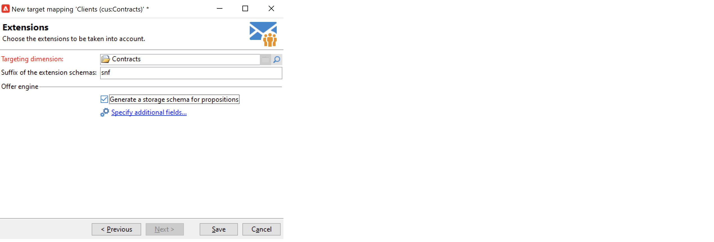

# Trabajar con asignaciones de destino{#gs-target-mappings}

De forma predeterminada, las plantillas de envío tienen como destino **[!UICONTROL Recipients]**. El destino de mapeo utiliza los campos de la tabla **nms:recipient.**

Puede utilizar otras asignaciones de destino para las entregas o crear una nueva asignación de destino.

## Asignaciones de destino integradas {#ootb-mappings}

Adobe Campaign incluye las siguientes asignaciones de destino integradas:

| Name | Uso a | Esquema |
|---|---|---|
| Recipients | Envío a destinatarios (tabla de destinatarios integrada) | nms:recipient |
| Visitantes | Envío a visitantes cuyos perfiles se hayan recopilado mediante recomendación (marketing viral) por ejemplo. | mns:visitor |
| Suscripciones | Envío a destinatarios suscritos a un servicio de información como un boletín informativo | nms:subscription |
| Suscripciones de visitantes | Envío a los visitantes que están suscritos a un servicio de información | nms:visitorSub |
| Operadores | Envío a los operadores de Adobe Campaign | nms:operator |
| Archivo externo | Envío a través de un archivo que contiene toda la información necesaria para la entrega | No hay ningún esquema vinculado, no se ha introducido ningún destino |

## Creación de una asignación de destino {#new-mapping}

También puede crear una asignación de destino. Puede que necesite añadir una asignación de destino personalizada, por ejemplo, si:

* se utiliza una tabla de destinatarios personalizada,
* se configura una dimensión de filtrado diferente de la dimensión de segmentación integrada en la pantalla de asignación de destino.

Obtenga más información sobre las tablas de destinatarios personalizadas en [esta página](../dev/custom-recipient.md).

El asistente de creación de asignación de destino de Adobe Campaign le ayuda a crear todos los esquemas necesarios para utilizar la asignación de destino personalizada.

1. Vaya a **[!UICONTROL Administration]** `>` **[!UICONTROL Campaign Management]** `>` **[!UICONTROL Target mappings]** del explorador de Adobe Campaign.

1. Cree una nueva asignación de destino y seleccione el esquema personalizado como dimensión de segmentación.

   

1. Indique los campos en los que se almacena la información de perfil: apellidos, nombre, correo electrónico, dirección, etc.

   

1. Especifique los parámetros para el almacenamiento de información, incluido el sufijo de los esquemas de extensión para que se puedan identificar fácilmente.

   

   Puede elegir si desea almacenar las exclusiones (**excludelog**), con mensajes (**broadlog**) o en una tabla independiente.

   También puede elegir si desea administrar el seguimiento para esta asignación de envíos (**trackinglog**).

1. A continuación, seleccione las extensiones que se van a tener en cuenta. El tipo de extensión depende de la configuración y los complementos de Campaign.

   

   Haga clic en el botón **[!UICONTROL Save]** para iniciar la creación de la asignación de entrega: todas las tablas vinculadas se crean automáticamente en función de los parámetros seleccionados.

