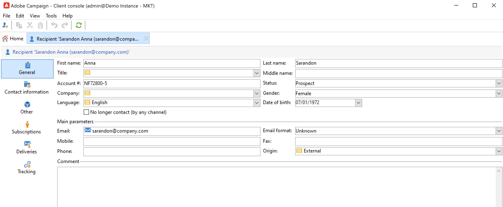

# Ver perfiles existentes{#view-profiles}

Vaya a **[!UICONTROL Profiles and targets]** para acceder a los destinatarios almacenados en la base de datos de Adobe Campaign.

Desde esta página, puede [crear destinatario nuevo](create-profiles.md), edite un destinatario existente y acceda a sus detalles de perfil.

Para realizar manipulaciones de perfiles más avanzadas, acceda al árbol de campañas desde el **[!UICONTROL Explorer]** en la página de inicio de Adobe Campaign.

>[!CAUTION]
>
>La pantalla Recipient integrada se define mediante un esquema XML y su formulario asociado. El esquema XML se almacena en la variable **[!UICONTROL Administration > Configuration > Data schemas]** del árbol del explorador de Adobe Campaign. Solo los usuarios expertos pueden realizar cambios en estos esquemas.

## Editar un perfil{#edit-a-profiles}

Seleccione un perfil para mostrar los detalles en una pestaña nueva.

Los datos concernientes a los perfiles se agrupan en fichas. Estas pestañas y su contenido dependen de la configuración específica y de los paquetes instalados.

Para un destinatario integrado típico, puede acceder a las siguientes pestañas:

* **[!UICONTROL General]**, para todos los datos generales de perfil. En concreto, contiene los apellidos, el nombre, la dirección de correo electrónico, el formato de correo electrónico, etc.

   Esta pestaña también almacena el **exclusión** para el perfil: cuando la variable **[!UICONTROL No longer contact (by any channel)]** está seleccionada, el perfil está en lista de bloqueados de . Esta información se añade a los datos de contacto si el destinatario hace clic en un vínculo de baja de suscripción en un boletín informativo, por ejemplo. Este destinatario ya no se dirige a ningún canal (correo electrónico, correo postal, etc.). Para obtener más información, consulte [esta página](../send/quarantines.md).

* **Información de contacto**, que contiene la dirección de correo postal del perfil seleccionado.

   Puede comprobar en esta pantalla el índice de calidad de la dirección y cuántos errores contiene la dirección. Esta información la utiliza directamente el proveedor de correo postal, en función del número de errores encontrados durante las entregas anteriores, y no se puede cambiar manualmente.

* **Otro**, para campos específicos que se pueden personalizar y rellenar según sus necesidades.

   Utilice la variable **[!UICONTROL Field properties…]** menú contextual para cambiar los nombres de los campos y definir su formato.

   

   Introduzca la nueva configuración como se indica a continuación:

   

   Compruebe la actualización en la interfaz de usuario:

   

   >[!CAUTION]
   >Los cambios se aplican a todos los destinatarios.

* **Suscripciones**, para todas las suscripciones activas a servicios. Utilice la variable **Historial** para acceder a los detalles de suscripciones y bajas de este contacto.

   

   Más información sobre Suscripciones [en esta sección](../start/subscriptions.md).

* **Entregas**, para todos los registros de envío del perfil seleccionado. Utilice esta pestaña para acceder al historial de marketing del contacto: etiquetas, fechas y estado de todas las acciones de envío dirigidas al perfil a través de todos los canales.

* **Seguimiento**, para todos los registros de seguimiento del perfil seleccionado. Esta información se utiliza para rastrear el comportamiento del perfil que sigue a las entregas. Esta ficha muestra el total acumulado de todas las direcciones URL rastreadas en las entregas. La lista se puede configurar y normalmente contiene la dirección URL, la fecha y la hora en que se hizo clic, y el documento que contiene la dirección URL

   Más información sobre el seguimiento [en esta sección](../start/tracking.md).

## Perfiles activos {#active-profiles}

Los perfiles activos son los perfiles que se toman en cuenta con fines de facturación.

La facturación solo abarca los perfiles que están **activos**. Un perfil se considera activo si este se ha identificado o comunicado en los últimos 12 meses a través de cualquier canal.

Un perfil al que se destinan varios envíos se cuenta solo una vez.

Tenga en cuenta que el recuento de perfiles principales solo está disponible para las **instancias de marketing**. No está disponible para Instancias de ejecución; es decir, instancias de MID (fuentes intermedias) y RT (mensajería en tiempo real/centro de mensajes).

>[!NOTE]
>
>También puede monitorizar el número de perfiles activos en su instancia directamente desde el Panel de control de Campaign. Para obtener más información, consulte la [Documentación del Panel de control](https://experienceleague.adobe.com/docs/control-panel/using/performance-monitoring/active-profiles-monitoring.html?lang=es).
