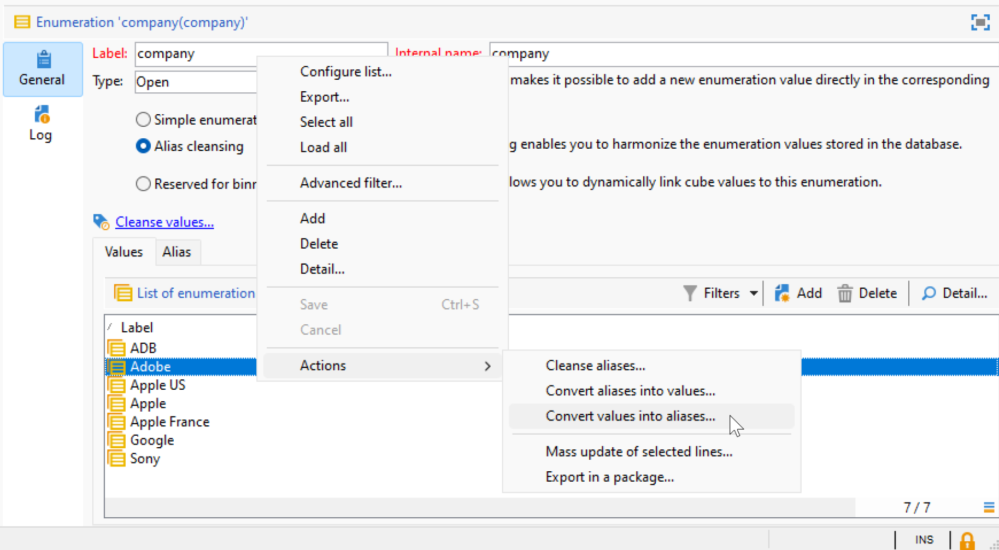

# Trabajo con enumeraciones {#enumerations}

Una enumeración (también denominada lista desglosada) es una lista predefinida de valores que puede utilizar para rellenar determinados campos. Las enumeraciones ayudan a estandarizar los valores de los campos, lo que hace que la entrada de datos sea más coherente y simplifica las consultas.

Cuando se definen, los valores se muestran en una lista desplegable. Se puede seleccionar un valor directamente o introducirlo mediante una entrada predictiva, que sugiere y completa entradas coincidentes. Algunos campos incluyen enumeraciones predefinidas y se pueden crear enumeraciones adicionales si es necesario.

## Tipos de enumeraciones {#types-of-enum}

Las enumeraciones se almacenan en la carpeta **[!UICONTROL Administration > Platform > Enumerations]** del explorador.

Una enumeración puede ser: **Open**, **System**, **Emoticon** o **Closed**.

* Una enumeración **Open** permite a los usuarios agregar nuevos valores directamente en los campos basándose en esta enumeración.
* Una enumeración **Closed** tiene una lista fija de valores que sólo pueden modificarse desde la carpeta **[!UICONTROL Administration > Platform > Enumerations]** del explorador.
* Se usa una enumeración **Emoticon** para actualizar la lista de emoticonos. Más información
* Una enumeración **System** está asociada a los campos del sistema y se incluye con un nombre interno.

Hay opciones específicas disponibles para las enumeraciones **Abrir** y **Cerrado**:

* **Enumeración simple** es el tipo estándar predeterminado.
* La enumeración **Limpieza de alias** se usa para armonizar los valores de enumeración almacenados en la base de datos. [Más información](#alias-cleansing)
* **Reservado para el agrupamiento** es una opción que le permite vincular valores de cubo a esta enumeración. [Más información](../reporting/gs-cubes.md)

## Limpieza de alias {#alias-cleansing}

En los campos de enumeración, se puede seleccionar un valor de la lista desplegable o introducirlo manualmente si no está disponible en la lista. Se pueden agregar valores personalizados a la enumeración cuando la opción **[!UICONTROL Open]** esté habilitada. Estos valores se pueden estandarizar posteriormente mediante la limpieza de alias, que reemplaza automáticamente las variaciones por el término correcto (por ejemplo, convertir `Adob` en `Adobe`).

>[!CAUTION]
>
>La limpieza de datos es una operación crítica que afecta a los valores de la base de datos. Adobe Campaign realiza actualizaciones de datos masivas, lo que puede resultar en la eliminación de ciertos valores. Esta operación está destinada únicamente a usuarios expertos.

Habilite la opción **[!UICONTROL Alias cleansing]** para usar las capacidades de limpieza de datos en una enumeración. Cuando se selecciona esta opción, la pestaña **[!UICONTROL Alias]** aparece en la parte inferior de la ventana.

Cuando un usuario introduce un valor que no existe en una enumeración de Limpieza de alias, se agrega a la lista **Valores**. Puede [crear alias a partir de estos valores](#convert-to-alias) o [crear nuevos alias desde cero](#create-alias).

### Creación de un alias{#create-alias}

Para crear un alias, siga estos pasos:

1. Haga clic en el botón **[!UICONTROL Add]** de la ficha **[!UICONTROL Alias]**.
1. Introduzca el alias que desea convertir y seleccione el valor que se aplicará en la lista desplegable.

   

1. Haga clic en **[!UICONTROL Ok]** y confirme.

1. Guarde los cambios. El reemplazo de valores se realiza mediante el flujo de trabajo **Limpieza de alias**, que se ejecuta todas las noches. Consulte [Ejecución de la limpieza de datos](#running-data-cleansing).

Para todos los campos basados en esta enumeración, cuando un usuario introduzca el valor **Adobe** en un campo &quot;compañía&quot; (en la consola del cliente de Adobe Campaign, en un formulario web), se reemplazará automáticamente por el valor **Adobe**.

### Convertir un valor incorrecto en un alias{#convert-to-alias}

También puede convertir un valor de enumeración existente en un alias. Para realizar esto:

1. En la lista de valores de una enumeración, haga clic con el botón secundario y busque **[!UICONTROL Actions... > Convert values into aliases...]**.

   

1. Seleccione los valores que desea convertir en alias y haga clic en **[!UICONTROL Next]**.
1. Haga clic en **[!UICONTROL Start]** para ejecutar la conversión.

   Una vez finalizada la ejecución, se agregan alias a la lista, en la ficha **Alias**. Puede asociar un valor correcto para reemplazar las entradas incorrectas. Para realizar esto:

1. Seleccione un valor para limpiar.
1. Haga clic en el botón **Detalle...**.
1. Seleccione el nuevo valor en la lista desplegable.

   

>[!NOTE]
>
>Puede realizar un seguimiento de las apariciones de un alias en la columna **[!UICONTROL Hits]** de la subpestaña **[!UICONTROL Alias]**. Puede mostrar el número de veces que se introdujo este valor.  [Más información](#calculate-entry-occurrences).

### Ejecución de limpieza de datos {#running-data-cleansing}

La limpieza de datos se realiza mediante el flujo de trabajo técnico **[!UICONTROL Alias cleansing]**. Se ejecuta a diario de forma predeterminada.

La limpieza también se puede activar mediante el vínculo **[!UICONTROL Cleanse values...]**.

El vínculo **[!UICONTROL Advanced parameters...]** permite establecer la fecha de comienzo a partir de la que se tienen en cuenta los valores recopilados.

Haga clic en el botón **[!UICONTROL Start]** para ejecutar la limpieza de datos.

### Monitorización de ocurrencias {#calculate-entry-occurrences}

La subpestaña **[!UICONTROL Alias]** de una enumeración puede mostrar el número de apariciones de un alias entre todos los valores introducidos. Esta información es una estimación y se muestra en la columna **[!UICONTROL Hits]**.

>[!CAUTION]
>
>El cálculo de las apariciones de las entradas de un alias puede llevar mucho tiempo.
>

Se puede ejecutar el cálculo de visitas manualmente mediante el vínculo **[!UICONTROL Cleanse values...]**. Para ello, haga clic en el vínculo **[!UICONTROL Advanced parameters...]** y seleccione las opciones.

* **[!UICONTROL Update the number of alias hits]**: esto permite actualizar las visitas que ya se han calculado, en función de la fecha ingresada.
* **[!UICONTROL Recalculate the number of alias hits from the start]**: permite ejecutar el cálculo en toda la plataforma de Adobe Campaign.

Asimismo, se puede crear un flujo de trabajo dedicado para que el cálculo se ejecute automáticamente durante un periodo determinado, por ejemplo, una vez por semana.

Para ello, cree una copia del flujo de trabajo **[!UICONTROL Alias cleansing]**, cambie el planificador y utilice la siguiente configuración en la actividad **[!UICONTROL Enumeration value cleansing]**:

* **-updateHits** para actualizar el número de visitas de alias,
* **-updateHits:full** para volver a calcular todas las visitas de alias.
