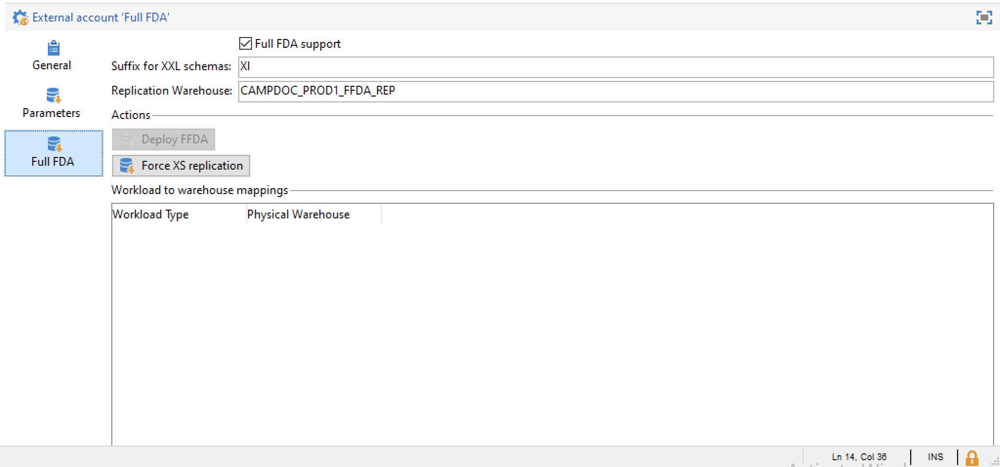

# Configuración de las cuentas externas

Adobe Campaign viene con un conjunto de cuentas externas predefinidas. Para configurar conexiones con sistemas externos, puede crear nuevas cuentas externas.

Los procesos técnicos utilizan las cuentas externas como flujos de trabajo técnicos o flujos de trabajo de campaña. Por ejemplo, al configurar una transferencia de archivos en un flujo de trabajo o un intercambio de datos con cualquier otra aplicación (Adobe Target, Experience Manager, etc.), debe seleccionar una cuenta externa.

:arrow_upper_right: Obtenga información sobre cómo crear y configurar cuentas externas en [Campaign Classic documentation](https://experienceleague.adobe.com/docs/campaign-classic/using/installing-campaign-classic/accessing-external-database/external-accounts.html)

Una cuenta externa específica administra la conexión entre la base de datos local de Campaign y la base de datos de Cloud ([!DNL Snowflake]).

: globo_voz: Como usuario de Cloud Services administrados, la cuenta externa [!DNL Snowflake] está configurada para su instancia por Adobe.

Puede acceder a esta cuenta externa para comprobar la configuración y ejecutar flujos de trabajo de replicación. Para ello, siga los pasos a continuación:

1. En Campaña **[!UICONTROL Explorer]**, haga clic en **[!UICONTROL Administration > Platform > External Accounts]**.

1. Seleccione la cuenta externa **[!UICONTROL Full FDA]**.

La configuración global se muestra en **[!UICONTROL General tab]**.

Utilice la pestaña **[!UICONTROL Parameters]** y el botón **[!UICONTROL Deploy functions]** para crear funciones.

**AÑADIR PARÁMETROS DESC AQUÍ**

Utilice la pestaña **[!UICONTROL Full FDA]** para forzar la ejecución del flujo de trabajo de duplicación.

**AÑADIR DETALLES AQUÍ**

