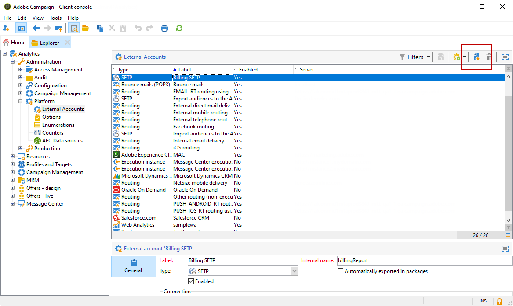
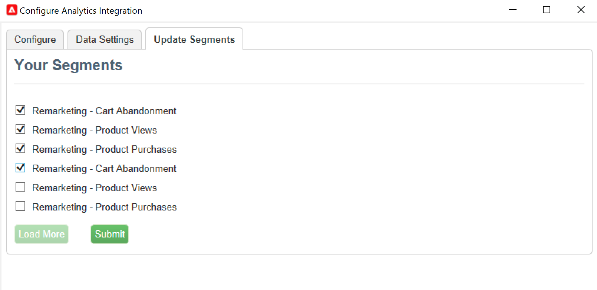
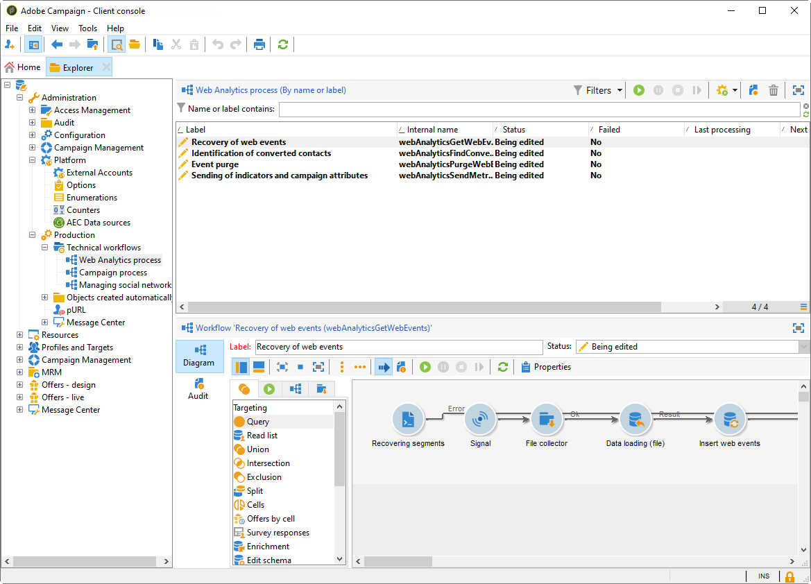

# Trabajo con Campaign y Adobe Analytics

Puede configurar Adobe Analytics para integrar Campaign y Analytics.

Esta integración permite que Adobe Campaign y Adobe Analytics interactúen mediante el complemento **Conectores web de Analytics**. Esta integración envía indicadores y atributos de las campañas de correo electrónico que envía Adobe Campaign a Adobe Analytics.

[!DNL :speech_balloon:] Como usuario de Cloud Services administrados,  [póngase en contacto con ](../start/campaign-faq.md#support) Adobe para conectar Campaign con los servicios y soluciones de Adobe Experience Cloud. El servicio Identity Management de Adobe (IMS) debe implementarse para su instancia. [Más información](../start/connect.md#connect-ims). El complemento del conector de Web Analytics debe estar instalado en el entorno, a través del paquete dedicado.

Con Adobe Analytics Connector, Adobe Campaign puede medir la audiencia de Internet (Web Analytics). Las herramientas de Web Analytics permiten a Adobe Campaign reenviar indicadores y atributos de campaña a Analytics.

El perímetro de acción de cada herramienta es el siguiente:

* **Adobe** Analytics marca las campañas de correo electrónico iniciadas con Adobe Campaign

* **Adobe** Campaign envía los indicadores y atributos de campaña al conector, que a su vez los reenvía a la herramienta Web Analytics

>[!CAUTION]
>
>El conector de Adobe Analytics no es compatible con los mensajes transaccionales (Centro de mensajes).

Para configurar la conexión de Campaign-Analytics, debe realizar las siguientes operaciones:

1. [Crear un grupo de informes en Adobe Analytics](#report-suite-analytics)
1. [Configurar las variables de conversión y los eventos de éxito](#configure-conversion-success)
1. [Configurar la cuenta externa en Adobe Campaign](#external-account-ac)

## Cree su grupo de informes de Analytics {#report-suite-analytics}

Para crear su **[!UICONTROL Report suite]** en [!DNL Adobe Analytics], siga los pasos a continuación:

1. En [!DNL Adobe Analytics], seleccione **[!UICONTROL Admin tab]** y haga clic en **[!UICONTROL All admin]**.

   

1. Haga clic en **[!UICONTROL Report suites]**.

   

1. En la página **[!UICONTROL Report suite manager]**, haga clic en **[!UICONTROL Create new]** y luego en **[!UICONTROL Report suite]**.

   Para ver el procedimiento detallado sobre la creación de **[!UICONTROL Report suite]**, consulte esta [sección](https://experienceleague.adobe.com/docs/analytics/admin/manage-report-suites/new-report-suite/t-create-a-report-suite.html?lang=en#prerequisites).

   

1. Seleccione una plantilla.

1. Configure su nuevo grupo de informes con la siguiente información:

   * **[!UICONTROL Report Suite ID]**
   * **[!UICONTROL Site Title]**
   * **[!UICONTROL Time Zone]**
   * **[!UICONTROL Go Live Date]**
   * **[!UICONTROL Estimated Page Views Per Day]**

   

1. Cuando esté configurado, haga clic en **[!UICONTROL Create report suite]**.

## Configurar las variables de conversión y los eventos de éxito {#configure-conversion-success}

Después de crear su **[!UICONTROL Report suite]**, debe configurar sus **[!UICONTROL Conversion variables]** y **[!UICONTROL Success events]** de la siguiente manera:

1. Seleccione el **[!UICONTROL Report suite]** configurado anteriormente.

1. En el botón **[!UICONTROL Edit settings]**, seleccione **[!UICONTROL Conversion]** > **[!UICONTROL Conversion variables]**.

   

1. Haga clic en **[!UICONTROL Add new]** para crear los identificadores necesarios para medir el impacto de la campaña de correo electrónico, es decir, el nombre de campaña interno (cid) y el ID de tabla de iNmsBroadlog (bid).

   Para aprender a editar **[!UICONTROL Conversion variables]**, consulte esta [sección](https://experienceleague.adobe.com/docs/analytics/admin/admin-tools/conversion-variables/t-conversion-variables-admin.html?lang=en#admin-tools).

   

1. Haga clic en **[!UICONTROL Save]** cuando termine.

1. A continuación, para crear su **[!UICONTROL Success events]**, seleccione **[!UICONTROL Conversion]** > **[!UICONTROL Success events]** en el botón **[!UICONTROL Edit settings]**.

   

1. Haga clic en **[!UICONTROL Add new]** para configurar el siguiente **[!UICONTROL Success events]**:

   * **[!UICONTROL Clicked]**
   * **[!UICONTROL Opened]**
   * **[!UICONTROL Person clicks]**
   * **[!UICONTROL Processed]**
   * **[!UICONTROL Scheduled]**
   * **[!UICONTROL Sent]**
   * **[!UICONTROL Total bounces]**
   * **[!UICONTROL Unique Clicks]**
   * **[!UICONTROL Unique Opens]**
   * **[!UICONTROL Unsubscribed]**

   Para aprender a configurar **[!UICONTROL Success events]**, consulte esta [sección](https://experienceleague.adobe.com/docs/analytics/admin/admin-tools/success-events/t-success-events.html?lang=en#admin-tools)

   

1. Haga clic en **[!UICONTROL Save]** cuando termine.

Cuando se configure el grupo de informes, deberá configurar el **[!UICONTROL External accounts]** en Adobe Campaign.

## Configure la cuenta externa de Campaign {#external-account-ac}

Ahora debe configurar la cuenta externa **[!UICONTROL Web Analytics]** en Adobe Campaign para habilitar la sincronización entre las dos soluciones.

Tenga en cuenta que si uno de los **[!UICONTROL Report suite]**, **[!UICONTROL Conversion variables]** o **[!UICONTROL Success events]** no está visible al configurar la cuenta externa, significa que le falta un permiso para este componente recién creado en el **[!UICONTROL Product profile]** asociado al usuario.

Para obtener más información, consulte la página [Perfiles de producto para Adobe Analytics](https://experienceleague.adobe.com/docs/analytics/admin/admin-console/permissions/product-profile.html?lang=en#product-profile-admins) .

1. Vaya a la carpeta **[!UICONTROL Administration]** > **[!UICONTROL Platform]** > **[!UICONTROL External accounts]** del árbol de Adobe Campaign y haga clic en **[!UICONTROL New]**.

   

1. Utilice la lista desplegable para seleccionar el tipo **[!UICONTROL Web Analytics]** y **[!UICONTROL Adobe Analytics]** en la lista desplegable **[!UICONTROL Integration]**.

   

1. Haga clic en **[!UICONTROL Configure]** junto a la lista desplegable **[!UICONTROL Integration]**.

1. Desde la ventana **[!UICONTROL Configure Analytics integration]** , asigne la cuenta externa con el grupo de informes creado anteriormente, con la siguiente información:

   * **[!UICONTROL E-Mail]**
   * **[!UICONTROL IMS Org]**
   * **[!UICONTROL Analytics Company]**
   * **[!UICONTROL Report Suite]**

1. Desde la categoría **[!UICONTROL eVars]**, asigne los dos **[!UICONTROL Conversion variables]** configurados en [!DNL Adobe Analytics].

   

1. Desde la categoría **[!UICONTROL Events]**, asigne los diez **[!UICONTROL Success events]** configurados en [!DNL Adobe Analytics].

1. Haga clic en **[!UICONTROL Submit]** cuando termine. Adobe Campaign creará **[!UICONTROL Data source]**, **[!UICONTROL Calculated metrics]**, **[!UICONTROL Remarketing segments]** y **[!UICONTROL Classifications]** en el Analytics **[!UICONTROL Report Suite]** asignado.

   Una vez finalizada esta sincronización entre [!DNL Adobe Analytics] y Adobe Campaign, puede cerrar la ventana.

1. La configuración se puede ver desde la pestaña **[!UICONTROL Data Settings]** de la ventana **[!UICONTROL Configure Analytics integration]**.

   Con el botón **[!UICONTROL Sync]**, [!DNL Adobe Campaign] sincronizará los cambios de nombre realizados en [!DNL Adobe Analytics]. Si el componente se elimina en [!DNL Adobe Analytics], se tachará en [!DNL Adobe Campaign] o se mostrará con un mensaje **no encontrado**.

   

1. Si es necesario, puede añadir o eliminar segmentos de la pestaña **[!UICONTROL Update Segments]** .

   

1. En **[!UICONTROL External account]**, haga clic en el enlace **[!UICONTROL Enrich the formula...]** para cambiar la fórmula de cálculo de URL y especificar la información de integración de la herramienta de Web Analytics (ID de campaña) y los dominios de los sitios cuya actividad debe rastrearse.

   

1. Especifique los nombres de dominio de los sitios.

   

1. Haga clic en **[!UICONTROL Next]** y asegúrese de que los nombres de dominio se hayan guardado.

   

1. Si es necesario, puede sobrecargar la fórmula de cálculo. Para ello, marque la casilla y edite la fórmula directamente en la ventana.

   >[!IMPORTANT]
   >
   >Este modo de configuración está reservado para usuarios expertos: cualquier error en esta fórmula puede resultar en envíos de correo electrónico detenidos.

1. La pestaña **[!UICONTROL Advanced]** permite configurar o modificar más ajustes técnicos.

   * **[!UICONTROL Lifespan]**: permite especificar el retraso (en días) después del cual los eventos web se recuperan en Adobe Campaign mediante flujos de trabajo técnicos. Predeterminado: 180 días.
   * **[!UICONTROL Persistence]**: permite especificar el periodo durante el cual se pueden atribuir todos los eventos web (una compra, por ejemplo) a una nueva campaña de marketing. Predeterminado: 7 días.

>[!NOTE]
>
>Si utiliza varias herramientas de medición de audiencia, puede seleccionar **[!UICONTROL Other]** en la lista desplegable **[!UICONTROL Partners]** al crear la cuenta externa. Solo puede hacer referencia a una cuenta externa en las propiedades de entrega: por lo tanto, debe adaptar la fórmula de URL rastreadas agregando los parámetros esperados por las herramientas de medición de Adobe y otras herramientas.

## Flujo de trabajo técnico de procesos de Web Analytics {#technical-workflows-of-web-analytics-processes}

El intercambio de datos entre Adobe Campaign y Adobe Analytics se administra mediante un flujo de trabajo técnico que se ejecuta como una tarea en segundo plano.

Este flujo de trabajo está disponible en el árbol del explorador de Campaign, en la carpeta **[!UICONTROL Administration]** > **[!UICONTROL Production]** > **[!UICONTROL Technical workflows]** > **[!UICONTROL Web analytics process]**.

El flujo de trabajo **[!UICONTROL Sending of indicators and campaign attributes]** permite enviar indicadores de campaña de correo electrónico a través de Adobe Campaign a Adobe Experience Cloud mediante Adobe Analytics Connector. Este flujo de trabajo se activa a las 4 de la mañana cada día y los datos pueden tardar hasta 24 horas en enviarse a Analytics.

Tenga en cuenta que este flujo de trabajo no debe reiniciarse o volverá a enviar todos los datos anteriores, lo que puede distorsionar los resultados de Analytics.

Los indicadores implicados son:

* **[!UICONTROL Messages to deliver]** (@toDeliver)
* **[!UICONTROL Processed]** (@processed)
* **[!UICONTROL Success]** (@success)
* **[!UICONTROL Total count of opens]** (@totalRecipientOpen)
* **[!UICONTROL Recipients who have opened]** (@recipientOpen)
* **[!UICONTROL Total number of recipients who clicked]** (@totalRecipientClick)
* **[!UICONTROL People who clicked]** (@personClick)
* **[!UICONTROL Number of distinct clicks]** (@recipientClick)
* **[!UICONTROL Opt-Out]** (@optOut)
* **[!UICONTROL Errors]** (@error)

>[!NOTE]
>
>Los datos enviados son la información delta basada en el último resumen que puede generar un valor negativo en los datos de la métrica.

Los atributos enviados son los siguientes:

* **[!UICONTROL Internal name]** (@internalName)
* **[!UICONTROL Label]** (@label)
* **[!UICONTROL Label]** (operation/@label): sólo si está instalado el paquete de **Campaign**
* **[!UICONTROL Nature]** (operation/@nature): solo si está instalado el paquete de **Campaign**
* **[!UICONTROL Tag 1]** (webAnalytics/@tag1)
* **[!UICONTROL Tag 2]** (webAnalytics/@tag2)
* **[!UICONTROL Tag 3]** (webAnalytics/@tag3)
* **[!UICONTROL Contact date]** (scheduling/@contactDate)

## Seguimiento de envíos {#tracking-deliveries-in-adobe-campaign}

Para que Adobe Experience Cloud pueda rastrear la actividad en los sitios una vez Adobe Campaign ha realizado la entrega, debe hacer referencia al conector coincidente en las propiedades de entrega. Para ello, siga los siguientes pasos:

1. Abra la entrega de la campaña a rastrear.

   

1. Abra las propiedades de entrega.
1. Vaya a la pestaña **[!UICONTROL Web Analytics]** y seleccione la cuenta externa creada anteriormente. Consulte [Configuración de la cuenta externa en Adobe Campaign](#external-account-ac).

   

1. Ahora puede realizar la entrega y acceder a su informe en Adobe Analytics.

**Temas relacionados**

* [Campaign: integración de Déclencheur de Experience Cloud](ac-triggers.md)
