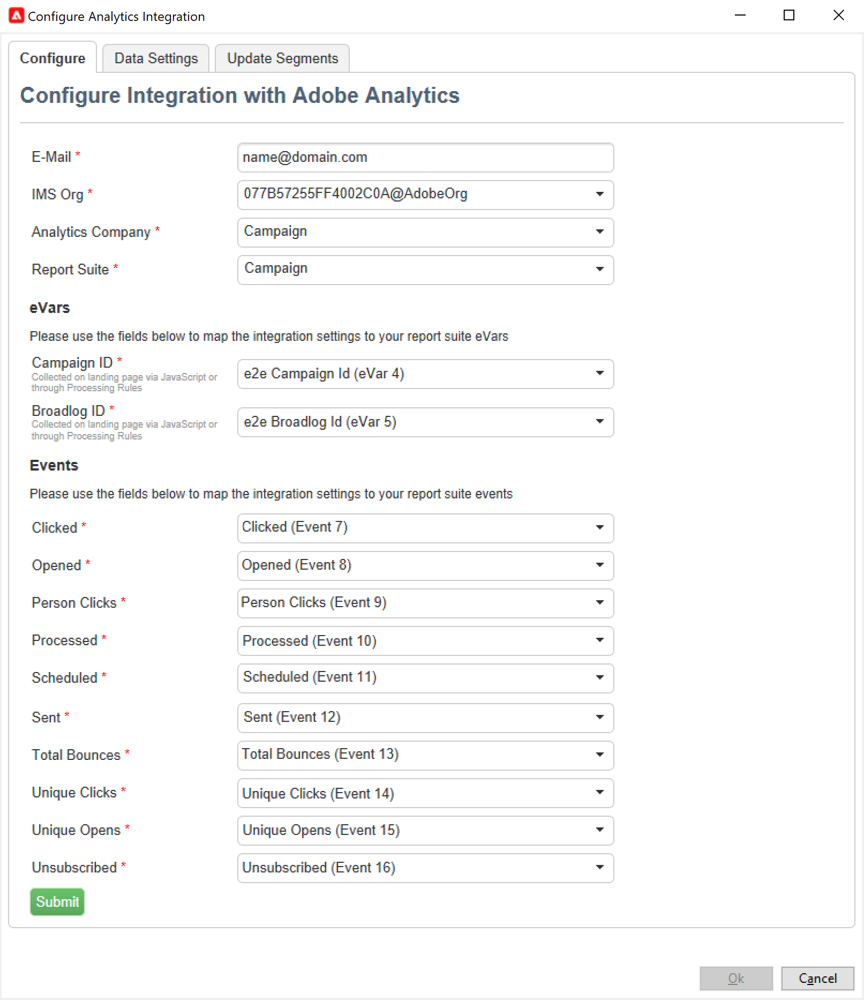

# Trabajo con Campaign y Adobe Analytics {#ac-aa}

Puede configurar Adobe Analytics para integrar Campaign y Analytics.

Esta integración permite que Adobe Campaign y Adobe Analytics interactúen a través del complemento **Conectores de análisis web**. Esta integración envía indicadores y atributos de las campañas de correo electrónico que envía Adobe Campaign a Adobe Analytics.

>[!NOTE]
>
>Como usuario de Cloud Service administrados, [póngase en contacto con el Adobe](../start/campaign-faq.md#support) para conectar Campaign con los servicios y las soluciones de Adobe Experience Cloud. El complemento del conector de Web Analytics debe instalarse en su entorno, a través del paquete dedicado.

A través del Conector de Adobe Analytics, Adobe Campaign puede medir la audiencia de Internet (Web Analytics). Las herramientas de Web Analytics permiten a Adobe Campaign reenviar indicadores y atributos de campaña a Analytics.

El perímetro de acción de cada herramienta es el siguiente:

* **Adobe Analytics** marca las campañas de correo electrónico iniciadas con Adobe Campaign

* **Adobe Campaign** envía los indicadores y atributos de campaña al conector, que a su vez los reenvía a la herramienta Web Analytics

>[!CAUTION]
>
>El conector de Adobe Analytics no es compatible con mensajes transaccionales (Centro de mensajería).

Para configurar la conexión de Campaign-Analytics, debe realizar las siguientes operaciones:

1. [Creación de un grupo de informes en Adobe Analytics](#report-suite-analytics)
1. [Configuración de las variables de conversión y los eventos de éxito](#configure-conversion-success)
1. [Configuración de la cuenta externa en Adobe Campaign](#external-account-ac)

## Crear su grupo de informes de Analytics {#report-suite-analytics}

Para crear su **[!UICONTROL Report suite]** en [!DNL Adobe Analytics], siga los pasos a continuación:

1. En [!DNL Adobe Analytics], seleccione **[!UICONTROL Admin tab]** y haga clic en **[!UICONTROL All admin]**.

   

1. Haga clic en **[!UICONTROL Report suites]**.

   

1. En la página **[!UICONTROL Report suite manager]**, haga clic en **[!UICONTROL Create new]** y luego en **[!UICONTROL Report suite]**.

   Para ver el procedimiento detallado sobre la creación de **[!UICONTROL Report suite]**, consulte [Documentación de Adobe Analytics](https://experienceleague.adobe.com/docs/analytics/admin/manage-report-suites/new-report-suite/t-create-a-report-suite.html#prerequisites){target="_blank"}.

   

1. Seleccione una plantilla.

1. Configure su nuevo grupo de informes con la siguiente información:

   * **[!UICONTROL Report Suite ID]**
   * **[!UICONTROL Site Title]**
   * **[!UICONTROL Time Zone]**
   * **[!UICONTROL Go Live Date]**
   * **[!UICONTROL Estimated Page Views Per Day]**

   

1. Cuando esté configurado, haga clic en **[!UICONTROL Create report suite]**.

## Configuración de las variables de conversión y los eventos de éxito {#configure-conversion-success}

Después de crear su **[!UICONTROL Report suite]**, debe configurar sus **[!UICONTROL Conversion variables]** y **[!UICONTROL Success events]** de la siguiente manera:

1. Seleccione el **[!UICONTROL Report suite]** configurado anteriormente.

1. En el botón **[!UICONTROL Edit settings]**, seleccione **[!UICONTROL Conversion]** > **[!UICONTROL Conversion variables]**.

   

1. Haga clic en **[!UICONTROL Add new]** para crear los identificadores necesarios para medir el impacto de la campaña de correo electrónico; es decir, el nombre de la campaña interna (cid) y el ID de tabla de iNmsBroadlog (bid).

   Para aprender a editar **[!UICONTROL Conversion variables]**, consulte esta [documentación de Adobe Analytics](https://experienceleague.adobe.com/docs/analytics/admin/admin-tools/conversion-variables/t-conversion-variables-admin.html?lang=es#admin-tools){target="_blank"}.

   

1. Haga clic en **[!UICONTROL Save]** cuando termine.

1. A continuación, para crear su **[!UICONTROL Success events]**, seleccione **[!UICONTROL Conversion]** > **[!UICONTROL Success events]** en el botón **[!UICONTROL Edit settings]**.

   

1. Haga clic en **[!UICONTROL Add new]** para configurar los siguientes **[!UICONTROL Success events]**:

   * **[!UICONTROL Clicked]**
   * **[!UICONTROL Opened]**
   * **[!UICONTROL Person clicks]**
   * **[!UICONTROL Processed]**
   * **[!UICONTROL Scheduled]**
   * **[!UICONTROL Sent]**
   * **[!UICONTROL Total bounces]**
   * **[!UICONTROL Unique Clicks]**
   * **[!UICONTROL Unique Opens]**
   * **[!UICONTROL Unsubscribed]**

   Para aprender a configurar **[!UICONTROL Success events]**, consulte esta [documentación de Adobe Analytics](https://experienceleague.adobe.com/docs/analytics/admin/admin-tools/manage-report-suites/edit-report-suite/conversion-variables/success-event.html)

   

1. Haga clic en **[!UICONTROL Save]** cuando termine.

Cuando se configure el grupo de informes, deberá configurar **[!UICONTROL External accounts]** en Adobe Campaign.

## Configuración de la cuenta externa de Campaign {#external-account-ac}

Ahora debe configurar la cuenta externa de **[!UICONTROL Web Analytics]** en Adobe Campaign para habilitar la sincronización entre las dos soluciones.

Tenga en cuenta que si uno de los **[!UICONTROL Report suite]**, **[!UICONTROL Conversion variables]** o **[!UICONTROL Success events]** no está visible al configurar la cuenta externa, significa que le falta un permiso para este componente recién creado en el **[!UICONTROL Product profile]** asociado al usuario.

Para obtener más información, consulte la página [Perfiles de producto para Adobe Analytics](https://experienceleague.adobe.com/docs/analytics/admin/admin-console/permissions/product-profile.html?lang=es#product-profile-admins){target="_blank"}.

1. Vaya a la carpeta **[!UICONTROL Administration]** > **[!UICONTROL Platform]** > **[!UICONTROL External accounts]** del árbol del explorador de Adobe Campaign y haga clic en **[!UICONTROL New]**.

   

1. Utilice la lista desplegable para seleccionar el tipo **[!UICONTROL Web Analytics]** y **[!UICONTROL Adobe Analytics]** en el desplegable **[!UICONTROL Integration]**.

   

1. Haga clic en **[!UICONTROL Configure]** junto a la lista desplegable **[!UICONTROL Integration]**.

1. Desde la ventana **[!UICONTROL Configure Analytics integration]**, asigne la cuenta externa con el grupo de informes creado anteriormente, con la siguiente información:

   * **[!UICONTROL E-Mail]**
   * **[!UICONTROL IMS Org]**
   * **[!UICONTROL Analytics Company]**
   * **[!UICONTROL Report Suite]**

1. En la categoría **[!UICONTROL eVars]**, asigne las dos **[!UICONTROL Conversion variables]** configuradas en [!DNL Adobe Analytics].

   >[!NOTE]
   >
   >Los campos ID de campaña e ID de carga amplia se recopilan mediante JavaScript en la página de aterrizaje o mediante reglas de procesamiento. [Más información sobre las reglas de procesamiento](https://experienceleague.adobe.com/en/docs/analytics/admin/admin-tools/manage-report-suites/edit-report-suite/report-suite-general/c-processing-rules/processing-rules)

   

1. Desde la categoría **[!UICONTROL Events]**, asigne los diez **[!UICONTROL Success events]** configurados en [!DNL Adobe Analytics].

1. Haga clic en **[!UICONTROL Submit]** cuando termine. Adobe Campaign creará **[!UICONTROL Data source]**, **[!UICONTROL Calculated metrics]**, **[!UICONTROL Remarketing segments]** y **[!UICONTROL Classifications]** en el **[!UICONTROL Report Suite]** de Analytics asignado.

   Una vez finalizada esta sincronización entre [!DNL Adobe Analytics] y Adobe Campaign, puede cerrar la ventana.

1. La configuración se puede ver desde la pestaña **[!UICONTROL Data Settings]** de la ventana **[!UICONTROL Configure Analytics integration]**.

   Con el botón **[!UICONTROL Sync]**, [!DNL Adobe Campaign] sincronizará los cambios de nombre realizados en [!DNL Adobe Analytics]. Si el componente se elimina en [!DNL Adobe Analytics], se tachará en [!DNL Adobe Campaign] o se mostrará con un mensaje de **no encontrado**.

   

   >[!NOTE]
   >
   > No puede añadir ni eliminar segmentos en esta versión de Campaign v8.

1. En **[!UICONTROL External account]**, haga clic en el enlace **[!UICONTROL Enrich the formula...]** para cambiar la fórmula de cálculo de URL y especificar la información de integración de la herramienta de análisis web (ID de campaña) y los dominios de los sitios cuya actividad debe rastrearse.

   

1. Especifique los nombres de dominio de los sitios.

   

1. Haga clic en **[!UICONTROL Next]** y asegúrese de que los nombres de dominio se hayan guardado.

   

1. Si es necesario, puede sobrecargar la fórmula de cálculo. Para ello, marque la casilla y edite la fórmula directamente en la ventana.

   >[!IMPORTANT]
   >
   >Este modo de configuración está reservado para usuarios expertos: cualquier error en esta fórmula puede provocar que se detengan las entregas de correo electrónico.

1. La pestaña **[!UICONTROL Advanced]** permite configurar o modificar más ajustes técnicos.

   * **[!UICONTROL Lifespan]**: permite especificar el retraso (en días) después del cual los eventos web se recuperan en Adobe Campaign mediante flujos de trabajo técnicos. Predeterminado: 180 días.
   * **[!UICONTROL Persistence]**: permite especificar el periodo durante el cual se pueden atribuir todos los eventos web (una compra, por ejemplo) a una nueva campaña de marketing. Predeterminado: 7 días.

>[!NOTE]
>
>Si utiliza varias herramientas de medición de audiencia, puede seleccionar **[!UICONTROL Other]** en la lista desplegable **[!UICONTROL Partners]** al crear la cuenta externa. Solo puede hacer referencia a una cuenta externa en las propiedades de entrega; por lo tanto, debe adaptar la fórmula de las URL rastreadas añadiendo los parámetros esperados por las herramientas de medición de Adobe y otras.

## Flujo de trabajo técnico de procesos de análisis web {#technical-workflows-of-web-analytics-processes}

El intercambio de datos entre Adobe Campaign y Adobe Analytics se administra mediante un flujo de trabajo técnico que se ejecuta como una tarea en segundo plano.

Este flujo de trabajo está disponible en el árbol de Campaign Explorer, en la carpeta **[!UICONTROL Administration]** > **[!UICONTROL Production]** > **[!UICONTROL Technical workflows]** > **[!UICONTROL Web analytics process]**.

El flujo de trabajo **[!UICONTROL Sending of indicators and campaign attributes]** le permite enviar indicadores de campaña de correo electrónico a través de Adobe Campaign a Adobe Experience Cloud mediante el Conector de Adobe Analytics. Este flujo de trabajo se activa a las 4 de la mañana cada día y los datos pueden tardar hasta 24 horas en enviarse a Analytics.

Tenga en cuenta que este flujo de trabajo no debe reiniciarse o volverá a enviar todos los datos anteriores, lo que puede distorsionar los resultados de Analytics.

Los indicadores implicados son:

* **[!UICONTROL Messages to deliver]** (@toDeliver)
* **[!UICONTROL Processed]** (@processed)
* **[!UICONTROL Success]** (@success)
* **[!UICONTROL Total count of opens]** (@totalRecipientOpen)
* **[!UICONTROL Recipients who have opened]** (@recipientOpen)
* **[!UICONTROL Total number of recipients who clicked]** (@totalRecipientClick)
* **[!UICONTROL People who clicked]** (@personClick)
* **[!UICONTROL Number of distinct clicks]** (@recipientClick)
* **[!UICONTROL Opt-Out]** (@optOut)
* **[!UICONTROL Errors]** (@error)

>[!NOTE]
>
>Los datos enviados son la información delta basada en el último resumen que puede generar un valor negativo en los datos de la métrica.

Los atributos enviados son los siguientes:

* **[!UICONTROL Internal name]** (@internalName)
* **[!UICONTROL Label]** (@label)
* **[!UICONTROL Label]** (operation/@label): sólo si está instalado el paquete de **Campaign**
* **[!UICONTROL Nature]** (operation/@nature): solo si está instalado el paquete de **Campaign**
* **[!UICONTROL Tag 1]** (webAnalytics/@tag1)
* **[!UICONTROL Tag 2]** (webAnalytics/@tag2)
* **[!UICONTROL Tag 3]** (webAnalytics/@tag3)
* **[!UICONTROL Contact date]** (scheduling/@contactDate)

## Seguimiento de envíos {#tracking-deliveries-in-adobe-campaign}

Para que Adobe Experience Cloud pueda rastrear la actividad en los sitios una vez Adobe Campaign ha realizado la entrega, debe hacer referencia al conector coincidente en las propiedades de entrega. Para ello, siga los siguientes pasos:

1. Abra la entrega de la campaña a rastrear.

   

1. Abra las propiedades de entrega.
1. Vaya a la pestaña **[!UICONTROL Web Analytics]** y seleccione la cuenta externa creada anteriormente. Consulte [Configuración de la cuenta externa en Adobe Campaign](#external-account-ac).

   

1. Ahora puede realizar la entrega y acceder a su informe en Adobe Analytics.

## Creación de una campaña de remarketing {#create-a-re-marketing-campaign}

Para preparar la campaña de remarketing, simplemente cree plantillas de entrega para utilizarlas en campañas de tipo de remarketing. A continuación, configure su campaña de remarketing y vincúlela a un segmento. Cada segmento debe tener una campaña de remarketing diferente.

Las campañas de remarketing se inician automáticamente una vez que Adobe Campaign ha terminado de recuperar los segmentos analizando el comportamiento de las personas a las que se dirigió la campaña inicial. En caso de abandono del carro de compras o de la visualización del producto sin compra, se realiza una entrega a los destinatarios en cuestión para que la navegación por su sitio finalice su compra.

Adobe Campaign proporciona plantillas de entrega personalizadas que puede utilizar o aplicar a bases de datos propias para preparar las campañas.

1. En **[!UICONTROL Explorer]**, vaya a la carpeta **[!UICONTROL Resources]** > **[!UICONTROL Templates]** > **[!UICONTROL Delivery templates]** del árbol de Adobe Campaign.
1. Duplique la plantilla de **[!UICONTROL Email delivery (re-marketing)]** o los ejemplos de plantilla de remarketing que ofrece Adobe Campaign.
1. Personalice la plantilla para adaptarla a sus necesidades y guárdela.
1. Cree una nueva campaña y seleccione la plantilla **[!UICONTROL Re-marketing campaign]** en la lista desplegable.
1. Haga clic en el enlace **[!UICONTROL Configure...]** para especificar el segmento y la plantilla de envíos relacionados con la campaña.
1. Seleccione la e[cuenta externa](#external-account-ac) de Analytics y el segmento correspondiente.
1. Seleccione la plantilla de entrega que prefiere usar para esta campaña de remarketing y luego haga clic en **[!UICONTROL Finish]** para cerrar la ventana.
1. Haga clic en **[!UICONTROL OK]** para cerrar la ventana de la campaña.

Puede acceder al informe de **[!UICONTROL Re-marketing efficiency]** a través de la página de informes globales. Permite ver la cantidad de contactos convertidos (por ejemplo: aquellos que han comprado algo) en relación con el número de abandonos del carro de la compra después del relanzamiento de la campaña de marketing de Adobe Campaign. La tasa de conversión se calcula por semana, mes o desde el inicio de la sincronización entre Adobe Campaign y Adobe Analytics.

**Temas relacionados**

* [Campaign: Integración de Déclencheur de Experience Cloud](ac-triggers.md)
