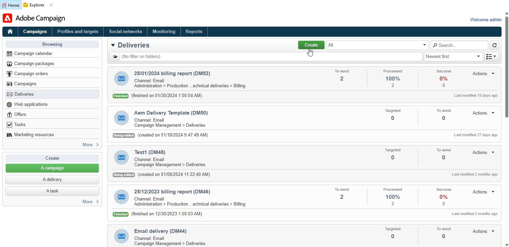

# Trabajo con Campaign y Adobe Experience Manager {#ac-aem}

La integración entre Adobe Campaign y Adobe Experience Manager le permite administrar el contenido de las entregas de los correos electrónicos y los formularios directamente en Adobe Experience Manager. Tiene la opción de importar su **Adobe Experience Manager** contenido en Campaign o conecte su **Adobe Experience Manager as a Cloud Service** , lo que le permite editar el contenido directamente en la interfaz web.

[Descubra cómo editar el contenido de Adobe Experience Manager como Cloud Service en la interfaz web de Campaign](https://experienceleague.adobe.com/docs/campaign-web/v8/integrations/aem-content.html?lang=en)

[Obtenga más información acerca de Adobe Experience Manager en este documento](https://experienceleague.adobe.com/docs/experience-manager-65/administering/integration/campaignonpremise.html#aem-and-adobe-campaign-integration-workflow)

## Importación de contenido desde Adobe Experience Manager {#integrating-with-aem}

  Como usuario de Managed Cloud Service, [Adobe de contacto](../start/campaign-faq.md#support) para integrar Adobe Experience Manager en Campaign.

Esta integración puede utilizarse, por ejemplo, para crear un “newsletter” en Adobe Experience Manager para su uso posterior en Adobe Campaign como parte de una campaña de correo electrónico.

**Desde Adobe Experience Manager:**

1. Navegue hasta su [!DNL Adobe Experience Manager] Cree una instancia de autor de y haga clic en Experiencia de Adobe en la esquina superior izquierda de la página. Elegir **[!UICONTROL Sites]** en el menú.

   

1. Acceso **[!UICONTROL Campaigns > Name of your brand (here we.Shopping) > Main Area > Email]**.

1. Clic **[!UICONTROL Create]** y seleccione **[!UICONTROL Page]** en el menú desplegable.

   

1. Seleccione la plantilla de **[!UICONTROL Adobe Campaign Email]** y asigne un nombre al newsletter.

1. Después de crear la página, acceda al **[!UICONTROL Page information]** y haga clic en **[!UICONTROL Open Properties]**.

   

1. Personalice el contenido del correo electrónico añadiendo componentes como, por ejemplo, campos de personalización de Adobe Campaign. [Más información](https://experienceleague.adobe.com/docs/experience-manager-65/content/sites/authoring/aem-adobe-campaign/campaign.html?lang=en#editing-email-content)

1. Una vez que el correo electrónico esté listo, vaya a **[!UICONTROL Page information]** y haga clic en **[!UICONTROL Start workflow]**.

   

1. En la primera lista desplegable, seleccione **[!UICONTROL Approve Adobe Campaign]** como modelo de flujo de trabajo y haga clic en **[!UICONTROL Start workflow]**.

   

1. Aparecerá un aviso legal en la parte superior de la página que indica: `This page is subject to the workflow Approve for Adobe Campaign`. Clic **[!UICONTROL Complete]** junto al aviso legal para confirmar la revisión y haga clic en **[!UICONTROL Ok]**.

1. Clic **[!UICONTROL Complete]** de nuevo y seleccione **[!UICONTROL Newsletter approval]** en el **[!UICONTROL Next Step]** menú desplegable.

   

El boletín ya está listo y sincronizado en Adobe Campaign.

**Desde Adobe Campaign:**

1. En la pestaña **[!UICONTROL Campaigns]** , haga clic en **[!UICONTROL Deliveries]** luego **[!UICONTROL Create]**.

1. Elija la **[!UICONTROL Email delivery with AEM content (mailAEMContent)]** plantilla de la **[!UICONTROL Delivery template]** menú desplegable.

   

1. Añada a la entrega una **[!UICONTROL Label]** y haga clic en **[!UICONTROL Continue]**.

1. Clic **[!UICONTROL Synchronize]** AEM para acceder a sus envíos de la.

   Si el botón no está visible en la interfaz de, vaya a **[!UICONTROL Properties]** y acceda al **[!UICONTROL Advanced]** pestaña. Asegúrese de que la variable **[!UICONTROL Content editing mode]** El campo está configurado para **[!UICONTROL AEM]** AEM e introduzca los detalles de la instancia de la en **[!UICONTROL AEM account]** field.

   

1. AEM Seleccione el envío de la lista de distribución creado anteriormente en [!DNL Adobe Experience Manager] y confirme haciendo clic en **[!UICONTROL Ok]**.

   

1. Asegúrese de hacer clic en **[!UICONTROL Refresh content]** AEM cada vez que se realicen modificaciones en el envío de la.

   

1. Para eliminar la vinculación entre Experience Manager y Campaign, haga clic en **[!UICONTROL Desynchronize]**.

El correo electrónico está listo para enviarlo a su audiencia.

## Importar recursos desde la biblioteca de Adobe Experience Manager Assets {#assets-library}

También puede insertar recursos directamente desde su [!DNL Adobe Experience Manager Assets Library] al editar un correo electrónico o una página de aterrizaje en Adobe Campaign. Esta funcionalidad se detalla en [Documentación de Adobe Experience Manager Assets](https://experienceleague.adobe.com/docs/experience-manager-65/content/assets/managing/manage-assets.html?lang=en).

**Desde Adobe Experience Manager:**

1. Navegue hasta su [!DNL Adobe Experience Manager] Cree una instancia de autor de y haga clic en Experiencia de Adobe en la esquina superior izquierda de la página. Elegir **[!UICONTROL Assets]** `>` **[!UICONTROL Files]** en el menú.

   

1. Clic **Crear** entonces **Archivos** para importar el recurso a su **Biblioteca de Adobe Experience Manager Assets**. [Más información](https://experienceleague.adobe.com/docs/experience-manager-65/content/assets/managing/manage-assets.html?lang=en#uploading-assets)

   

1. Cambie el nombre del recurso si es necesario y seleccione **Cargar**.

El recurso se ha cargado a su **Biblioteca de Adobe Experience Manager Assets**.

**Desde Adobe Campaign:**

1. En Adobe Campaign, cree un nuevo envío navegando hasta **Campañas** pestaña, haga clic en **Envíos** y haga clic en **Crear** botón situado sobre la lista de envíos existentes.

   

1. Seleccione una **Plantilla de envíos**, y asigne un nombre a la entrega.

1. Defina y personalice el contenido del mensaje. [Más información](../send/email.md)

1. Para usar su **Biblioteca de Adobe Experience Manager Assets**, acceda al **[!UICONTROL Properties]** AEM de la entrega y seleccione la opción **[!UICONTROL Advanced]** pestaña.

   Elija su **AEM cuenta de** y habilite la **[!UICONTROL Use above AEM instance as shared asset library]** opción.

   

1. Desde el **Imagen** , acceda al **[!UICONTROL Select a shared asset]** menú.

   

1. En la ventana de selección, seleccione una imagen de su **Biblioteca de Adobe Experience Manager Assets**, entonces **Seleccionar**.

   

El recurso se ha cargado a su envío de correo electrónico. Ahora puede especificar la audiencia de destino, confirmar la entrega y continuar enviándolo.
