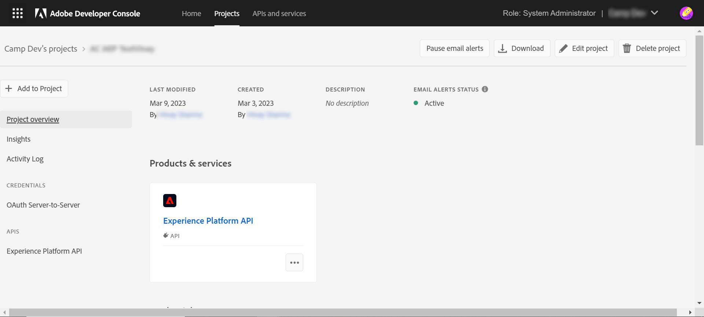
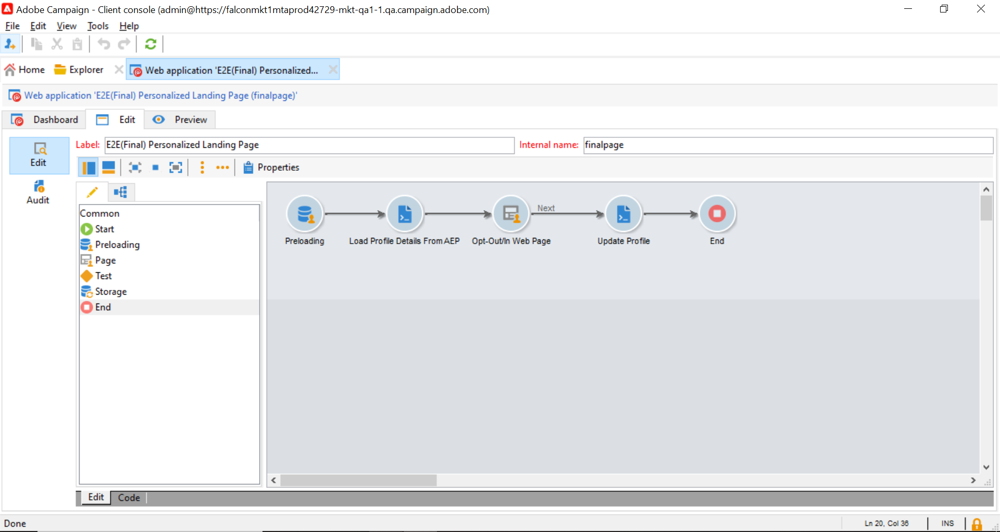

# Actualización de perfiles de Adobe Experience Platform desde páginas de aterrizaje de Adobe Campaign {#ac-aep-lp}

La integración entre Adobe Campaign y Adobe Experience Platform le permite sincronizar fácilmente los datos de perfil entre sus páginas de aterrizaje de Adobe Campaign y Adobe Experience Platform. Con esta integración, puede:

* Recupere atributos de perfil de Adobe Experience Platform para mostrar información actualizada en páginas de aterrizaje de Adobe Campaign.
* Envíe atributos de perfil actualizados a Adobe Experience Platform para actualizar los atributos correspondientes en función de lo que se haya rellenado y enviado en las páginas de aterrizaje.

Los pasos principales para configurar esta integración son los siguientes:

<table>
<tr>
<td><p><a href="#oauth">Configuración de una conexión OAuth</a></p></td>
<td><p><a href="#source">Crear una conexión de origen de API HTTP</a></p></td>
<td><p><a href="#xtk">Añadir opciones de autenticación en Campaign</a></p></td>
<td><p><a href="#javascript">Adición de códigos JavaScript en Campaign</a></p></td>
<td><p><a href="#script">Configuración del flujo de trabajo de página de aterrizaje</a></p></td>
</table>

## Configuración de una conexión de Oauth {#oauth}

Las API de Adobe Cloud Platform utilizan el protocolo OAuth 2.0 para la autenticación y autorización. Para conectar Adobe Experience Platform a Adobe Campaign mediante llamadas a la API, debe generar un token de acceso mediante la integración de OAuth creada en la consola de Adobe Developer.

Para ello, siga estos pasos:

1. Acceda a la consola de Adobe Developer.
1. Cree una nueva conexión API con el producto API de Adobe Experience Platform. Encontrará los pasos detallados para obtener un token de acceso OAuth 2.0 en la [Documentación de la consola Adobe Developer](https://developer.adobe.com/developer-console/docs/guides/authentication/Tools/OAuthPlayground/).
1. Una vez creada la conexión, vaya a **[!UICONTROL OAuth Server-to-Server]** y copie los detalles siguientes, que son necesarios en Campaign para la autenticación:

   * `CLIENT ID`
   * `CLIENT SECRET`
   * `ID DE ORGANIZACIÓN

   {width="70%"}

Ahora que la conexión de OAuth está configurada, cree y configure un nuevo **[!UICONTROL HTTP API]** Conexión de origen para vincular Adobe Campaign con Adobe Experience Platform.

## Crear una conexión de origen de API HTTP {#source}

Con la conexión OAuth establecida, el siguiente paso es crear una **[!UICONTROL HTTP API]** Conexión de origen en Adobe Experience Platform. Esta conexión le permite transmitir datos a Adobe Experience Platform mediante API. Siga estos pasos:

1. Navegar a Adobe Experience Platform **[!UICONTROL Sources]**, busque la variable **[!UICONTROL HTTP API]** origen y haga clic en **[!UICONTROL Add data]**.

   {width="70%"}

1. Configure la conexión según sus necesidades. Encontrará información detallada sobre cómo configurar una conexión API HTTP en [Documentación de fuentes de Adobe Experience Platform](https://experienceleague.adobe.com/docs/experience-platform/sources/ui-tutorials/create/streaming/http.html).

   En el **[!UICONTROL Authentication]** paso, active la opción **[!UICONTROL Enable authentication]** opción para autenticarse con el token de acceso generado anteriormente mediante la integración de OAuth.

   {width="70%"}

1. Una vez configurada la conexión de origen, se muestra el extremo de flujo continuo. Este punto de conexión es necesario para introducir datos en Adobe Experience Platform.

   {width="70%"}

   También puede acceder a una muestra del formato de datos introducido en Adobe Experience Platform abriendo el flujo de datos recién creado desde el **[!UICONTROL Dataflows]** pestaña.

   {width="70%"}

Ahora que la conexión de origen de la API HTTP está configurada, debe agregar opciones específicas a Adobe Campaign para habilitar la conexión a Adobe Experience Platform.

## Agregar opciones de autenticación en Adobe Campaign {#xtk}

Una vez configurada la conexión de origen de la API HTTP, debe agregar opciones específicas a Adobe Campaign para habilitar la conexión con Adobe Experience Platform. Esto se puede hacer en el menú Campaign Administration o al ejecutar el flujo de trabajo de la página de aterrizaje añadiendo una variable específica **[!UICONTROL JavaScript code]** actividad.

Examine las pestañas siguientes para descubrir los dos métodos:

>[!BEGINTABS]

>[!TAB Agregar opciones desde el menú Administración]

1. Vaya a **[!UICONTROL Administration]** > **[!UICONTROL Platform]** > **[!UICONTROL Options]**  menú.
1. Añada las siguientes opciones con los valores correspondientes de la consola de Adobe Developer:

   * IMS_CLIENT_ID = cryptString(ID DE CLIENTE)
   * IMS_CLIENT_SECRET = cryptString(CLIENT SECRET)
   * IMS_ORG_ID = ID DE ORGANIZACIÓN
   * IMS_CLIENT_API_KEY = cryptString(ID DE CLIENTE)

   {width="70%"}

   >[!NOTE]
   >
   >La función cryptString() se utiliza para cifrar los datos de autenticación.

>[!TAB Añadir opciones mediante una actividad de código JavaScript]

Para configurar estas opciones automáticamente al ejecutar el flujo de trabajo de las páginas de aterrizaje, agregue una **[!UICONTROL JavaScript code]** a su flujo de trabajo con el código siguiente. [Obtenga información sobre cómo configurar una actividad de código JavaScript](https://experienceleague.adobe.com/docs/campaign/automation/workflows/wf-activities/action-activities/sql-code-and-JavaScript-code.html#JavaScript-code).

En la ejecución del flujo de trabajo, las opciones se crean automáticamente en la consola de Campaign con los valores proporcionados.

    &quot;javascript
    loadLibrary(&quot;xtk:shared/nl.js&quot;);
    loadLibrary(&quot;xtk:shared/xtk.js&quot;);
    loadLibrary(&quot;xtk:shared/json2.js&quot;);
    loadLibrary(&quot;xtk:common.js&quot;);
    
    function setAuthCredentials()
    {
    setOption(&quot;IMS_CLIENT_ID&quot;, cryptString(&#39;CLIENT ID&#39;));
    setOption(&quot;IMS_CLIENT_SECRET&quot;, cryptString(&#39;CLIENT SECRET&#39;));
    setOption(&quot;IMS_ORG_ID&quot;, cryptString(&#39;ORGANIZATION ID&#39;));
    setOption(&quot;IMS_CLIENT_API_KEY&quot;, cryptString(&#39;CLIENT ID&#39;));
    }
    &quot;

>[!ENDTABS]

Ahora que las opciones de autenticación están configuradas en Campaign, debe crear códigos JavaScript personalizados para permitir la sincronización de datos entre Campaign y Adobe Experience Platform desde la página de aterrizaje.

## Añadir opciones en la ejecución del flujo de trabajo {#javacript}

Para permitir la sincronización de datos entre páginas de aterrizaje y Adobe Experience Platform, se deben agregar códigos JavaScript personalizados a Adobe Campaign. Siga estos pasos:

1. Vaya a **[!UICONTROL Administration]** > **[!UICONTROL Configuration]** > **[!UICONTROL JavaScript codes]** menú.
1. Cree nuevos códigos JavaScript y copie y pegue los siguientes fragmentos de código.

   >[!NOTE]
   >
   >El token de acceso y los datos de autenticación se recuperan automáticamente de las opciones configuradas anteriormente.

   {width="70%"}

+++  Script 1: Carga de atributos de perfil del Experience Platform

   Este código comprueba si el perfil existe en Adobe Experience Platform antes de cargar la página de aterrizaje. Recupera los atributos de perfil y los muestra en los campos correspondientes de la página de aterrizaje.

   ```javascript
   // API implementation to read profile from AEP
   function getProfileInfo(email)
   {
   var accessToken = getAccessToken();
   var request = new HttpClientRequest(('https://platform-stage.adobe.io/data/core/ups/access/entities?schema.name=_xdm.context.profile&entityId=' + email + '&entityIdNS=email&fields=identities,consents.marketing'));
   request.method = 'GET';
   request.header["Content-Type"] = "application/json";
   request.header["sandbox-name"] = "prod";
   request.header["x-gw-ims-org-id"] = getOption('IMS_ORG_ID');
   request.header["x-api-key"] = getOption('IMS_CLIENT_API_KEY');
   request.header["Authorization"] = "Bearer " + accessToken;
   request.execute();
   return request.response;
   }
   ```

+++

+++ Script 2: Actualización de atributos de perfil del Experience Platform

   Este código actualiza los atributos de perfil en Adobe Experience Platform con los valores enviados en la página de aterrizaje.

   ```javascript
   // API implementation to update profile in AEP
   loadLibrary("xtk:shared/nl.js");
   loadLibrary("xtk:shared/xtk.js");
   loadLibrary("xtk:shared/json2.js");
   loadLibrary("xtk:common.js");
   
   function updateProfileInAEP(profileUpdatePayload)
   {
   var accessToken = getAccessToken();
   var request = new HttpClientRequest('https://dcs-stg.adobedc.net/collection/64a300b84d61c0bcea4f0cd4ecaaa224a19477026d14f7e08b5408ffaf5e6162?syncValidation=false');
   request.method = 'POST';
   request.header["Content-Type"] = "application/json";
   request.header["sandbox-name"] = "prod";
   request.header["Authorization"] = "Bearer " + accessToken;
   var body = '{"header":{"schemaRef":{"id":"https://ns.adobe.com/campdev/schemas/35d8e567772e1a1093ed6cf9e41d2c1fec22eeb3a89583e1","contentType":"application/vnd.adobe.xed-full+json;version=1.0"},"imsOrgId":"A1F66F0D5C47D1950A494133@AdobeOrg","datasetId":"63c7fa2a20cce11b98cccb41","source":{"name":"testHTTPSourcesVinay - 03/06/2023 5:43 PM"}},"body":{"xdmMeta":{"schemaRef":{"id":"https://ns.adobe.com/campdev/schemas/35d8e567772e1a1093ed6cf9e41d2c1fec22eeb3a89583e1","contentType":"application/vnd.adobe.xed-full+json;version=1.0"}},"xdmEntity":' + profileUpdatePayload +'}}';
   request.body = body;
   request.execute();
   return request.response;
   }
   
   
   // Get Access token from OAuth-Server-to-server API call
   function getAccessToken() {
   var clientId = decryptString(getOption('IMS_CLIENT_ID'));
   var clientSecret = decryptString(getOption('IMS_CLIENT_SECRET'));
   var request = new HttpClientRequest(('https://ims-na1-stg1.adobelogin.com/ims/token/v2?grant_type=client_credentials' + '&client_id=' + clientId + '&client_secret=' + clientSecret + '&scope=openid,session,AdobeID,read_organizations,additional_info.projectedProductContext'));
   request.method = 'POST';
   request.execute();
   var response = request.response;
   if(response.code != 200){
   logError('GetAccessToken failed,', response.code, response.body);
   return;
   }
   var body = ''+response.body;
   var parsedResponse = JSON.parse(body);
   var accessToken = parsedResponse.access_token;
   logInfo("Access token generated successfully");
   return accessToken;
   }
   ```

+++

Ahora que los códigos JavaScript personalizados se crean en Adobe Campaign, puede configurar el flujo de trabajo que contiene la página de aterrizaje para utilizar estos códigos JavaScript para la sincronización de datos.

## Configuración del flujo de trabajo de página de aterrizaje {#script}

Con los códigos JavaScript añadidos a Adobe Campaign, puede aprovecharlos en el flujo de trabajo de la página de aterrizaje mediante **[!UICONTROL JavaScript code]** actividades:

* Para cargar datos del Experience Platform antes de cargar la página de aterrizaje, agregue una **[!UICONTROL JavaScript code]** actividad antes de la actividad de página de aterrizaje y copiar y pegar el script 1.

+++ Script 1: Carga de atributos de perfil del Experience Platform

  ```javascript
  // Script code to read profile from AEP.
  
  logInfo("Loading profile from AEP");
  loadLibrary("cus:aepAPI");
  var recipient=ctx.recipient;
  var email = recipient.@email;
  var response = getProfileInfo(email);
  ctx.isAEPProfileExists = 1;
  
  if(response.code == 404){
  ctx.isAEPProfileExists = 0
  logInfo("Profile with email" + email + " not found in AEP, ignoring the update activity");
  }
  else if(response.code == 200){
  var body = ''+response.body;
  var parsedResponse = JSON.parse(body);
  for (var key in parsedResponse) {
      var value =  parsedResponse[key];
      var marketing = value.entity.consents.marketing;
      logInfo("User Consent Details : " + JSON.stringify(marketing));   
      if(marketing.hasOwnProperty('email')&&marketing.email.hasOwnProperty('val')&&marketing.email.val=='n'){
      ctx.recipient.@blackListEmail = 1;
      }
      if(marketing.hasOwnProperty('sms')&&marketing.sms.hasOwnProperty('val')&&marketing.sms.val=='n'){
      ctx.recipient.@blackListMobile = 1;
      }
      if(marketing.hasOwnProperty('push')&&marketing.push.hasOwnProperty('val')&&marketing.push.val=='n'){
      ctx.recipient.@blackListPostalMail = 1;
      }
  } 
  }
  ```

+++

* Para actualizar los atributos de perfil del Experience Platform con los datos enviados en la página de aterrizaje, agregue una **[!UICONTROL JavaScript code]** actividad posterior a la actividad de página de aterrizaje y copiar y pegar el script 2.

+++ Script 2: Actualización de atributos de perfil del Experience Platform

  ```javascript
  // Script code to update profile in AEP and ACC.
  
  logInfo("Executing script to update AEP profile.");
  
  // Loading aepAPI library JS code
  loadLibrary("cus:aepAPI");
  
  var recipient=ctx.recipient
  
  // Update profile only if it exists in AEP
  if(ctx.isAEPProfileExists==1){
  
  var email = recipient.@email
  logInfo(email);
  logInfo(recipient.@blackListEmail);
  logInfo(recipient.@blackListMobile);
  logInfo(recipient.@blackListPostalMail);
  
  var optOutPayload = new Array();
  
  if(recipient.@blackListEmail==1){
      optOutPayload.push('"email":{"val":"n"}');
  }
  else
      optOutPayload.push('"email":{"val":"y"}');
  
  if(recipient.@blackListMobile==1){
      optOutPayload.push('"sms":{"val":"n"}');
  }
  else
      optOutPayload.push('"sms":{"val":"y"}');
  
  if(recipient.@blackListPostalMail==1){
      optOutPayload.push('"push":{"val":"n"}');
  }
  else
      optOutPayload.push('"push":{"val":"y"}');
  
  var profileUpdatePayload = '{'+ '"personalEmail":{"address":' + '\"' + email + '\"' + '},' +'"consents":{"marketing":{' + optOutPayload.toString() + '}}}';
  
  var response = updateProfileInAEP(profileUpdatePayload);
  if(response.code == 200){
  var body = '' + response.body;
  logInfo("AEP Profile Updated successfully, Response " + body);
  // Update ACC profile 
  recipient.@xtkschema = "nms:recipient";
  recipient.@_operation = "update";
  recipient.@_key="@id";
  xtk.session.Write(recipient);
  logInfo("ACC Profile Updated successfully");
  }
  else{
      logError('Server Error: ', response.code, response.body);
  } 
  }
  else {
  logInfo("Ignoring AEP profile update as profile doesn't exists.");
  
  // Update ACC profile   
  recipient.@xtkschema = "nms:recipient";
  recipient.@_operation = "update";
  recipient.@_key="@id";  
  xtk.session.Write(recipient);
  logInfo("ACC Profile Updated successfully");
  }
  ```

+++

>[!CAUTION]
>
>Asegúrese de personalizar la carga útil en cada script según sus necesidades específicas.
>
>Si no agrega ningún script antes de la actividad de la página de aterrizaje, no se realizará ninguna comprobación de la existencia del perfil en Adobe Experience Platform. Cuando se envía la página de aterrizaje y el perfil no existe, se crea en Adobe Experience Platform con los atributos de la página de aterrizaje.

Este es un ejemplo de flujo de trabajo con las actividades de código JavaScript antes y después de una página de aterrizaje:

{width="70%"}

A continuación, se muestra un ejemplo de una página de aterrizaje y una actividad de código JavaScript configurada para actualizar atributos de perfil en Adobe Experience Platform:

{width="70%"}

{width="70%" zoomable="yes"}

### Más información

* [Configuración de una actividad de código JavaScript](../../automation/workflow/sql-code-and-javascript-code.md#javascript-code)
* [Creación de una página de aterrizaje](https://experienceleague.adobe.com/docs/campaign-classic/using/designing-content/editing-html-content/creating-a-landing-page.html)
* [Administración de suscripciones y bajas](../start/subscriptions.md)
