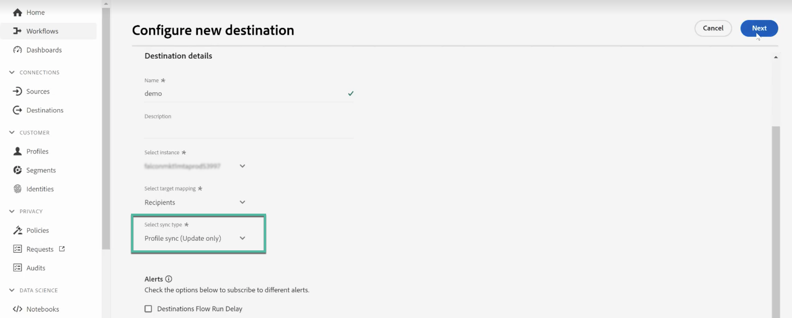

# Uso compartido y sincronización de audiencias con Adobe Experience Platform {#gs-ac-aep}

Los conectores Adobe Campaign Managed Cloud Service Destination y Source permiten una integración perfecta entre Adobe Campaign y Adobe Experience Platform. Con esta integración, puede:

* Envíe audiencias de Adobe Experience Platform a Adobe Campaign y envíe los &quot;logs&quot; de entrega y seguimiento a Adobe Experience Platform con fines de análisis.
* Incluya atributos de perfil de Adobe Experience Platform en Adobe Campaign y establezca un proceso de sincronización para que se puedan actualizar de forma regular.

## Envío de audiencias de Adobe Experience Platform a Campaign {#audiences}

Los pasos principales para enviar audiencias de Adobe Experience Platform a Adobe Campaign y devolver los registros de envío y seguimiento son los siguientes:

* Use una conexión de destino de Adobe Campaign Managed Cloud Services **Destination** para enviar segmentos de Experience Platform a Adobe Campaign:

  1. Acceda al catálogo Destinos de Adobe Experience Platform y cree una nueva conexión **[!UICONTROL Adobe Campaign Managed Cloud Services]**.
  1. Proporcione detalles sobre la instancia de Campaign que se utilizará y elija **[!UICONTROL Audience sync]** como tipo de sincronización.

     {width="800" align="center"}

  1. Seleccione los segmentos que desea enviar a Adobe Campaign.
  1. Configure los atributos que desee exportar en la audiencia.
  1. Una vez configurado el flujo, las audiencias seleccionadas estarán disponibles para su activación en Adobe Campaign.

     {width="800" align="center"}

  Encontrará información detallada sobre cómo configurar el destino en [Documentación de conexión de Adobe Campaign Managed Cloud Services](https://www.adobe.com/go/destinations-adobe-campaign-managed-cloud-services-en){target="_blank"}

* Use una conexión de Adobe Campaign Managed Cloud Services **Source** para enviar los registros de envío y seguimiento de Adobe Campaign a Adobe Experience Platform:

  Para ello, configure una nueva conexión de Adobe Campaign Managed Cloud Services **Source** para introducir eventos de Campaign en Adobe Experience Platform. Proporcione detalles sobre la instancia de Campaign y el esquema que desea utilizar, seleccione un conjunto de datos donde se deben introducir los datos y, a continuación, configure los campos que desea recuperar. [Aprenda a crear una conexión de origen de Adobe Campaign Managed Cloud Services](https://www.adobe.com/go/sources-campaign-ui-en)

  {width="800" align="center"}

## Sincronización de atributos de perfil entre Adobe Experience Platform y Adobe Campaign {#profile}

Al conectar Adobe Campaign con Adobe Experience Platform, puede introducir atributos de perfil adicionales que estén vinculados a un perfil en Adobe Experience Platform y que tengan un proceso de sincronización configurado para que se actualicen en la base de datos de Adobe Campaign.

Por ejemplo, supongamos que captura los valores de inclusión y exclusión en Adobe Experience Platform. Con esta conexión, puede trasladar estos valores a Adobe Campaign y establecer un proceso de sincronización para que se actualicen de forma regular.

>[!NOTE]
>
>La sincronización de atributos de perfil está disponible para perfiles que ya están presentes en la base de datos de Adobe Campaign.

Los pasos principales para sincronizar atributos de perfil de Adobe Experience Platform con Adobe Campaign son los siguientes:

1. Acceda al catálogo Destinos de Adobe Experience Platform y cree una nueva conexión **[!UICONTROL Adobe Campaign Managed Cloud Services]**.
1. Proporcione detalles sobre la instancia de Campaign que se utilizará y elija **[!UICONTROL Profile sync (Update only)]** como tipo de sincronización.

   {width="800" align="center"}

1. Seleccione los segmentos dirigidos a los perfiles que desea actualizar en la base de datos de Adobe Campaign.
1. Configure los atributos de perfil que desee actualizar en Adobe Campaign.
1. Una vez configurado el flujo, los atributos de perfil seleccionados se sincronizan con Adobe Campaign y se actualizan para todos los perfiles segmentados por los segmentos configurados en el destino.

Encontrará información detallada sobre cómo configurar el destino en [Documentación de conexión de Adobe Campaign Managed Cloud Services](https://www.adobe.com/go/destinations-adobe-campaign-managed-cloud-services-en){target="_blank"}