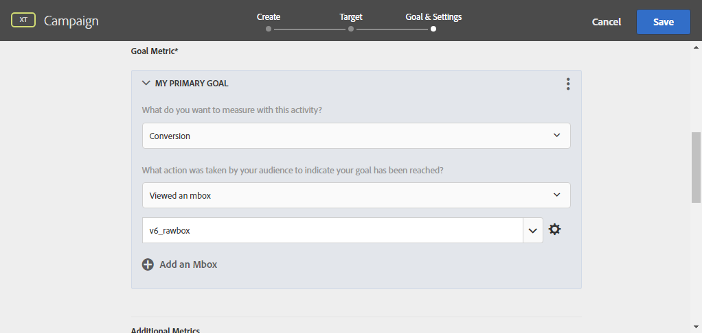

# Uso de Campaign y Adobe Target

Conecte Campaign y Target para incluir una oferta de Adobe Target en una entrega de correo electrónico de Adobe Campaign.

Esta integración le ayuda a implementar casos de uso de la siguiente manera: cuando un destinatario abre un correo electrónico enviado a través de Adobe Campaign, una llamada a Adobe Target le permite mostrar una versión dinámica del contenido. Esta versión dinámica se calcula según las reglas especificadas previamente al crear el correo electrónico.

>[!NOTE]
>La integración solo admite imágenes estáticas. Los otros tipos de contenido no se pueden personalizar.

  Como usuario de Managed Cloud Service, [Adobe de contacto](../start/campaign-faq.md#support) para implementar déclencheur de Experience Cloud con Campaign.

Adobe Target puede utilizar los siguientes tipos de datos:

* Datos de la base de datos de Adobe Campaign
* Segmentos vinculados al ID de visitante en Adobe Target, solo si los datos utilizados no están sujetos a limitaciones legales
* Datos de Adobe Target: agente de usuario, dirección IP, datos de geolocalización

## Inserción de contenido dinámico

En el siguiente ejemplo, aprenderá a integrar **una oferta dinámica** de Adobe Target a un correo electrónico de Adobe Campaign.

Se busca crear un mensaje con una imagen que cambie de forma dinámica según el país del destinatario. Los datos se envían con cada solicitud mbox y dependen de la dirección IP del visitante.

En este correo electrónico, queremos que una de las imágenes cambie de manera dinámica según las siguientes experiencias de los usuarios:

* El correo electrónico se abre en Francia.
* El correo electrónico se abre en Estados Unidos.
* Si no se aplica ninguna de estas condiciones, se muestra una imagen predeterminada.

Se deben lograr los siguientes pasos en Adobe Campaign y Adobe Target:

1. [Inserción de la oferta dinámica en un correo electrónico](#inserting-dynamic-offer)
1. [Creación de ofertas de redireccionamiento](#create-redirect-offers)
1. [Creación de audiencias](#audiences-target)
1. [Creación de una actividad de segmentación de experiencias ](#creating-targeting-activity)
1. [Previsualización y envío del mensaje](#preview-send-email)

### Inserción de la oferta dinámica en un correo electrónico {#inserting-dynamic-offer}

En Adobe Campaign, defina el destinatario y el contenido del correo electrónico. Puede insertar una imagen dinámica desde Adobe Target.

Para ello, especifique la URL de la imagen predeterminada, el nombre de la ubicación y los campos que desee transferir a Adobe Target.

En Adobe Campaign, hay dos formas de insertar una imagen dinámica desde Target en un mensaje de correo electrónico:

* Si utiliza el editor de contenido digital, elija una imagen existente y seleccione **[!UICONTROL Insert]** > **[!UICONTROL Dynamic image served by Adobe Target]** en la barra de herramientas.

  

* Si está utilizando el editor estándar, coloque el cursor donde desee insertar la imagen y, en el menú desplegable de personalización, seleccione **[!UICONTROL Include]** > **[!UICONTROL Dynamic image served by Adobe Target...]**.

  

A continuación, puede definir los parámetros de imagen:

* El **[!UICONTROL Default image]** La dirección URL de es la imagen que se muestra cuando no se cumpla ninguna de las condiciones. También puede seleccionar una imagen de su biblioteca de activos.
* El **[!UICONTROL Target location]** es el nombre de la ubicación de su oferta dinámica. Debe seleccionar esta ubicación en la actividad de Adobe Target.
* El **[!UICONTROL Landing Page]** permite redirigir la imagen predeterminada a una página de aterrizaje predeterminada. Esta URL solo se aplica cuando la imagen predeterminada se muestra en el correo electrónico final. Es opcional.
* El **[!UICONTROL Additional decision parameters]**  define la asignación entre los campos definidos en los segmentos Adobe Target y los campos Adobe Campaign. Los campos de Adobe Campaign utilizados deben haberse especificado en el “rawbox”. En el ejemplo, añadimos el campo País.

Si utiliza permisos de empresa en la configuración de Adobe Target, añada la propiedad correspondiente en este campo. Obtenga más información sobre los permisos de empresa de Target en [esta página](https://experienceleague.adobe.com/docs/target/using/administer/manage-users/enterprise/properties-overview.html#administer).

### Creación de ofertas de redireccionamiento {#create-redirect-offers}

En Adobe Target, puede crear diferentes versiones de la oferta. Según cada experiencia de usuario, se puede crear una oferta de redireccionamiento y puede especificar la imagen que desee mostrar.

En este caso, necesitamos dos ofertas de redirección, la tercera (la predeterminada) se define en Adobe Campaign.

1. Para crear una nueva oferta de redirección en Target Standard, en la pestaña **[!UICONTROL Content]**, haga clic en **[!UICONTROL Code offers]**.

1. Haga clic en **[!UICONTROL Create]**, luego en **[!UICONTROL Redirect Offer]**.

   

1. Introduzca un nombre para la oferta y la URL de su imagen.

   

1. Siga el mismo procedimiento para la oferta de redirección restante. Para obtener más información, consulte [esta página](https://experienceleague.adobe.com/docs/target/using/experiences/offers/offer-redirect.html#experiences).

### Creación de audiencias {#audiences-target}

En Adobe Target, debe crear las dos audiencias en las que se clasifican las personas que visitan la oferta para enviarles los diferentes contenidos. Para cada audiencia, añada una regla para definir quién puede ver la oferta.

1. Para crear una nueva audiencia en Target, en la pestaña **[!UICONTROL Audiences]**, haga clic en **[!UICONTROL Create Audience]**.

   

1. Añada un nombre a su audiencia.

   

1. Haga clic en **[!UICONTROL Add a rule]** y seleccione una categoría. La regla utiliza criterios específicos para dirigirse a los visitantes. Puede restringir las reglas añadiendo condiciones o creando nuevas reglas en otras categorías.

1. Siga el mismo procedimiento para las audiencias restantes.

### Creación de una actividad de segmentación de experiencias  {#creating-targeting-activity}

En Adobe Target, es necesario crear una actividad de segmentación de experiencias, definir las diferentes experiencias y asociarlas a las ofertas correspondientes.

Primero debe definir la audiencia:

1. Para crear una actividad de segmentación de experiencias, en la pestaña **[!UICONTROL Activities]**, haga clic en **[!UICONTROL Create Activity]** y, a continuación, en **[!UICONTROL Experience Targeting]**.

   

1. Seleccione **[!UICONTROL Form]** como **[!UICONTROL Experience Composer]**.

1. Haga clic en el botón **[!UICONTROL Change audience]** para elegir una audiencia.

   

1. Seleccione la audiencia que se creó en los pasos anteriores.

   

1. Para crear otra experiencia, haga clic en **[!UICONTROL Add Experience Targeting]**.

A continuación, añada un contenido para cada audiencia:

1. Seleccione el nombre de la ubicación que eligió al insertar la oferta dinámica en Adobe Campaign.

   

1. Haga clic en el botón desplegable y seleccione **[!UICONTROL Change Redirect Offer]**.

   

1. Seleccione la oferta de redirección que había creado anteriormente.

   

1. Siga el mismo procedimiento para la segunda experiencia.

La ventana de **[!UICONTROL Target]** resume la actividad. Si es necesario, puede añadir otras experiencias.

La ventana de **[!UICONTROL Goal & Settings]** permite personalizar la actividad estableciendo una prioridad, un objetivo o una duración.

La sección **[!UICONTROL Reporting Settings]** permite seleccionar una acción y editar los parámetros que determinan cuándo se logra el objetivo.

## Previsualización y envío del mensaje {#preview-send-email}

En Adobe Campaign, ahora puede previsualizar el correo electrónico y probar su renderizado en distintos destinatarios.

Observe que la imagen cambia según las diferentes experiencias creadas.

Ya está listo para enviar su correo electrónico, incluida una oferta dinámica de Target.

