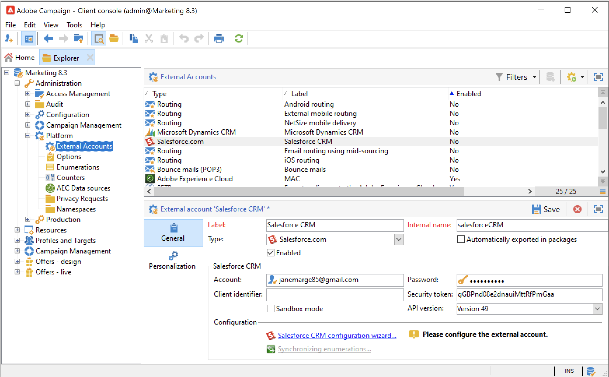

# Trabajo con Campaign y SFDC{#crm-sfdc}

Aprenda a configurar el conector CRM de Campaign para conectar la versión 8 de Campaign a **Salesforce.com**.

Una vez completada la configuración, la sincronización de datos entre sistemas se realiza mediante una actividad de flujo de trabajo dedicada. [Más información](crm-data-sync.md).

>[!NOTE]
>
>Las versiones de SFDC compatibles se detallan en Campaign [Compatibility matrix](../start/compatibility-matrix.md).

Siga los pasos a continuación para configurar una cuenta externa dedicada para importar y exportar datos de Salesforce en Adobe Campaign.

## Creación de la conexión{#new-sfdc-external-account}

En primer lugar, debe crear la cuenta externa de Salesforce.

1. Examine el nodo **[!UICONTROL Administration > Platform > External accounts]** del explorador de Campaign y cree una cuenta externa.
1. Seleccione la cuenta externa **[!UICONTROL Salesforce.com]** en la sección **Tipo**.
1. Introduzca la configuración para habilitar la conexión.

   

   Para configurar la cuenta externa de Salesforce CRM para que funcione con Adobe Campaign, proporcione los siguientes detalles:

   * Escriba su inicio de sesión de Salesforce en el campo **[!UICONTROL Account]**.
   * Introduzca su contraseña de Salesforce.
   * Puede ignorar el campo **[!UICONTROL Client identifier]**.
   * Copiar/pegar su Salesforce **[!UICONTROL Security token]**
   * Seleccione su **[!UICONTROL API version]**. Las versiones de API de SFDC compatibles se enumeran en Campaign [Compatibility matrix](../start/compatibility-matrix.md).

1. Seleccione la opción **Enable** para activar la cuenta en Campaign.

>[!NOTE]
>
>Para aprobar la instalación, debe cerrar la sesión y volver a iniciarla en la consola del cliente de Adobe Campaign.

## Seleccionar tablas para sincronizar{#sfdc-create-tables}

Ahora puede configurar tablas para sincronizar.

1. Haga clic en **[!UICONTROL Salesforce CRM configuration wizard...]**.
1. Seleccione las tablas para sincronizar e iniciar el proceso.
1. Compruebe el esquema generado en Adobe Campaign en el nodo **[!UICONTROL Administration > Configuration > Data schemas]**.

   Ejemplo de esquema **Salesforce** importado en Campaign:

   

## Sincronice las enumeraciones{#sfdc-enum-sync}

Una vez creado el esquema, puede sincronizar las enumeraciones automáticamente con Adobe Campaign a través de Salesforce.

1. Abra el asistente desde el vínculo **[!UICONTROL Synchronizing enumerations...]**.
1. Seleccione la enumeración Adobe Campaign que coincida con la enumeración Salesforce.
Puede reemplazar todos los valores de una enumeración de Adobe Campaign con los del CRM: para hacerlo, seleccione **[!UICONTROL Yes]** en la columna **[!UICONTROL Replace]**.

   

1. Haga clic en **[!UICONTROL Next]** y luego en **[!UICONTROL Start]** para comenzar a importar las enumeraciones.

1. Examine el nodo **[!UICONTROL Administration > Platform > Enumerations]** para comprobar los valores importados. Obtenga más información acerca de las enumeraciones en [esta página](../config/ui-settings.md#enumerations).

Adobe Campaign y Salesforce.com ya están conectados. Puede configurar la sincronización de datos entre los dos sistemas.

Para sincronizar datos entre los datos de Adobe Campaign y SFDC, cree un flujo de trabajo y use la actividad **[!UICONTROL CRM connector]**.

Obtenga más información acerca de la sincronización de datos [en esta página](crm-data-sync.md).

Obtenga más información acerca de la administración de la enumeración en Campaign [en esta página](../config/enumerations.md).
