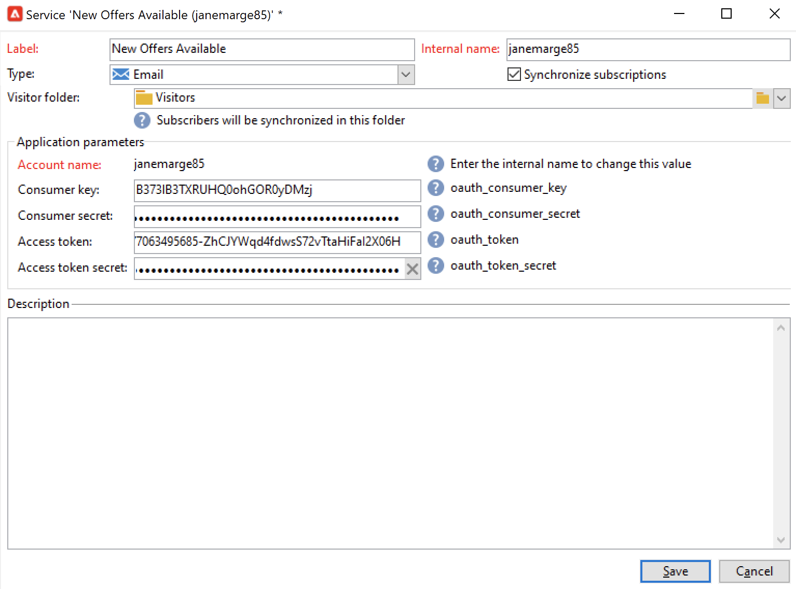

# Trabajo con Campaign y Twitter{#tw-ac-ovv}

La variable **Administración de redes sociales (Marketing social)** le permite interactuar con sus clientes a través de Twitter. Utilice esta capacidad para:

* Publicar mensajes y enviar DM: usar Adobe Campaign Social Marketing para publicar mensajes en Twitter. También puede enviar mensajes directos a todos sus seguidores. 

* Recopilar nuevos contactos : Adobe Campaign Social Marketing también facilita la adquisición de nuevos contactos: póngase en contacto con los usuarios y pídale que compartan su información de perfil. Si lo aceptan, Adobe Campaign recupera automáticamente los datos, lo que le permite llevar a cabo campañas de objetivo y, cuando sea posible, implementar estrategias multicanal.

 Como usuario de Cloud Services administrados, [Adobe de contacto](../start/campaign-faq.md#support) para conectar Campaign con Twitter. La variable  **Administración de redes sociales (Marketing social)** el complemento debe estar instalado en su entorno, a través del paquete dedicado, y la cuenta externa de Twitter debe estar configurada.

Para configurar Adobe Campaign para que publique tweets en sus cuentas de Twitter, delegue el acceso de escritura a Adobe Campaign para estas cuentas. Para ello, debe:

1. Cree una cuenta de Twitter y regístrese para obtener una cuenta de desarrollador. [Más información](#dev-account)
1. (opcional) Cree una cuenta de Twitter de prueba para enviar pruebas. [Más información](#tw-test-account)
1. Cree una aplicación de Twitter (una aplicación por cuenta de Twitter). [Más información](#create-an-app-on-twitter)
1. Crear un nuevo servicio para **[!UICONTROL Twitter]** (un servicio por cuenta de Twitter). [Más información](#create-tw-service)
1. Sincronice su cuenta de Twitter con Campaign. [Más información](#synchro-tw-accounts)

## Cuenta de desarrollador de twitter {#dev-account}

Para comenzar con esta integración, debe registrarse para [Cuenta de desarrollador de twitter](https://developer.twitter.com){target="_blank"}.

Campaign utiliza la versión 1.1 de la API de Twitter. Para utilizarlo, debe solicitar el acceso Elevated a través del Portal para desarrolladores. Obtenga más información sobre Twitter Elevated Access [en esta página](https://developer.twitter.com/en/portal/products/elevated){target="_blank"}.

## Creación de una aplicación en Twitter {#create-an-app-on-twitter}

Una vez aprobado con acceso Elevado, cree una aplicación de Twitter para permitir que Adobe Campaign publique tweets en su cuenta de Twitter. Para realizar esto, siga los pasos a continuación:

1. Inicie sesión en su cuenta de Twitter.
1. Conectar a [Portal para desarrolladores de twitter](https://developer.twitter.com/en/apps).
1. Select **Crear una aplicación**.
1. Permita que el asistente de Twitter le guíe a través del proceso.
1. Para permitir que Adobe Campaign publique tweets en su cuenta, edite al **Permisos de la aplicación** en la sección Configuración de autenticación de usuario de la aplicación. Select **Leer, escribir y dirigir mensajes**.

   

1. En el **Tipo de aplicación** , seleccione **Aplicación web, aplicación automatizada o bot**. Puede dejar el **URL de devolución de llamada** campo vacío y guarde la configuración.

   

1. Vuelva al panel de la aplicación, seleccione la aplicación y vaya a la página **Teclas y tokens** pestaña . En **Token de acceso y secreto**, si la variable **Leer, escribir y dirigir mensajes** no se menciona el permiso, debe volver a generar el token y el secreto de la aplicación. Tenga en cuenta que todas las claves y tokens deben guardarse tras la creación. Los necesitará para configurar el servicio de Twitter de Campaign.

   

>[!NOTE]
>
>Necesita una aplicación por cuenta de Twitter. Como consecuencia, debe crear otra aplicación de prueba para enviar pruebas a la cuenta de prueba.

## Creación de un servicio de Twitter en Campaign {#create-tw-service}

Para vincular la instancia de Campaign a la cuenta de Twitter, cree una **Twitter** y acceso de escritura delegado a Campaign.

>[!CAUTION]
>
>Crear una **Twitter** por cuenta de Twitter. Como consecuencia, debe crear otro servicio de prueba para enviar pruebas a su [cuenta de prueba](#tw-test-account).
>
>Cada **Twitter** también debe crearlo Adobe en su instancia de MID. Póngase en contacto con el representante de Adobes para configurar su entorno.

Para introducir la configuración, debe acceder a la consola de Adobe Campaign y a los permisos de la aplicación de Twitter.

1. En **Adobe Campaign**, vaya a la **[!UICONTROL Profiles and targets]** y seleccione **[!UICONTROL Services and Subscriptions]** vínculo
1. Cree un nuevo servicio.
1. Seleccione el tipo **[!UICONTROL Twitter]**.
1. Introduzca la etiqueta y el nombre interno del servicio.

   >[!CAUTION]
   >
   >La variable **[!UICONTROL Internal name]** del servicio debe ser el mismo nombre de su cuenta de Twitter.

1. De forma predeterminada, los seguidores se guardan en la carpeta **[!UICONTROL Visitors]**. Puede seleccionar otra ubicación desde la **[!UICONTROL Visitor folder]** campo . [Más información](../send/twitter.md#direct-tw-messages)

   

   >[!NOTE]
   >
   >La variable **[!UICONTROL Synchronize subscriptions]** está activada de forma predeterminada: esta opción recupera automáticamente la lista de sus seguidores de Twitter para que pueda [enviarles mensajes directos](../send/twitter.md#direct-tw-messages). La sincronización se realiza mediante una [flujo de trabajo técnico dedicado](#synchro-tw-accounts).

1. Desde la aplicación de Twitter, copie el contenido de la **Clave de API** y **[Secreto de clave de API]** y péguelos en el **[!UICONTROL Consumer key]** y **[!UICONTROL Consumer secret]** campos de la campaña **Twitter** servicio.

1. Desde la aplicación de Twitter, copie el contenido de la **Token de acceso** y **Secreto del token de acceso** y péguelos en el **[!UICONTROL Access token]** y **[!UICONTROL Access token secret]** campos de la campaña **Twitter** servicio.

1. En la consola del cliente de Campaign, haga clic en **[!UICONTROL Save]**. Ahora ha delegado el acceso de escritura a Adobe Campaign.

Para comprobar la configuración, puede:

* Edite el **Twitter** que acaba de crear.
* Examine la **[!UICONTROL Twitter page]** pestaña: se debe mostrar la cuenta de Twitter.
   

## Sincronice su cuenta de Twitter {#synchro-tw-accounts}

La sincronización entre Campaign y Twitter se administra mediante flujos de trabajo técnicos específicos. Estos flujos de trabajo se almacenan en la variable **[!UICONTROL Administration > Production > Technical workflows > Managing social networks]** carpeta.

Se detienen de forma predeterminada: debe iniciarlos manualmente cuando comience a usar la variable **Marketing social** módulo.

La variable **[!UICONTROL Synchronization of Twitter accounts]** el flujo de trabajo técnico sincroniza las cuentas de Twitter en Adobe Campaign. Este flujo de trabajo recupera la lista de seguidores de Twitter para que pueda enviarles mensajes directos. [Más información](../send/twitter.md#direct-tw-messages)

De forma predeterminada, este flujo de trabajo se activa todos los jueves a las 7:30 a. m. Puede usar la variable **[!UICONTROL Execute pending task(s) now]** para iniciar el flujo de trabajo en cualquier momento mientras implementa esta integración.  También puede editar el planificador para cambiar la frecuencia de activación del flujo de trabajo. Obtenga más información en [esta página](../../automation/workflow/scheduler.md).

>[!CAUTION]
>
>Para recuperar la lista de suscriptores de Twitter, la variable **[!UICONTROL Twitter account synchronization]** se debe marcar para el servicio vinculado a la cuenta. [Más información](#create-tw-service)

Los seguidores se almacenan en una tabla específica: la tabla de visitantes. Para mostrar la lista de seguidores de Twitter, vaya a la **[!UICONTROL Profiles and Targets > Visitors]**.

Para cada seguidor, Adobe Campaign almacena la siguiente información:

* **[!UICONTROL Origin]**: Twitter
* **[!UICONTROL External ID]**: identificador de usuario
* **[!UICONTROL Username]**: nombre de cuenta del usuario
* **[!UICONTROL Full name]**: nombre del usuario
* **[!UICONTROL Number of friends]**: número de seguidores
* **[!UICONTROL Checked]**: este campo indica si el usuario tiene una cuenta de Twitter verificada

Una vez completada esta configuración, puede publicar tweets en sus cuentas de Twitter y enviar mensajes directos a sus seguidores. [Más información](../send/twitter.md)

## Creación de una cuenta de prueba en Twitter {#tw-test-account}

Además de la cuenta de Twitter, cree una cuenta privada de Twitter que pueda utilizarse para enviar [pruebas de tweet](../send/twitter.md#send-tw-proofs). Para realizar esto, siga los pasos a continuación:

1. Cree una nueva cuenta de Twitter.
1. Acceso a la cuenta  **Configuración**.
1. Vaya a **Privacidad y seguridad** y **Audiencia y etiquetado** y compruebe el **Protect sus tweets** . Los tuits y demás información de la cuenta solo son visibles para las personas que le siguen.

Configure la aplicación de Twitter y el servicio de Campaign para que funcionen con esta cuenta de prueba, tal como se describe más arriba.
