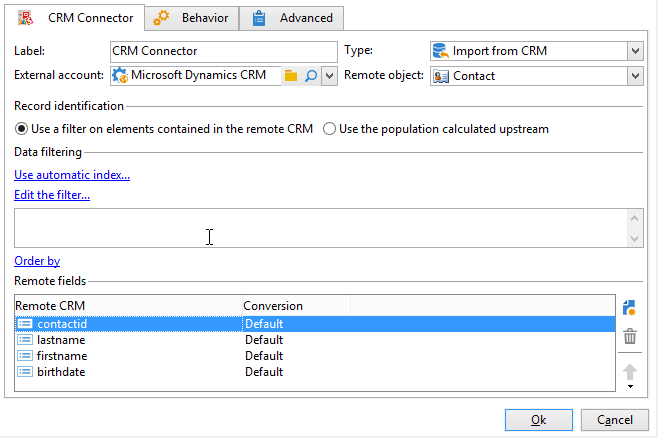
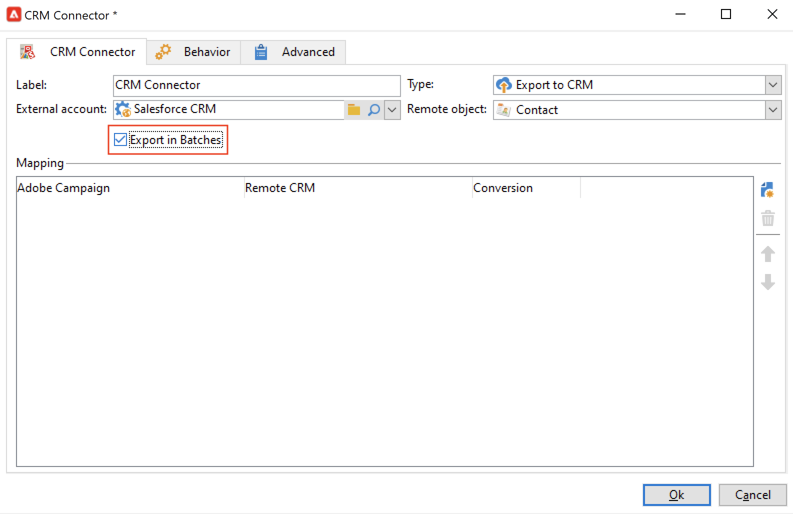

# Sincronizar datos entre Campaign y su CRM {#data-synchronization}

La sincronización de datos entre Adobe Campaign y su CRM se administra mediante la función **Conector CRM** actividad de flujo de trabajo.

Por ejemplo, para importar los datos de Microsoft Dynamics en Adobe Campaign, cree el siguiente tipo de flujo de trabajo:

Este flujo de trabajo importa los contactos a través de Microsoft Dynamics, los sincroniza con los datos de Adobe Campaign existentes, elimina los contactos duplicados y actualiza la base de datos de Adobe Campaign.

Debe configurarse la actividad **[!UICONTROL CRM Connector]** para sincronizar los datos.

Con esta actividad puede:

* Importar desde CRM: [Más información](#importing-from-the-crm)
* Exportar a CRM: [Más información](#exporting-to-the-crm)
* Importar objetos eliminados en CRM: [Más información](#importing-objects-deleted-in-the-crm)
* Eliminar objetos en CRM: [Más información](#deleting-objects-in-the-crm)

Seleccione la cuenta externa que coincida con el CRM con el que desea configurar la sincronización y, a continuación, seleccione el objeto que desea sincronizar: cuentas, oportunidades, posibles clientes, contactos, etc.

La configuración de esta actividad depende del proceso que se realice. A continuación se describen varias configuraciones.

## Importación desde CRM {#importing-from-the-crm}

Para importar datos del CRM a Adobe Campaign, debe crear el siguiente tipo de flujo de trabajo:

1. Seleccione una operación **[!UICONTROL Import from the CRM]**.
1. En el **[!UICONTROL Remote object]** lista desplegable, seleccione el objeto que desea importar. Este objeto coincide con una de las tablas creadas en Adobe Campaign durante la configuración del conector.
1. En el **[!UICONTROL Remote fields]** , introduzca los campos que desea importar.

   Para agregar un campo, haga clic en el botón **[!UICONTROL Add]** en la barra de herramientas y, a continuación, haga clic en el icono **[!UICONTROL Edit expression]**.

   Si es necesario, cambie el formato de los datos mediante la lista desplegable de la variable **[!UICONTROL Conversion]** columnas. Los tipos de conversión posibles se detallan en [esta sección](#data-format).

   >[!CAUTION]
   >
   >El identificador del registro en CRM es obligatorio para enlazar objetos en CRM y en Adobe Campaign. Se añade automáticamente cuando se aprueba el cuadro.
   >
   >La fecha de modificación del servidor CRM también es obligatoria para las importaciones de datos incrementales.

1. Puede filtrar los datos que desea importar según sus necesidades. Para ello, haga clic en el vínculo **[!UICONTROL Edit the filter...]**.

   En el siguiente ejemplo, Adobe Campaign sólo importa contactos para los que se haya registrado alguna actividad desde el 1 de noviembre de 2021.

   

   >[!CAUTION]
   >
   >Las limitaciones relacionadas con los modos de filtrado de datos se detallan en [esta sección](#filtering-data).

1. Seleccione el **[!UICONTROL Use automatic index...]** para administrar automáticamente la sincronización de objetos incrementales entre CRM y Adobe Campaign, en función de la fecha y la última modificación.

   Para obtener más información, consulte [esta sección](#variable-management).

### Administración de variables {#variable-management}

Active la variable **[!UICONTROL Automatic index]** para recopilar solo los objetos modificados desde la última importación.

La fecha de la última sincronización se almacena de forma predeterminada en una opción especificada en la ventana de configuración, por defecto: **LASTIMPORT_&lt;%=instance.internalName%>_&lt;%=activityName%>**.

>[!NOTE]
>
>Esta nota solo se aplica a la actividad genérica **[!UICONTROL CRM Connector]**. Para otras actividades CRM, el proceso es automático.
>
>Esta opción debe crearse manualmente y rellenarse en **[!UICONTROL Administration]** > **[!UICONTROL Platform]** > **[!UICONTROL Options]**. Debe ser una opción de texto y su valor debe coincidir con el siguiente formato: **aaaa/MM/dd hh:mm:ss**.
> 
>Debe actualizar manualmente esta opción para una importación posterior.

Puede especificar el campo remoto CRM que desea tener en cuenta para identificar los cambios más recientes.

De forma predeterminada, se utilizan los campos siguientes (en el orden especificado):

* Para Microsoft Dynamics: **modificado**,
* Para Salesforce.com: **LastModifiedDate**, **SystemModstamp**.

La activación de la opción **[!UICONTROL Automatic index]** genera tres variables que se pueden utilizar en el flujo de trabajo de sincronización a través de una actividad de tipo **[!UICONTROL JavaScript code]**. Estas actividades son:

* **vars.crmOptionName**: nombre de la opción que contiene la última fecha de importación.
* **vars.crmStartImport**: fecha de inicio (incluida) de la última importación de datos.
* **vars.crmEndDate**: fecha de finalización (excluida) de la última importación de datos.

   >[!NOTE]
   >
   >Estas fechas se muestran en el siguiente formato: **yyyy/MM/dd hh:mm:ss**.

### Filtrado de datos {#filtering-data}

Para garantizar una operación eficaz con los distintos CRM, es necesario crear filtros con las siguientes reglas:

* Cada nivel de filtrado solo puede utilizar un tipo de operador.
* No se admite el operador AND NOT.
* Las comparaciones solo pueden tener como resultado valores nulos (“está vacío”/“no está vacío”) o números. Esto significa que el valor (columna derecha) se evalúa y el resultado de esta evaluación debe ser un número. Por lo tanto, no se admiten comparaciones de tipo JOIN.
* El valor contenido en la columna derecha se evalúa en JavaScript.
* No se admiten comparaciones JOIN.
* La expresión de la columna de la izquierda debe ser un campo. No puede ser una combinación de varias expresiones, un número, etc.

### Ordenar por {#order-by}

En Microsoft Dynamics y Salesforce.com, puede ordenar los campos remotos para que se importen en orden de subida o de bajada.

Para ello, haga clic en el vínculo **[!UICONTROL Order by]** y añada las columnas a la lista.

El orden de las columnas de la lista es el orden de clasificación:

### Identificación de registro {#record-identification}

En lugar de importar elementos incluidos (y posiblemente filtrados) en su CRM, puede utilizar una población calculada previamente en el flujo de trabajo.

Para ello, seleccione la opción **[!UICONTROL Use the population calculated upstream]** y especifique el campo que contiene el identificador remoto.

Entonces, seleccione los campos de la población entrante que desea importar, como se muestra a continuación:

## Exportar a CRM {#exporting-to-the-crm}

Exporte datos de Adobe Campaign a su CRM para copiar todo su contenido en la base de datos de CRM.

Para exportar datos a su CRM, cree el siguiente tipo de flujo de trabajo:

1. Seleccione una operación **[!UICONTROL Export to CRM]**.
1. Vaya a la **[!UICONTROL Remote object]** lista desplegable y seleccione el objeto que desea exportar. Este objeto coincide con una de las tablas creadas en Adobe Campaign durante la configuración del conector.

   >[!CAUTION]
   >
   >La función de exportación de la variable **[!UICONTROL CRM Connector]** actividad puede insertar o actualizar campos en su CRM. Para activar las actualizaciones de campo en CRM, especifique la clave principal de la tabla remota. Si falta la clave, se insertan los datos en lugar de actualizarse.

1. Si necesita realizar exportaciones más rápidas, marque la casilla  **[!UICONTROL Export in Batches]** .

   

1. En el **[!UICONTROL Mapping]** , haga clic en **[!UICONTROL New]** para especificar los campos que se exportarán y su asignación en CRM.

   Para agregar un campo, haga clic en el botón **[!UICONTROL Add]** en la barra de herramientas y, a continuación, haga clic en el icono **[!UICONTROL Edit expression]**.

   >[!NOTE]
   >
   >Si no se define ninguna coincidencia para un campo, los valores no se pueden actualizar: se insertan directamente en su CRM.

   Si es necesario, cambie el formato de los datos mediante la lista desplegable de la variable **[!UICONTROL Conversion]** columnas. Los tipos de conversión posibles se detallan en [esta sección](#data-format).

   >[!NOTE]
   >
   >La lista de registros que se van a exportar y el resultado de la exportación se guardan en un archivo temporal que permanece accesible hasta que el flujo de trabajo termina o se reinicia. Esto le permite iniciar el proceso de forma segura en caso de errores.

## Configuraciones adicionales {#additional-configurations}

### Formato de datos {#data-format}

Puede convertir el formato de los datos sobre la marcha al importarlos desde o hacia su CRM.

Para ello, seleccione la conversión que se aplica en la columna correspondiente.

El modo **[!UICONTROL Default]** aplica la conversión automática de datos, que en la mayoría de los casos es igual a una copia o pegado de los datos. Sin embargo, se aplica la administración de zona horaria.

Otras conversiones posibles son:

* **[!UICONTROL Date only]**: elimina los campos de tipo Fecha + Hora.
* **[!UICONTROL Without time offset]**: cancela la administración de zona horaria aplicada en el modo predeterminado.
* **[!UICONTROL Copy/Paste]**: utiliza datos sin procesar como cadenas (sin conversión).

### Error de procesamiento {#error-processing}

Dentro del marco de las importaciones o exportaciones de datos, puede aplicar un proceso específico a errores y rechazos. Para ello, en la pestaña **[!UICONTROL Behavior]** , seleccione la opción **[!UICONTROL Keep the rejections in a file]** y **[!UICONTROL Process errors]**.

Estas opciones agregan las transiciones de salida relacionadas.

A continuación, inserte las actividades relevantes para procesar los datos. Por ejemplo, agregue un **Espera** actividad y programar reintentos de errores.

La transición de salida **[!UICONTROL Reject]** permite acceder al esquema de salida que contiene las columnas específicas de los mensajes de error y los códigos. Para Salesforce.com, esta columna es **errorSymbol** (símbolo de error, distinto del código de error), **errorMessage** (descripción del contexto del error).

## Importación de objetos eliminados en CRM {#importing-objects-deleted-in-the-crm}

Puede importar objetos eliminados en su CRM a Adobe Campaign.

1. Seleccione una operación **[!UICONTROL Import objects deleted in the CRM]**.
1. Ir a la lista desplegable **[!UICONTROL Remote object]** y seleccionar el objeto afectado en el proceso. Este objeto coincide con una de las tablas creadas en Adobe Campaign durante la configuración del conector.
1. Especifique el periodo de eliminación a tener en cuenta en la **[!UICONTROL Start date]** y **[!UICONTROL End date]** campos (las fechas se incluyen).

   >[!CAUTION]
   >
   >El periodo de eliminación debe coincidir con las limitaciones específicas de CRM. Por ejemplo, para Salesforce.com, los elementos eliminados hace más de 30 días no se pueden recuperar.

## Eliminación de objetos en CRM {#deleting-objects-in-the-crm}

Para eliminar objetos en su CRM, especifique la clave principal de los elementos remotos que desea eliminar.

La pestaña **[!UICONTROL Behavior]** permite activar el procesamiento de los rechazos. Esta opción genera una segunda transición de salida para la actividad **[!UICONTROL CRM connector]**. Para obtener más información, consulte [Error de procesamiento](#error-processing).
