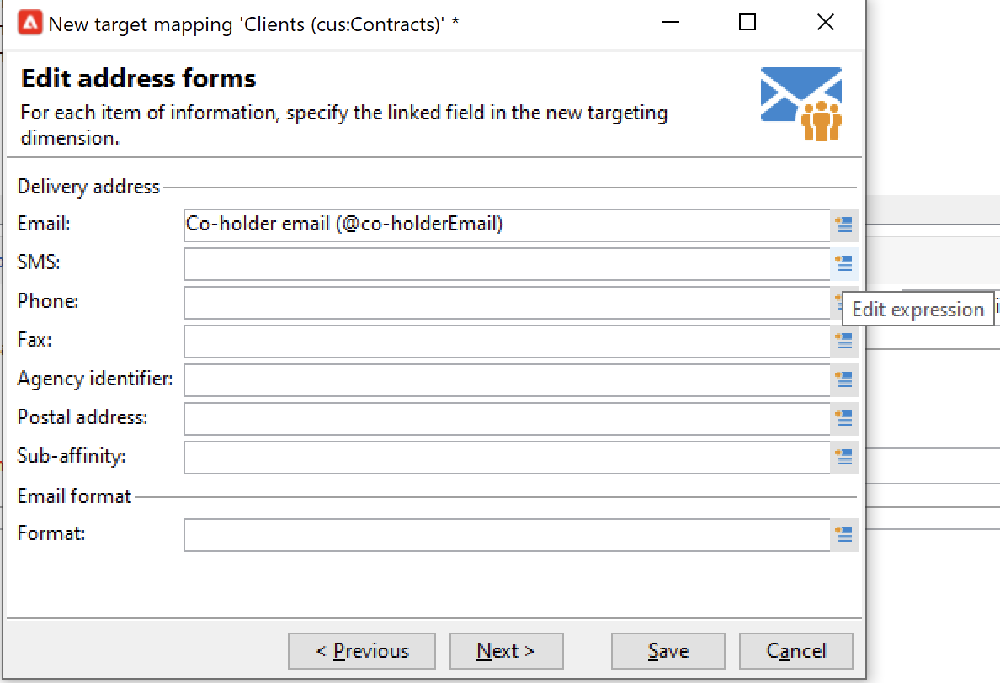

# Acceso de datos federado (FDA){#gs-fda}

Utilice el conector FDA (Acceso de Datos Federados) para conectar Campaign a una o más **bases de datos externas** y procesar la información almacenada en ellas sin afectar a los datos de la base de datos de Campaign Cloud. A continuación, puede acceder a datos externos sin cambiar la estructura de los datos de Adobe Campaign.

>[!NOTE]
>
>Las bases de datos compatibles con FDA se enumeran en la [Matriz de compatibilidad](../start/compatibility-matrix.md).

La opción FDA de campaña le permite ampliar el modelo de datos en una base de datos de terceros. Detecta automáticamente la estructura de las tablas de destino y utiliza datos de los orígenes SQL.

Se requieren **permisos específicos** en [!DNL Adobe Campaign] y en la base de datos externa para interactuar juntos. Obtenga más información en [esta sección](#fda-permissions).

## Prácticas recomendadas y limitaciones

* **Optimización de la personalización de correo electrónico con datos externos**

   Puede preprocesar la personalización de mensajes en un flujo de trabajo dedicado. Para ello, utilice la opción **[!UICONTROL Prepare the personalization data with a workflow]**, disponible en la pestaña **[!UICONTROL Analysis]** de las propiedades de envío.

   Durante el análisis de envío, esta opción crea y ejecuta automáticamente un flujo de trabajo que almacena todos los datos vinculados al objetivo en una tabla temporal, incluidos los datos de tablas vinculadas en una base de datos externa.

   Esta opción mejora significativamente el rendimiento al ejecutar el paso de personalización.

* **Limitaciones de FDA**

   La opción FDA se realiza para manipular los datos en bases de datos externas en modo de lote en los flujos de trabajo. Para evitar problemas de rendimiento, no se recomienda utilizar el módulo FDA en el contexto de operaciones unitarias, como: personalización, interacción, mensajería en tiempo real, etc.

   Evite en la medida de lo posible las operaciones que requieran utilizar tanto Adobe Campaign como la base de datos externa. Para ello, puede hacer lo siguiente:

   * Exporte la base de datos de Adobe Campaign a la base de datos externa y ejecute las operaciones solo desde la base de datos externa antes de volver a importar los resultados en Adobe Campaign.

   * Recopile los datos de la base de datos externa de Adobe Campaign y ejecute las operaciones localmente.

   Si desea personalizar las entregas utilizando datos de la base de datos externa, recopile los datos para utilizarlos en un flujo de trabajo para que estén disponibles en una tabla temporal. A continuación, utilice los datos de la tabla temporal para personalizar su envío.

   La opción FDA está sujeta a las limitaciones del sistema de base de datos externo que utilice.

## Pasos de configuración{#fda-configuration-steps}

Para configurar el acceso a una base de datos externa con FDA, los pasos de configuración son:

1. Como usuario de Adobe Managed Services, póngase en contacto con Adobe para instalar los controladores en la instancia de Campaign.
1. Una vez instalados los controladores, configure la cuenta externa que se corresponda con la base de datos en el servidor de Adobe Campaign y pruebe la cuenta externa. [Más información](#fda-external-account)
1. Crear el esquema de la base de datos externa en Adobe Campaign. Esto permite identificar la estructura de datos de la base de datos externa. [Más información](#create-data-schema)
1. Si es necesario, cree una nueva asignación de destino a partir del esquema creado anteriormente. Esto es necesario si los destinatarios de los envíos proceden de la base de datos externa. Esta implementación incluye limitaciones relacionadas con la personalización de mensajes. [Más información](#define-data-mapping)

## Cuenta externa de la base de datos externa{#fda-external-account}

Debe crear una cuenta externa específica para conectar la instancia de Campaign a la base de datos externa.

Para conseguir esto, siga los pasos a continuación:

1. En Campaña **[!UICONTROL Explorer]**, vaya a **[!UICONTROL Administration]** `>` **[!UICONTROL Platform]** `>` **[!UICONTROL External accounts]**.

1. Haga clic en **[!UICONTROL New]**.

   >[!NOTE]
   >
   > Para estar activa, la opción **[!UICONTROL Enabled]** debe estar activada. Si es necesario, desactive esta opción para deshabilitar el acceso a esta base de datos sin eliminar su configuración.

1. Seleccione **[!UICONTROL External database]** como **[!UICONTROL Type]** de su cuenta externa.

1. Elija la base de datos externa en la lista desplegable y configure la cuenta externa. Debe especificar:

   * **[!UICONTROL Server]**: URL del servidor 

   * **[!UICONTROL Account]**: Nombre del usuario

   * **[!UICONTROL Password]**: Contraseña de la cuenta de usuario

   * **[!UICONTROL Database]**: Nombre de la base de datos

      

1. Haga clic en la pestaña **[!UICONTROL Parameters]** y luego en el botón **[!UICONTROL Deploy functions]** para crear funciones.

1. Una vez introducidos los parámetros, haga clic en el botón **[!UICONTROL Test the connection]** para aprobarlos.

1. Para permitir que Adobe Campaign acceda a esta base de datos, debe implementar las funciones SQL. Hacer clic en la pestaña **[!UICONTROL Parameters]** y luego en el botón **[!UICONTROL Deploy functions]**.

Puede definir espacios de trabajo específicos para las tablas y para el índice en la pestaña **[!UICONTROL Parameters]**.

Para [!DNL Snowflake], el conector admite las siguientes opciones:

| Opción | Descripción |
|---|---|
| esquema de trabajo | Esquema de base de datos que se va a utilizar para tablas de trabajo |
| almacén | Nombre del almacén predeterminado que se va a utilizar. Anula el valor predeterminado del usuario. |
| TimeZoneName | De forma predeterminada, vacío, lo que significa que se utiliza la zona horaria del sistema del servidor de aplicaciones de Campaign Classic. La opción se puede utilizar para forzar el parámetro de sesión TIMEZONE.  [Para obtener más información, consulte esta página](https://docs.snowflake.net/manuals/sql-reference/parameters.html#timezone). |
| WeekStart | Parámetro de sesión WEEK_START. De forma predeterminada, se establece en 0.  [Para obtener más información, consulte esta página](https://docs.snowflake.com/en/sql-reference/parameters.html#week-start). |
| UseCachedResult | Parámetro de sesión USE_CACHED_RESULTS. De forma predeterminada, se establece en TRUE. Esta opción se puede utilizar para deshabilitar los resultados en caché de Snowflake.  Para obtener más información, consulte [esta página](https://docs.snowflake.net/manuals/user-guide/querying-persisted-results.html). |

## Creación del esquema de datos{#create-data-schema}

Para crear el esquema de la base de datos externa en Adobe Campaign, siga los pasos a continuación:

1. Haga clic en el botón **[!UICONTROL New]** sobre la lista de esquemas de datos y elija **[!UICONTROL Access external data]**.

   

1. Introduzca un nombre y una descripción para el esquema y seleccione la cuenta externa que activa la conexión con la base de datos. Esto permite acceder a la lista de tablas disponibles en la base externa. Seleccione la tabla que contiene los datos que se van a recopilar.

   

1. Haga clic en **[!UICONTROL OK]** para confirmar. Adobe Campaign detecta automáticamente la estructura de la tabla seleccionada y genera el esquema lógico. Tenga en cuenta que Adobe Campaign no genera enlaces.

1. Haga clic en **[!UICONTROL Save]** para confirmar la creación.

## Definición de la asignación de destino{#define-data-mapping}

Puede definir una asignación en los datos de una tabla externa.

Para ello, una vez que se haya creado el esquema de la tabla externa, debe crear una nueva asignación de envío para utilizar los datos de esta tabla como objetivo de envío.

Para ello, siga estos pasos:

1. Vaya a **[!UICONTROL Administration]** `>` **[!UICONTROL Campaign Management]** `>` **[!UICONTROL Target mappings]** desde el explorador de Adobe Campaign.

1. Cree una nueva asignación de destino y seleccione el esquema que acaba de crear como dimensión de segmentación.

   

1. Indique los campos donde se almacena la información de envío (apellidos, nombre, correo electrónico, dirección, etc.).

   

1. Especifique los parámetros para el almacenamiento de información, incluido el sufijo de los esquemas de extensión para que se puedan identificar fácilmente.

   

   Puede elegir si desea almacenar las exclusiones (**excludelog**), con mensajes (**broadlog**) o en una tabla independiente.

   También puede elegir si desea administrar el seguimiento para esta asignación de envíos (**trackinglog**).

1. A continuación, seleccione las extensiones que se van a tener en cuenta. El tipo de extensión depende de los parámetros y opciones de la plataforma (consulte el contrato de licencia).

   

   Haga clic en el botón **[!UICONTROL Save]** para iniciar la creación de la asignación de entrega: todas las tablas vinculadas se crean automáticamente en función de los parámetros seleccionados.

## Permisos{#fda-permissions}

Se requieren **permisos específicos** en [!DNL Adobe Campaign] y en la base de datos externa para interactuar juntos.

En primer lugar, para que el usuario pueda realizar operaciones en una base de datos externa a través de FDA, el operador debe tener un derecho específico denominado en [!DNL Adobe Campaign].

1. Seleccione el nodo **[!UICONTROL Administration > Access Management > Named Rights]** en el explorador de Adobe Campaign.
1. Cree un nuevo derecho especificando la etiqueta elegida.
1. Introduzca el nombre del derecho asignado en el siguiente formato **user:base@server**, donde:

   * **** useres el nombre del usuario en la base de datos externa
   * **** bases el nombre de la base de datos externa
   * **** server es el nombre del servidor de base de datos externo

1. Guarde el derecho Nombre y vincúlelo al operador elegido desde el nodo **[!UICONTROL Administration > Access Management > Operators]** del explorador de Adobe Campaign.

A continuación, para procesar los datos contenidos en una base de datos externa, el operador de Adobe Campaign debe tener al menos permisos de escritura en la base de datos para poder crear tablas de trabajo. Adobe Campaign elimina automáticamente estas tablas.

Los siguientes permisos son necesarios:

* **CONNECT**: conexión con la base de datos remota
* **READ Data**: acceso de sólo lectura a tablas que contienen datos de clientes
* **READ &#39;MetaData**: acceso a los catálogos de datos del servidor para obtener la estructura de la tabla
* **LOAD**: carga masiva en tablas de trabajo (requerido cuando se trabaja en colecciones y uniones)
* **CREATE/DROP** para **TABLE/INDEX/PROCEDURE/FUNCTION** (solo para las tablas de trabajo generadas por Adobe Campaign)
* **EXPLICAR**  (recomendado): para controlar el rendimiento en caso de problemas
* **WRITE Data** (según el escenario de integración)

El administrador de la base de datos debe hacer coincidir estos derechos con los derechos específicos de cada motor de base de datos, como se detalla a continuación.

|   | Snowflake | Amazon Redshift |
|:-:|:-:|:-:|
| **Conexión a la base de datos remota** | USO EN ALMACÉN (WAREHOUSE), USO EN BASE DE DATOS (DATABASE ) y USO EN PRIVILEGIOS DE ESQUEMA (SCHEMA) | Creación de un usuario vinculado a la cuenta de AWS |
| **Creación de tablas** | Privilegio CREATE TABLE ON SCHEMA | Privilegio CREATE |
| **Creación de índices** | N/A | Privilegio CREATE |
| **Creación de funciones** | Privilegio CREATE FUNCTION ON SCHEMA | El privilegio USAGE ON LANGUAGE plpythonu podrá llamar scripts de python externos |
| **Creación de procedimientos** | N/D | Privilegio USAGE ON LANGUAGE python para poder llamar scripts de python externos |
| **Eliminación de objetos (tablas, índices, funciones, procedimientos)** | Propiedad del objeto | Tener el objeto o ser un superusuario |
| **Monitoreo de las ejecuciones** | Privilegio MONITOR en el objeto requerido | No se requiere ningún privilegio para utilizar el comando EXPLAIN |
| **Escritura de datos** | Privilegios INSERT o UPDATE (según la operación de escritura) | Privilegios INSERT y UPDATE |
| **Carga de datos en tablas** | Privilegios CREATE STAGE ON SCHEMA, SELECT e INSERT en la tabla de destino | Privilegios SELECT e INSERT |
| **Acceso a los datos del cliente** | Privilegios SELECT en (FUTURE) TABLE(S) o VIEW(S) | Privilegio SELECT |
| **Acceso a metadatos** | Privilegio SELECT en INFORMATION_SCHEMA SCHEMA | Privilegio SELECT |

## Uso de datos externos en un flujo de trabajo

Una vez que se haya creado el esquema, los datos se pueden procesar en los flujos de trabajo de Adobe Campaign.

Múltiples actividades permiten interactuar con datos de una base de datos externa:

* **Filter on external data** : la  **[!UICONTROL Query]** actividad permite agregar datos externos y utilizarlos en las configuraciones de filtro definidas.

* **Crear subconjuntos** : la  **[!UICONTROL Split]** actividad permite crear subconjuntos. Puede utilizar datos externos para definir los criterios de filtrado que deben utilizarse.

* **Cargar base de datos externa** : puede utilizar los datos externos en la  **[!UICONTROL Data loading (RDBMS)]** actividad .

* **Adición de información y vínculos** : la  **[!UICONTROL Enrichment]** actividad permite agregar datos adicionales a la tabla de trabajo del flujo de trabajo y vínculos a una tabla externa. En este contexto, puede utilizar datos de una base de datos externa.

También puede definir directamente una conexión con una base de datos externa desde estas actividades de flujo de trabajo, para un uso temporal. En este caso, se trata de una base de datos externa local, reservada para utilizarse dentro de un flujo de trabajo actual: no se guarda en las cuentas externas.

>[!CAUTION]
>
>Este tipo de configuración solo debe utilizarse de forma temporal para recopilar datos. Se debe preferir la configuración de cuenta externa para cualquier otro uso.

Por ejemplo, en la actividad **[!UICONTROL Query]** puede definir una conexión temporal con una base de datos externa de la siguiente manera:

1. Abra la actividad y haga clic en **[!UICONTROL Add data...]**
1. Seleccione las opciones de **[!UICONTROL External data]**
1. Seleccione la opción **[!UICONTROL Locally defining the data source]**
1. Seleccionar el motor de base de datos de objetivo en la lista desplegable. Introducir el nombre del servidor y especificar los parámetros de autenticación. Especificar también el nombre de la base de datos externa.
1. Seleccionar la tabla en la que se almacenan los datos. Puede introducir el nombre de la tabla directamente en el campo correspondiente o hacer clic en el icono de edición para acceder a la lista de las tablas de la base de datos.
1. Hacer clic en el botón **[!UICONTROL Add]** para definir uno o varios campos de reconciliación entre los datos de la base de datos externa y los datos de la base de datos de Adobe Campaign. Los iconos **[!UICONTROL Edit expression]** del **[!UICONTROL Remote field]** y el **[!UICONTROL Local field]** le proporcionan acceso a la lista de campos de cada una de las tablas.
1. Si es necesario, especifique una condición de filtrado y el modo de clasificación de datos.
1. Seleccione los datos adicionales que se recopilarán en la base de datos externa. Para ello, haga doble clic en los campos que desea añadir para mostrarlos en las **[!UICONTROL Output columns]**.
1. Hacer clic en **[!UICONTROL Finish]** para confirmar esta configuración.
