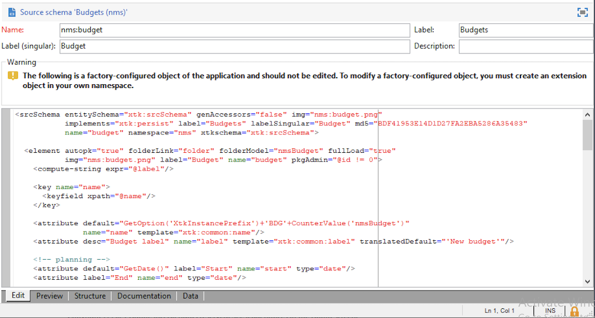
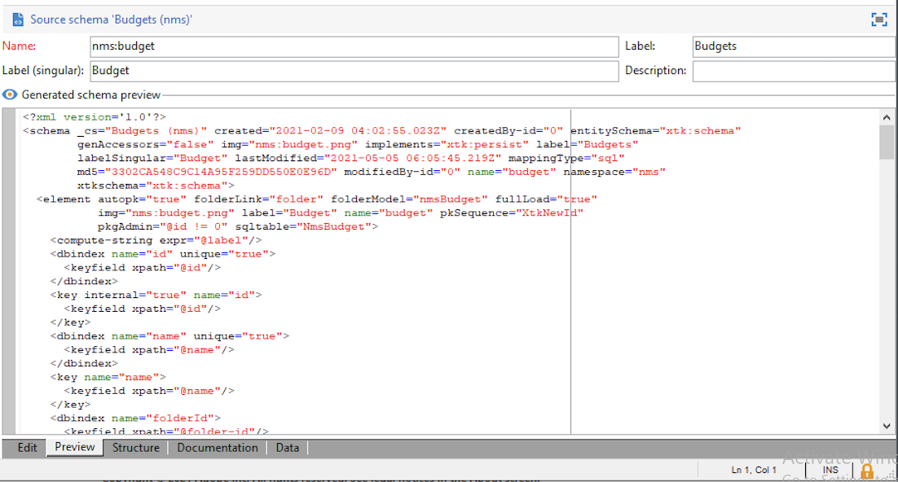

# Crear un nuevo esquema{#create-new-schema}

Para editar, crear y configurar los esquemas, haga clic en el nodo **[!UICONTROL Administration > Configuration > Data schemas]** de la consola del cliente de Adobe Campaign.

>[!NOTE]
>
>Los esquemas de datos integrados solo se pueden eliminar mediante un administrador de la consola de Adobe Campaign.


La pestaña **[!UICONTROL Edit]** muestra el contenido XML de un esquema:



>[!NOTE]
>
>El control de edición &quot;Name&quot; permite introducir la clave de esquema formada por el nombre y el área de nombres. Los atributos &quot;name&quot; y &quot;namespace&quot; del elemento raíz del esquema se actualizan automáticamente en la zona de edición XML del esquema. Tenga en cuenta que algunas áreas de nombres solo son internas. [Más información](schemas.md#reserved-namespaces)

La pestaña **[!UICONTROL Preview]** genera automáticamente el esquema extendido:



>[!NOTE]
>
>Cuando se guarda el esquema de origen, se inicia automáticamente la generación del esquema ampliado.

Si necesita comprobar la estructura completa de un esquema, puede utilizar la pestaña **[!UICONTROL Preview]** . Si el esquema se ha ampliado, podrá visualizar todas sus extensiones. Como complemento, la pestaña **[!UICONTROL Documentation]** muestra todos los atributos y elementos del esquema, así como sus propiedades (Campo SQL, tipo/longitud, etiqueta, descripción). La pestaña **[!UICONTROL Documentation]** solo se aplica a los esquemas generados.

## Caso de uso: crear una tabla de contrato {#example--creating-a-contract-table}

En el siguiente ejemplo, se crea una nueva tabla para **contratos** en la base de datos. Esta tabla permite almacenar los nombres y apellidos y las direcciones de correo electrónico de los titulares y cotitulares de cada contrato.

Para ello, debe crear el esquema de la tabla y actualizar la estructura de la base de datos para generar la tabla correspondiente. A continuación se enumeran los pasos detallados.

1. Edite el nodo **[!UICONTROL Administration > Configuration > Data schemas]** del árbol de Adobe Campaign y haga clic en **[!UICONTROL New]**.
1. Elija la opción **[!UICONTROL Create a new table in the data template]** y haga clic en **[!UICONTROL Next]** .

   

1. Especifique un nombre para la tabla y un área de nombres.

   

   >[!NOTE]
   >
   >De forma predeterminada, los esquemas creados por los usuarios se almacenan en el espacio de nombres &quot;cus&quot;. Para obtener más información, consulte [Identificación de un esquema](extend-schema.md#identification-of-a-schema).

1. Cree el contenido de la tabla. Se recomienda utilizar el asistente dedicado para asegurarse de que no falte ninguna configuración. Para ello, haga clic en el botón **[!UICONTROL Insert]** y seleccione el tipo de configuración que desea añadir.

   

1. Defina la configuración de la tabla de contratos.

   Como práctica recomendada, cree la tabla en la base de datos de Cloud añadiendo el atributo `dataSource="nms:extAccount:ffda"`. Este atributo se añade de forma predeterminada al crear una tabla nueva.

   ```
   <srcSchema created="YYYY-MM-DD HH:MM:SS.TZ" desc="Active contracts" img="crm:crm/mscrm/mscrm_account_16x16.png"
           label="Contracts" labelSingular="Contract" lastModified="YYYY-MM-DD HH:MM:SS.TZ"
           mappingType="sql" name="Contracts" namespace="cus" xtkschema="xtk:srcSchema">
      <element dataSource="nms:extAccount:ffda" desc="Active contracts" img="crm:crm/mscrm/mscrm_account_16x16.png"
           label="Contracts" labelSingular="Contract" name="Contracts">
           <attribute name="holderName" label="Holder last name" type="string"/>
           <attribute name="holderFirstName" label="Holder first name" type="string"/>
           <attribute name="holderEmail" label="Holder email" type="string"/>
           <attribute name="co-holderName" label="Co-holder last name" type="string"/>           
           <attribute name="co-holderFirstName" label="Co-holder first name" type="string"/>           
           <attribute name="co-holderEmail" label="Co-holder email" type="string"/>    
           <attribute name="date" label="Subscription date" type="date"/>     
           <attribute name="noContract" label="Contract number" type="long"/> 
      </element>
   </srcSchema>
   ```

   Añada el tipo de enumeración de contrato.

   ```
   <srcSchema created="AA-MM-DD HH:MM:SS.TZ" desc="Active contracts" img="crm:crm/mscrm/mscrm_account_16x16.png" label="Contracts" labelSingular="Contract" AA-MM-DD HH:MM:SS.TZ"mappingType="sql" name="Contracts" namespace="cus" xtkschema="xtk:srcSchema">
      <enumeration basetype="byte" name="typeContract">
         <value label="Home" name="home" value="0"/>
         <value label="Car" name="car" value="1"/>
         <value label="Health" name="health" value="2"/>
         <value label="Pension fund" name="pension fund" value="2"/>
      </enumeration>
      <element dataSource="nms:extAccount:ffda" desc="Active contracts" img="crm:crm/mscrm/mscrm_account_16x16.png"
           label="Contracts" labelSingular="Contract" name="Contracts">
           <attribute name="holderName" label="Holder last name" type="string"/>
           <attribute name="holderFirstName" label="Holder first name" type="string"/>
           <attribute name="holderEmail" label="Holder email" type="string"/>
           <attribute name="co-holderName" label="Co-holder last name" type="string"/>           
           <attribute name="co-holderFirstName" label="Co-holder first name" type="string"/>           
           <attribute name="co-holderEmail" label="Co-holder email" type="string"/>    
           <attribute name="date" label="Subscription date" type="date"/>     
           <attribute name="noContract" label="Contract number" type="long"/> 
      </element>
   </srcSchema>
   ```

1. Guarde el esquema y haga clic en la pestaña **[!UICONTROL Structure]** para generar la estructura:

   

1. Actualice la estructura de la base de datos para crear la tabla a la que se vinculará el esquema. Para obtener más información, consulte [esta sección](update-database-structure.md).
