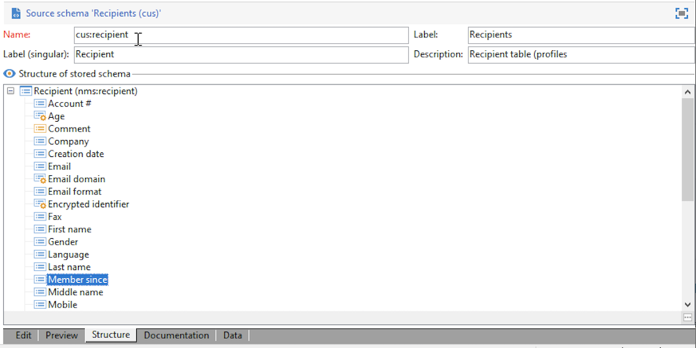

# Ampliación de un esquema{#extend-schemas}

Como usuario técnico, puede personalizar el modelo de datos de Campaign para satisfacer las necesidades de su implementación: añadir elementos a un esquema existente, modificar un elemento de un esquema o eliminar elementos.

Los pasos clave para personalizar el modelo de datos de Campaign son:

1. Crear un esquema de extensión
1. Actualización de la base de datos de Campaign
1. Adaptación del formulario de entrada

>[!CAUTION]
>El esquema integrado no debe modificarse directamente. Si necesita adaptar un esquema integrado, debe ampliarlo.

?? Para comprender mejor las tablas integradas de Campaign y su interacción, consulte [esta página](datamodel.md). Consulte también las recomendaciones al crear un nuevo esquema en [esta página](create-schema.md).

Para ampliar un esquema, siga los pasos a continuación:

1. Vaya a la carpeta **[!UICONTROL Administration > Configuration > Data schemas]** en el Explorador.
1. Haga clic en el botón **New** y seleccione **[!UICONTROL Extend the data in a table using an extension schema]**.

   

1. Identifique el esquema integrado que desea ampliar y selecciónelo.

   

   Por convención, asigne el mismo nombre al esquema de extensión que al esquema integrado y utilice un espacio de nombres personalizado.  Tenga en cuenta que algunas áreas de nombres solo son internas. [Más información](schemas.md#reserved-namespaces)

   

1. Una vez en el editor de esquemas, añada los elementos que necesite utilizando el menú contextual y guarde.

   

   En el siguiente ejemplo, agregamos el atributo **MembershipYear**, establecemos un límite de longitud para los apellidos (este límite sobrescribirá el predeterminado) y eliminamos la fecha de nacimiento del esquema integrado.

   

   ```
   <srcSchema created="YYYY-MM-DD" desc="Recipient table" extendedSchema="nms:recipient"
           img="nms:recipient.png" label="Recipients" labelSingular="Recipient" lastModified="YYYY-MM-DD"
           mappingType="sql" name="recipient" namespace="cus" xtkschema="xtk:srcSchema">
    <element desc="Recipient table" img="nms:recipient.png" label="Recipients" labelSingular="Recipient" name="recipient">
       <attribute label="Member since" name="MembershipYear" type="long"/>
       <attribute length="50" name="lastName"/>
       <attribute _operation="delete" name="birthDate"/>
   </element>
   </srcSchema>
   ```

1. Desconecte y vuelva a conectarse a Campaign para comprobar la actualización de la estructura del esquema en la pestaña **[!UICONTROL Structure]**.

   

1. Actualice la estructura de la base de datos para aplicar los cambios. [Más información](update-database-structure.md)

1. Una vez implementados los cambios en la base de datos, se puede adaptar el formulario de entrada de destinatarios para que los cambios sean visibles. [Más información](forms.md)
