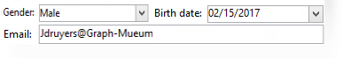

# Introducción a los formularios de entrada{#gs-ac-forms}

Al crear o ampliar un esquema, es necesario crear o modificar los formularios de entrada asociados para que esos cambios sean visibles para los usuarios finales.

Un formulario de entrada permite editar una instancia asociada a un esquema de datos desde la consola del cliente de Adobe Campaign. El formulario se identifica con su nombre y área de nombres.

La clave de identificación de un formulario es una cadena formada por el área de nombres y el nombre separados por dos puntos, por ejemplo: &quot;cus:contact&quot;.

## Editar formularios de entrada

Cree y configure formularios de entrada desde la variable **[!UICONTROL Administration]> [!UICONTROL Configuration] >[!UICONTROL Input forms]** carpeta de la consola del cliente:


La zona de edición permite introducir el contenido XML del formulario de entrada:


La vista previa genera una visualización del formulario de entrada:


## Estructura del formulario

La descripción de un formulario es un documento XML estructurado que observa la gramática del esquema del formulario **xtk:form**.

El documento XML del formulario de entrada debe contener la variable `<form>` elemento raíz con la variable  **name** y  **namespace** atributos para rellenar el nombre del formulario y el área de nombres.

```
<form name="form_name" namespace="name_space">
...
</form>
```

De forma predeterminada, un formulario está asociado al esquema de datos con el mismo nombre y área de nombres. Para asociar un formulario con otro nombre, establezca la variable **entity-schema** del `<form>` al nombre de la clave de esquema. Para ilustrar la estructura de un formulario de entrada, describa una interfaz con el esquema de ejemplo &quot;cus:recipient&quot;:

```
<srcSchema name="recipient" namespace="cus">
  <enumeration name="gender" basetype="byte">    
    <value name="unknown" label="Not specified" value="0"/>    
    <value name="male" label="Male" value="1"/>   
    <value name="female" label="Female" value="2"/>   
  </enumeration>

  <element name="recipient">
    <attribute name="email" type="string" length="80" label="Email" desc="E-mail address of recipient"/>
    <attribute name="birthDate" type="datetime" label="Date"/>
    <attribute name="gender" type="byte" label="Gender" enum="gender"/>
  </element>
</srcSchema>
```

El formulario de entrada basado en el esquema de ejemplo:


```
<form name="recipient" namespace="cus">
  <input xpath="@gender"/>
  <input xpath="@birthDate"/>
  <input xpath="@email"/>
</form>
```

La descripción de los controles de edición comienza desde el `<form>` elemento raíz. Se introduce un control de edición en el elemento **`<input>`** con el atributo **xpath** que contiene la ruta de acceso al esquema.

El control de edición se adapta automáticamente al tipo de datos correspondiente y utiliza la etiqueta definida en el esquema.

>[!NOTE]
>
>Puede sobrescribir la etiqueta definida en su esquema de datos agregando la variable **label** a la variable `<input>` elemento:\
>`<input label="E-mail address" xpath="@name" />`

De forma predeterminada, cada campo se muestra en una sola línea y ocupa todo el espacio disponible en función del tipo de datos.

 Todos los atributos de formulario se enumeran en [Documentación de Campaign Classic v7](https://experienceleague.adobe.com/developer/campaign-api/api/control-Button.html).

## Formato {#formatting}

El diseño de los controles es similar al diseño utilizado en las tablas de HTML, con la posibilidad de dividir un control en varias columnas, entrelazar elementos o especificar la ocupación del espacio disponible. Sin embargo, recuerde que el formato solo permite dividir el área por proporciones; no se pueden especificar dimensiones fijas para un objeto.

Para mostrar los controles del ejemplo anterior en dos columnas:


```
<form name="recipient" namespace="cus">
  <container colcount="2">
    <input xpath="@gender"/>
    <input xpath="@birthDate"/>
    <input xpath="@email"/>
  </container>
</form>
```

La variable **`<container>`** con el elemento **colcount** permite forzar la visualización de controles secundarios en dos columnas.

La variable **colspan** en un control extiende el control por el número de columnas introducidas en su valor:



```
<form name="recipient" namespace="cus">
  <container colcount="2">
    <input xpath="@gender"/>
    <input xpath="@birthDate"/>
    <input xpath="@email" colspan="2"/>
  </container>
</form> 
```

Al rellenar el **type=&quot;frame&quot;** , el contenedor agrega un marco alrededor de los controles secundarios con la etiqueta contenida en la variable **label** atributo:


```
<form name="recipient" namespace="cus">
  <container colcount="2" type="frame" label="General">
    <input xpath="@gender"/>
    <input xpath="@birthDate"/>
    <input xpath="@email" colspan="2"/>
  </container>
</form>
```

A **`<static>`** para dar formato al formulario de entrada:


```
<form name="recipient" namespace="cus">
  <static type="separator" colspan="2" label="General"/>
  <input xpath="@gender"/>
  <input xpath="@birthDate"/>
  <input xpath="@email" colspan="2"/>
  <static type="help" label="General information about recipient with date of birth, gender, and e-mail address." colspan="2"/>
</form>
```

La variable **`<static>`** con la variable **separador** type permite añadir una barra separadora con una etiqueta contenida en el **label** atributo.

Se agregó un texto de ayuda con la variable `<static>` con el tipo de ayuda. El contenido del texto se introduce en la variable **label** atributo.

## Usar contenedores {#containers}

Uso **contenedores** para agrupar un conjunto de controles. Están representados por el **`<container>`** elemento. Se utilizaron anteriormente para dar formato a controles en varias columnas.

La variable **xpath** atributo en un `<container>` permite simplificar la referencia a controles secundarios. La referencia de los controles es entonces relativa al elemento principal `<container>` principal.

Ejemplo de un contenedor sin &quot;xpath&quot;:

```
<container colcount="2">
  <input xpath="location/@zipCode"/>
  <input xpath="location/@city"/>
</container>
```

Ejemplo con la adición de &quot;xpath&quot; al elemento llamado &quot;location&quot;:

```
<container colcount="2" xpath="location">
  <input xpath="@zipCode"/>
  <input xpath="@city"/>
</container>
```

Los contenedores se utilizan para construir controles complejos utilizando un conjunto de campos formateados en páginas.

### Añadir pestañas (bloc de notas) {#tab-container}

Utilice un **bloc de notas** contenedor para dar formato a los datos en páginas a las que se puede acceder desde pestañas.


```
<container type="notebook">
  <container colcount="2" label="General">
    <input xpath="@gender"/>
    <input xpath="@birthDate"/>
    <input xpath="@email" colspan="2"/>
  </container>
  <container colcount="2" label="Location">
    ...
  </container>
</container>
```

El contenedor principal se define mediante la variable **type=&quot;bloc de notas&quot;** atributo. Las pestañas se declaran en los contenedores secundarios y la etiqueta de las pestañas se rellena desde el **label** atributo.

Agregue la variable **style=&quot;down&quot;** para forzar la posición vertical de las etiquetas de tabulación debajo del control. Este atributo es opcional. El valor predeterminado es **&quot;up&quot;**.


`<container style="down" type="notebook">  ... </container>`

### Agregar iconos (iconbox) {#icon-list}

Utilice este contenedor para mostrar una barra de iconos vertical que le permite seleccionar las páginas que desea mostrar.


```
<container type="iconbox">
  <container colcount="2" label="General" img="xtk:properties.png">
    <input xpath="@gender"/>
    <input xpath="@birthDate"/>
    <input xpath="@email" colspan="2"/>
  </container>
  <container colcount="2" label="Location" img="nms:msgfolder.png">
    ...
  </container>
</container>
```

El contenedor principal se define mediante la variable **type=&quot;iconbox&quot;** atributo. Las páginas asociadas con los iconos se declaran en los contenedores secundarios. La etiqueta de los iconos se rellena desde la variable **label** atributo.

El icono de una página se rellena desde el `img="<image>"` donde `<image>` es el nombre de la imagen correspondiente a su clave formada por el nombre y el área de nombres (por ejemplo, &quot;xtk:properties.png&quot;).

Las imágenes están disponibles desde la **[!UICONTROL Administration > Configuration > Images]** nodo .

### Ocultar contenedores (visibleGroup) {#visibility-container}

Puede ocultar un conjunto de controles mediante una condición dinámica.

Este ejemplo ilustra la visibilidad de los controles en el valor del campo &quot;Gender&quot;:

```
<container type="visibleGroup" visibleIf="@gender=1">
  ...
</container>
<container type="visibleGroup" visibleIf="@gender=2">
  ...
</container>
```

El atributo define un contenedor de visibilidad **type=&quot;visibleGroup&quot;**. La variable **visibleIf** contiene la condición de visibilidad.

Ejemplos de sintaxis de condición:

* **visibleIf=&quot;@email=&#39;peter.martinezATneolane.net&#39;&quot;**: prueba la igualdad en los datos de tipo cadena. El valor de comparación debe entrecomillarse.
* **visibleIf=&quot;@gender >= 1 y @gender != 2&quot;**: en un valor numérico.
* **visibleIf=&quot;@boolean1=true o @boolean2=false&quot;**: prueba en campos booleanos.

### Visualización condicional (enabledGroup) {#enabling-container}

Este contenedor le permite activar o desactivar un conjunto de datos de una condición dinámica. Desactivar un control impide que se edite. El siguiente ejemplo ilustra la activación de controles desde el valor del campo &quot;Gender&quot; :

```
<container type="enabledGroup" enabledIf="@gender=1">
  ...
</container>
<container type="enabledGroup" enabledIf="@gender=2">
  ...
</container>
```

Un contenedor de activación se define mediante la variable **type=&quot;enabledGroup&quot;** atributo. La variable **enabledIf** contiene la condición de activación.

## Editar un vínculo {#editing-a-link}

Recuerde que un vínculo se declara en el esquema de datos de la siguiente manera:

```
<element label="Company" name="company" target="cus:company" type="link"/>
```

El control de edición del vínculo en su formulario de entrada es el siguiente:


```
<input xpath="company"/>
```

Se puede acceder a la selección de destino mediante el campo de edición . La entrada está asistida por un tipo por adelantado para que un elemento de destino pueda encontrarse fácilmente a partir de los primeros caracteres introducidos. A continuación, la búsqueda se basa en la variable **Cadena de caracteres** definida en el esquema de destino. Si el esquema no existe después de la validación en el control, se muestra un mensaje de confirmación de la creación del destino sobre la marcha. La confirmación crea un nuevo registro en la tabla de destino y lo asocia con el vínculo .

Se utiliza una lista desplegable para seleccionar un elemento de destino de la lista de registros ya creados.

La variable **[!UICONTROL Modify the link]** (carpeta) inicia un formulario de selección con la lista de elementos de destino y una zona de filtro.

La variable **[!UICONTROL Edit link]** (lupa) inicia el formulario de edición del elemento vinculado. El formulario utilizado se deduce de forma predeterminada en la clave del esquema de destino. La variable **formulario** permite forzar el nombre del formulario de edición (p. ej. &quot;cus:company2&quot;).

Puede restringir la selección de elementos de destino añadiendo la variable **`<sysfilter>`** elemento de la definición del vínculo en el formulario de entrada:

```
<input xpath="company">
  <sysFilter>
    <condition expr="[location/@city] =  'Newton"/>
  </sysFilter>
</input>
```

También puede ordenar la lista con la variable **`<orderby>`** elemento:

```
<input xpath="company">
  <orderBy>
    <node expr="[location/@zipCode]"/>
  </orderBy>
</input>
```

## Propiedades de control {#control-properties}

* **noAutoComplete**: desactiva el tipo anterior (con el valor &quot;true&quot;)
* **createMode**: crea el vínculo sobre la marcha si no existe. Los valores posibles son:

   * **ninguno**: deshabilita la creación. Se muestra un mensaje de error si el vínculo no existe
   * **inline**: crea el vínculo con el contenido en el campo de edición
   * **edición**: muestra el formulario de edición en el vínculo . Cuando se valida el formulario, se guardan los datos (modo predeterminado)

* **noZoom**: sin formulario de edición en el vínculo (con el valor &quot;true&quot;)
* **formulario**: sobrecarga el formulario de edición del elemento de destino

## Agregar una lista de vínculos (no enlazados) {#list-of-links}

Un vínculo introducido en el esquema de datos como elemento de recopilación (unbound=&quot;true&quot;) debe pasar por una lista para ver todos los elementos asociados a ella.

El principio consiste en mostrar la lista de elementos vinculados con una carga de datos optimizada (descarga por lote de datos, ejecución de la lista solo si está visible).

Ejemplo de un vínculo de recopilación en un esquema:

```
<element label="Events" name="rcpEvent" target="cus:event" type="link" unbound="true">
...
</element>
```

La lista en su formulario de entrada:

```
 <input xpath="rcpEvent" type="linklist">
  <input xpath="@label"/>
  <input xpath="@date"/>
</input>
```

El control de lista se define mediante la variable **type=&quot;linklist&quot;** atributo. La ruta de la lista debe hacer referencia al vínculo de recopilación.

Las columnas se declaran mediante la variable **`<input>`** elementos de la lista. La variable **xpath** hace referencia a la ruta del campo en el esquema de destino.

Una barra de herramientas con una etiqueta (definida en el vínculo del esquema ) se coloca automáticamente encima de la lista.

La lista se puede filtrar mediante la variable **[!UICONTROL Filters]** y configurado para añadir y ordenar las columnas.

La variable **[!UICONTROL Add]** y **[!UICONTROL Delete]** los botones permiten añadir y eliminar elementos de colección en el vínculo. De forma predeterminada, al agregar un elemento, se inicia el formulario de edición del esquema de destino.

La variable **[!UICONTROL Detail]** se agrega automáticamente cuando la variable **zoom=&quot;true&quot;** se completa en la variable **`<input>`** de la lista: permite iniciar el formulario de edición de la línea seleccionada.

El filtrado y la ordenación se pueden aplicar cuando se carga la lista:

```
 <input xpath="rcpEvent" type="linklist">
  <input xpath="@label"/>
  <input xpath="@date"/>
  <sysFilter>
    <condition expr="@type = 1"/>
  </sysFilter>
  <orderBy>
    <node expr="@date" sortDesc="true"/>
  </orderBy>
</input>
```

## Definir una tabla de relación {#relationship-table}

Una tabla de relación permite vincular dos tablas con cardinalidad N-N. La tabla de relaciones contiene solamente los vínculos a las dos tablas.

Por lo tanto, añadir un elemento a la lista debería permitirle completar una lista de uno de los dos vínculos de la tabla de relaciones.

Ejemplo de tabla de relación en un esquema:

```
<srcSchema name="subscription" namespace="cus">
  <element name="recipient" type="link" target="cus:recipient" label="Recipient"/>
  <element name="service" type="link" target="cus:service" label="Subscription service"/>
</srcSchema>
```

Para nuestro ejemplo, comenzamos con el formulario de entrada del esquema &quot;cus:recipient&quot;. La lista debe mostrar las asociaciones con suscripciones a servicios y debe permitirle añadir una suscripción seleccionando un servicio existente.


```
<input type="linklist" xpath="subscription" xpathChoiceTarget="service" xpathEditTarget="service" zoom="true">
  <input xpath="recipient"/>
  <input xpath="service"/>
</input>
```

La variable **xpathChoiceTarget** permite iniciar un formulario de selección desde el vínculo introducido. Al crear el registro de tabla de relaciones, se actualizará automáticamente el vínculo al destinatario actual y al servicio seleccionado.

>[!NOTE]
>
>La variable **xpathEditTarget** permite forzar la edición de la línea seleccionada en el vínculo introducido.

### Propiedades de lista {#list-properties}

* **noToolbar**: oculta la barra de herramientas (con el valor &quot;true&quot;)
* **toolbarCaption**: sobrecarga la etiqueta de la barra de herramientas
* **toolbarAlign**: modifica la geometría vertical u horizontal de la barra de herramientas (valores posibles: &quot;vertical&quot;|&quot;horizontal&quot;)
* **img**: muestra la imagen asociada a la lista
* **formulario**: sobrecarga el formulario de edición del elemento de destino
* **zoom**: agrega el **[!UICONTROL Zoom]** para editar el elemento de destino
* **xpathEditTarget**: establece la edición en el vínculo introducido
* **xpathChoiceTarget**: además, inicia el formulario de selección en el vínculo introducido

## Agregar controles de lista de memoria {#memory-list-controls}

Las listas de memoria permiten editar los elementos de colección utilizando la precarga de datos de lista. Esta lista no se puede filtrar ni configurar.

Estas listas se utilizan en elementos de colección asignados a XML o en vínculos de bajo volumen.

## Agregar una lista de columnas {#column-list}

Este control muestra una lista de columnas editable con una barra de herramientas que contiene los botones Añadir y Eliminar.

```
<input xpath="rcpEvent" type="list">
  <input xpath="@label"/>
  <input xpath="@date"/>
</input>
```

El control de lista debe rellenarse con el atributo **type=&quot;list&quot;** y la ruta de la lista debe hacer referencia al elemento de colección.

Las columnas se declaran en el elemento secundario **`<input>`** etiquetas de la lista. Se puede forzar la etiqueta y el tamaño de columna con la variable **label** y **colSize** atributos.

>[!NOTE]
>
>Las flechas del orden se agregan automáticamente cuando se usa la variable **ordered=&quot;true&quot;** se agrega al elemento de colección en el esquema de datos.

Los botones de la barra de herramientas se pueden alinear horizontalmente:

```
<input nolabel="true" toolbarCaption="List of events" type="list" xpath="rcpEvent" zoom="true">
  <input xpath="@label"/>
  <input xpath="@date"/>
</input>
```

La variable **toolbarCaption** fuerza la alineación horizontal de la barra de herramientas e introduce el título sobre la lista.

### Habilitar el zoom en una lista {#zoom-in-a-list}

La inserción y edición de los datos en una lista se pueden introducir en un formulario de edición independiente.

```
<input nolabel="true" toolbarCaption="List of events" type="list" xpath="rcpEvent" zoom="true" zoomOnAdd="true">
  <input xpath="@label"/>
  <input xpath="@date"/>

  <form colcount="2" label="Event">
    <input xpath="@label"/>
    <input xpath="@date"/>
  </form>
</input>
```

El formulario de edición se completa desde el `<form>`  elemento en definición de lista. Su estructura es idéntica a la de un formulario de entrada. La variable **[!UICONTROL Detail]** se agrega automáticamente cuando la variable **zoom=&quot;true&quot;** se completa en la variable **`<input>`** de la lista. Este atributo permite iniciar el formulario de edición de la línea seleccionada.

>[!NOTE]
>
>Adición de la variable **zoomOnAdd=&quot;true&quot;** fuerza a que se llame al formulario de edición cuando se inserte un elemento de lista.

### Propiedades de lista {#list-properties-1}

* **noToolbar**: oculta la barra de herramientas (con el valor &quot;true&quot;)
* **toolbarCaption**: sobrecarga la etiqueta de la barra de herramientas
* **toolbarAlign**: modifica la posición de la barra de herramientas (valores posibles: &quot;vertical&quot;|&quot;horizontal&quot;)
* **img**: muestra la imagen asociada a la lista
* **formulario**: sobrecarga el formulario de edición del elemento de destino
* **zoom**: agrega el **[!UICONTROL Zoom]** para editar el elemento de destino
* **zoomOnAdd**: inicia el formulario de edición en la adición
* **xpathChoiceTarget**: además, inicia el formulario de selección en el vínculo introducido

## Agregar campos no editables {#non-editable-fields}

Para mostrar un campo e impedir que se edite, utilice el **`<value>`** o complete la **readOnly=&quot;true&quot;** en la variable **`<input>`** etiqueta.

Ejemplo en el campo &quot;Gender&quot;:


```
<value value="@gender"/>
<input xpath="@gender" readOnly="true"/>
```

## Agregar botón de radio {#radio-button}

Un botón de opción permite elegir entre varias opciones. La variable **`<input>`** se usan para listar las opciones posibles y la variable **selectedValue** especifica el valor asociado a la opción.

Ejemplo en el campo &quot;Gender&quot;:

```
<input type="RadioButton" xpath="@gender" checkedValue="0" label="Choice 1"/>
<input type="RadioButton" xpath="@gender" checkedValue="1" label="Choice 2"/>
<input type="RadioButton" xpath="@gender" checkedValue="2" label="Choice 3"/>
```


## Agregar una casilla de verificación {#checkbox}

Una casilla de verificación refleja un estado booleano (seleccionado o no). De forma predeterminada, los campos &quot;Boolean&quot; (true/false) utilizan este control. Con este botón se puede asociar una variable que tome un valor predeterminado de 0 o 1. Este valor se puede sobrecargar mediante la variable **checkValue** atributos.

```
<input xpath="@boolean1"/>
<input xpath="@field1" type="checkbox" checkedValue="Y"/>
```


## Editar jerarquía de navegación {#navigation-hierarchy-edit}

Este control crea un árbol en un conjunto de campos que se van a editar.

Los controles que se van a editar se agrupan en un **`<container>`** introducida en el **`<input>`** del control de árbol:

```
<input nolabel="true" type="treeEdit">
  <container label="Text fields">
    <input xpath="@text1"/>
    <input xpath="@text2"/>
  </container>
  <container label="Boolean fields">
    <input xpath="@boolean1"/>
    <input xpath="@boolean2"/>
  </container>
</input>
```


## Añadir un campo de expresión {#expression-field}

Un campo de expresión actualiza un campo dinámicamente desde una expresión; el **`<input>`** se usa con un **xpath** para introducir la ruta del campo que se va a actualizar y un **expr** que contiene la expresión update .

```
<!-- Example: updating the boolean1 field from the value contained in the field with path /tmp/@flag -->
<input expr="Iif([/tmp/@flag]=='On', true, false)" type="expr" xpath="@boolean1"/>
<input expr="[/ignored/@action] == 'FCP'" type="expr" xpath="@launchFCP"/>
```

## Contexto de los formularios {#context-of-forms}

La ejecución de un formulario de entrada inicializa un documento XML que contiene los datos de la entidad que se está editando. Este documento representa el contexto del formulario y se puede utilizar como espacio de trabajo.

### Actualizar el contexto {#updating-the-context}

Para modificar el contexto del formulario, utilice la variable `<set expr="<value>" xpath="<field>"/>` , donde `<field>` es el campo de destino y `<value>` es la expresión o valor de actualización.

Ejemplos de uso de la variable `<set>` etiqueta:

* **`<set expr="'Test'" xpath="/tmp/@test" />`**: posiciona el valor &quot;Test&quot; en la ubicación temporal /tmp/@test1
* **`<set expr="'Test'" xpath="@lastName" />`**: actualiza la entidad del atributo &quot;lastName&quot; con el valor &quot;Test&quot;
* **`<set expr="true" xpath="@boolean1" />`**: establece el valor del campo &quot;boolean1&quot; en &quot;true&quot;
* **`<set expr="@lastName" xpath="/tmp/@test" />`**: actualizaciones con el contenido del atributo &quot;lastName&quot;

El contexto del formulario se puede actualizar al inicializar y cerrar el formulario mediante el **`<enter>`** y **`<leave>`** etiquetas.

```
<form name="recipient" namespace="cus">
  <enter>
    <set...
  </enter>
  ...
  <leave>
    <set...
  </leave>
</form>
```

>[!NOTE]
>
>La variable `<enter>`  y  `<leave>`   se pueden usar en la variable `<container>` de páginas (tipos &quot;bloc de notas&quot; y &quot;iconbox&quot;).

### Lenguaje de expresión {#expression-language-}

Se puede utilizar un lenguaje de macro en la definición del formulario para realizar pruebas condicionales.

La variable **`<if expr="<expression>" />`** ejecuta las instrucciones especificadas en la etiqueta si se verifica la expresión:

```
<if expr="([/tmp/@test] == 'Test' or @lastName != 'Doe') and @boolean2 == true">
  <set xpath="@boolean1" expr="true"/>
</if>
```

La variable **`<check expr="<condition>" />`** junto con la variable **`<error>`** impide la validación del formulario y muestra un mensaje de error si no se cumple la condición:

```
<leave>
  <check expr="/tmp/@test != ''">
    <error>You must populate the 'Test' field!</error> 
  </check>
</leave>
```

## Ayudante (asistente) {#wizards}

Un asistente lo guía a través de un conjunto de pasos de entrada de datos en forma de páginas. Los datos introducidos se guardan al validar el formulario.

Para añadir un asistente, utilice el siguiente tipo de estructura:

```
<form type="wizard" name="example" namespace="cus" img="nms:rcpgroup32.png" label="Wizard example" entity-schema="nms:recipient">
  <container title="Title of page 1" desc="Long description of page 1">
    <input xpath="@lastName"/>
    <input xpath="comment"/>
  </container>
  <container title="Title of page 2" desc="Long description of page 2">
    ...
  </container>
  ...
</form>
```

La presencia de **type=&quot;wizard&quot;** en la variable `<form>` element permite definir el modo del asistente en la construcción del formulario. Las páginas se completan desde `<container>` elementos, que son hijos de `<form>` elemento. La variable `<container>` del elemento de una página se rellena con los atributos de título del título y desc para mostrar la descripción bajo el título de la página. La variable **[!UICONTROL Previous]** y **[!UICONTROL Next]** se añaden automáticamente para permitir la navegación entre páginas.

La variable **[!UICONTROL Finish]** guarda los datos introducidos y cierra el formulario.

### Métodos SOAP {#soap-methods}

La ejecución del método SOAP se puede iniciar desde un **`<leave>`** al final de una página.

La variable **`<soapcall>`** contiene la llamada para el método con los siguientes parámetros de entrada:

```
<soapCall name="<name>" service="<schema>">
  <param type="<type>" exprIn="<xpath>"/>  
  ...
</soapCall>
```

El nombre del servicio y su esquema de implementación se introducen mediante la variable **name** y **service** atributos de la variable **`<soapcall>`** etiqueta.

Los parámetros de entrada se describen en la sección **`<param>`** los elementos de la sección **`<soapcall>`** etiqueta.

El tipo de parámetro debe especificarse mediante la variable **type** atributo. Los tipos posibles son los siguientes:

* **string**: cadena de caracteres
* **booleano**: Booleano
* **byte**: Entero de 8 bits
* **short**: Entero de 16 bits
* **long**: Entero de 32 bits
* **short**: Entero de 16 bits
* **double**: número de coma flotante de precisión doble
* **DOMElement**: nodo element-type

La variable **exprIn** contiene la ubicación de los datos que se van a pasar como parámetro.

**Ejemplo**:

```
<leave>
  <soapCall name="RegisterGroup" service="nms:recipient">         
    <param type="DOMElement" exprIn="/tmp/entityList"/>         
    <param type="DOMElement" exprIn="/tmp/choiceList"/>         
    <param type="boolean"    exprIn="true"/>       
  </soapCall>
</leave>
```
