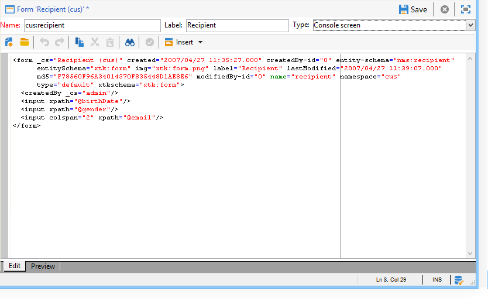

# Introducción a los formularios de entrada {#gs-ac-forms}

Al crear o ampliar un esquema, debe crear o modificar los formularios de entrada asociados para que los usuarios finales puedan ver esos cambios.

Un formulario de entrada permite editar una instancia asociada a un esquema de datos desde la consola del cliente de Adobe Campaign. El formulario se identifica con su nombre y área de nombres.

La clave de identificación de un formulario es una cadena formada por el área de nombres y el nombre separados por dos puntos, por ejemplo: &quot;cus:contact&quot;.

## Edición de formularios de entrada

Crear y configurar formularios de entrada desde **[!UICONTROL Administration]> [!UICONTROL Configuration] >[!UICONTROL Input forms]** de la consola de cliente:


La zona de edición permite introducir el contenido XML del formulario de entrada:



La previsualización genera una visualización del formulario de entrada:


## Estructura del formulario

La descripción de un formulario es un documento XML estructurado que observa la gramática del esquema del formulario **xtk:formulario**.

El documento XML del formulario de entrada debe contener la variable `<form>` elemento raíz con la variable  **name** y  **namespace** atributos para rellenar el nombre del formulario y el área de nombres.

```
<form name="form_name" namespace="name_space">
...
</form>
```

De forma predeterminada, un formulario está asociado al esquema de datos con el mismo nombre y área de nombres. Para asociar un formulario con un nombre diferente, establezca **entity-schema** atributo del `<form>` al nombre de la clave de esquema. Para ilustrar la estructura de un formulario de entrada, describamos una interfaz con el esquema de ejemplo &quot;cus:recipient&quot;:

```
<srcSchema name="recipient" namespace="cus">
  <enumeration name="gender" basetype="byte">    
    <value name="unknown" label="Not specified" value="0"/>    
    <value name="male" label="Male" value="1"/>   
    <value name="female" label="Female" value="2"/>   
  </enumeration>

  <element name="recipient">
    <attribute name="email" type="string" length="80" label="Email" desc="E-mail address of recipient"/>
    <attribute name="birthDate" type="datetime" label="Date"/>
    <attribute name="gender" type="byte" label="Gender" enum="gender"/>
  </element>
</srcSchema>
```

El formulario de entrada se basa en el esquema de ejemplo:


```
<form name="recipient" namespace="cus">
  <input xpath="@gender"/>
  <input xpath="@birthDate"/>
  <input xpath="@email"/>
</form>
```

La descripción de los controles de edición comienza desde el `<form>` elemento raíz. Se introduce un control de edición en el elemento **`<input>`** con el atributo **xpath** que contiene la ruta de acceso al esquema.

El control de edición se adapta automáticamente al tipo de datos correspondiente y utiliza la etiqueta definida en el esquema.

>[!NOTE]
>
>Puede sobrescribir la etiqueta definida en su esquema de datos añadiendo el **etiqueta** atribuir a `<input>` elemento:\
>`<input label="E-mail address" xpath="@name" />`

De forma predeterminada, cada campo se muestra en una sola línea y ocupa todo el espacio disponible en función del tipo de datos.

Todos los atributos de formulario se enumeran en [Documentación de Campaign Classic v7](https://experienceleague.adobe.com/developer/campaign-api/api/control-Button.html){target="_blank"}.

## Formato {#formatting}

El diseño de los controles se parece al diseño utilizado en las tablas de HTML, con la posibilidad de dividir un control en varias columnas, entrelazar elementos o especificar la ocupación del espacio disponible. Sin embargo, recuerde que el formato sólo permite dividir el área por proporciones; no se pueden especificar dimensiones fijas para un objeto.

Para mostrar los controles del ejemplo anterior en dos columnas:


```
<form name="recipient" namespace="cus">
  <container colcount="2">
    <input xpath="@gender"/>
    <input xpath="@birthDate"/>
    <input xpath="@email"/>
  </container>
</form>
```

El **`<container>`** con el elemento **cómputo** permite forzar la visualización de los controles secundarios en dos columnas.

El **colSpan** en un control extiende el control por el número de columnas introducidas en su valor:


```
<form name="recipient" namespace="cus">
  <container colcount="2">
    <input xpath="@gender"/>
    <input xpath="@birthDate"/>
    <input xpath="@email" colspan="2"/>
  </container>
</form> 
```

Rellenando el **type=&quot;frame&quot;** , el contenedor agrega un marco alrededor de los controles secundarios con la etiqueta contenida en el **etiqueta** atributo:


```
<form name="recipient" namespace="cus">
  <container colcount="2" type="frame" label="General">
    <input xpath="@gender"/>
    <input xpath="@birthDate"/>
    <input xpath="@email" colspan="2"/>
  </container>
</form>
```

A **`<static>`** para dar formato al formulario de entrada:


```
<form name="recipient" namespace="cus">
  <static type="separator" colspan="2" label="General"/>
  <input xpath="@gender"/>
  <input xpath="@birthDate"/>
  <input xpath="@email" colspan="2"/>
  <static type="help" label="General information about recipient with date of birth, gender, and e-mail address." colspan="2"/>
</form>
```

El **`<static>`** etiqueta con el **separador** type permite añadir una barra de separación con una etiqueta contenida en la variable **etiqueta** atributo.

Se ha añadido un texto de ayuda utilizando `<static>` etiqueta con tipo de ayuda. El contenido del texto se introduce en **etiqueta** atributo.

## Uso de contenedores {#containers}

Uso **contenedores** para agrupar un conjunto de controles. Están representados por el **`<container>`** Elemento. Se utilizaron anteriormente para dar formato a los controles en varias columnas.

El **xpath** atributo en un `<container>` permite simplificar la referencia de los controles secundarios. La referencia a los controles es relativa al elemento principal `<container>` principal.

Ejemplo de un contenedor sin &quot;xpath&quot;:

```
<container colcount="2">
  <input xpath="location/@zipCode"/>
  <input xpath="location/@city"/>
</container>
```

Ejemplo con la adición de &quot;xpath&quot; al elemento llamado &quot;location&quot;:

```
<container colcount="2" xpath="location">
  <input xpath="@zipCode"/>
  <input xpath="@city"/>
</container>
```

Los contenedores se utilizan para construir controles complejos mediante un conjunto de campos con formato en páginas.

### Agregar fichas (bloc de notas) {#tab-container}

Utilice un **cuaderno** contenedor para dar formato a los datos en páginas accesibles desde las pestañas.


```
<container type="notebook">
  <container colcount="2" label="General">
    <input xpath="@gender"/>
    <input xpath="@birthDate"/>
    <input xpath="@email" colspan="2"/>
  </container>
  <container colcount="2" label="Location">
    ...
  </container>
</container>
```

El contenedor principal se define mediante la variable **type=&quot;bloc de notas&quot;** atributo. Las pestañas se declaran en los contenedores secundarios y la etiqueta de las pestañas se rellena desde el **etiqueta** atributo.

Añada el **style=&quot;down&quot;** para forzar la colocación vertical de las etiquetas de tabulación debajo del control. Este atributo es opcional. El valor predeterminado es **&quot;up&quot;**.


`<container style="down" type="notebook">  ... </container>`

### Agregar iconos (cuadro de iconos) {#icon-list}

Utilice este contenedor para mostrar una barra de iconos vertical que le permite seleccionar las páginas que desea mostrar.


```
<container type="iconbox">
  <container colcount="2" label="General" img="xtk:properties.png">
    <input xpath="@gender"/>
    <input xpath="@birthDate"/>
    <input xpath="@email" colspan="2"/>
  </container>
  <container colcount="2" label="Location" img="nms:msgfolder.png">
    ...
  </container>
</container>
```

El contenedor principal se define mediante la variable **type=&quot;iconbox&quot;** atributo. Las páginas asociadas con los iconos se declaran en los contenedores secundarios. La etiqueta de los iconos se rellena desde el **etiqueta** atributo.

El icono de una página se rellena desde el `img="<image>"` atributo, donde `<image>` es el nombre de la imagen correspondiente a su clave formada por el nombre y el área de nombres (por ejemplo, &quot;xtk:properties.png&quot;).

Las imágenes están disponibles en el **[!UICONTROL Administration > Configuration > Images]** nodo.

### Ocultar contenedores (visibleGroup) {#visibility-container}

Puede ocultar un conjunto de controles mediante una condición dinámica.

Este ejemplo ilustra la visibilidad de los controles en el valor del campo &quot;Gender&quot;:

```
<container type="visibleGroup" visibleIf="@gender=1">
  ...
</container>
<container type="visibleGroup" visibleIf="@gender=2">
  ...
</container>
```

Un contenedor de visibilidad se define mediante el atributo **type=&quot;visibleGroup&quot;**. El **visibleIf** contiene la condición de visibilidad.

Ejemplos de sintaxis de condición:

* **visibleIf=&quot;@email=&#39;peter.martinezATneolane.net&#39;&quot;**: prueba la igualdad en los datos de tipo cadena. El valor de comparación debe estar entre comillas.
* **visibleIf=&quot;@gender >= 1 y @gender != 2&quot;**: condición en un valor numérico.
* **visibleIf=&quot;@boolean1=true o @boolean2=false&quot;**: prueba en campos booleanos.

### Visualización condicional (enabledGroup) {#enabling-container}

Este contenedor permite habilitar o deshabilitar un conjunto de datos de una condición dinámica. Al deshabilitar un control se impide su edición. El ejemplo siguiente ilustra la activación de controles a partir del valor del campo &quot;Gender&quot;:

```
<container type="enabledGroup" enabledIf="@gender=1">
  ...
</container>
<container type="enabledGroup" enabledIf="@gender=2">
  ...
</container>
```

Un contenedor de activación se define mediante la variable **type=&quot;enabledGroup&quot;** atributo. El **enabledIf** contiene la condición de activación.

## Edición de un vínculo {#editing-a-link}

Recuerde que un vínculo se declara en el esquema de datos de la siguiente manera:

```
<element label="Company" name="company" target="cus:company" type="link"/>
```

El control de edición del vínculo en su formulario de entrada es el siguiente:


```
<input xpath="company"/>
```

Se puede acceder a la selección de destino mediante el campo de edición. La entrada se realiza con ayuda de escritura anticipada, de modo que se pueda encontrar fácilmente un elemento de destino a partir de los primeros caracteres introducidos. La búsqueda se basa entonces en **Cadena Compute** definido en el esquema de destino. Si el esquema no existe después de la validación en el control, se muestra un mensaje de confirmación de creación de destino sobre la marcha. La confirmación crea un nuevo registro en la tabla de destino y lo asocia al vínculo.

Se utiliza una lista desplegable para seleccionar un elemento de destino de la lista de registros ya creados.

El **[!UICONTROL Modify the link]** El icono (carpeta) inicia un formulario de selección con la lista de elementos de destino y una zona de filtro.

El **[!UICONTROL Edit link]** El icono (lupa) inicia el formulario de edición del elemento vinculado. El formulario utilizado se deduce de forma predeterminada en la clave del esquema de destino. El **formulario** El atributo permite forzar el nombre del formulario de edición (por ejemplo &quot;cus:company2&quot;).

Puede restringir la selección de elementos de destino añadiendo **`<sysfilter>`** de la definición del vínculo en el formulario de entrada:

```
<input xpath="company">
  <sysFilter>
    <condition expr="[location/@city] =  'Newton"/>
  </sysFilter>
</input>
```

También puede ordenar la lista con el **`<orderby>`** elemento:

```
<input xpath="company">
  <orderBy>
    <node expr="[location/@zipCode]"/>
  </orderBy>
</input>
```

## Propiedades de control {#control-properties}

* **noAutoComplete**: deshabilita el texto anticipado (con el valor &quot;true&quot;)
* **createMode**: crea el vínculo sobre la marcha si no existe. Los valores posibles son:

   * **ninguno**: deshabilita la creación. Si el vínculo no existe, aparece un mensaje de error
   * **en línea**: crea el vínculo con el contenido en el campo de edición
   * **edición**: muestra el formulario de edición en el vínculo. Cuando se valida el formulario, los datos se guardan (modo predeterminado)

* **noZoom**: no hay ningún formulario de edición en el vínculo (con el valor &quot;true&quot;)
* **formulario**: sobrecarga el formulario de edición del elemento de destino

## Añadir una lista de vínculos (sin enlazar) {#list-of-links}

Un vínculo introducido en el esquema de datos como elemento de colección (unbound=&quot;true&quot;) debe pasar por una lista para ver todos los elementos asociados a él.

El principio consiste en mostrar la lista de elementos vinculados con carga de datos optimizada (descarga por lote de datos, ejecución de la lista solo si está visible).

Ejemplo de un vínculo de colección en un esquema:

```
<element label="Events" name="rcpEvent" target="cus:event" type="link" unbound="true">
...
</element>
```

La lista en su formulario de entrada:

```
 <input xpath="rcpEvent" type="linklist">
  <input xpath="@label"/>
  <input xpath="@date"/>
</input>
```

El control de lista se define mediante la variable **type=&quot;linklist&quot;** atributo. La ruta de la lista debe hacer referencia al vínculo de colección.

Las columnas se declaran mediante la variable **`<input>`** elementos de la lista. El **xpath** attribute hace referencia a la ruta del campo en el esquema de destinatario.

Una barra de herramientas con una etiqueta (definida en el vínculo del esquema) se coloca automáticamente encima de la lista.

La lista se puede filtrar mediante el **[!UICONTROL Filters]** y configuradas para añadir y ordenar las columnas.

El **[!UICONTROL Add]** y **[!UICONTROL Delete]** Los botones permiten añadir y eliminar elementos de colección en el vínculo. De forma predeterminada, al agregar un elemento, se inicia el formulario de edición del esquema de destino.

El **[!UICONTROL Detail]** se añade automáticamente cuando el **zoom=&quot;true&quot;** se completa en el **`<input>`** tag of the list: permite iniciar el formulario de edición de la línea seleccionada.

El filtrado y la ordenación se pueden aplicar cuando se carga la lista:

```
 <input xpath="rcpEvent" type="linklist">
  <input xpath="@label"/>
  <input xpath="@date"/>
  <sysFilter>
    <condition expr="@type = 1"/>
  </sysFilter>
  <orderBy>
    <node expr="@date" sortDesc="true"/>
  </orderBy>
</input>
```

## Definición de una tabla de relaciones {#relationship-table}

Una tabla de relación permite vincular dos tablas con la cardinalidad N-N. La tabla de relaciones sólo contiene los vínculos a las dos tablas.

Por lo tanto, añadir un elemento a la lista debería permitirle completar una lista desde uno de los dos vínculos de la tabla de relaciones.

Ejemplo de una tabla de relaciones en un esquema:

```
<srcSchema name="subscription" namespace="cus">
  <element name="recipient" type="link" target="cus:recipient" label="Recipient"/>
  <element name="service" type="link" target="cus:service" label="Subscription service"/>
</srcSchema>
```

Para nuestro ejemplo, empezamos con el formulario de entrada del esquema &quot;cus:recipient&quot;. La lista debe mostrar las asociaciones con suscripciones a servicios y debe permitirle agregar una suscripción seleccionando un servicio existente.


```
<input type="linklist" xpath="subscription" xpathChoiceTarget="service" xpathEditTarget="service" zoom="true">
  <input xpath="recipient"/>
  <input xpath="service"/>
</input>
```

El **xpathChoiceTarget** El atributo permite iniciar un formulario de selección desde el vínculo introducido. Al crear el registro de la tabla de relaciones, se actualizará automáticamente el vínculo al destinatario actual y al servicio seleccionado.

>[!NOTE]
>
>El **xpathEditTarget** El atributo permite forzar la edición de la línea seleccionada en el vínculo introducido.

### Propiedades de lista {#list-properties}

* **noToolbar**: oculta la barra de herramientas (con valor &quot;true&quot;)
* **toolbarCaption**: sobrecarga la etiqueta de la barra de herramientas
* **toolbarAlign**: modifica la geometría vertical u horizontal de la barra de herramientas (valores posibles: &quot;vertical&quot;|&quot;horizontal&quot;)
* **img**: muestra la imagen asociada a la lista
* **formulario**: sobrecarga el formulario de edición del elemento de destino
* **zoom**: añade el **[!UICONTROL Zoom]** para editar el elemento de destino
* **xpathEditTarget**: establece la edición en el vínculo introducido
* **xpathChoiceTarget**: para obtener más información, inicia el formulario de selección en el vínculo introducido

## Agregar controles de lista de memoria {#memory-list-controls}

Las listas de memoria permiten editar los elementos de recopilación mediante la precarga de datos de lista. Esta lista no se puede filtrar ni configurar.

Estas listas se utilizan en elementos de colección asignados en XML o en vínculos de bajo volumen.

## Agregar una lista de columnas {#column-list}

Este control muestra una lista de columnas editable con una barra de herramientas que contiene los botones Añadir y Eliminar.

```
<input xpath="rcpEvent" type="list">
  <input xpath="@label"/>
  <input xpath="@date"/>
</input>
```

El control de lista debe rellenarse con el atributo **type=&quot;list&quot;** y la ruta de la lista debe hacer referencia al elemento de colección.

Las columnas se declaran en el elemento secundario **`<input>`** etiquetas de la lista. La etiqueta de columna y el tamaño se pueden forzar con la etiqueta **etiqueta** y **colSize** atributos.

>[!NOTE]
>
>Las flechas de orden se añaden automáticamente al **ordered=&quot;true&quot;** El atributo se agrega al elemento de colección en el esquema de datos.

Los botones de la barra de herramientas se pueden alinear horizontalmente:

```
<input nolabel="true" toolbarCaption="List of events" type="list" xpath="rcpEvent" zoom="true">
  <input xpath="@label"/>
  <input xpath="@date"/>
</input>
```

El **toolbarCaption** fuerza la alineación horizontal de la barra de herramientas e introduce el título encima de la lista.

### Habilitar el zoom en una lista {#zoom-in-a-list}

La inserción y edición de los datos en una lista se puede introducir en un formulario de edición independiente.

```
<input nolabel="true" toolbarCaption="List of events" type="list" xpath="rcpEvent" zoom="true" zoomOnAdd="true">
  <input xpath="@label"/>
  <input xpath="@date"/>

  <form colcount="2" label="Event">
    <input xpath="@label"/>
    <input xpath="@date"/>
  </form>
</input>
```

El formulario de edición se completa desde el `<form>`  elemento bajo definición de lista. Su estructura es idéntica a la de un formulario de entrada. El **[!UICONTROL Detail]** se añade automáticamente cuando el **zoom=&quot;true&quot;** se completa en el **`<input>`** de la lista. Este atributo permite iniciar el formulario de edición de la línea seleccionada.

>[!NOTE]
>
>Añadir el **zoomOnAdd=&quot;true&quot;** obliga a llamar al formulario de edición cuando se inserta un elemento de lista.

### Propiedades de lista {#list-properties-1}

* **noToolbar**: oculta la barra de herramientas (con valor &quot;true&quot;)
* **toolbarCaption**: sobrecarga la etiqueta de la barra de herramientas
* **toolbarAlign**: modifica la posición de la barra de herramientas (valores posibles: &quot;vertical&quot;|&quot;horizontal&quot;)
* **img**: muestra la imagen asociada a la lista
* **formulario**: sobrecarga el formulario de edición del elemento de destino
* **zoom**: añade el **[!UICONTROL Zoom]** para editar el elemento de destino
* **zoomOnAdd**: inicia el formulario de edición al añadir
* **xpathChoiceTarget**: para obtener más información, inicia el formulario de selección en el vínculo introducido

## Adición de campos no editables {#non-editable-fields}

Para mostrar un campo y evitar que se edite, utilice el **`<value>`** etiquete o complete el **readOnly=&quot;true&quot;** en el **`<input>`** etiqueta.

Ejemplo en el campo &quot;Género&quot;:


```
<value value="@gender"/>
<input xpath="@gender" readOnly="true"/>
```

## Añadir botón de radio {#radio-button}

Un botón de opción le permite elegir entre varias opciones. El **`<input>`** se utilizan para enumerar las posibles opciones y la variable **checkValue** especifica el valor asociado con la opción.

Ejemplo en el campo &quot;Género&quot;:

```
<input type="RadioButton" xpath="@gender" checkedValue="0" label="Choice 1"/>
<input type="RadioButton" xpath="@gender" checkedValue="1" label="Choice 2"/>
<input type="RadioButton" xpath="@gender" checkedValue="2" label="Choice 3"/>
```


## Agregar una casilla de verificación {#checkbox}

Una casilla de verificación refleja un estado booleano (seleccionado o no). De forma predeterminada, los campos &quot;booleanos&quot; (true/false) utilizan este control. Con este botón se puede asociar una variable que tenga un valor predeterminado de 0 o 1. Este valor se puede sobrecargar mediante la variable **checkValue** atributos.

```
<input xpath="@boolean1"/>
<input xpath="@field1" type="checkbox" checkedValue="Y"/>
```


## Editar jerarquía de navegación {#navigation-hierarchy-edit}

Este control genera un árbol en un conjunto de campos que se van a editar.

Los controles que se van a editar se agrupan en una **`<container>`** introducido en la sección **`<input>`** etiqueta del control de árbol:

```
<input nolabel="true" type="treeEdit">
  <container label="Text fields">
    <input xpath="@text1"/>
    <input xpath="@text2"/>
  </container>
  <container label="Boolean fields">
    <input xpath="@boolean1"/>
    <input xpath="@boolean2"/>
  </container>
</input>
```


## Agregar un campo de expresión {#expression-field}

Un campo de expresión actualiza un campo dinámicamente desde una expresión; la variable **`<input>`** se utiliza con una etiqueta **xpath** para introducir la ruta del campo que se va a actualizar y un **expr** atributo que contiene la expresión update.

```
<!-- Example: updating the boolean1 field from the value contained in the field with path /tmp/@flag -->
<input expr="Iif([/tmp/@flag]=='On', true, false)" type="expr" xpath="@boolean1"/>
<input expr="[/ignored/@action] == 'FCP'" type="expr" xpath="@launchFCP"/>
```

## Contexto de los formularios {#context-of-forms}

La ejecución de un formulario de entrada inicializa un documento XML que contiene los datos de la entidad que se está editando. Este documento representa el contexto del formulario y se puede utilizar como espacio de trabajo.

### Actualización del contexto {#updating-the-context}

Para modificar el contexto del formulario, utilice el `<set expr="<value>" xpath="<field>"/>` etiqueta, donde `<field>` es el campo de destino, y `<value>` es la expresión o el valor de actualización.

Ejemplos de uso del `<set>` etiqueta:

* **`<set expr="'Test'" xpath="/tmp/@test" />`**: coloca el valor &quot;Test&quot; en la ubicación temporal /tmp/@test1
* **`<set expr="'Test'" xpath="@lastName" />`**: actualiza la entidad en el atributo &quot;lastName&quot; con el valor &quot;Test&quot;
* **`<set expr="true" xpath="@boolean1" />`**: establece el valor del campo &quot;boolean1&quot; en &quot;true&quot;
* **`<set expr="@lastName" xpath="/tmp/@test" />`**: se actualiza con el contenido del atributo &quot;lastName&quot;

El contexto del formulario se puede actualizar al inicializar y cerrar el formulario mediante el **`<enter>`** y **`<leave>`** etiquetas.

```
<form name="recipient" namespace="cus">
  <enter>
    <set...
  </enter>
  ...
  <leave>
    <set...
  </leave>
</form>
```

>[!NOTE]
>
>El `<enter>`  y  `<leave>`   Las etiquetas se pueden utilizar en `<container>` de páginas (tipos de &quot;bloc de notas&quot; e &quot;iconbox&quot;).

### Lenguaje de expresión {#expression-language-}

Se puede utilizar un lenguaje de macro en la definición del formulario para realizar pruebas condicionales.

El **`<if expr="<expression>" />`** ejecuta las instrucciones especificadas en la etiqueta si se verifica la expresión:

```
<if expr="([/tmp/@test] == 'Test' or @lastName != 'Doe') and @boolean2 == true">
  <set xpath="@boolean1" expr="true"/>
</if>
```

El **`<check expr="<condition>" />`** combinado con la etiqueta **`<error>`** impide la validación del formulario y muestra un mensaje de error si la condición no se cumple:

```
<leave>
  <check expr="/tmp/@test != ''">
    <error>You must populate the 'Test' field!</error> 
  </check>
</leave>
```

## Ayudante (asistente) {#wizards}

Un asistente le guiará a través de un conjunto de pasos de entrada de datos en forma de páginas. Los datos introducidos se guardan al validar el formulario.

Para añadir un asistente, utilice el siguiente tipo de estructura:

```
<form type="wizard" name="example" namespace="cus" img="nms:rcpgroup32.png" label="Wizard example" entity-schema="nms:recipient">
  <container title="Title of page 1" desc="Long description of page 1">
    <input xpath="@lastName"/>
    <input xpath="comment"/>
  </container>
  <container title="Title of page 2" desc="Long description of page 2">
    ...
  </container>
  ...
</form>
```

La presencia del **type=&quot;wizard&quot;** en el `<form>` permite definir el modo de asistente en la construcción del formulario. Las páginas se completan desde `<container>` elementos, que son secundarios del `<form>` Elemento. El `<container>` de una página se rellena con los atributos title para que el título y desc muestren la descripción debajo del título de la página. El **[!UICONTROL Previous]** y **[!UICONTROL Next]** se añaden automáticamente para permitir la exploración entre páginas.

El **[!UICONTROL Finish]** guarda los datos introducidos y cierra el formulario.

### Métodos SOAP {#soap-methods}

La ejecución del método SOAP se puede iniciar desde un **`<leave>`** al final de una página.

El **`<soapcall>`** contiene la llamada para el método con los siguientes parámetros de entrada:

```
<soapCall name="<name>" service="<schema>">
  <param type="<type>" exprIn="<xpath>"/>  
  ...
</soapCall>
```

El nombre del servicio y su esquema de implementación se introducen mediante la variable **name** y **servicio** atributos del **`<soapcall>`** etiqueta.

Los parámetros de entrada se describen en la **`<param>`** elementos bajo el **`<soapcall>`** etiqueta.

El tipo de parámetro debe especificarse mediante la variable **type** atributo. Los tipos posibles son los siguientes:

* **cadena**: cadena de caracteres
* **booleano**: booleano
* **byte**: entero de 8 bits
* **corto**: entero de 16 bits
* **largo**: entero de 32 bits
* **corto**: entero de 16 bits
* **doble**: número de punto flotante de precisión doble
* **DOMElement**: nodo de tipo de elemento

El **exprIn** contiene la ubicación de los datos que se van a pasar como parámetro.

**Ejemplo**:

```
<leave>
  <soapCall name="RegisterGroup" service="nms:recipient">         
    <param type="DOMElement" exprIn="/tmp/entityList"/>         
    <param type="DOMElement" exprIn="/tmp/choiceList"/>         
    <param type="boolean"    exprIn="true"/>       
  </soapCall>
</leave>
```
