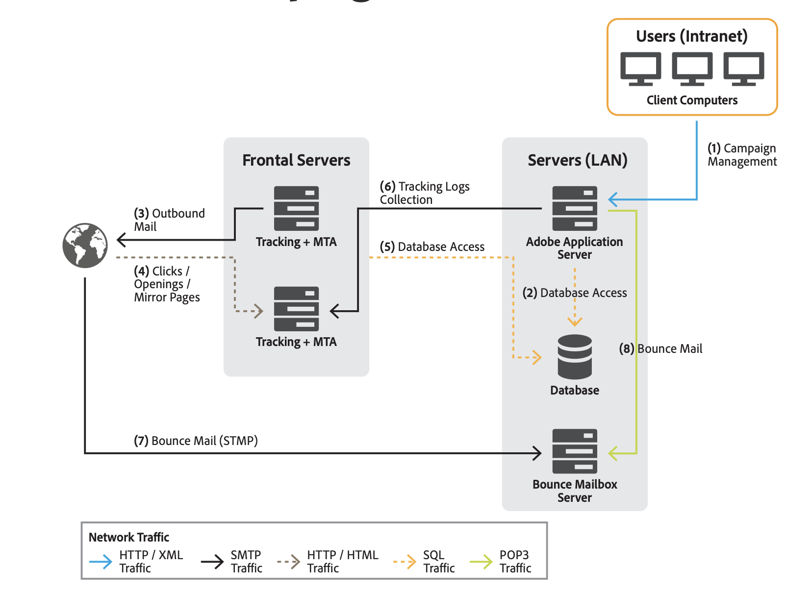

# Arquitectura general{#general-architecture}

La implementación típica de la solución Adobe Campaign consta de los siguientes componentes:

* **Entorno de cliente personalizado**

   Interfaz gráfica intuitiva en la que los usuarios pueden comunicarse y rastrear ofertas de marketing, crear campañas, revisar y administrar todas las actividades, programas y planes de marketing, incluidos correos electrónicos, flujos de trabajo y páginas de aterrizaje, crear y administrar perfiles de cliente y crear audiencias.

* **Entorno de desarrollo**

   Software del lado del servidor que ejecuta las campañas de marketing a través de los canales de comunicación seleccionados, incluidos correos electrónicos, SMS, notificaciones push, correo postal, web o social, en función de las reglas y flujos de trabajo definidos en la interfaz de usuario.

* **Contenedores de base de datos**

   Basándose en la tecnología de bases de datos relacionales, la base de datos de Adobe Campaign Cloud almacena toda la información de los clientes, los componentes de campañas, las ofertas y los flujos de trabajo, así como los resultados de las campañas en contenedores de bases de datos de clientes.

## Entorno de cliente personalizado {#client-env}

Se puede acceder a la aplicación de diferentes maneras: Cliente enriquecido, cliente ligero o integración de API.

* **Consola** de cliente: La interfaz de usuario principal de la aplicación es una aplicación nativa (en Windows) que se comunica con el servidor de aplicaciones de Adobe Campaign con protocolos de Internet estándar (SOAP, HTTP, etc.). La consola del cliente de Adobe Campaign ofrece una buena facilidad de uso para la productividad, utiliza muy poco ancho de banda (mediante el uso de una caché local) y está diseñada para facilitar la implementación. Esta consola se puede implementar desde un explorador de Internet, se puede actualizar automáticamente y no requiere ninguna configuración de red específica, ya que solo genera tráfico HTTP(S).

   ?? [Obtenga más información sobre la consola del cliente de Campaign](../start/connect.md).

* **Acceso** web: se puede acceder a partes de la aplicación a través de un explorador web simple mediante una interfaz de usuario HTML, que incluye el módulo de informes, las etapas de aprobación de la entrega, la supervisión de instancias, etc.

   ?? [Obtenga más información acerca de Campaign Web Access](../start/connect.md).

* **API de campaña**: En algunos casos, se puede llamar al sistema desde una aplicación externa mediante las API de servicios web expuestas mediante el protocolo SOAP.

   ?? [Obtenga más información sobre las API de Campaign](../dev/api.md).

## Entorno de desarrollo {#dev-env}

Adobe Campaign es una plataforma única con diferentes aplicaciones para crear una arquitectura abierta y escalable. La plataforma Adobe Campaign está escrita en una capa de aplicación flexible y es fácilmente configurable para satisfacer sus necesidades comerciales. La arquitectura distribuida garantiza la escalabilidad lineal del sistema desde miles de mensajes hasta millones de mensajes.

Algunos módulos de Campaign funcionan continuamente, mientras que otros se inician ocasionalmente para realizar tareas administrativas (por ejemplo, configurar la conexión de base de datos) o para ejecutar una tarea recurrente (por ejemplo, consolidar la información de seguimiento).

Existen tres tipos de módulos de Adobe Campaign:

* **Módulos** de varias instancias: se ejecuta un solo proceso para todas las instancias. Esto se aplica a los siguientes módulos: web, syslogd, trackinglogd y watchdog.
* **Módulos** de instancia única: se ejecuta un proceso por instancia. Esto se aplica a los siguientes módulos: mta, wfserver, inMail, sms y stat.
* **Módulos** de utilidad: son módulos que se ejecutan ocasionalmente para realizar operaciones ocasionales o recurrentes (limpieza, configuración, descarga de registros de seguimiento, etc.).

Los procesos principales son:

**Servidor de aplicaciones**  (nlserver web)

Este proceso expone la gama completa de funcionalidades de Adobe Campaign a través de las API de servicios web (SOAP / HTTP + XML). Además, puede generar dinámicamente las páginas web utilizadas para el acceso basado en HTML (informes, formularios web, etc.). Para conseguirlo, este proceso incluye un servidor JSP Apache Tomcat. Este es el proceso al que se conecta la consola.

**Motor de flujo de trabajo**  (nlserver wfserver)

Ejecuta los procesos de flujo de trabajo definidos en la aplicación.

También gestiona los flujos de trabajo técnicos que se ejecutan periódicamente, incluidos:

* **Seguimiento**: Recuperación y consolidación de registros de seguimiento. Permite recuperar los registros del servidor de redirección y crear los indicadores agregados utilizados por el módulo de informes.
* **Limpieza**: Limpieza de bases de datos. Se utiliza para purgar registros antiguos y evitar que la base de datos crezca exponencialmente.
* **Facturación**: Envío automático de un informe de actividad para la plataforma (tamaño de la base de datos, número de acciones de marketing, etc.).

**Servidor de entrega**  (nlserver mta)

Adobe Campaign tiene una funcionalidad nativa de difusión por correo electrónico. Este proceso funciona como un agente de transferencia de correo SMTP (MTA). Realiza la personalización &quot;uno a uno&quot; de los mensajes y gestiona su envío físico. Se ejecuta utilizando trabajos de envío y gestiona los reintentos automáticos. Además, cuando el seguimiento está habilitado, reemplaza automáticamente las direcciones URL para que apunten al servidor de redirección.

Este proceso puede gestionar la personalización y el envío automático a un enrutador de terceros para SMS, fax y correo postal.

**Servidor de redirección**  (nlserver webmdl)

Para el correo electrónico, Adobe Campaign administra automáticamente el rastreo de clics y aperturas (el seguimiento transaccional a nivel de sitio web es otra posibilidad). Para conseguirlo, las direcciones URL incorporadas en los mensajes de correo electrónico se reescriben para que apunten a este módulo, que registra el paso del usuario de Internet antes de redirigirlos a la dirección URL requerida.

Para garantizar la mayor disponibilidad, este proceso es totalmente independiente de la base de datos: los demás procesos del servidor se comunican con él utilizando llamadas SOAP (HTTP, HTTP(S) y XML) únicamente. Técnicamente, esta funcionalidad se implementa en un módulo de extensión de un servidor HTTP (extensión ISAPI en IIS, o un módulo DSO Apache, etc.) y solo está disponible en Windows.

También hay disponibles otros procesos técnicos:

**Administración de correos electrónicos rechazados**  (nlserver inMail)

Este proceso permite recoger automáticamente el correo electrónico de los buzones configurados para recibir mensajes devueltos en caso de error de envío. A continuación, estos mensajes se someten a un procesamiento basado en reglas para determinar los motivos de la no entrega (destinatario desconocido, cuota excedida, etc.) y para actualizar el estado de entrega en la base de datos.

Todas estas operaciones son totalmente automáticas y están preconfiguradas.

**Estado de envío de SMS**  (nlserver sms)

Este proceso sondea el enrutador SMS para recopilar el estado del progreso y actualizar la base de datos.

**Escribiendo mensajes de registro**  (nlserver syslogd)

Este proceso técnico captura los mensajes de registro y los rastros generados por los otros procesos y los escribe en el disco duro. Esto proporciona amplia información disponible para el diagnóstico en caso de problemas.

**Escritura de registros de seguimiento**  (nlserver trackinglogd)

Este proceso guarda en disco los registros de seguimiento generados por el proceso de redirección.

**Escritura de eventos entrantes**  (nlserver interactiond)

Este proceso garantiza la grabación en el disco de eventos entrantes, dentro del marco de la interacción.

**Supervisión de módulos**  (nlserver watchdog)

Este proceso técnico actúa como un proceso principal que engendra a los demás. También los supervisa y los reinicia automáticamente en caso de incidentes, manteniendo así el máximo tiempo de actividad del sistema.

**Servidor de estadísticas**  (nlserver stat)

Este proceso mantiene estadísticas sobre el número de conexiones, los mensajes enviados para cada servidor de correo al que se envían los mensajes, así como sus limitaciones (el mayor número de conexiones simultáneas, mensajes por hora/ y/o conexión). También le permite federar varias instancias o equipos si comparten las mismas direcciones IP públicas.

## Contenedores de base de datos {#db-containers}

La base de datos de Adobe Campaign Cloud se basa en [!DNL Snowflake] que contiene los datos funcionales (perfiles, suscripciones, contenido, etc.), los datos técnicos (registros y trabajos de envío, registros de seguimiento, etc.) y los datos de trabajo (compras, posibles clientes) de la solución, y todos los componentes de Adobe Campaign se comunican con la base de datos para realizar sus tareas específicas.

Los clientes pueden implementar Adobe Campaign utilizando la base de datos predefinida y los esquemas, y si es necesario, se puede ampliar este entorno predefinido. Adobe Campaign accede a todos los datos del data mart a través de llamadas SQL. Adobe Campaign también proporciona un complemento completo de las herramientas de extracción, transformación y carga (ETL) para realizar la importación y exportación de datos dentro y fuera del sistema.

>[!CAUTION]
>
>Con **Cloud Services administrados de Campaign**, su entorno y la configuración inicial se han configurado mediante Adobe, según los términos del acuerdo de licencia. No se le permite modificar paquetes integrados, esquemas integrados o informes instalados.
>
>Si necesita utilizar un complemento de Campaign o una funcionalidad específica que no se haya aprovisionado por usted, debe ponerse en contacto con el **Servicio de atención al cliente de Adobe**.